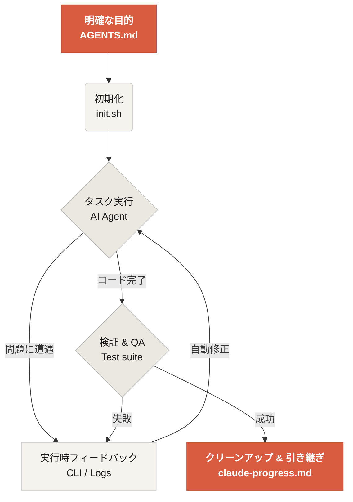

# Learn Harness Engineering へようこそ

Learn Harness Engineering は、AI コーディングエージェントのためのハーネス設計を学ぶコースです。業界で最先端の Harness Engineering に関する理論と実践を深く研究し、整理しています。主な参考資料は次のとおりです。
- [OpenAI: Harness engineering: leveraging Codex in an agent-first world](https://openai.com/index/harness-engineering/)
- [Anthropic: Effective harnesses for long-running agents](https://www.anthropic.com/engineering/effective-harnesses-for-long-running-agents)
- [Anthropic: Harness design for long-running application development](https://www.anthropic.com/engineering/harness-design-long-running-apps)
- [Awesome Harness Engineering](https://github.com/walkinglabs/awesome-harness-engineering)

体系的な環境設計、状態管理、検証、制御システムを通じて、このコースでは Codex や Claude Code のような agentic なコーディングツールを本当に信頼できるものにする方法を学びます。明示的なルールと境界で AI コーディングアシスタントを制約することで、機能開発、バグ修正、開発タスクの自動化に役立ちます。

## はじめる

学習の進め方を選んで始めてください。このコースは、理論講義、実践プロジェクト、すぐに使えるリソースライブラリに分かれています。

  <a href="./lectures/lecture-01-why-capable-agents-still-fail/" class="card">
    <h3>講義</h3>
    
高性能なモデルでも失敗する理由を理解し、効果的なハーネスの理論を学びます。

  </a>
  <a href="./projects/" class="card">
    <h3>プロジェクト</h3>
    
信頼できる agentic 環境をゼロから構築する実践演習です。

  </a>
  <a href="./resources/" class="card">
    <h3>リソースライブラリ</h3>
    
自分のリポジトリですぐ使える、そのままコピーできるテンプレート（AGENTS.md, feature_list.json）を用意しています。

  </a>

## ハーネスの中核メカニズム

ハーネスはモデルを「賢くする」わけではありません。むしろ、モデルのための閉ループの **作業システム** を構築します。次の簡単な図で、その中核的な流れを理解できます。

## 学べること

このコースで習得する主な概念は次のとおりです。

<ul class="index-list">
  <li><strong>エージェントの挙動を制約する</strong>ために、明示的なルールと境界を設ける。</li>
  <li><strong>文脈を維持する</strong>ために、長時間・複数セッションのタスクをまたいで情報を保つ。</li>
  <li><strong>早すぎる勝利宣言を防ぐ</strong>。</li>
  <li><strong>作業を検証する</strong>ために、フルパイプラインのテストと自己反省を活用する。</li>
  <li><strong>実行時を可観測にする</strong>ことで、デバッグしやすくする。</li>
</ul>

## 次のステップ

中核概念を理解したら、次のガイドでさらに深く学べます。

<ul class="index-list">
  <li><a href="./lectures/lecture-01-why-capable-agents-still-fail/">講義 01: Why Capable Agents Still Fail</a>: ハーネス設計の理論から始めましょう。</li>
  <li><a href="./projects/project-01-baseline-vs-minimal-harness/">プロジェクト 01: Baseline vs Minimal Harness</a>: 最初の実践タスクを一緒に進めます。</li>
  <li><a href="./resources/templates/">テンプレート</a>: 自分のプロジェクトで使える最小ハーネス一式（AGENTS.md, feature_list.json, claude-progress.md）を入手できます。</li>
</ul>
