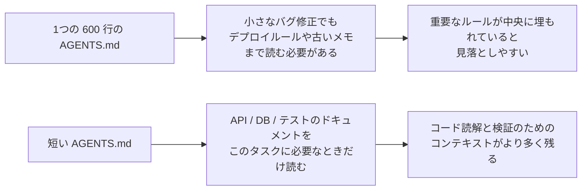
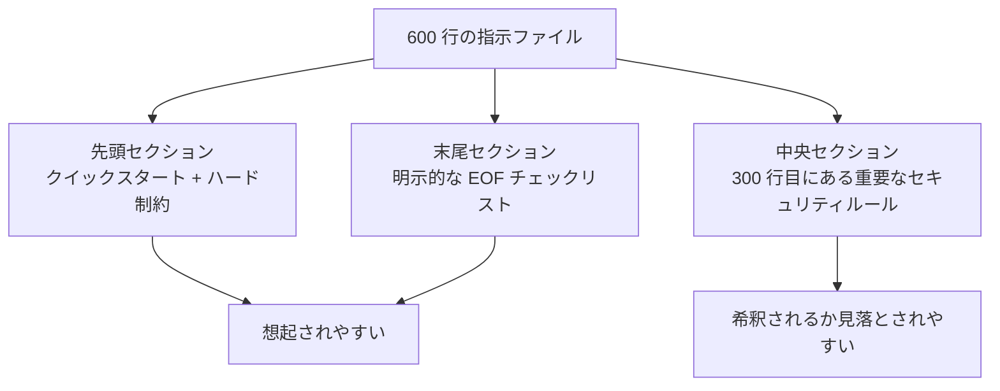

[中国語版 →](../../../zh/lectures/lecture-04-why-one-giant-instruction-file-fails/)

> コード例: [code/](https://github.com/walkinglabs/learn-harness-engineering/blob/main/docs/en/lectures/lecture-04-why-one-giant-instruction-file-fails/code/)
> 演習プロジェクト: [Project 02. Agent-readable workspace](./../../projects/project-02-agent-readable-workspace/index.md)

# レクチャー 04. 指示を複数ファイルに分割する

ハーネスエンジニアリングに本気で取り組み始めたあなたは立派です。`AGENTS.md` を作り、思いつく限りのルール、制約、学びをすべて詰め込みました。ところが1か月後にはファイルが300行に膨れ、2か月後には450行、3か月後には600行になっていました。そして気づくのです。エージェントの性能が実際には悪化していることに。単純なバグ修正でも、エージェントは無関係なデプロイ手順を読むために大量のコンテキストを消費し、300行目に埋もれた重要なセキュリティ制約は完全に見落とされ、3つの矛盾するコードスタイル規則のせいで、毎回どれを選ぶかがランダムになってしまいます。

これが「巨大な指示ファイル」の罠です。まるでスーツケースに荷物を詰め込みすぎるのと同じです。どれも役に立ちそうに見えるので、壊れそうになるまで押し込んでしまう。下着を探すだけでも、結局はバッグの中身を全部出さなければなりません。スーツケースはいっぱい持っていたのに、実際に使ったのは中身の3分の1ほどだった、というわけです。

## 根本にある悪循環

最もよくある悪循環は次の通りです。エージェントがミスをする、あなたは「これを防ぐルールを追加しよう」と言う、`AGENTS.md` に追記する、一時的にはうまくいく、別のミスが起きる、さらにルールを追加する、これを繰り返してファイルが制御不能に膨らんでいく。

これはあなたのせいではありません。とても自然な反応です。何か問題が起こるたびに「ルールを追加する」のは、「念のため」と家を出るたびに荷物をもう1つ増やすのと同じくらい、もっともらしく感じられます。ですが、その積み重ねの結果は悲惨です。何が具体的にまずいのかを見ていきましょう。

**コンテキスト予算が食い尽くされる。** エージェントのコンテキストウィンドウは有限です。たとえば、あなたのエージェントが200Kトークンのウィンドウを持っているとします（Claude の標準）。肥大化した指示ファイルだけで10〜20Kトークンを消費することがあります。まだ余裕があるように見えるでしょうか？ しかし、複雑なタスクでは多数のソースファイルを読む必要があり、ツール実行の出力もコンテキストを使い、会話履歴も積み上がっていきます。エージェントがコードを理解する必要が出てくる頃には、予算はすでに逼迫しています。まるで「念のため」の荷物でスーツケースがパンパンになり、ノートPCを入れる場所すらないようなものです。

**途中で見失われる。** 「Lost in the Middle」論文（Liu et al., 2023）は、LLM が長い文章の中央にある情報を、冒頭や末尾にある情報よりもかなり低い精度で使うことを明確に示しました。あなたの `AGENTS.md` が600行あり、300行目に「すべてのデータベースクエリはパラメータ化クエリを使うこと」と書いてあるとします。これは重要なセキュリティ制約です。しかし中央に埋もれているため、エージェントはほぼ確実に見落とします。まるで詰め込みすぎたスーツケースの底にある日焼け止めのようなものです。そこにあるのは分かっているのに、3回掘っても見つからず、結局もう1本買ってしまう。

**優先度の衝突。** ファイルには、守るべきハード制約（「`eval()` を絶対に使わない」）、重要な設計指針（「関数型スタイルを優先する」）、そして特定の歴史的学び（「先週 WebSocket のメモリリークを直したので、似たパターンに注意する」）が混在しています。これら3つは重要度がまったく異なるのに、ファイル上ではすべて同じ見た目をしています。エージェントには区別するための信頼できる手がかりがありません。まるでパスポートと充電ケーブルがスーツケースの中でごちゃ混ぜになっていて、どちらが急ぎなのか分からないようなものです。

**保守性の劣化。** 大きなファイルは本質的に保守しにくいものです。古くなった指示は削除されにくいのです。削除したときの影響が不確実だからです（「このルールに何か依存しているかもしれない？」）。一方で、新しい指示を追加するのは気楽に感じられます。その結果、ファイルは増える一方で減らず、シグナル対ノイズ比は下がり続けます。これはソフトウェアにおける技術的負債の蓄積そのものです。

**矛盾の蓄積。** 時期の異なる指示が互いに矛盾し始めます。ある指示は「TypeScript の strict mode を使う」と言い、別の指示は「一部のレガシーファイルでは any 型を許可する」と言う。エージェントは毎回、どちらに従うかをランダムに選びます。まるで母親が「暖かくしなさい」と言い、父親が「着込みすぎるな」と言い、あなたが玄関先でどちらを聞けばいいのか分からなくなるようなものです。

## 基本概念

- **Instruction Bloat**: 指示ファイルがコンテキストウィンドウの10〜15%以上を占めると、コード読解とタスク推論のための予算を圧迫し始める。600行の `AGENTS.md` は、エージェントが作業を始める前に 10,000〜20,000 トークンを消費しうる。これは128Kウィンドウの8〜15%が、まだ何も始めていない段階で食われるということだ。
- **Lost in the Middle Effect**: Liu らの2023年の研究は、LLM が長文の中央にある情報を、冒頭や末尾の情報よりもかなり低い精度で使うことを証明した。600行ファイルの300行目に埋もれた重要な制約は、かなり高い確率で実質的に無視される。
- **Instruction Signal-to-Noise Ratio (SNR)**: 現在のタスクに関連する指示が、ファイル内のどれだけの割合を占めるかを表す指標。バグ修正中にデプロイ手順を50行も読まされるなら、それは低い SNR だ。
- **Routing File**: エージェントをより詳細なドキュメントへ案内することを主目的とした短い入口ファイルであり、何でもかんでも詰め込むものではない。50〜200行程度で十分。
- **Progressive Disclosure**: まず概要情報を示し、必要になったら詳細情報を出す。良いハーネス設計は良いUI設計に似ている。最初からすべての選択肢をユーザーに一気に見せない。
- **Priority Ambiguity**: すべての指示が同じ形式と同じ場所にあると、エージェントは絶対に守るべきハード制約と、あくまで推奨にすぎないソフトなガイドラインを区別できない。

## 指示アーキテクチャ





## 分割のしかた

基本原則は、頻繁に必要な情報は手元に置き、たまに必要な情報はしまっておき、二度と使わないものは残さないことです。

入口ファイルの `AGENTS.md` は50〜200行に保ち、最も頻繁に使う項目だけを含めます。たとえば、プロジェクト概要（1〜2文）、初回実行コマンド（`make setup && make test`）、全体に適用されるハード制約（非交渉ルールは15個以下）、トピック文書へのリンク（1行の説明 + 適用条件）です。

```markdown
# AGENTS.md

## プロジェクト概要
Python 3.11 の FastAPI バックエンド、PostgreSQL 15 データベース。

## クイックスタート
- インストール: `make setup`
- テスト: `make test`
- 全体検証: `make check`

## ハード制約
- すべての API は OAuth 2.0 認証を使用すること
- すべてのデータベースクエリは SQLAlchemy 2.0 の構文を使用すること
- すべての PR は `pytest` + `mypy --strict` + `ruff check` を通過すること

## トピックドキュメント
- [API Design Patterns](docs/api-patterns.md) — エンドポイントを追加するときに必読
- [Database Rules](docs/database-rules.md) — データベース操作を変更するときに必須
- [Testing Standards](docs/testing-standards.md) — テストを書くときの参照
```

各トピック文書は50〜150行で、`docs/` ディレクトリ内または対応するモジュールの隣に、トピックごとに整理します。エージェントは必要なときだけそれを読みます。スーツケースにある仕分けポーチのようなものです。下着は1つのポーチに、洗面用品は別のポーチに、充電器はさらに別のポーチに入れる。物を見つけるのに、バッグの中身を全部空ける必要はありません。

情報の中には、コード内に直接置いたほうがよいものもあります。型定義、インターフェースのコメント、設定ファイル中の説明などです。エージェントはコードを読むときに自然とそれらを見るので、指示側で重複させる必要はありません。

すべての指示には、出典（「なぜこのルールが追加されたのか」）、適用条件（「いつこのルールが必要なのか」）、削除条件（「どのような状況ならこのルールを外せるのか」）が必要です。定期的に監査し、古いもの、冗長なもの、矛盾するものを削除してください。指示はコードの依存関係を管理するのと同じように扱いましょう。使われていない依存関係は削除すべきで、そうしないと単にシステムを遅くするだけです。

もしある指示を入口ファイルに置く必要があるなら、中央ではなく先頭か末尾に置いてください。「途中で見失われる」効果が示すように、LLM は中央よりも端の情報をかなりよく使います。ただし、より良い方法は、指示をトピック文書へ移して必要時に読み込む形にすることです。

OpenAI と Anthropic の両方が、暗黙的にこの分割アプローチを支持しています。OpenAI は入口ファイルは「短く、ルーティング指向であるべき」と述べ、Anthropic は長時間稼働するエージェントの制御情報は「簡潔で優先度が高い」べきだと言っています。どちらも言っていることは同じです。全部を1つのファイルに詰め込むな、ということです。スーツケースは整理が必要であって、力任せの詰め込みではありません。

## 実例

ある SaaS チームの `AGENTS.md` は、50行から600行に膨れ上がりました。中身は、技術スタックのバージョン、コーディング標準、過去のバグ修正メモ、API の利用ガイド、デプロイ手順、チームメンバーの個人的な好みまで混在しており、まさにスーツケースが限界までパンパンになった状態でした。

エージェントの性能は明らかに落ち始めました。単純なバグ修正でも、無関係なデプロイ手順を読むために大量のコンテキストを使い、セキュリティ制約「すべてのデータベースクエリはパラメータ化クエリを使うこと」は300行目に埋もれて頻繁に無視され、3つの矛盾するコードスタイル規則のせいでエージェントの挙動はランダムになりました。

チームは「スーツケースの再整理」を実施しました。
1. `AGENTS.md` を80行に圧縮: プロジェクト概要、実行コマンド、15個の全体ハード制約だけに限定
2. トピック文書を作成: `docs/api-patterns.md`（120行）、`docs/database-rules.md`（60行）、`docs/testing-standards.md`（80行）
3. 入口ファイルにトピック文書へのリンクを追加
4. 過去のメモはテストケースに変換するか削除

リファクタ後、同じ種類のタスクで無関係な手順を読む時間が減り、セキュリティ制約も見落とされにくくなりました。これは、その制約がファイル中央から入口ファイルの先頭へ移動し、もはや「途中で見失われる」状態ではなくなったからです。

## 重要なポイント

- 「ルールを追加する」は短期的には痛み止め、長期的には毒です。ルールを増やす前に、「これはトピック文書に置いたほうがよいか？」と自問してください。スーツケースに何でも詰め込み続けないこと。
- 入口ファイルは百科事典ではなく、ルーターです。50〜200行で、概要、ハード制約、リンクだけに絞ること。
- 「途中で見失われる」効果を活用しましょう。重要な情報は先頭か末尾へ、重要でない情報はトピック文書へ移す。
- 指示の肥大化は技術的負債のように管理すること。定期監査を行い、すべての指示には出典、適用条件、削除条件を持たせる。
- 分割後は SNR が改善し、エージェントは無関係な指示を処理する代わりに実際のタスクへより多くのコンテキスト予算を使えるようになる。

## さらに読む

- [OpenAI: Harness Engineering](https://openai.com/index/harness-engineering/)
- [Anthropic: Effective Harnesses for Long-Running Agents](https://www.anthropic.com/engineering/effective-harnesses-for-long-running-agents)
- [Lost in the Middle: How Language Models Use Long Contexts](https://arxiv.org/abs/2307.03172)
- [HumanLayer: Harness Engineering for Coding Agents](https://humanlayer.dev/articles/harness-engineering-for-coding-agents/)
- [Nielsen Norman Group: Progressive Disclosure](https://www.nngroup.com/articles/progressive-disclosure/)

## 演習

1. **SNR 監査**: 現在の入口指示ファイルを取り、すべての指示項目を列挙する。5種類の異なる典型タスクを選び、それぞれの指示がそのタスクに関連するかどうかをマークする。各タスク種別ごとに SNR を計算する。ほとんどのタスクにとってノイズになる指示は、トピック文書へ移すべきです。

2. **Progressive disclosure リファクタ**: 300行を超える指示ファイルがあるなら、次のように分割する。(a) 100行未満のルーティングファイル、(b) 3〜5個のトピック文書。同じタスクセットを分割前後で実行し（少なくとも5件）、成功率を比較する。

3. **途中で見失われる現象の検証**: 長い指示ファイルの先頭、中央、末尾にそれぞれ重要な制約を置き、同じタスクセットを毎回実行する（各位置につき少なくとも5回）。遵守率に差が出るか確認する。位置の影響がどれほど強いか、きっと驚くはずです。
