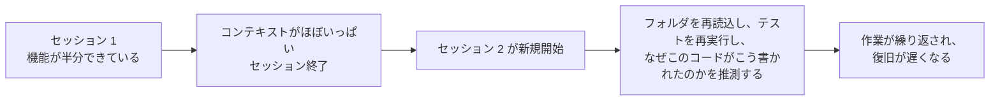
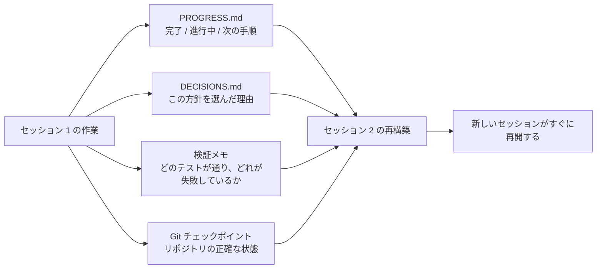

[中国語版 →](../../../zh/lectures/lecture-05-why-long-running-tasks-lose-continuity/)

> コード例: [code/](https://github.com/walkinglabs/learn-harness-engineering/blob/main/docs/en/lectures/lecture-05-why-long-running-tasks-lose-continuity/code/)
> 練習用プロジェクト: [Project 03. マルチセッションの継続性](./../../projects/project-03-multi-session-continuity/index.md)

# 講義 05. セッションをまたいでコンテキストを維持する

Claude Code に完全な機能の実装を依頼したとします。30 分ほど動かして作業の大半は進んだものの、コンテキストはかなり減っています。続きのために新しいセッションを始めると、前回どんな判断をしたのか、なぜ option A ではなく option B を選んだのか、どのファイルがすでに変更済みなのか、テストがどんな状態なのかを覚えていないことに気づきます。すると 15 分かけてプロジェクトを再調査し直し、前回の方針と整合しない実装になるかもしれません。

毎朝起きるたびに何もかも忘れてしまう職人を想像してください。作業現場全体をもう一度把握し直さなければなりません。どの壁が途中までできているのか、なぜ青いレンガではなく赤いレンガを選んだのか、配管がどこを通っているのか。さらに悪いことに、昨日すでに取り付けた窓を、そこにあったことを忘れていたせいで壊してしまうかもしれません。

これこそが、セッションをまたぐタスクで AI コーディングエージェントが直面する困難です。この講義では、なぜエージェントが長時間タスクの途中で「ブラックアウト」するのか、そして構造化された状態の永続化によって、毎日の記録をきちんと残す職人のようにできるのかを説明します。エージェント自身は相変わらず健忘でも、日誌にはすべてが残るのです。

## コンテキストウィンドウは無限ではない

コンテキストウィンドウには上限があります。これはモデルのアップグレードだけでは解決できません。たとえウィンドウサイズが 1M トークンまで増えたとしても、複雑なタスクならいずれ使い切ります。エージェントはコードを生成しているだけではなく、コードベースを理解し、自分の判断履歴を追跡し、ツールの出力を処理し、会話の文脈を維持しているからです。こうした情報は、ウィンドウの拡張よりも速く増えていきます。

さらに深刻なのは、エージェントが生成する情報の重要度が一様ではないことです。途中の推論には、判断の「なぜ」が含まれます。なぜ option A ではなく option B を選んだのか、なぜこのライブラリを使い、あのライブラリを使わなかったのか、なぜ特定の最適化を見送ったのか。最終出力には「何をしたか」だけが残ります。つまり、コードそのものです。圧縮戦略はたいてい後者を残し、前者を失います。次のセッションはコードは見えても、それがなぜその形で書かれているのかを知りません。そのため、意図的に下した設計判断を「改善」して台無しにしてしまうことがあります。

Anthropic の長時間稼働エージェント研究では、興味深い現象が報告されています。エージェントがコンテキスト残量の低下を察知すると、「premature convergence」的な振る舞いを示すのです。つまり、今やっている作業を急いで終わらせようとし、検証手順を飛ばし、最適解よりも単純な解を選びがちになります。試験終了が迫っていると気づいて、残りの選択問題を雑にマークしてしまうようなものです。Anthropic はこれを「context anxiety」と呼んでいます。

## セッション継続の流れ

継続用の成果物がなければ、新しいセッションは毎回ひどい状態になります。



継続用の成果物があれば、新しいセッションはすぐに再開できます。



## 基本概念

- **コンテキストウィンドウは有限**: どれほど大きなサイズが謳われても（128K、200K、1M など）、長いタスクでは最終的に使い切ります。使い切ったあとには、圧縮（情報を失う）かリセット（新しいセッション）が必要です。どちらも何かを失います。
- **継続用アーティファクト**: 次のセッションが、前回の続きから曖昧さなく再開できるようにする永続化状態ファイル。基本形は、進捗ログ + 検証記録 + 次のアクションです。あの職人の日誌のことです。
- **再構築コスト**: 新しいセッションが実行可能な状態に到達するまでに要する時間。良いハーネスなら、再構築コストを 15 分から 3 分に短縮できます。
- **ドリフト**: エージェントの理解と、実際のコードリポジトリの状態との差。セッション境界ごとにドリフトは生まれ、放置すると積み重なります。
- **context anxiety**: Anthropic が観測した現象で、エージェントがコンテキスト上限に近づくと premature convergence 的な振る舞いを示し、情報損失を避けるためにタスクを早く終えようとします。非合理的なリソース不安です。
- **圧縮 vs リセット**: 圧縮は同一セッション内でコンテキストを要約する方式です。「何をしたか」は残せますが、「なぜ」は失われがちです。リセットは永続化した状態から新しいセッションを立ち上げて再構築する方式です。きれいですが、成果物の完全性に依存します。

## 継続が壊れたときに起こること

前のセッションでは、3 つの案を分析して option B を選ぶためにかなりのコンテキストを使いました。しかし今回のセッションのエージェントはその分析を知りません。そのため、不完全な情報をもとに再び判断し直し、option A を選ぶかもしれません。赤いレンガを選んだ理由を覚えていない健忘の職人が、今日は青いレンガのほうがきれいだと思って、昨日の壁を壊して作り直すのと同じです。

さらに悪いのは重複作業です。エージェントは、ある作業がすでに完了しているかどうか確信できず、もう一度やってしまいます。あるいは、もっと悪く、半分だけ進めたところで既存実装との衝突に気づき、やり直しになります。建設現場では、2 つのチームが同じ壁を同時に作ることはできません。しかし進捗記録がなければ、新しい作業者はすでに誰かが取り掛かっていることを知りようがないのです。

複数セッションをまたぐうちに、実装の方向性が当初の要件から静かにずれていくこともあります。新しいセッションごとに、プロジェクト目標の理解が少しずつ異なっていくからです。伝言ゲームのように、10 人を通ると「コーヒーを取ってきて」が「コーヒーマシンを買ってきて」に変わってしまうかもしれません。

検証の抜けもあります。前のセッションでの検証結果（どのテストが通っていて、どれが失敗していて、なぜ失敗しているのか）が記録されていません。新しいセッションは現在の状態を把握するために、すべての検証を再実行しなければなりません。毎回ゼロから再診断することになり、そのたびに貴重なコンテキストを消耗します。

OpenAI と Anthropic の両方が、ドキュメントの中で構造化された状態の永続化を重視しています。OpenAI の harness engineering 記事では、リポジトリを「operational record」として扱い、各操作の結果は追跡可能な証拠として repo に残すべきだとしています。Anthropic の long-running agents 文書では、現在の状態、既知の問題、次のアクションを含む構造化文書である「handoff files」を特に推奨しています。

## 健忘な職人のための日誌

基本方針: **エージェントを、健忘症のある優秀なエンジニアとして扱う。** 「退勤」する前に、次の「シフト」のエージェントがすぐ引き継げるよう、重要な情報を書き残しておくのです。

**ツール 1: 進捗ファイル (`PROGRESS.md`)。** 最も基本的な継続用アーティファクトであり、この日誌の中心です。

```markdown
# 進捗記録

## 現在の状態
- 最新コミット: abc1234 (feat: add user preferences endpoint)
- テスト状況: 42/43 が通過済み (`test_pagination_edge_case` が失敗中)
- Lint: 通過済み

## 完了済み
- [x] User model と database migration
- [x] 基本的な CRUD エンドポイント
- [x] Auth middleware の統合

## 進行中
- [ ] Pagination 機能 (90% - edge case test が失敗中)

## 既知の問題
- `test_pagination_edge_case` は空の result set で 500 を返す
- 削除済みユーザーを一覧に含めるべきか確認が必要

## 次の手順
1. Pagination の edge case バグを修正する
2. `"include deleted users"` の query parameter を追加する
3. API ドキュメントを更新する
```

**ツール 2: 決定ログ (`DECISIONS.md`)。** 重要な設計判断とその理由を記録します。詳細な設計書は不要です。日誌に書くべきは「何を決めたか、なぜそうしたか、いつ決めたか」だけです。

```markdown
# 設計判断

## 2024-01-15: user preferences の caching に Redis を使う
- 理由: 読み取り頻度が高い（API 呼び出しのたび）、データサイズが小さい
- 採用しなかった代替案: PostgreSQL materialized view（変更頻度が高く、保守コストに見合わない）
- 制約: Cache TTL は 5 分、書き込み時は active invalidation
```

**ツール 3: チェックポイントとしての Git コミット。** 1 つの原子的な作業単位が終わるたびにコミットします。コミットメッセージには、何をしたかと、なぜそれをしたのかを書きます。これは無料で使える、自動的にバージョン管理される状態スナップショットです。

**ツール 4: `init.sh` またはハーネス初期化フロー。** `AGENTS.md` に「出勤」と「退勤」の手順を定義します。

```markdown
## セッション開始時（出勤）
1. PROGRESS.md を読んで現在の状態を確認する
2. DECISIONS.md を読んで重要な判断を確認する
3. `make check` を実行して repo が整合状態にあることを確認する
4. PROGRESS.md の "次の手順" セクションから続ける

## セッション終了前（退勤）
1. PROGRESS.md を更新する
2. `make check` を実行して整合状態を確認する
3. 完了した作業をすべて commit する
```

**混合戦略**: すべてのタスクでコンテキストリセットが必要なわけではありません。短いタスク（30 分未満）は 1 セッション内で完了できます。長いタスク（複数セッションにまたがるもの）は、継続のために進捗ファイルと決定ログを使う必要があります。判断基準は、タスクがウィンドウの 60% 以上を要するなら、引き継ぎの準備を始めることです。

### context anxiety の深掘り

Anthropic の 2026 年 3 月の研究では、context anxiety の具体的な現れ方もさらに明らかになりました。Sonnet 4.5 では、コンテキストがウィンドウ上限に近づくと、エージェントは強い premature convergence 振る舞いを示します。試験終了が間近だと気づいて、多肢選択問題に適当に答えを埋めていくようなものです。

これに対処する方法は 2 つあります。

**圧縮**: 同じセッション内で、会話の前半を要約する方法です。利点は継続性を保てることです。エージェントは「何をしたか」を見ることができます。欠点は、要約では「なぜ」が失われやすいことです。たとえば、なぜ option A ではなく option B を選んだのか、なぜある最適化を見送ったのか、といった点です。さらに重要なのは、圧縮しても context anxiety 自体は消えないことです。エージェントは一度は十分なコンテキストがあったことを知っているため、心理的には依然として収束を急ぎがちです。

**コンテキストリセット**: コンテキストを完全に消し、新しいセッションを開いて、永続化された成果物から再構築する方法です。利点は、頭がすっきりした状態になることです。新しいセッションには「時間が足りない」という不安がありません。欠点は、引き継ぎ用成果物が十分であることに依存する点です。日誌に重要情報が欠けていれば、新しいセッションは誤った方向に時間を使ってしまうかもしれません。

Anthropic の実データでは、Sonnet 4.5 では context anxiety がかなり強く、圧縮だけでは不十分で、コンテキストリセットがハーネス設計の重要な要素になります。一方で Opus 4.5 ではこの振る舞いは大きく弱まり、リセットに頼らず圧縮だけでコンテキストを管理できます。つまり、**ハーネス設計には対象モデルの個別理解が必要であり、万能テンプレートでは足りない**ということです。

> 出典: [Anthropic: Harness design for long-running application development](https://www.anthropic.com/engineering/harness-design-long-running-apps)

## 実例

あるエージェントは、ユーザー認証付きのブログシステムを実装するよう依頼されました。12 個の機能項目があり、必要なセッション数は 5 と見積もられていました。

**日誌なしのベースライン**: セッション 1 でユーザーモデルと基本ルートを実装。セッション 2 は、エージェントが auth middleware のインターフェース契約を覚えていない状態で始まり、前回の設計意図を推測するのに約 15 分を費やしました。セッション 3 までには、蓄積したドリフトのために、すでに完了した機能を再実装し始めてしまいました。セッション 5 では、リポジトリには冗長なコードが大量にあるのに、肝心の認証機能は end-to-end テストをまだ通っていませんでした。12 個の機能項目のうち完了したのは 7 個だけで、3 個には隠れた正しさの問題がありました。日誌を書かない職人と同じです。5 日目には現場は混乱し、ある壁は 2 回作られ、あるべき壁はまだ着手されていません。

**日誌あり**: 進捗ファイル、決定ログ、検証記録、Git チェックポイントを使用。各セッション終了時に状態レポートを自動更新。セッション 2 の再構築コストは約 3 分に低下。セッション 5 までに、12 個すべての機能項目が完了し、検証も済みました。

定量比較では、再構築時間は約 78% 削減、機能完了率は 58% から 100% に上昇、隠れた欠陥率は 43% から 8% に低下しました。職人は相変わらず健忘でも、日誌があれば毎日をゼロからではなく、前日の続きから始められます。

## 重要なポイント

- コンテキストウィンドウは有限資源です。長いタスクはセッションをまたぎ、そのたびに情報が失われます。毎日忘れてしまう職人と同じで、これは客観的な現実です。
- 解決策はウィンドウの拡大ではなく、より良い状態の永続化です。進捗ファイル + 決定ログ + Git チェックポイントで、健忘な職人に信頼できる日誌を持たせます。
- エージェントは健忘のあるエンジニアとして扱います。「退勤」前に、何をしたか、なぜそうしたか、次に何をするかを書き残します。
- 再構築コストが重要な指標です。良いハーネスなら、新しいセッションを 3 分以内に実行可能な状態へ到達させるべきです。
- 混合戦略を使います。短いタスクはセッション内で、長いタスクは構造化された成果物で継続性を保ちます。

## さらに読む

- [Anthropic: Effective Harnesses for Long-Running Agents](https://www.anthropic.com/engineering/effective-harnesses-for-long-running-agents)
- [OpenAI: Harness Engineering](https://openai.com/index/harness-engineering/)
- [Lost in the Middle: How Language Models Use Long Contexts](https://arxiv.org/abs/2307.03172)
- [Claude Code Documentation](https://docs.anthropic.com/en/docs/claude-code)
- [HumanLayer: Harness Engineering for Coding Agents](https://humanlayer.dev/articles/harness-engineering-for-coding-agents/)

## 演習

1. **継続損失の測定**: 少なくとも 3 セッション必要な開発タスクを選びます。継続用アーティファクトを一切与えずに、各セッション開始時にエージェントが「前回何が起きたかを把握する」のにどれだけコンテキストを使うか記録します。その後、各セッション終了時に進捗ファイルを作成し、次のセッションをそこから始めさせます。進捗ファイルの有無で再構築コストを比較します。

2. **引き継ぎテンプレート設計**: 4 つの項目を持つ最小の引き継ぎテンプレートを設計します。項目は、repo state（commit hash）、runtime state（テスト通過率）、blockers、next actions です。完全に新しいエージェントセッションに、このテンプレートだけを使ってプロジェクト状態を復元させます。復元時に生じた曖昧さを記録し、テンプレートを改良していきます。

3. **混合戦略の実験**: 5 セッションにまたがる開発タスクで、次の 3 つの戦略を比較します。(a) 毎回新規セッションを開始し、進捗ファイルを使う、(b) できるだけ 1 セッション内で進める（context compaction）、(c) 混合戦略（短いタスクはセッション内、長いタスクはセッションをまたいで進め、進捗ファイルを使う）。再構築時間、機能完了率、判断の一貫性を比較します。
