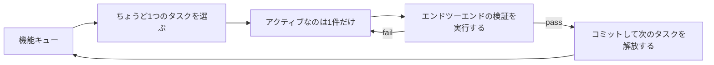
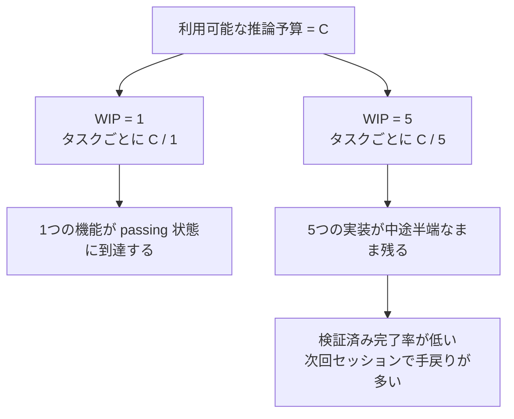

[中国語版 →](../../../zh/lectures/lecture-07-why-agents-overreach-and-under-finish/)

> コード例: [code/](https://github.com/walkinglabs/learn-harness-engineering/blob/main/docs/en/lectures/lecture-07-why-agents-overreach-and-under-finish/code/)
> 実践プロジェクト: [Project 04. ランタイムフィードバックとスコープ制御](./../../projects/project-04-incremental-indexing/index.md)

# Lecture 07. エージェントのタスク境界を明確にする

Claude Code に「このプロジェクトにユーザー認証を追加して」と指示すると、データベーススキーマを変更し、ルートを書き、フロントエンドコンポーネントを変え、さらにそのついでにエラーハンドリング用のミドルウェアまでリファクタし始めます。2時間後に確認すると、12ファイルが変更され、800行の新しいコードが増えているのに、エンドツーエンドで動く機能は1つもありません。

「自分の手に余ることに手を出す」という言葉は、AI エージェントにとてもよく当てはまります。エージェントには「少しだけ余計にやる」衝動が生まれつきあり、関係ありそうなものを見つけると、その流れでまとめて片付けてしまいます。たとえば、醤油1本を買いに行ったのに、気づけば山盛りのカートを押して出てくるようなものです。問題は、人間が買いすぎるとお金を無駄にするだけですが、エージェントが同時にやりすぎると、どれもきちんと終わらないことです。

Anthropic のエンジニアリングブログ「Effective harnesses for long-running agents」は明確に述べています。プロンプトが広すぎると、エージェントは「1つを先に終える」よりも「複数のことを同時に始める」傾向があります。OpenAI の Codex engineering practices でも同じことが確認されており、明示的なスコープ制御のないタスクでは完了率が大きく落ち込みます。これはモデルの問題ではありません。harness の問題です。境界を引いていないのです。

## 注意力は有限資源

これは比喩ではなく、数学です。エージェントのコンテキスト容量を C とし、同時に k 個のタスクを動かすとします。各タスクに割り当てられる推論資源の平均は C/k です。C/k が 1つのタスクを終えるのに必要な最小閾値を下回ると、どれも完了しません。胃袋にも限界があります。餃子を10個いっぺんに詰め込めば、全部消化できるどころか、10件の胃もたれになるだけです。

Claude Code の実際の挙動を見るとよくわかります。「ユーザー登録を追加して」と頼むと、次のようなことを始めるかもしれません。

1. User モデルを作成する
2. 登録ルートを書く
3. メール認証が必要だと気づいて、メールサービスを追加する
4. パスワードのハッシュ化が必要だと気づいて、`bcrypt` を導入する
5. エラーハンドリングに一貫性がないと気づいて、グローバルなエラーミドルウェアをリファクタする
6. テストファイルの構成が乱雑だと気づいて、ディレクトリを整理する

6つのステップを経ても、どれも中途半端なままです。エンドツーエンドの検証はなく、未完成のコード同士が複雑に結びつき、次のセッションで続きを引き継ぐのは完全に困難になります。6品を同時に作っている料理人のようなものです。全部フライパンの中にあるのに、皿に盛られたものは1つもありません。やがて全部焦げます。

Anthropic の長時間稼働エージェントの事例でも、feature list から 1 つの機能を選び、各セッションで incremental progress を残す構成が紹介されています。これは WIP=1 に近い制約で、エージェントが一度に広く作りすぎて半端な状態を残す失敗を防ぐためのものです。書いたコード量ではなく、検証済みの小さな完了単位を増やすことが重要です。

## WIP=1 のワークフロー





## 基本概念

- **やりすぎ（Overreach）**: エージェントが1回のセッションで、最適値より多くのタスクを動かしてしまうことです。これは定量化できます。5個の機能に手を出して、エンドツーエンドで1つも passing しないなら、それは overreach です。
- **やり切れなさ（Under-finish）**: 起動した全タスクのうち、エンドツーエンド検証を通過したタスクの割合が閾値を下回ることです。コードは書いたのにテストが通らない状態は under-finish です。
- **仕掛かり制限（WIP Limit / Work-in-Progress Limit）**: Kanban 手法に由来します。基本の考え方は、同時に進行中のタスク数を制限することです。エージェントでは WIP=1 が最も安全なデフォルトです。次を始める前に、まず1つを終わらせる。ビュッフェのように皿に山盛りにせず、1皿食べ終えてから次に行くのです。
- **完了証跡（Completion Evidence）**: タスクが "in progress" から "done" に移るために満たすべき、検証可能な条件です。これがないと、エージェントは「コードはよさそうだ」を「動作がテストに通った」の代わりにしてしまいます。
- **スコープ面（Scope Surface）**: 各ノードが作業単位で、辺が依存関係を表す DAG 構造です。状態は `not_started`、`active`、`blocked`、`passing` の4つに限定されます。
- **完了圧（Completion Pressure）**: harness が WIP 制限と completion evidence 要件を通じてかける制約圧です。エージェントに、新しいタスクを始める前に現在のタスクを終わらせることを強制します。

## Overreach と Under-finish は相互に強め合う

この2つの問題は独立ではありません。互いに増幅し合います。Overreach が注意力を分散させ、その分散した注意力が under-finish を招き、残された中途半端なコードがシステムの複雑さを増し、次のタスクでさらに overreach を引き起こします。悪循環です。

Kanban の観点で言えば、Little's Law は L = lambda * W を示します。進行中の作業 L が高すぎる、つまり同時にやりすぎると、各タスクのリードタイム W は必然的に伸びます。エージェントにとっては、各機能が着手から検証済み完了まで長くかかり、失敗の確率も高まるということです。

これは人間の世界でも昔からある問題です。Steve McConnell は *Rapid Development* の中で、スコープクリープがプロジェクト失敗の主要因だと記しています。ただ、人間には少なくとも「もう十分やった」という感覚があります。エージェントにはそれがありません。次のアイデアを出すための追加トークンはモデルにとってほとんどコストにならず、「ついでにこれも直しておこう」と書いても大した負荷には見えません。しかし、追加の変更ごとにエージェントの注意力は薄まります。ビュッフェで皿を1枚増やすコストはほぼゼロでも、胃袋の容量には限りがあるのと同じです。

## 推奨されるやり方

### 1. WIP=1 を徹底する

これが最も直接的で効果的な方法です。harness で、エージェントに明示してください。**`active` 状態にあるタスクは、常に1つだけにすること。** Claude Code の `CLAUDE.md` や Codex の `AGENTS.md` には、次のように書きます。

```
## 作業ルール
- 一度に扱うのは1機能だけにする
- 現在の機能がエンドツーエンド検証を通過してから、次の機能を始める
- 機能 A を実装しながら、機能 B を「ついでにリファクタ」しない
```

ビュッフェで食べるのと同じです。1皿ずつ取り、食べ終えてから次を取りに戻ります。

### 2. すべてのタスクに明示的な完了証跡を定義する

Done は「コードを書いた」ではありません。「動作検証が通った」です。機能一覧の各項目には、検証コマンドが必要です。

```
F01: ユーザー登録
  検証: curl -X POST /api/register -d '{"email":"test@example.com","password":"123456"}' | jq .status == 201
  状態: passing
```

### 3. スコープ面を外部化する

機械可読なファイル（JSON か Markdown）を使って、すべてのタスク状態を記録します。新しいセッションでもこのファイルを読めば、すぐに次が分かります。どのタスクが `active` か。どの動作が `done` とみなされるか。どの検証が通っているか。

### 4. 検証済み完了率を監視する

harness は VCR (Verified Completion Rate) = verified tasks / activated tasks を継続的に追跡するべきです。VCR < 1.0 のときは、新しいタスクの起動を止めます。

## 実例

8機能を持つ REST API プロジェクトで、2つの戦略を比較します。

**ビュッフェモード（制約なし）**: エージェントがセッション1で5機能を同時に起動します。12ファイルにまたがって約800行を生成します。エンドツーエンドテストの通過率は 20% で、ユーザー登録だけが動きます。残りの4機能は、データベーススキーマは作られているのに検証ロジックがなく、ルートは定義されているのにレスポンス形式が間違っています。6品を同時に作っているようなもので、かろうじて食べられるのは1品だけです。セッション3の終わり時点でも、8機能中3機能しか完了していません。

**単皿モード（WIP=1）**: エージェントはセッション1でユーザー登録だけに取り組みます。4ファイルにまたがって約200行を生成します。エンドツーエンドテストは 100% passing です。きれいに検証済みの実装としてコミットします。セッション4の終わりには、8機能中7機能が完了しています（8つ目は外部依存でブロック）。

結果として、総コード量は少ない（800行対1200行）のに、より効果的なコードになります。完了率は 87.5% 対 37.5% です。1口ずつ食べるほうが、実際にはたくさん食べられるのです。

## 重要なポイント

- **WIP=1 は agent harness のデフォルトの安全設定です** — 1つ終えてから次を始める。並列化しようとしないこと。1口で太ることはありません。
- **Completion evidence は実行可能でなければならない** — 「コードはよさそう」は数えません。「curl が 201 を返す」は数えます。
- **Scope surface はファイルとして外部化する必要があります** — 会話で触れるだけでなく、リポジトリ内の機械可読な形式で記録します。
- **Overreach と under-finish は共生関係です** — 片方を解決すれば、もう片方も解決します。
- **「少なくやっても最後まで終える」は「たくさんやって半分で終わる」より常に勝ちます** — エージェントのコード行数と機能完了率は負の相関があります。品質は常に量に勝ります。

## 参考資料

- [Effective harnesses for long-running agents - Anthropic](https://www.anthropic.com/engineering/effective-harnesses-for-long-running-agents) — Anthropic のエンジニアリングブログ。「small next step」戦略の詳しい解説
- [Harness Engineering - OpenAI](https://openai.com/index/harness-engineering/) — OpenAI による harness engineering の包括的な解説
- [Kanban: Successful Evolutionary Change - David Anderson](https://www.goodreads.com/book/show/1070822.Kanban) — WIP 制限に関する古典的な資料
- [Rapid Development - Steve McConnell](https://www.goodreads.com/book/show/125171.Rapid_Development) — スコープクリープがプロジェクト失敗の主因であることを示す実証データ

## 演習

1. **タスクの原子化**: 広めの要件（たとえば「ユーザー管理システムを実装する」）を1つ選び、少なくとも5つの原子的な作業単位に分解してください。各単位について、(a) 単一の動作説明、(b) 実行可能な検証コマンド、(c) 依存関係を指定してください。その分解が WIP=1 制約を満たしているか確認してください。

2. **比較実験**: 同じプロジェクトを2回実行してください。1回は制約なし、もう1回は WIP=1 を強制します。比較する項目は、検証済み完了率、総コード行数、有効コード比率です。

3. **完了証跡監査**: 直近のエージェント実行の出力を確認し、各コード変更を "completed behavior"、"incomplete behavior"、"scaffolding" に分類してください。不完全な動作ごとに不足している検証コマンドを追加してください。
