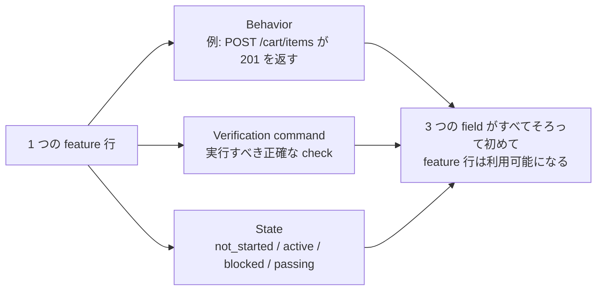
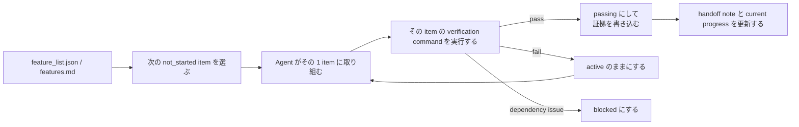

[中国語版 →](../../../zh/lectures/lecture-08-why-feature-lists-are-harness-primitives/)

> コード例: [code/](https://github.com/walkinglabs/learn-harness-engineering/blob/main/docs/en/lectures/lecture-08-why-feature-lists-are-harness-primitives/code/)
> 実践プロジェクト: [Project 04. Runtime feedback and scope control](./../../projects/project-04-incremental-indexing/index.md)

# Lecture 08. Feature List を使って Agent の行動範囲を制約する

agent に e-commerce サイトを作るよう依頼したとします。完了すると、agent は「done」と報告します。コードを見ると、ユーザー認証は動いていますが、ショッピングカートの checkout ボタンは何もせず、payment の流れはまったくつながっていません。問題は、「done」の意味をこちらが定義していなかったことです。そのため、agent は自分なりの基準で判断しました。「たくさんコードを書いたし、見た目もかなり完成している」と。

Feature list は、多くの人にとっては単なるメモに見えます。やることを書き留めて、忘れないようにして、あとはしまっておくものです。しかし harness の世界では、feature list は人間向けのメモではなく、harness 全体の土台です。scheduler は task を選ぶためにこれを参照し、verifier は完了判定のためにこれを参照し、handoff reporter は要約を生成するためにこれを参照します。土台を壊せば、全体が動かなくなります。

Anthropic も OpenAI も、**artifacts は外部化しなければならない** と強調しています。feature state は、非構造化な会話テキストではなく、repo 内の machine-readable な file に置かなければなりません。

## Agents は「done」の意味を知らない

Claude Code も Codex も、こちらが言う「done」の意味を自動では理解しません。「shopping cart 機能を追加して」と言えば、model の解釈は「Cart component を書いて、`addToCart` method を追加する」かもしれません。しかし、あなたが本当に意図していたのは「ユーザーが商品を閲覧し、cart に追加し、checkout を end-to-end で完了できること」だったはずです。Feature list がなければ、この理解のずれは埋まりません。agent は自分の暗黙の基準、たいていは「コードに明らかな syntax error がないこと」で動いてしまいます。必要なのは end-to-end の behavior verification です。友人に fruit を買ってきてと頼むときに、「fruit を買ってきて」と言ったら lemon を持って帰ってくるようなものです。相手の fruit とあなたの fruit は、同じ fruit ではありません。

よくある進捗メモを見てみましょう。

```
Did user auth, shopping cart mostly done, still need payments
```
このメモだけで、新しい agent session は次の質問に答えられるでしょうか。`mostly done` とは何を意味するのでしょう。cart はどの test を通過したのでしょう。payment の何がブロックしているのでしょう。答えはすべて「誰にもわからない」です。医者に「胃が痛いです。最近はまあまあでした」とだけ伝えるようなものです。それで何の薬を出せるでしょうか。

その結果、新しい session は project state の推測にまとまった時間を費やし、完了済みの feature を再実装してしまうこともあります。Anthropic の公開事例でも、progress file と git history を使って次の agent が状態を素早く理解できるようにする設計が紹介されています。

## Feature State Machine





## Core Concepts

- **Feature list は harness の primitive**: 「任意の planning tool」ではなく、他のすべての harness component が依存する基礎データ構造です。database の table structure のようなものです。primary key を「省略してもよさそう」とは言えません。
- **Triple structure**: 各 feature item は `(behavior description, verification command, current state)` の triple です。どれか 1 つでも欠ければ、その item は incomplete です。
- **State machine model**: 各 feature item には `not_started`, `active`, `blocked`, `passing` の 4 つの state があります。state transition は agent が自由に変えるのではなく、harness が制御します。
- **Pass-state gating**: feature が `active` から `passing` に移る唯一の方法は、verification command が正常に実行されることです。これは不可逆です。いったん `passing` になったら、戻れません。exam に合格したら合格であって、あとから score を書き換えることはできないのと同じです。
- **Single source of truth**: 「何をすべきか」に関する情報はすべて 1 つの feature list から導かなければなりません。feature list と conversation history の間に矛盾があってはいけません。
- **Back-pressure**: まだ pass していない feature の数が、harness が agent にかける pressure です。pressure が 0 なら、project は完了です。

## Why Feature Lists Must Be "Primitives"

document は人間が読むためのものです。primitive は system が実行するためのものです。document は無視できますが、primitive は迂回できません。

database の trigger constraint と application-layer check を比べるとわかりやすいでしょう。前者は database engine によって強制され、どんな SQL でも飛ばせません。後者は application code の正しさに依存しており、うっかり bypass されることがあります。harness primitive としての feature list は、まさに前者です。feature list は具体的に 4 つの harness component を支えます。

1. **Scheduler**: state を読み取り、次の `not_started` feature を選びます。工場の production planning system のようなものです。
2. **Verifier**: verification command を実行し、state transition を許可するかを判断します。quality inspection のようなものです。
3. **Handoff reporter**: feature list から session handoff の summary を自動生成します。自動の shift-change report のようなものです。
4. **Progress tracker**: state 分布を集計し、project health metrics を提供します。dashboard のようなものです。

## How to Do It Right

### 1. 最小限の Feature List Format を定義する

複雑な system は必要ありません。structured な Markdown でも JSON file でも十分です。重要なのは、各 entry に必ず triple があることです。

```json
{
  "id": "F03",
  "behavior": "POST /cart/items に {product_id, quantity} を送ると 201 を返す",
  "verification": "curl -X POST http://localhost:3000/api/cart/items -H 'Content-Type: application/json' -d '{\"product_id\":1,\"quantity\":2}' | jq .status == 201",
  "state": "passing",
  "evidence": "commit abc123, test output log"
}
```

### 2. Harness に state transition を制御させる

agent は feature の state を直接 `passing` に変更できません。できるのは verification request を送ることだけです。harness が verification command を実行し、その transition を許可するかどうかを決めます。これが pass-state gating です。

### 3. ルールを CLAUDE.md に書く

```
## Feature List Rules
- Feature list file: /docs/features.md
- Only one feature active at a time
- Verification command must pass before marking as passing
- Don't modify feature list states yourself — the verification script updates them automatically
```

### 4. 粒度を調整する

各 feature item は、「1 session で完了できる」範囲に収めるべきです。広すぎると終わらず、狭すぎると管理コストが増えます。「ユーザーが cart に item を追加できる」は適切な粒度です。「shopping cart を実装する」は広すぎます。「Cart model に name field を追加する」は狭すぎます。肉を切るのと同じです。塊のままでも、ひき肉でもいけません。

## Real-World Case

10 個の feature を持つ e-commerce platform を考えます。2 つの tracking approach を比較します。

**Memo mode**: agent は非構造化な note を使います。3 session 後には、note が「user auth と product list はできた、shopping cart は mostly done だが bug がある、payments は未着手」という状態になります。新しい session は state を推測するのに 20 分かかり、最終的に完了済みの feature を再実装します。ちょうど shopping list に「milk, bread, and that thing」と書いてあるようなもので、店に着いても何を買うべきかわかりません。

**Backbone mode**: すべての feature に明確な state と verification command があります。新しい session は feature list を読めば、3 分で F01-F05 が `passing`、F06 が `active`、F07-F10 が `not_started` だと把握できます。そのまま F06 から直接作業を再開でき、手戻りはゼロです。

この比較で重要なのは、structured feature list では完了条件と現在状態が機械可読に残るため、free-form な tracking よりも「何を次にやるべきか」「何が完了済みか」を判断しやすいことです。

## Key Takeaways

- **Feature list は harness の backbone** であり、人間向けの memo ではありません。scheduler、verifier、handoff reporter はすべてそれに依存します。
- **各 feature item には triple が必要** です。behavior description + verification command + current state の 3 つです。1 つでも欠ければ incomplete です。ちょうど 3 本脚の stool から 1 本脚を抜いたようなものです。
- **state transition は harness が制御します**。agent は自力で state を変えられません。verification を通すことだけがアップグレード経路です。
- **feature list は project の single source of truth** です。「何をすべきか」の情報はすべて 1 つの list から導かれます。
- **粒度は「1 session で完了できる」ことに合わせて調整します。**

## Further Reading

- [Effective harnesses for long-running agents - Anthropic](https://www.anthropic.com/engineering/effective-harnesses-for-long-running-agents) — feature list を premature completion や scope drift への対策として使う実例を示している
- [Harness Engineering - OpenAI](https://openai.com/index/harness-engineering/) — 「artifacts を externalize する」原則を強調している
- [Design by Contract - Bertrand Meyer](https://www.goodreads.com/book/show/130439.Object_Oriented_Software_Construction) — contract design の原則であり、feature list の理論的基盤
- [The Practical Test Pyramid - Martin Fowler](https://martinfowler.com/articles/practical-test-pyramid.html) — test pyramid と user-facing acceptance tests の実践

## Exercises

1. **Feature List Design**: 最小限の feature list JSON schema を定義してください。`id`、behavior description、verification command、current state、evidence reference を含めてください。5 個の feature を持つ実際の project をこの schema で表現してください。

2. **Verification Strictness Comparison**: 3 つの feature を選び、`code has no syntax errors` のような「loose」な verification と、`end-to-end test passes` のような「strict」な verification の両方を設計してください。それぞれの false positive rate を比較してください。

3. **Single Source Principle Audit**: 既存の agent project をレビューし、feature list と矛盾する scope information がないか確認してください（会話に含まれる暗黙の要件、code 内の TODO comment など）。すべての情報を feature list に統合する plan を設計してください。
