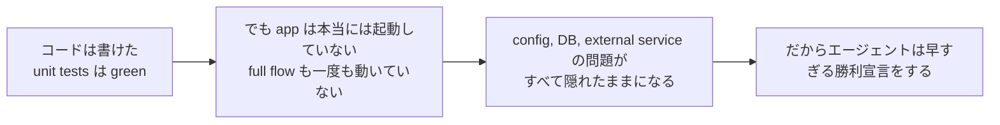

[中国語版 →](../../../zh/lectures/lecture-09-why-agents-declare-victory-too-early/)

> この講義のコード例: [code/](https://github.com/walkinglabs/learn-harness-engineering/blob/main/docs/en/lectures/lecture-09-why-agents-declare-victory-too-early/code/)
> ハンズオン演習: [Project 05. エージェントに自分の作業を検証させる](./../../projects/project-05-grounded-qa-verification/index.md)

# 講義 9. エージェントが早まって勝利宣言しないようにする

エージェントに「password reset」機能の実装を依頼したとします。すると、データベーススキーマを変更し、API エンドポイントを書き、メールテンプレートを追加し、単体テストを実行し、すべて通ったうえで、自信満々に「完了しました」と言ってきます。ところが実際に動かしてみると、password reset link を送れない（email service の設定が足りない）、database migration が途中で失敗する（schema の不整合がある）、そして end-to-end の流れは一度も実行されていない、という具合です。

この感覚に覚えがある人は多いはずです。まるで試験用紙を全部埋めて真っ先に提出したのに、結果発表で不合格になるようなものです。用紙が埋まっているからといって、答えが正しいとは限りません。

これは珍しい事故ではありません。Guo らによる 2017 年の ICML 論文は、**現代のニューラルネットワークは体系的に過信する**ことを示しました。モデルが示す confidence は、実際の accuracy よりもかなり高くなりがちです。AI コーディングエージェントにも同じことが起きます。本人は「終わった」と感じていても、実際にはまったく届いていないのです。harness は、エージェントの「感覚」を、外部化された実行ベースの検証に置き換えなければなりません。

## すべりやすい坂

早すぎる完了宣言は、たいてい同じ流れで起こります。コードは見た目上は問題なさそうで、構文も正しく、ロジックも妥当に見え、静的解析でも明らかなエラーは出ません。ところが harness が包括的な実行検証を強制していないため、エージェントは実際に動かすことを飛ばしたり、一部のテストしか走らせなかったりします。unit test は通すが integration test は省く。テストは走らせるが coverage は確認しない。最終的に、「コードはよさそうだ」が「機能は完了した」の根拠として扱われてしまいます。こうして試験用紙が提出されるのです。

情報は各段階で失われます。task specification から code implementation へ、さらに runtime behavior へと変換されるたびに bias が入り込み、検証を省くたびに情報の非対称性はさらに大きくなります。

## 3 層の終了判定チェック




## 核心概念

- **早すぎる完了宣言**: エージェントはタスクが完了したと断言するが、正しさの要件はまだ満たされていない状態です。核心は、エージェントがコードレベルの局所的な自信で判断してしまい、システム全体の正しさには全体的な検証が必要だという点です。
- **confidence calibration bias**: エージェントが自己申告する完了への confidence と、実際の完了品質のあいだにある体系的なズレです。複数ファイルにまたがる複雑なタスクでは、この bias はかなり正の方向に偏り、エージェントは実際よりも常に自信過剰になります。まるで、試験後にいつも点数を高く見積もる学生のようです。
- **終了条件**: harness が定義する、明確で実行可能な判定条件のセットです。エージェントは完了を宣言する前に、すべての条件を満たさなければなりません。「完了」は主観ではなく、客観的な判定に変わります。
- **verification-validation の二重ゲート**: 1 つ目の verification 層では「コードが指定された振る舞いを正しく実装したか」を確認し、2 つ目の validation 層では「システム全体として end-to-end の要件を満たしているか」を確認します。両方通って初めて完了と見なします。
- **runtime feedback signals**: プログラム実行から得られる logs、process state、health check です。harness が完了品質を判断するための客観的な根拠になります。
- **完了優先制約**: まず機能の正しさを確認し、その後に performance を扱い、最後に style を整えます。核心機能が検証されるまでは refactoring を禁じます。

## 単体テストに通ること ＝ タスク完了 ではない

これは最もよくある落とし穴であり、最も危険な落とし穴でもあります。エージェントはコードを書き、unit tests を実行し、すべて green になったので「完了」と言いました。しかし、unit tests の設計思想は、対象の unit を切り出して dependency を mock することです。だからこそ、コンポーネント間の問題を見つけることはできません。

**Interface Mismatch**: render process から preload script に渡される file path は relative path なのに、preload script は absolute path を想定しているケースです。それぞれの unit test は mock を使っていて通ってしまいました。問題が見つかるのは end-to-end testing のときだけです。まるで、バンドの各メンバーが個別には完璧に練習していたのに、一緒に演奏したら調性が違っていたと気づくようなものです。

**State Propagation Errors**: database migration によって table schema は変わったのに、ORM の caching layer には古い schema の cache entry が残っているケースです。unit tests は毎回新しい mock environment を用意するため、このレイヤーをまたぐ state の不整合は表に出ません。

**Environment Dependency**: test environment では正しく動くのに（すべて mock されているため）、実 environment では configuration の違い、network latency、service 不可用性のせいで失敗するケースです。まるで、リハーサル室では完璧に歌えたのに、本番では音響機材の問題にぶつかるようなものです。

### 「ついでにリファクタリング」は完了判定を壊す

Claude Code には、核心機能が検証を通る前に code refactoring、performance 最適化、style 改善を始めてしまう、よくある振る舞いがあります。Knuth の「Premature optimization is the root of all evil.」という言葉は、エージェントの文脈では別の意味を持ちます。refactoring は、検証済みと未検証の境界を変えてしまい、それまで暗黙に正しかった code path を壊す可能性があるからです。まるで、数学の記述問題をまだ終えていないのに、選択問題の解答をより見栄えよく書き直すようなものです。時間を無駄にするだけでなく、書き写しを間違えるかもしれません。

### 自己評価における体系的な偏り

Anthropic は 2026 年の研究で、より深い失敗パターンを発見しました。**エージェントに自分の作業を評価させると、人間の観察者なら明らかに質が低いと判断する場合でも、体系的に高めの評価を返す**のです。これは、学生に自分の試験を採点させるようなものです。自分の解答には、どうしても甘くなります。

この問題は、とくに subjective な task（たとえば design aesthetics）で深刻です。「layout is exquisite かどうか」は判断の問題であり、エージェントは安定して positive に寄ります。結果が検証可能な task でも、判断の甘さによって performance が損なわれることがあります。

解決策は、エージェントを「もっと objective にする」ことではありません。同じ model が生成と評価の両方を担う限り、自分に甘くなる傾向は避けられないからです。**解決策は、「worker」と「checker」を分離することです。** 学生が自分の試験を採点すべきでないのと同じです。独立した採点者が必要です。

生成するエージェントとは別に、「厳しめ」に調整された独立の評価エージェントを置くほうが、自己評価よりはるかに有効です。Anthropic の実験データでは次のとおりです。

| アーキテクチャ | 実行時間 | コスト | 核心機能は動作したか? |
|--------------|---------|------|------------------------|
| 単一エージェント（素の実行） | 20 分 | $9 | いいえ（game entities が input に反応しない） |
| 3 エージェント（planner + generator + evaluator） | 6 時間 | $200 | はい（game は完全にプレイ可能） |

これは、まったく同じ model（Opus 4.5）に、まったく同じ prompt（"build a 2D retro game editor"）を与えたものです。違うのは harness だけです。つまり、「素の実行」から「planner が requirements を展開 → generator が feature ごとに実装 → evaluator が Playwright を使って実際に click testing を行う」へ変わっただけです。

> 出典: [Anthropic: Harness design for long-running application development](https://www.anthropic.com/engineering/harness-design-long-running-apps)

## 早すぎる提出を防ぐ方法

### 1. 終了判定を外部化する

完了判定はエージェント自身が下すべきではありません。harness が runtime signals を入力として、独立に終了検証を実行する必要があります。これを `CLAUDE.md` に明確に書いてください。

```
## Definition of Done
- Feature complete = end-to-end verification passed, not "code is written"
- Required verification levels:
  1. Unit tests pass
  2. Integration tests pass
  3. End-to-end flow verification passes
- Do not proceed to level 2 if level 1 fails
- Do not proceed to level 3 if level 2 fails
```

### 2. 3 層の終了検証を構築する

- **Layer 1: Syntax and Static Analysis**. 最もコストが低く、得られる情報も少ないですが、必ず通す必要があります。まずは単語の綴りが正しいことを確認してから、他を見るための最低限のチェックです。
- **Layer 2: Runtime Behavior Verification**. テスト実行、app 起動チェック、critical path の検証です。完了の核心となる証拠です。書くだけでは不十分で、実際に動かなければなりません。
- **Layer 3: System-Level Confirmation**. end-to-end testing、integration validation、user scenario のシミュレーションです。早すぎる宣言に対する最後の防壁です。動かすだけでは足りず、正しく動かなければなりません。

### 3. エージェント向けの良い「赤ペン添削」を設計する

OpenAI は Codex の実践の中で、とくに効果的なパターンを導入しました。**エージェント向けのエラーメッセージには修正指示を含める**ことです。怠けた採点者のように大きくバツを付けるだけではなく、よい先生のように「こう直してください」と余白に書くのです。`"Test failed"` ではなく、`"Test failed: POST /api/reset-password returned 500. Check that the email service config exists in environment variables. The template file should be at templates/reset-email.html."` のようにします。こうした具体的で実行可能なフィードバックがあれば、人手を介さずにエージェントは自己修正できます。

### 4. runtime signals を収集する

有効な runtime signals には次のようなものがあります。
- アプリケーションは正常に起動し、ready state に到達したか?
- critical feature path は runtime 上で正常に実行されたか?
- database write、file operation、その他の side effect は正しかったか?
- 一時的なリソースは片付けられたか?

## 実例

**Task**: user の password reset 機能を実装する。database operation、email sending、API endpoint の変更を含みます。

**早すぎる提出の流れ**: エージェントが database schema を変更し、API endpoint を書き、email template を追加し、unit tests を実行して通り、完了を宣言します。試験用紙はすっかり埋まっています。

**実際の減点要素**: (1) end-to-end flow を未検証でした。reset link の実際の送信と確認が一度も保証されていません。 (2) database migration が部分実行後に失敗し、schema の不整合を起こしました。 (3) 対象環境で email service の config が不足していました。

**harness の介入**: 終了検証を強制しました。(1) full app を起動して reset endpoint へのアクセスを確認する。 (2) 完全な reset flow を実行する。 (3) database state の整合性を検証する。すると、セッション内ですべての欠陥が見つかり、その後の修正コストを 5〜10 倍節約できました。独立した採点者が、実際の問題を見つけたのです。

## 要点

- **エージェントは体系的に過信する**。confidence calibration bias は客観的な事実です。試験用紙を埋めたからといって、正解したことにはなりません。
- **完了判定は外部化しなければならない**。harness が独立に検証し、エージェントの「感覚」は信じないでください。学生は自分の試験を採点できません。
- **3 層すべての検証が重要です**。構文を通し、振る舞いを通し、システムを通し、層ごとに進めます。
- **エラーメッセージは、よい先生の赤ペン添削のようにする**。具体的な修正手順を含めれば、エージェントは自己修正できます。
- **核心機能が検証されるまで refactoring しない**。完了優先制約こそが、早すぎる最適化を防ぐ鍵です。

## 参考文献

- [On Calibration of Modern Neural Networks - Guo et al.](https://arxiv.org/abs/1706.04599) — 現代の深層ネットワークが体系的に過信することを示した論文
- [Building Effective Agents - Anthropic](https://www.anthropic.com/research/building-effective-agents) — 完了判定における runtime evidence の重要性
- [Harness Engineering - OpenAI](https://openai.com/index/harness-engineering/) — 早すぎる完了宣言は、エージェントの主な失敗モードの 1 つ
- [The Art of Software Testing - Myers](https://www.goodreads.com/book/show/137543.The_Art_of_Software_Testing) — テスト手法の階層と有効性に関する定番の参考文献

## 演習

1. **終了検証関数の設計**: database migration と API modification を含む task に対して、完全な終了検証を設計してください。必要な runtime signals と、それぞれの pass/fail 基準を列挙してください。実際の task で実行し、どんな隠れた問題が見つかるか記録してください。

2. **calibration bias の測定**: 10 種類の異なる coding task を選び、エージェントの自己申告による完了 confidence と、実際の完了品質を記録してください。bias 値を算出し、task complexity との関係を分析してください。

3. **多層防御の実験**: 同じ task 群に対して 3 つの構成を実行してください。(a) 静的解析のみ、(b) unit testing を追加、(c) 3 層すべての検証を実施。早すぎる完了宣言の割合と、見逃された defect の数を比較してください。
