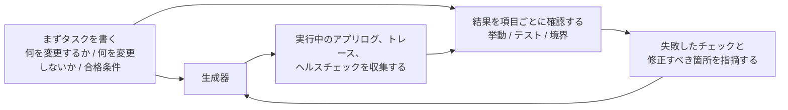

[中国語版 →](../../../zh/lectures/lecture-11-why-observability-belongs-inside-the-harness/)

> コード例: [code/](https://github.com/walkinglabs/learn-harness-engineering/blob/main/docs/en/lectures/lecture-11-why-observability-belongs-inside-the-harness/code/)
> 実践プロジェクト: [Project 06. 完全なハーネス (Capstone)](./../../projects/project-06-runtime-observability-and-debugging/index.md)

# 第11講. なぜ可観測性はハーネスの内部にあるべきなのか

## この講義で解決する問題は何か？

エージェントに機能の実装を依頼したとします。20分ほど動いたあと、いくつものファイルを変更し、最後に「完了しましたが、2つのテストが失敗しています」と報告してきます。なぜ失敗しているのかを尋ねると、「よくわかりません。タイミングの問題かもしれません」と返ってくる。どの重要経路を変更したのかを聞くと、「ちょっとコードを見てみます...」となる。

これは、エージェントに能力が足りないという話ではありません。ハーネスが十分な可観測性を提供していないのです。**可観測性がなければ、エージェントは不確実なまま判断し、評価は主観的なものになり、再試行は盲目的なさまよいになります。** OpenAI も Anthropic も、信頼性とは証拠の問題だと定義しています。ハーネスは、次の判断を導くために使える形で、実行時の挙動と評価シグナルを露出しなければなりません。

## 基本概念

- **実行時可観測性**: ログ、トレース、プロセスイベント、ヘルスチェックといったシステムレベルのシグナル。システムが「何をしたか」に答える。
- **プロセス可観測性**: 計画、採点ルーブリック、受け入れ基準といったハーネスの判断アーティファクトの可視性。変更が「なぜ受け入れられるべきか」に答える。
- **タスクトレース**: タスク開始から完了までの完全な判断経路記録。分散システムにおけるリクエストトレーシングに相当する。エージェントが踏んだすべての手順と文脈を記録する。
- **スプリント契約**: コーディングを始める前に交わす短期合意。タスク範囲、検証基準、除外事項を明示する。プロセス可観測性の中核となるツール。
- **評価ルーブリック**: 品質評価を主観から証拠ベースの構造化採点へ変換する。異なる評価者でも同じ出力に対して似た結果を出しやすくする。
- **レイヤード可観測性**: システム層とプロセス層の可観測性を同時に設計し、相互に補強する考え方。実行時シグナルは挙動を説明し、プロセスアーティファクトは意図を説明する。

## レイヤード可観測性



## なぜこうなるのか

### 可観測性が欠けると何が本当に失われるのか

ハーネスに可観測性がないと、4種類の問題が体系的に現れます。

**「正しい」と「正しそう」を見分けられない**: 関数はコードレビューでは完璧に見えるかもしれません。構文は正しく、ロジックも妥当です。しかし実行時には、エッジケース処理の誤りにより、特定の入力で誤った結果を返します。実際の実行経路が期待から外れていることを明らかにできるのは、実行時トレースだけです。

**評価が神秘化する**: 採点ルーブリックや受け入れ基準がなければ、評価者（人間でもエージェントでも）は暗黙の前提に頼ることになります。同じ出力でも、評価者によって大きく結果が変わり得ます。品質評価は再現不能になります。

**再試行が盲目的な推測になる**: 何が失敗の原因なのかエージェントがわからなければ、再試行の方向はランダムになります。無関係なコード経路を直し続けて、本当の失敗原因を見落とすかもしれません。盲目的な再試行のたびに、トークンと時間が失われます。

**セッション引き継ぎの情報断崖が起きる**: 未完了の作業を次のセッションに渡すとき、可観測性が不足していると、新しいセッションはシステム状態を一から診断しなければなりません。Anthropic の長時間稼働エージェントに関する観察では、この重複診断だけでセッション全体の 30〜50% を消費しうるとされています。

### 実際の Claude Code のシナリオ

「planner-generator-evaluator」の3役ワークフローを持つハーネスで、「アプリにダークモードを追加する」タスクを実行するとします。

**可観測性がない場合**: planner は曖昧な説明を出します。generator はその曖昧さを前提にダークモードを実装しますが、planner の暗黙の期待には合いません。evaluator は自分の暗黙の基準で却下しますが、何が具体的に悪いのかは言えません。generator は、曖昧な却下理由をもとに盲目的に再試行します。このサイクルが 3〜4 回繰り返され、約45分かけて、かろうじて受け入れられる程度の出力になります。

**完全に可観測な場合**: planner はスプリント契約を出し、どのコンポーネントを変更するか、各項目の検証基準、除外事項（印刷用スタイルなし）を列挙します。generator は契約に従って実装します。実行時可観測性が、各コンポーネントのスタイル読み込みと適用プロセスを記録します。evaluator は採点ルーブリックを使い、各観点を分けて、具体的な証拠を引用しながら評価します。1回の反復で高品質な結果が得られ、所要時間は約15分です。

3倍の効率差です。変わったのは可観測性だけです。

### なぜエージェント自身では解決できないのか

「エージェント自身がログを出せばいいのでは？」と思うかもしれません。問題は次の通りです。

1. エージェントは自分が知らないことを知らないため、必要だと気づいていないシグナルを自発的には記録しません。
2. ログ形式が一貫しないため、セッションごとに出力形式が違い、体系的な分析ができません。
3. プロセス可観測性はログだけでは解決できません。スプリント契約や採点ルーブリックは、ハーネス側の支援が必要な構造化アーティファクトです。

## 正しいやり方

### 1. 実行時シグナル収集をハーネスに組み込む

エージェントに自分でログを出させることに頼らないでください。ハーネスが次のシグナルを自動収集すべきです。

- **アプリケーションライフサイクル**: 起動、準備完了、稼働中、シャットダウンの各フェーズ状態
- **機能パス実行**: エントリポイント、チェックポイント、終了点を含む重要経路の実行記録
- **データフロー**: コンポーネント間を流れるデータの記録
- **リソース利用**: 異常なリソース使用パターン（例: メモリが継続的に増え続ける）
- **エラーと例外**: エラーメッセージだけでなく、完全なエラー文脈

### 2. スプリント契約を実装する

各タスクの開始前に、generator と evaluator（同じエージェントの別実行であってもよい）が契約を交渉します。

```markdown
# スプリント契約: ダークモード対応

## 範囲
- テーマ切り替えコンポーネントを変更する
- グローバル CSS 変数を更新する
- ダークモードのテストを追加する

## 検証基準
- 各コンポーネントでビジュアル回帰テストが通る
- メインフローの E2E テストが通る
- 未スタイルコンテンツのちらつき（FOUC）がない

## 除外事項
- 印刷用スタイルは扱わない
- サードパーティ製コンポーネントのダークモードは扱わない
```

### 3. 評価ルーブリックを整備する

「良いか悪いか」を、定量的に採点できる形に変えます。

```markdown
# 採点ルーブリック

| 観点 | A | B | C | D |
|------|---|---|---|---|
| コードの正確性 | すべてのテストが通る | メインフローが通る | 部分的に通る | ビルドが失敗する |
| アーキテクチャ適合性 | 完全に適合 | 軽微な逸脱 | 明らかな逸脱 | 重大な違反 |
| テストカバレッジ | メイン + エッジケース | メインフローのみ | 骨組みだけ | テストなし |
```

### 4. OpenTelemetry で標準化する

ハーネスの各セッションにトレースを1つ、各タスクにスパンを1つ、各検証ステップにサブスパンを作成します。標準属性を使って重要情報を注釈します。こうすることで、可観測性データを標準的なツールチェーン（Jaeger, Zipkin）へ統合できます。

## 実世界の事例

planner-generator-evaluator ワークフローを使い、「ダークモード対応を追加する」を実行するハーネスを考えます。

**可観測でない版**: 3〜4回の盲目的再試行、45分、かろうじて受け入れ可能な出力。evaluator は「何となく違う」としか言えず、何が具体的に悪いのかは説明できません。generator は間違った方向に多くの時間を費やします。

**完全に可観測な版**:
- スプリント契約が範囲、基準、除外事項を明確化する
- 実行時トレースが各コンポーネントのスタイル読み込みプロセスを記録する
- 採点ルーブリックが観点ごとの構造化評価を提供する
- 1回の反復で高品質な結果が得られ、15分で終わる

3倍の効率改善、より安定した品質、再現可能な評価。

## 重要なポイント

- **可観測性はハーネスのアーキテクチャ特性である** - 後付けの機能ではなく、設計時点で考慮すべき中核能力です。
- **両方の可観測性レイヤーが必要である** - 実行時シグナルは「何が起きたか」を説明し、プロセスアーティファクトは「なぜそのやり方だったか」を説明します。
- **スプリント契約は認識合わせを前倒しする** - 「generator が何かを作ったが、evaluator が予見可能な理由で即座に拒否する」事態を防ぎます。
- **採点ルーブリックは評価を再現可能にする** - 異なる評価者でも同じ出力に対して似たスコアを出します。
- **可観測性の欠如は、セッション時間の30〜50%を重複診断で浪費する**。

## 参考文献

- [Observability Engineering - Charity Majors](https://www.honeycomb.io/blog/observability-engineering-book) — 現代の可観測性エンジニアリングに関する理論と実践の枠組み
- [Dapper - Google (Sigelman et al.)](https://research.google/pubs/pub36356/) — 大規模分散トレーシングにおける画期的な実践
- [Harness Design - Anthropic](https://www.anthropic.com/engineering/harness-design-long-running-apps) — スプリント契約と評価ルーブリックの紹介
- [Site Reliability Engineering - Google](https://sre.google/sre-book/table-of-contents/) — 本番システムにおける可観測性の体系的な適用

## 演習

1. **可観測性ギャップ分析**: 現在のハーネスについて、システム層とプロセス層の可観測性を監査してください。既存のシグナルでは区別できないシステム状態を見つけ、追加案を提案してください。

2. **スプリント契約の実践**: 実際のタスク向けにスプリント契約を書いてください。エージェントに契約どおり実行させ、契約ありとなしで効率と品質を比較してください。

3. **タスクトレースの構築**: 完全なコーディングタスクの間、エージェントの操作の各ステップを記録してください。OpenTelemetry のセマンティック規約に沿って注釈を付けます。トレース内の情報ボトルネックを分析し、どのステップで判断に十分なシグナルが不足しているかを特定してください。
