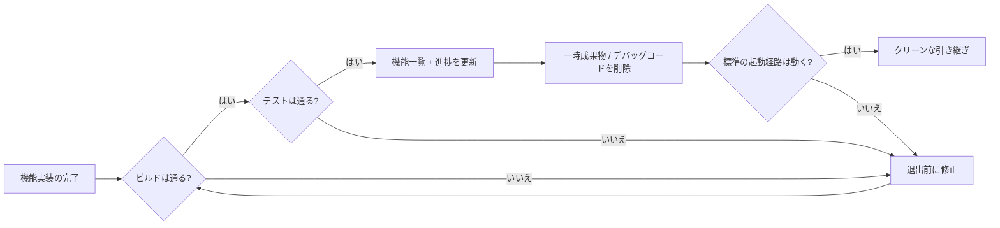
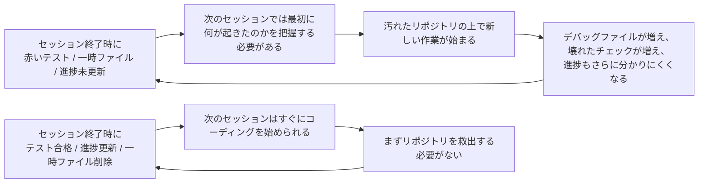

[中国語版 →](../../../zh/lectures/lecture-12-why-every-session-must-leave-a-clean-state/)

> コード例: [code/](https://github.com/walkinglabs/learn-harness-engineering/blob/main/docs/en/lectures/lecture-12-why-every-session-must-leave-a-clean-state/code/)
> 演習プロジェクト: [Project 06. Complete harness (Capstone)](./../../projects/project-06-runtime-observability-and-debugging/index.md)

# 講義 12. すべてのセッションをクリーンな状態で終える理由

## この講義はどんな問題を解決するのか?

エージェントが午後いっぱい動き、20ファイルを変更し、コードをコミットして、セッションが終了します。すると次のエージェントセッションが始まってすぐに、ビルドが壊れている、テストが赤い、一時的なデバッグファイルが散らかっている、機能一覧が更新されていない、進捗がまったく分からない、という状態に気づきます。新しいセッションの最初の30分は、「前回のセッションは実際に何をしたのか」を把握するだけで終わってしまいます。

OpenAI も Anthropic も明確に述べています。**長期的な信頼性は、1回の実行成功ではなく、運用上の規律に依存する**のです。セッション終了時の状態の質が、次のセッションの効率を直接左右します。Git のベストプラクティスと同じで、各コミットは原子的でビルド可能な変更であるべきで、未完成のコードの寄せ集めであってはいけません。

## コア概念

- **クリーンな状態**: セッション終了時にシステムが 5 つの条件を満たしている状態。ビルド成功、テスト成功、進捗の記録、一時生成物が残っていないこと、標準の起動経路が使えることです。どれか 1 つでも欠ければ、そのセッションは「完了」とは言えません。
- **セッション整合性**: データベースのトランザクションに似ています。完全にコミットしてクリーンな状態を残すか、最後の整合した状態までロールバックするかのどちらかです。中間はありません。
- **品質ドキュメント**: 各モジュールの品質評価を継続的に記録する、アクティブな成果物です。一度だけの評価ではなく、コードベースが時間とともに強くなっているか弱くなっているかを示すトラッカーです。
- **クリーンアップループ**: コードベース内のエントロピーを体系的に減らすことを目的にした、定期メンテナンスのセッションです。緊急修正ではなく、通常運用の一部です。
- **ハーネスの簡素化**: モデル能力が向上したら、もはや不要になったハーネス要素を定期的に取り除きます。今日必須の制約でも、3か月後には不要な負債かもしれません。
- **冪等なクリーンアップ**: 何回実行しても同じ結果になるクリーンアップ操作です。失敗後の再試行シナリオでも、安全にクリーンアップできることを保証します。

## クリーンな状態の5つの次元





## なぜこうなるのか

### エントロピーの増大はデフォルト状態

Lehman のソフトウェア進化法則が示すように、継続的に変更されるシステムは、積極的に管理しない限り、必然的に複雑化します。これは AI コーディングエージェントで特に顕著です。各セッションが変更を持ち込み、終了時にクリーンアップしなければ、技術的負債は指数関数的に蓄積します。

この講義では、次のような想定例で差を考えます。

- クリーンアップ戦略なし: 週を追うごとにビルドとテストの失敗が増え、新しいセッションはまず状態復元に時間を使う。
- クリーンアップ戦略あり: 各セッションの終了時にビルド、テスト、進捗、成果物、起動経路を確認し、次のセッションがすぐ作業に入れる状態を保つ。

ここで重要なのは、特定の数値ではなく傾向です。クリーンな終了条件を持たないプロジェクトは、時間の経過とともに「作る時間」より「状態を戻す時間」が増えていきます。

### クリーンな状態の5つの次元

クリーンな状態とは、単に「コードがコンパイルできる」ことではありません。5つの次元をまとめて評価する必要があります。

**ビルドの次元**: コードはエラーなくビルドできるか。これは最も基本的な条件です。次のセッションが最初にビルドエラーを直す必要があってはいけません。

**テストの次元**: すべてのテストは通るか。セッション以前から存在していたテストも含みます。つまり、そのセッションは既存機能を壊さない責任を負っています。そして、「自分の環境では動く」ではなく、CI で検証されていなければなりません。

**進捗の次元**: 現在の進捗は機械可読な成果物に記録されているか。完了したサブタスク、その合格基準、進行中だが未完了のサブタスク、その現在状態、未着手のサブタスク。適切な進捗記録は、セッション開始時の診断を減らします。

**成果物の次元**: 古くなった、または曖昧な一時成果物は残っていないか。デバッグログ、一時ファイル、コメントアウトされたコード、TODO マーカーなどはすべて、次のセッションの認知負荷を増やします。

**起動の次元**: 標準の起動経路は使えるか。次のセッションが手動介入なしで作業を始められるか。環境初期化、コードベース読み込み、コンテキスト取得、タスク選択。これらの経路は壊れていてはいけません。

### 「あとで片付ける」は、片付けないのと同じ

最もよくある思考の罠は、「このセッションでは片付ける時間がない。次回やろう」です。しかし次のエージェントセッションは、あなたが何を残したかを知りません。コードと不確かな状態が混ざった混乱を前にして、「このコードのどの部分が意図的で、どこが一時的なものなのか」を推測するのにかなりの時間を費やします。

さらに悪いことに、各セッションにはそれぞれ独自のタスク目標があります。新しいセッションは前回のセッションの散らかった状態を片付けるためではなく、新しい作業をするためにあります。したがって混乱を無視してその上に新しい作業を重ね、さらに混乱を積み上げます。これがエントロピーの正のフィードバックループです。

## 正しくやるには

### 1. 完了条件としてクリーンな状態を定義する

ハーネス内で明示的に定義します。**セッション完了 = タスクの検証に合格 AND クリーンな状態チェックに合格**。どちらか一方でも欠ければ、そのセッションは完了ではありません。CLAUDE.md には次のように書きます。

```
## セッション終了チェックリスト
- [ ] ビルドが通る (`npm run build`)
- [ ] すべてのテストが通る (`npm test`)
- [ ] 機能一覧が更新されている
- [ ] デバッグコードが残っていない (`console.log`, `debugger`, `TODO`)
- [ ] 標準の起動経路が使える (`npm run dev`)
```

### 2. 二重モードのクリーンアップ戦略

2つのクリーンアップモードを組み合わせます。

**即時クリーンアップ（各セッション終了時）**: そのセッション中に作られた一時成果物を片付け、機能一覧の状態を更新し、ビルドとテストが通ることを確認します。これは「参照カウント」型のクリーンアップです。

**定期クリーンアップ（週次）**: システム全体をスキャンし、蓄積した構造的問題を扱い、品質ドキュメントを更新し、ベンチマークテストを実行してドリフトを検出します。これは「トレーシング」型のクリーンアップです。

### 3. 品質ドキュメントを維持する

品質ドキュメントは、各モジュールを継続的に採点するアクティブな成果物です。

```markdown
# 品質ドキュメント

## ユーザー認証モジュール (品質: A)
- 検証合格: はい
- エージェントが理解しやすい: はい
- テストの安定性: 安定
- アーキテクチャ境界: 適合
- コーディング規約: 遵守

## 支払いモジュール (品質: C)
- 検証合格: 部分的 (payment callback 未テスト)
- エージェントが理解しやすい: 難しい (ロジックが3ファイルに分散)
- テストの安定性: 不安定 (2件の不安定なテスト)
- アーキテクチャ境界: 違反あり
- コーディング規約: 一部のみ遵守
```

新しいセッションはこのドキュメントを読めば、どこを優先すべきかすぐに分かります。最も低い評価のモジュールから先に修正してください。

### 4. ハーネスを定期的に簡素化する

Anthropic の重要な示唆は次の通りです。**ハーネスの各要素は、モデルが自力では確実にできないことがあるために存在している。だがモデルが改善すれば、その前提は時代遅れになる。** 3 か月前には必須だった制約が、今日では不要な負担になっているかもしれません。

推奨されるやり方はこうです。毎月ハーネスの要素を 1 つ選び、一時的に無効化してベンチマークタスクを実行します。結果が悪化しなければ、恒久的に削除します。悪化するなら、復元するか、より軽い代替に置き換えます。

### 5. クリーンアップ操作は冪等にする

クリーンアップスクリプトは、何度実行しても安全であるべきです。

```bash
# 冪等なクリーンアップ操作
rm -f /tmp/debug-*.log  # -f により、ファイルがなくてもエラーにならない
git checkout -- .env.local  # 既知の状態に戻す
npm run test  # クリーンアップで何も壊れていないことを確認する
```

## 実例

エージェントで継続開発した Electron アプリを想定し、2 つのアプローチを比較します。

**クリーンアップ戦略なし**（対照群）: セッション終了時に一時成果物、赤いテスト、曖昧な進捗メモが残ります。次のセッションは、まず何が意図的な変更で何が一時状態なのかを切り分ける必要があります。

**クリーンアップ戦略あり**（実験群）: 各セッション終了時に完全なクリーン状態チェックと定期的なクリーンアップループを走らせます。次のセッションは、標準の起動経路と進捗記録からそのまま作業を再開できます。

この例で見るべき点は、クリーンアップが美観の問題ではなく、次のセッションの立ち上がりと検証可能性を守るための完了条件だということです。

## 重要なポイント

- **クリーンな状態はセッション完了の必要条件である** — 任意の整理ではなく、「完了」の定義の一部です。
- **5つの次元すべてが必要である** — ビルド、テスト、進捗、成果物、起動。各項目を明示的に確認しなければなりません。
- **品質ドキュメントによりコードベースの健全性を追跡できる** — 劣化していると分かっているものだけを修正できます。
- **ハーネスは定期的に簡素化する** — モデル能力が向上したら、不要になった制約を取り除きます。
- **「あとで片付ける」は片付けないのと同じである** — エントロピー増大がデフォルトであり、積極的なクリーンアップだけがそれに対抗します。

## 参考文献

- [Clean Code - Robert C. Martin](https://www.goodreads.com/book/show/3735293-clean-code) — コードを清潔に保つための体系的な原則
- [Harness Engineering - OpenAI](https://openai.com/index/harness-engineering/) — 再現性をハーネス設計の中核要件とする考え方
- [Effective Harnesses - Anthropic](https://www.anthropic.com/engineering/effective-harnesses-for-long-running-agents) — 長期的な信頼性においてクリーンなセッション終了が果たす重要な役割
- [Programs, Life Cycles, and Laws of Software Evolution - Lehman](https://ieeexplore.ieee.org/document/1702314) — 能動的なメンテナンスがなければシステムの複雑さは必然的に増大することを示すソフトウェア進化の法則

## 演習

1. **クリーン状態チェックリスト**: あなたのコードベース向けに、5つの次元すべてをカバーするセッション終了チェックリストを設計してください。それを5回連続のセッションに適用し、次元ごとの違反を記録してください。

2. **ベンチマーク比較**: 2種類のハーネス変種（クリーン状態要件あり / なし）で、固定のタスクセットを使って比較してください。完了率、再試行回数、欠陥流出率を比較します。

3. **ハーネス簡素化の実践**: ハーネス要素を1つ選び、一時的に無効化してベンチマークタスクを実行してください。無効化前後の結果を比較し、維持・削除・置換のどれにするか判断してください。
