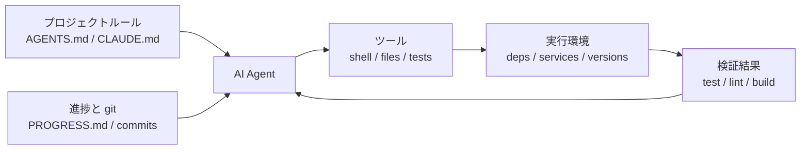

[英語版 →](../../../en/lectures/lecture-02-what-a-harness-actually-is/) | [中国語版 →](../../../zh/lectures/lecture-02-what-a-harness-actually-is/)

> コード例: [code/](https://github.com/walkinglabs/learn-harness-engineering/blob/main/docs/ja/lectures/lecture-02-what-a-harness-actually-is/code/)
> 実践プロジェクト: [Project 01. Prompt-only vs. rules-first](./../../projects/project-01-baseline-vs-minimal-harness/index.md)

# 講義 02. ハーネスとは実際には何を意味するのか

「harness」という言葉は AI コーディングエージェントの文脈で頻繁に使われますが、正直なところ、多くの人は「プロンプトファイル」のことを harness と呼んでいます。しかし、それは harness ではありません。材料しかない状態でレストランを開くようなものです。コンロも、包丁も、レシピも、盛り付けのワークフローもない。それはレストランではありません。それは冷蔵庫です。

この講義では、harness の定義を正確かつ実用的に示します。学術的な抽象論ではなく、今日から使える枠組みです。harness は 5 つのサブシステムから成り、それぞれに明確な責任と評価基準があります。

## たとえ話から始める

あなたが新しく入ったエンジニアで、ドキュメントが一切ないプロジェクトに放り込まれたと想像してください。README はなく、コードにコメントもなく、テストの実行方法を教えてくれる人もいない。CI の設定はどこかに埋もれています。そんな状況で良いコードを書けるでしょうか。たぶん書けます。十分に賢くて、忍耐強ければ。ですが、「このプロジェクトが何をしているのかを把握すること」に膨大な時間を使うことになり、「問題を解くこと」に時間を割けません。

AI エージェントもまったく同じ状況に置かれます。しかも、事情はさらに悪いです。人間なら同僚に質問できますが、エージェントが見られるのは、あなたが目の前に置いたファイルと、実行できるコマンドだけです。「このプロジェクトで使っている ORM のバージョンは何ですか？」と肩を叩いて聞くことはできません。

OpenAI はこの核心を「repo IS the spec」と表現しています。必要な文脈はすべてリポジトリの中にあり、構造化された instruction file、明示的な検証コマンド、わかりやすいディレクトリ構成を通じて渡されるべきだ、という考え方です。Anthropic の長時間稼働するエージェント向けドキュメントは、状態の永続化、明示的な復帰経路、構造化された進捗管理を重視しています。両社は別の言い方をしていますが、要点は同じです。**モデルの外側にあるエンジニアリング基盤のすべてが、モデルの能力をどれだけ実際に引き出せるかを決める**のです。

すでに知っているツールを見てみましょう。

**Claude Code** はハーネス的な発想を体現しています。リポジトリから `CLAUDE.md` を読み込み（レシピ棚）、shell コマンドを実行でき（包丁置き場）、ローカル環境で動作し（コンロ）、セッション履歴を保持し（仕込み台）、テストを実行して結果を確認できます（品質確認窓）。ただし、テストの実行方法を指示しなければ、品質確認窓は機能しません。料理にちゃんと火が通っているか、誰にもわからないからです。

**Cursor** も同様の論理に従っています。`.cursorrules` ファイルはレシピ棚、ターミナルは包丁置き場、プロジェクト構造と lint 設定はコンロに相当します。ただし、Cursor の状態の扱いは比較的弱く、IDE を閉じて再度開くと、以前の文脈は失われます。

**Codex**（OpenAI のコーディングエージェント）は、各タスクの実行環境を git worktree で分離し、さらにローカルの可観測性スタック（ログ、メトリクス、トレース）を組み合わせることで、すべての変更を独立した環境で検証します。`AGENTS.md` と明確な検証コマンドがあるリポジトリでは、そうでない「素の」リポジトリよりもずっと良い結果を出します。

**AutoGPT** は反面教師の例です。構造化された状態管理の欠如は長いタスクで文脈の積み上がりを招き、正確なフィードバック機構の欠如はエージェントをループに陥らせます。多くの人は AutoGPT が「動かない」と言いますが、実際には AutoGPT の harness が機能していないのです。壊れたコンロを渡されては、最高の食材があっても料理は完成しません。

## コア概念

- **harness とは何か**: モデル重み以外の、エンジニアリング基盤のすべてです。OpenAI はエンジニアの中心的な仕事を、環境設計、意図の表現、フィードバックループの構築の 3 つに要約しています。Anthropic は Claude Agent SDK を「汎用エージェント harness」と呼んでいます。
- **リポジトリが唯一の真実の情報源である**: エージェントが見えないものは、実務上は存在しないのと同じです。OpenAI は repo を「system of record」として扱っており、必要な文脈はすべて構造化ファイルと明確なディレクトリ構成の中に置くべきだとしています。
- **マニュアルではなく地図を渡す**: OpenAI の経験では、`AGENTS.md` は百科事典ではなくディレクトリの案内板であるべきです。100 行前後で十分です。収まらない内容は `docs/` ディレクトリに分け、エージェントが必要に応じて読むようにします。
- **細かく管理するのではなく、制約する**: 良い harness は、指示を 1 つずつ列挙するのではなく、実行可能なルールでエージェントを制約します。OpenAI は「実装を細かく管理するな、守るべき不変条件を強制せよ」と述べています。Anthropic は、エージェントが自分の仕事を自信満々に褒めてしまうことを発見し、その対策として「仕事をする人」と「仕事を検査する人」を分けています。
- **コンポーネントは 1 つずつ外して評価する**: 各 harness コンポーネントの価値を定量化するには、1 つずつ取り除いて、どれを外したときに性能が最も落ちるかを見ます。Anthropic はこの方法を使い、モデルが強くなるにつれて、いくつかのコンポーネントは重要でなくなる一方で、新しい重要項目は常に現れることを示しました。

## 5 サブシステムのハーネスモデル

キッチンの比喩に戻りましょう。完全なキッチンには 5 つの機能領域があります。harness にも 5 つのサブシステムがあります。



**Instruction サブシステム（レシピ棚）**: プロジェクト概要と目的（1文）、技術スタックとバージョン（Python 3.11、FastAPI 0.100+、PostgreSQL 15）、初回実行コマンド（`make setup`, `make test`）、譲れないハード制約（「すべての API は OAuth 2.0 を使うこと」）、より詳細なドキュメントへのリンクを含む `AGENTS.md`（または `CLAUDE.md`）を作成します。

**Tool サブシステム（包丁置き場）**: エージェントに十分なツールアクセスがあることを保証します。「安全性」の名目で shell を無効化しないでください。`pip install` すら実行できないなら、どうやって作業するのでしょうか。ただし、何でも開放しすぎてもいけません。最小権限の原則に従います。

**Environment サブシステム（コンロ）**: 環境状態を自己記述的にします。依存関係は `pyproject.toml` や `package.json` で固定し、実行時バージョンは `.nvmrc` や `.python-version` で管理し、再現性のために Docker や devcontainer を使います。

**State サブシステム（仕込み台）**: 長いタスクには進捗管理が必要です。単純な `PROGRESS.md` を用意し、「完了したこと」「進行中のこと」「ブロックされていること」を記録します。各セッションが終わる前に更新し、次のセッション開始時に読みます。

**Feedback サブシステム（品質確認窓）**: これは最も ROI が高いサブシステムです。`AGENTS.md` に検証コマンドを明示的に列挙します。
```
検証コマンド:
- Tests: pytest tests/ -x
- Type check: mypy src/ --strict
- Lint: ruff check src/
- Full verification: make check (includes all above)
```

どのサブシステムが欠けていても、キッチンの機能領域が 1 つ欠けているのと同じです。料理はできますが、いつもどこかぎこちなくなります。

**harness の品質診断**: 「等尺性モデル制御」を使います。モデルは固定したまま、サブシステムを 1 つずつ外し、どれを外したときに性能が最も下がるかを測ります。それがボトルネックです。キッチンのボトルネックを見つけるのと同じです。レシピ棚を取り除いてどれだけ遅くなるかを見て、コンロを止めてどれだけ影響があるかを確認します。

## チームの実例

あるチームは、TypeScript + React のフロントエンドアプリ（約 20,000 行のコード）で GPT-4o を使っていました。彼らは 4 つの段階を経ました。要するに、キッチンの設備を 1 つずつ増やしていったのです。

**段階 1 — 空のキッチン**: README に基本的なプロジェクト説明しかない状態です。成功したのは 5 回中 1 回（20%）でした。主な失敗は、間違ったパッケージマネージャーを選ぶ（npm と yarn の取り違え）、コンポーネント命名規則に従わない、テストを実行できないことでした。

**段階 2 — レシピ棚を設置**: `AGENTS.md` に技術スタックのバージョン、命名規則、主要なアーキテクチャ判断を追加しました。成功率は 60% に上がりました。残る失敗は主に環境問題と検証不足でした。

**段階 3 — 品質確認窓を開放**: `AGENTS.md` に検証コマンドを列挙しました。`yarn test && yarn lint && yarn build` です。成功率は 80% に上がりました。

**段階 4 — 仕込み台を整備**: エージェントが実行ごとに完了した作業と未完了の作業を記録する進捗ファイルのテンプレートを導入しました。成功率は 80-100% で安定しました。

4 回の反復で、モデル自体はまったく変えていません。それでも成功率は 20% からほぼ 100% まで上がりました。これが harness engineering の力です。高価な食材を買い足したのではなく、キッチンをきちんと整理しただけなのです。

## 重要ポイント

- ハーネス = Instructions + Tools + Environment + State + Feedback。キッチンの 5 つの機能領域のように、5 つのサブシステムがすべて必要です。
- モデル重み以外はすべて harness です。harness が、モデルの能力をどこまで実現できるかを決めます。
- 5 つのサブシステムの中では、たいてい feedback サブシステムが最も投資額が小さく、見返りが大きいです。まず検証コマンドを正しく整えましょう。品質確認窓は最も価値のある改善です。
- 「等尺性モデル制御」を使って、各サブシステムの限界的な寄与を定量化してください。勘で判断しないことです。
- Harness もコードと同じように劣化します。定期的に監査し、技術的負債を返済するのと同じように harness debt を返済してください。

## さらに読む

- [OpenAI: Harness Engineering](https://openai.com/index/harness-engineering/)
- [Anthropic: Effective Harnesses for Long-Running Agents](https://www.anthropic.com/engineering/effective-harnesses-for-long-running-agents)
- [HumanLayer: Harness Engineering for Coding Agents](https://humanlayer.dev/articles/harness-engineering-for-coding-agents/)
- [SWE-agent: Agent-Computer Interfaces](https://github.com/princeton-nlp/SWE-agent)
- [Thoughtworks: Harness Engineering on Technology Radar](https://www.thoughtworks.com/radar)

## 演習

1. **5 要素 harness 監査**: AI エージェントを使っているプロジェクトを 1 つ選び、5 要素フレームワークで完全に監査してください。各サブシステムを 1-5 で評価します。最も低いスコアのサブシステムを見つけ、30 分かけて改善し、その後のエージェント性能の変化を観察してください。

2. **等尺性モデル制御の実験**: 1 つのモデルと 1 つの難しいタスクを選びます。指示を順に削除し（`AGENTS.md` を消す）、フィードバックを削除し（検証コマンドを与えない）、状態を削除し（進捗ファイルをなくす）ます。1 度に 1 つだけ外し、性能低下を測定してください。結果に基づいて、あなたのプロジェクトでのサブシステムの重要度を順位付けします。

3. **アフォーダンス分析**: あなたのプロジェクトで、エージェントが「やりたいのにできない」状況を 1 つ見つけてください（例: パラメータ化クエリを使うべきだとわかっているのに、プロジェクトの ORM パターンがわからない）。それが Gulf of Execution（やり方がわからない）の問題か、Gulf of Evaluation（正しいかどうかわからない）の問題かを分析し、それを埋める harness 改善を設計してください。
