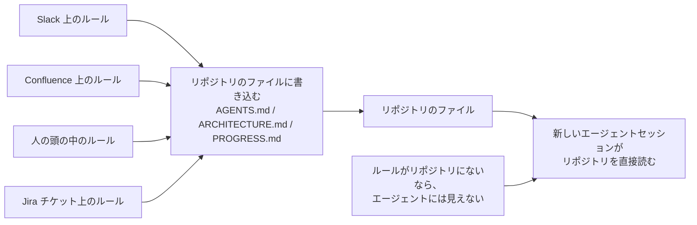
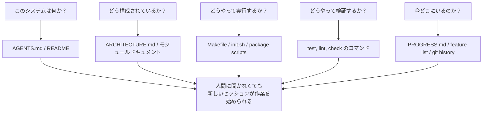

[英語版 →](../../../en/lectures/lecture-03-why-the-repository-must-become-the-system-of-record/) | [中国語版 →](../../../zh/lectures/lecture-03-why-the-repository-must-become-the-system-of-record/)

> コード例: [code/](https://github.com/walkinglabs/learn-harness-engineering/blob/main/docs/ja/lectures/lecture-03-why-the-repository-must-become-the-system-of-record/code/)
> 演習プロジェクト: [Project 02. Agent-readable workspace](./../../projects/project-02-agent-readable-workspace/index.md)

# 講義 03. リポジトリをシステム・オブ・レコードにする

チームのアーキテクチャ上の判断は、Confluence、Slack、Jira、そして数人のシニアエンジニアの頭の中に散らばっています。人間なら、これはなんとか回ります。同僚に聞くこともできるし、チャット履歴を検索することもできるし、ドキュメントを掘り返すこともできます。最悪でも、休憩室で誰かをつかまえて確認できます。しかし AI エージェントにとっては、リポジトリに入っていない情報は存在しないのと同じです。

これは誇張ではありません。エージェントが実際に受け取る入力を考えてみてください。システムプロンプトとタスク説明、リポジトリ内のファイル内容、それからツール実行の出力です。それだけです。Slack の履歴、Jira のチケット、Confluence のページ、金曜の午後に同僚とコーヒーを飲みながら話したアーキテクチャ判断は、エージェントには見えません。「誰かに聞く」ことも「チャット履歴を検索する」こともできません。エージェントは、リポジトリの中に閉じ込められたエンジニアです。外側にあるものは何も知りません。

では、そのエンジニアに良い地図を渡せるか、という話になります。

## 地図に載せるべきもの

OpenAI はこれをはっきり述べています。**リポジトリに存在しない情報は、エージェントにとって存在しない。** 彼らはこれを「repo as spec」の原則と呼んでいます。つまり、リポジトリそのものが最も権威のある仕様書です。

Anthropic の長期実行エージェント向けドキュメントも、同じ方向を向いています。永続状態は、長時間のタスクを継続するための前提条件です。セッションをまたいで知識を取り出せるかどうかが、タスク成功率を直接左右します。そして、この状態はリポジトリに置かなければなりません。エージェントが安定してアクセスできる保存先は、そこしかないからです。

「うちは小さなチームだし、知識はみんなの頭の中にある。問題ない」と思うかもしれません。人間にとってはそうかもしれません。しかしエージェントを使うなら、この事実を受け入れる必要があります。エージェントは人に聞けません。必要な情報はすべて書き下ろし、見つけられる場所に置かなければなりません。

これは「もっとドキュメントを書く」という話ではありません。「判断に必要な情報を正しい場所に置く」という話です。`src/api/` ディレクトリにある 50 行の `ARCHITECTURE.md` は、誰も保守していない Confluence 上の 500 ページの設計書よりも、1 万倍役に立ちます。机に貼った手書きの社内地図と、書庫にしまわれた美しい設計図の違いに似ています。前者は必要なときに目の前にあります。後者は技術的には優れていても、その瞬間には役に立ちません。

## 知識の可視性



地図が十分かどうかは、どうやって確認するのでしょうか。「コールドスタートテスト」を行います。まったく新しいエージェントセッションを、リポジトリの内容だけで立ち上げ、次の 5 つの基本的な質問に答えられるかを確かめます。



これらに答えられないなら、地図には空白があります。地図の空白を見つけたエージェントは推測します。間違った推測はバグになり、過剰な推測はコンテキストを浪費します。そして新しいセッションが始まるたびに、同じ推測をまた繰り返します。推測にかかるコストは、最初に地図を正しく描くコストより、常に高くつきます。

## 基本概念

- **Knowledge Visibility Gap**: プロジェクト知識の総量のうち、リポジトリに入っていない割合です。ギャップが大きいほど、エージェントの失敗率は高くなります。このプロジェクトに関する暗黙知は、どれだけあなたの頭の中にあるでしょうか。全部数え上げて、どれだけがリポジトリに入っているかを見てください。その差が可視性ギャップです。
- **System of Record**: プロジェクトの判断、アーキテクチャ制約、実行状態、検証基準についての権威ある情報源としてのコードリポジトリです。最終決定権はリポジトリにあり、他の場所は関係ありません。たとえば「通行止め」と書かれた地図のようなものです。その道には入らないでしょう。しかしその情報が Old Zhang の頭の中にしかないなら、毎回 Old Zhang に聞かなければなりません。
- **Cold-Start Test**: 上の 5 つの質問です。何個に答えられるかが、地図の完全さを表します。
- **Discovery Cost**: エージェントがリポジトリ内で重要な情報を見つけるために消費するコンテキスト予算です。情報が隠れているほど discovery cost は高くなり、実際の作業に使える予算は減ります。重要な情報を 10 階層下の README に隠すのは、消火器を地下の金庫にしまうようなものです。存在はしていますが、必要なときに見つけられません。
- **Knowledge Decay Rate**: 単位時間あたりに陳腐化する知識エントリの割合です。コードとドキュメントがずれていくことは最大の敵であり、ドキュメントがないことよりも悪い場合があります。
- **ACID Analogy**: データベースのトランザクション原則（Atomicity, Consistency, Isolation, Durability）を、エージェントの状態管理に当てはめる考え方です。これについては後で詳しく説明します。

## 良い地図の描き方

**原則 1: 知識はコードの近くに置く。** API エンドポイントの認証に関するルールは、大きなグローバル文書の奥深くに埋めるのではなく、API コードのそばに置くべきです。各モジュールの責務、インターフェース、特別な制約を説明する短いドキュメントを、各モジュールディレクトリに置きましょう。図書館の棚札のようなものです。歴史書を探すなら、「History」と書かれた棚に行けばいい。図書館全体を探す必要はありません。

**原則 2: 標準化された入口ファイルを使う。** `AGENTS.md`（または `CLAUDE.md`）は、エージェントの「ランディングページ」です。すべての情報を入れる必要はありませんが、少なくとも次の 3 つにはすぐ答えられなければなりません。「このプロジェクトは何か」「どうやって実行するか」「どうやって検証するか」です。50〜100 行あれば十分です。

**原則 3: 最小限だが十分であること。** すべての知識には明確な用途が必要です。あるルールを削除してもエージェントの判断品質に影響しないなら、そのルールは存在すべきではありません。しかしコールドスタートテストのすべての質問には答えが必要です。これは繊細なバランスです。多すぎず、少なすぎず、ちょうどよく。

**原則 4: コードと一緒に更新する。** 知識の更新をコード変更に結びつけます。最も単純な方法は、対応するモジュールディレクトリにアーキテクチャドキュメントを置くことです。コードを変更すると、自然にそのドキュメントが目に入ります。コード変更のあとで、CI がドキュメント更新の必要性を思い出させることもできます。

**具体的なリポジトリ構成**:

```
project/
├── AGENTS.md              # 入口: プロジェクト概要、実行コマンド、厳格な制約
├── src/
│   ├── api/
│   │   ├── ARCHITECTURE.md  # API レイヤーのアーキテクチャ判断
│   │   └── ...
│   ├── db/
│   │   ├── CONSTRAINTS.md   # DB 操作の厳格な制約
│   │   └── ...
│   └── ...
├── PROGRESS.md             # 現在の進捗: 完了、進行中、ブロック中
└── Makefile                # 標準化されたコマンド: setup, test, lint, check
```

## ACID 原則でエージェント状態を管理する

この比喩はデータベースのトランザクション管理から来ています。大げさに思えるかもしれませんが、実際にはとても実用的な枠組みを与えてくれます。

- **Atomicity**: 各「論理操作」（たとえば「新しいエンドポイントを追加してテストを更新する」）ごとに 1 つの git commit にします。途中で失敗したら、`git stash` で巻き戻します。全部かゼロかであり、「半分だけ終わった」はありません。
- **Consistency**: 「整合した状態」の検証条件を定義します。すべてのテストが通り、lint がエラー 0 であることです。エージェントは各操作の後に検証を実行し、一時的な不整合状態のままコミットしません。銀行振込のようなものです。引き落としだけして入金しない、ということはできません。
- **Isolation**: 複数のエージェントが同時に作業するときは、状態ファイルを設計して競合を避けます。単純な方法は、各エージェントに専用の進捗ファイルを持たせるか、git ブランチで分離することです。2 人の料理人が同じ鍋に同時に塩を入れるわけにはいきません。しょっぱくなりすぎたとき、責任は誰が取るのでしょうか。
- **Durability**: 重要なプロジェクト知識は git で追跡されるファイルに置きます。一時的な状態はセッションメモリに置いても構いませんが、セッションをまたいで必要な知識はファイルに保存しなければなりません。頭の中にあるものは数えません。紙の上にあるものだけが数に入ります。

## 実際の変革ストーリー

あるチームは、約 30 のマイクロサービスを持つ e コマースプラットフォームを運用していました。アーキテクチャ判断（サービス間通信プロトコル、データ整合性戦略、API バージョニングのルール）は、Confluence（部分的に古い）、Slack（検索しづらい）、一部のシニアエンジニアの頭の中（スケールしない）、断片的なコードコメント（体系的でない）に散らばっていました。

AI エージェントを導入したあと、タスクの 70% で人間の介入が必要でした。ほぼすべての失敗は、エージェントが「みんな知っているが誰も書いていない」暗黙の制約を破ったことに起因していました。これは、新人に「昼食の注文はグループチャットに投稿する必要がある」と誰も教えなかったのに似ています。新人は間違えて、叱られます。しかし叱ったあとも、結局そのルールは誰も教えません。

チームは次の変革を実施しました。
1. リポジトリのルートに `AGENTS.md` を作成し、プロジェクト概要、技術スタックのバージョン、グローバルな厳格制約を記載した
2. 各マイクロサービスのディレクトリに `ARCHITECTURE.md` を追加し、責務、インターフェース、依存関係を説明した
3. 厳格な制約を明示的な "MUST/MUST NOT" 言語でまとめた集中管理の `CONSTRAINTS.md` を作成した
4. 各サービスディレクトリに `PROGRESS.md` を追加し、現在の作業状況を追跡した

変革の結果、同じエージェントがコールドスタートで主要なプロジェクト質問すべてに答えられるようになり、タスク完了の品質も大幅に改善しました。

## 要点

- リポジトリにない知識は、エージェントにとって存在しません。重要な判断をリポジトリに置くことは、ハーネスへの最も基本的な投資です。良い地図を描いて、迷わないようにしましょう。
- リポジトリ品質の評価には「コールドスタートテスト」を使います。新しいセッションが、リポジトリの内容だけで 5 つの基本質問に答えられるかを確認してください。
- 知識はコードの近くに置き、最小限だが十分であり、コードと一緒に更新すべきです。大切なのは、もっとドキュメントを書くことではなく、情報を正しい場所に置くことです。
- エージェント状態には ACID 原則を使います。原子的な commit、整合性の検証、同時実行の分離、重要知識の永続化です。
- 知識の劣化が最大の敵です。コードとずれたドキュメントは、ドキュメントがないことより危険です。エージェントを、自分では正しいと思いながら間違った方向へ導いてしまいます。

## さらに読む

- [OpenAI: Harness Engineering](https://openai.com/index/harness-engineering/)
- [Anthropic: Effective Harnesses for Long-Running Agents](https://www.anthropic.com/engineering/effective-harnesses-for-long-running-agents)
- [Infrastructure as Code — Martin Fowler](https://martinfowler.com/bliki/InfrastructureAsCode.html)
- [ADR: Architecture Decision Records](https://adr.github.io/)
- [The Twelve-Factor App](https://12factor.net/)

## 演習

1. **コールドスタートテスト**: あなたのプロジェクトで、まったく新しいエージェントセッションを開いてください（口頭のコンテキストはなし、リポジトリ内容のみ）。次の 5 つを質問します。このシステムは何か？ どう構成されているか？ どうやって実行するか？ どうやって検証するか？ 現在の進捗はどうなっているか？ 答えられなかった内容を記録し、答えられるようになるまでリポジトリを改善してください。

2. **知識の外部化の定量化**: プロジェクトの開発作業に重要な判断と制約をすべて列挙してください。それぞれがリポジトリ内か外かを記録します。Knowledge visibility gap（リポジトリ外の割合）を計算してください。10% 未満にする計画を立ててください。

3. **ACID 評価**: この講義の ACID 比喩を使って、プロジェクトの状態管理を評価してください。Atomicity — エージェント操作はきれいに巻き戻せますか？ Consistency — 「整合した状態」の検証がありますか？ Isolation — 同時に作業するエージェント同士が干渉していませんか？ Durability — セッションをまたぐ知識はすべて永続化されていますか？
