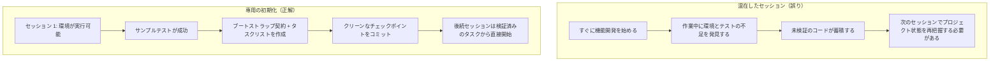

[英語版 →](../../../en/lectures/lecture-06-why-initialization-needs-its-own-phase/) | [中国語版 →](../../../zh/lectures/lecture-06-why-initialization-needs-its-own-phase/)

> コード例: [code/](https://github.com/walkinglabs/learn-harness-engineering/blob/main/docs/ja/lectures/lecture-06-why-initialization-needs-its-own-phase/code/)
> 演習プロジェクト: [Project 03. Multi-session continuity](./../../projects/project-03-multi-session-continuity/index.md)

# Lecture 06. 初期化に独立したフェーズが必要な理由

新しいエージェントセッションを開始して、「検索機能を追加して」と伝える。すると、その場でコーディングに飛びつく。意欲的ではある。しかし 20 分後、テストフレームワークの設定が不十分だと気づき、さらに 10 分かけて修正する。続いてデータベースのマイグレーションスクリプトの形式が違っていて、また手直しが必要になる。最終的に検索機能は追加されるものの、セッション全体は非効率だった。時間の大半が「このプロジェクトの動き方を把握すること」に費やされ、検索機能そのものを書く時間ではなかった。

より良い方法は、エージェントに作業を始めさせる前に、別のフェーズでベース環境を整え、検証コマンドを通し、プロジェクト構造を理解させることだ。家を建てるのと同じで、基礎工事と壁の建設を同時には進めない。そんなことをすれば、基礎が固まる前に壁が立ち上がり、建物全体を壊してやり直すことになる。まず基礎を打ち、固まるのを待ってから壁を立てる。そうすれば、きれいで効率的だ。

この講義では、なぜ初期化を実装と混ぜず、独立したフェーズとして扱う必要があるのかを説明する。

## 基礎と壁: 本質的に異なる 2 つの仕事

初期化と実装では、最適化対象がまったく違う。実装フェーズが最適化するのは、検証済みの機能の量と質を最大化することだ。初期化フェーズが最適化するのは、その後に続くすべての実装の信頼性と効率を最大化することだ。

初期化と実装を混ぜると、エージェントは複数目的の最適化問題に直面する。つまり、インフラを整えながら機能コードも書くことになる。優先順位を明示しないと、エージェントは自然とコードを書く方に寄る。なぜなら、それは直接見える成果だからだ。一方でインフラは、その価値が次のセッション以降にしか現れないため、軽視されやすい。建設チームに「基礎を打ちながら壁も同時に作って」と指示するようなものだ。おそらく、目に見えて成果が分かる壁の方を急いで作ろうとするだろう。しかし、基礎の悪い家は後になって構造的な問題を抱える。

## 初期化のライフサイクル



## 混ぜると何が起きるか

最も直接的な問題は、基礎が正しく固まらないことだ。エージェントは力の 80% を機能コードに使い、残りの 20% でインフラをなんとなく整える。テストフレームワークは設定されていても検証されていない。lint ルールは設定されていても緩すぎる。進捗ファイルも作られていない。こうした欠陥は最初のセッションでは目立たない。というのも、そのときのエージェントは自分が何をしたか覚えているからだ。しかし、次のセッションで表面化する。新しいエージェントは、どう実行するか、どうテストするか、今どういう状態なのかを知らない。ずさんな基礎、ぐらつく建物だ。

もっと見えにくいコストは「未検証の蓄積」だ。テストフレームワークが整う前に書かれた機能コードは、検証されていないコードである。あとからそのコードにテストを追加しようとすると、そもそもの設計が間違っていたと分かるかもしれない。最初から分かっていれば、別の実装にしていたはずだ。濡れたコンクリートの上にタイルを貼るようなものだ。床が水平でないと分かった瞬間、タイルは全部はがしてやり直しになる。

セッション予算も無駄になる。初期化作業（環境設定、テスト準備、プロジェクト構造の理解）はかなりの予算を消費し、実際の機能実装に使える時間が減る。その結果、1 回目のセッションでは機能を半分しか終えられず、2 回目のセッションでもまたプロジェクト理解から始めることになる。基礎にお金を使ったのに、その基礎は固くもない。どちらの目的も達成できていない。

見落とされやすい問題は、暗黙の前提という地雷だ。初期化中にエージェントが下す決定（どのテストフレームワークを使うか、ディレクトリをどう整理するか、依存関係をどう管理するか）を明示的に記録していないと、後続セッションはその判断を理解できない。さらに悪いことに、後続セッションが矛盾した判断をしてしまうこともある。最初の工事班はコンクリートの基礎を使ったのに、次の工事班はそれを知らずに木製の杭を打ち込んでしまう。すると基礎がひび割れる。

Anthropic の長時間稼働アプリケーション開発に関する研究でも、初期化を実装から分離する構成が紹介されている。公開記事で確認できる範囲では、専用の initializer が環境、feature list、progress record を用意し、以後の coding agent が段階的に進める。重要な示唆は、初期化を実装と混ぜると、後続セッションの立ち上がりや判断が曖昧になるということだ。基礎がしっかりしているほど、壁は速く立ち上がる。

OpenAI の Codex harness engineering guide でも、「repository as operational record」原則が強調されている。最初の実行から明確な運用構造を確立しなければ、新しいセッションが来るたびにプロジェクトの慣習を再推論しなければならない。

## コア概念

- **Initialization Phase**: エージェントのライフサイクルにおける最初のフェーズ。機能実装は行わず、その後のすべての実装フェーズに必要な前提条件だけを整える。成果物はコードではなく、インフラである。
- **Bootstrap Contract**: 新しいエージェントセッションがプロジェクトを曖昧さなしに操作できる状態の条件。起動できる、テストできる、進捗を確認できる、次の作業を引き継げる、の 4 条件をすべて満たす必要がある。
- **Cold Start vs Warm Start**: Cold start は空のディレクトリから始まり、エージェントがプロジェクト構造を推測しなければならない状態。Warm start はテンプレートや既存プロジェクトから始まり、インフラがすでに整っている状態。Warm start は Cold start を大きく上回る。水道と電気が通った現場で作業を始めるのと、何もない荒野から始めるのとの差だ。
- **Handoff Readiness**: いつでも、新しいエージェントが引き継げる状態にあること。口頭説明は不要で、リポジトリの中身だけで十分である。
- **Time to First Verification**: プロジェクト開始から最初の機能ポイントが検証を通過するまでの時間。初期化の効率を測る中心指標である。
- **Downstream Usability**: 初期化品質を測る最良の指標。後続セッションのうち、暗黙知に頼らずにタスクを正常に実行できる割合を指す。

## 正しい初期化の進め方

**初期化は専用フェーズとして扱う。** 最初のセッションは初期化だけを行い、ビジネス機能のコードは一切書かない。初期化で得るものは次のとおりだ。

**1. 実行可能な環境。** プロジェクトが起動し、依存関係がインストールされ、環境面の問題がない。基礎が打たれ、ひび割れもない。

**2. 検証可能なテストフレームワーク。** 少なくとも 1 つのサンプルテストが通る。これにより、テストフレームワーク自体が正しく設定されていることが証明される。基礎の上に柱を立てて、荷重に耐えられることを確かめるようなものだ。

**3. ブートストラップ契約ドキュメント。** 後続セッションに次の内容を明確に伝えるドキュメントを用意する。
```markdown
# 初期化契約

## 起動コマンド
- 依存関係のインストール: `make setup`
- 開発サーバーの起動: `make dev`
- テストの実行: `make test`
- 完全な検証: `make check`

## 現在の状態
- すべての依存関係がインストールされ、ロック済み
- テストフレームワーク設定済み (Vitest + React Testing Library)
- サンプルテスト成功 (1/1)
- lint ルール設定済み (ESLint + Prettier)

## プロジェクト構造
- src/ — ソースコード
- src/components/ — React コンポーネント
- src/api/ — API クライアント
- tests/ — テストファイル
```

**4. タスク分解。** プロジェクト全体を順序立てたタスクリストに分割し、それぞれのタスクに明確な受け入れ条件を付ける。
```markdown
# タスク分解

## タスク 1: ユーザー認証の基本
- JWT 認証ミドルウェアを実装する
- ログイン/登録エンドポイントを追加する
- 受け入れ条件: pytest tests/test_auth.py がすべて成功する

## タスク 2: ユーザープロフィールページ
- ユーザープロフィールの CRUD を実装する
- プロフィール編集フォームを追加する
- 受け入れ条件: pytest tests/test_profile.py がすべて成功する

## タスク 3: 検索機能
- ...
```

**5. Git コミットをチェックポイントにする。** 初期化が完了したら、クリーンなチェックポイントをコミットする。その後の作業はすべてこのチェックポイントから始める。

**Warm start 戦略**: 空のディレクトリから始めないこと。プロジェクトテンプレート（create-react-app、fastapi-template など）を使って、標準的なディレクトリ構造、依存関係設定、テストフレームワークをあらかじめ用意する。共通の初期化手順はテンプレートに埋め込み、プロジェクト固有の初期化だけを残す。水道と電気が通った現場で作業を始めるようなもので、何もない荒野から始めるのとは比べものにならない。

**初期化完了条件** は「どれだけコードを書いたか」ではない。ブートストラップ契約の 4 条件、つまり起動できる、テストできる、進捗を確認できる、次の作業を引き継げる、が満たされているかどうかで判断する。初期化を検証するために、次のチェックリストを使う。

```markdown
## 初期化受け入れチェックリスト
- [ ] `make setup` がゼロから成功する
- [ ] `make test` で少なくとも 1 つのテストが成功する
- [ ] 新しいエージェントセッションが、リポジトリの内容だけから「起動方法」と「テスト方法」を答えられる
- [ ] タスク分解ファイルがあり、少なくとも 3 つのタスクがある
- [ ] すべてが git にコミットされている
```

## 実例

React フロントエンドプロジェクトに対する 2 つの初期化アプローチを比較する。

**混在アプローチ（基礎工事と壁の建設を同時に進める）**: エージェントは 1 回目のセッションで、プロジェクトの土台作りと最初の機能実装を同時に行った。セッション終了時点でリポジトリには実行可能なコードがあったが、明示的な起動/テストコマンドのドキュメントはなく、進捗追跡ファイルもなく、タスク分解もなかった。2 回目のセッションでは、プロジェクト構造、テストフレームワーク、ビルドプロセスを推測するのに約 20 分かかった。まるで新しい工事班が現場に到着したものの、基礎がどこまでできているのか、配管がどこを通っているのか分からず、1 か所ずつ穴を掘って確かめるようなものだ。

**専用の初期化（まず基礎）**: 1 回目のセッションでは初期化だけを行い、テンプレートからディレクトリ構造を作成し、テストフレームワーク（Vitest + React Testing Library）を設定し、1 つのサンプルテストを書いて検証し、ブートストラップ契約ドキュメントとタスク分解ファイルを作成し、初期チェックポイントをコミットした。2 回目のセッションの再構築時間は 3 分未満で、タスクリストから直接作業を開始できた。まるで作業班が現場に来て設計図を見れば、どこから着手すべきか一目で分かるようなものだ。

プロジェクト全体のサイクルを比較すると、混在アプローチの総再構築時間（全セッション合計）は、専用の初期化アプローチより約 60% 長かった。初期化に余分に 20 分かけた分は、その後のセッションで何倍にもなって回収された。堅牢な基礎が壁の立ち上がりを速くするように、遅く見えるものが実は速い。

## 重要な要点

- 初期化と実装は最適化対象が違う。混ぜると、両方とも遅くなる。まず基礎を打ち、その後で壁を作る。
- 初期化の成果物はコードではなくインフラだ。実行可能な環境、検証可能なテスト、ブートストラップ契約、タスク分解を用意する。
- 初期化はブートストラップ契約の 4 条件、つまり起動できる、テストできる、進捗を確認できる、次の作業を引き継げる、で検証する。
- Warm start は Cold start に勝る。プロジェクトテンプレートを使って標準化されたインフラをあらかじめ整える。
- 初期化に投じた時間は、後続セッションが毎回状態を推測し直すコストを減らす。これは追加コストではなく、先行投資だ。基礎が堅いほど、建物は速く立ち上がる。

## 参考文献

- [Anthropic: Effective Harnesses for Long-Running Agents](https://www.anthropic.com/engineering/effective-harnesses-for-long-running-agents)
- [OpenAI: Harness Engineering](https://openai.com/index/harness-engineering/)
- [HumanLayer: Harness Engineering for Coding Agents](https://humanlayer.dev/articles/harness-engineering-for-coding-agents/)
- [Infrastructure as Code — Martin Fowler](https://martinfowler.com/bliki/InfrastructureAsCode.html)
- [SWE-agent: Agent-Computer Interfaces](https://github.com/princeton-nlp/SWE-agent)

## 演習

1. **ブートストラップ契約の設計**: いま開発しているプロジェクトの完全なブートストラップ契約を書いてみる。その後、まったく新しいエージェントセッションを開き、リポジトリの内容だけを見せて（口頭の文脈は与えず）、プロジェクトの起動、テスト実行、現在の進捗理解を試させる。遭遇した問題をすべて記録する。記録された各問題は、ブートストラップ契約に不足している条項に対応している。

2. **比較実験**: 中程度に複雑な新規プロジェクトを 1 つ選ぶ。アプローチ A: エージェントに初期化と最初の実装を同時にさせる。アプローチ B: 1 セッションを専用の初期化に使い、2 セッション目から実装を始める。4 セッション後、次を比較する: 最初の検証までの時間、再構築コスト、機能完了率。

3. **初期化受け入れチェックリスト**: あなたのプロジェクト向けに初期化受け入れチェックリストを設計する。新しいエージェントセッションに各チェック項目を実行させ、どれが通り、どれが失敗するかを記録する。失敗した項目こそ、あなたの harness を強化すべき箇所である。
