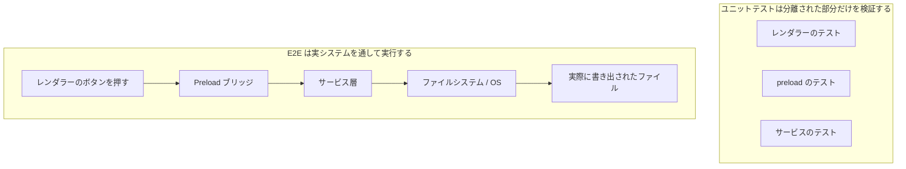
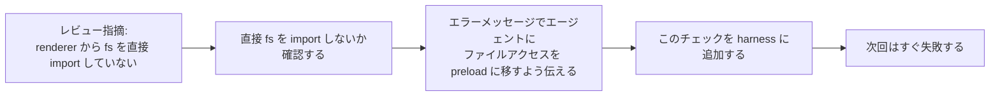

[英語版 →](../../../en/lectures/lecture-10-why-end-to-end-testing-changes-results/) | [中国語版 →](../../../zh/lectures/lecture-10-why-end-to-end-testing-changes-results/)

> この講義のコード例: [code/](https://github.com/walkinglabs/learn-harness-engineering/blob/main/docs/ja/lectures/lecture-10-why-end-to-end-testing-changes-results/code/)
> ハンズオン: [Project 05. エージェントに自分の作業を検証させる](./../../projects/project-05-grounded-qa-verification/index.md)

# 講義 10. エンドツーエンドテストは結果を変える

Electron アプリにファイル書き出し機能を追加するようエージェントに依頼したとします。エージェントはレンダラープロセスのコンポーネント、preload スクリプト、サービス層のロジックを書きました。各コンポーネントのユニットテストは完璧に通ります。エージェントは「完了しました」と言います。ところが実際にエクスポートボタンを押してみると、ファイルパスの形式が間違っていて、進捗バーは更新されず、大きなファイルを書き出すとメモリリークが起きます。コンポーネント境界の不具合が 5 つもあるのに、ユニットテストは 1 つも拾えていません。

これは合唱のリハーサルのようなものです。各パートは個別に歌えば完璧に聞こえますが、いざ一緒に歌うと、ソプラノはバスより半拍早く、伴奏は主旋律から半音ずれています。各パートはそれぞれ「正しい」のに、全体としては調和していません。

テストピラミッドが示すのは、大量のユニットテストが土台にはなるものの、そこだけで止まるとコンポーネント間の相互作用の問題を体系的に取り逃がす、ということです。AI コーディングエージェントではこの問題はさらに深刻で、エージェントは最速のテストだけを実行して完了宣言しがちです。**エンドツーエンドテストは、ユニットテストや統合テストだけでは見えにくいシステムレベルの欠陥を露出させます。ただし、どのテスト層も欠陥の不存在を証明するものではありません。**

## ユニットテストの盲点

ユニットテストの設計思想は分離です。依存関係をモックし、対象の単位だけに集中します。この考え方はユニットテストを高速かつ正確にしますが、同時に体系的な盲点も生みます。合唱のリハーサルで各パートがヘッドホンを付けて練習しているようなもので、本人たちには問題なく聞こえても、全員が揃ったときに初めて問題が表面化します。

**インターフェースの不一致**: レンダラープロセスから preload スクリプトへ渡されるファイルパスは相対パスなのに、preload スクリプトは絶対パスを想定している。双方のユニットテストはモックを使っていたため通過していました。問題が見つかるのはエンドツーエンドの流れを実行したときだけです。ちょうど、2 つのパートが別々に練習している間は問題なく感じても、合奏したら片方は 4/4 拍子、もう片方は 3/4 拍子で歌っていたと気づくようなものです。

**状態伝播の誤り**: データベースのマイグレーションでテーブルスキーマは変わったのに、ORM のキャッシュ層には古いスキーマのキャッシュエントリが残っている。ユニットテストは毎回まったく新しいモック環境を用意するため、この層をまたぐ状態の不整合は表に出ません。歌詞を変更したのに、誰かがまだ古い版を歌っているようなものです。

**リソースのライフサイクル問題**: ファイルハンドル、データベース接続、ネットワークソケットの取得と解放は複数コンポーネントにまたがります。ユニットテストは各テストごとに独立したリソースを生成して破棄するため、リソース競合やリークを露出できません。リハーサルでは各パートが順番にマイクを使えていても、本番で全員が一斉に出るとマイクが足りないのと同じです。

**環境依存**: テスト環境では（すべてがモックされているので）正しく動くのに、本番環境では設定差、ネットワーク遅延、サービス停止などで失敗する。練習室では完璧に歌えても、屋外フェスではハウリングや風の影響を受けるようなものです。

## エンドツーエンドテストは結果を変えるだけでなく、振る舞いも変える

多くの人が見落としがちですが、エージェントは自分の作業がエンドツーエンドテストにかけられると分かると、コーディングの振る舞い自体が変わります。

1. **コンポーネント間の相互作用を考える**: コードを書きながら、単一の関数だけを見るのではなく、「このインターフェースは上流とどうつながるか」を考えるようになります。あとで一緒に歌うと分かっていれば、練習中も他のパートに注意を向けるのと同じです。
2. **アーキテクチャの境界を守る**: アーキテクチャ上の制約があるシステムでは、エンドツーエンドテストが境界ルールの遵守をエージェントに強います。楽譜に「ここはクレッシェンド」と書いてあれば、それに従わなければならないのと同じです。
3. **エラーパスを扱う**: エンドツーエンドテストには通常失敗シナリオが含まれるため、エージェントは例外処理を考えるようになります。リハーサルで「もしマイクが突然壊れたらどうするか」を試しておくようなものです。

## テストピラミッドとレビュー指摘の昇格





Codex のエンジニアリング実践では、OpenAI は **エージェント向けのエラーメッセージには修正手順を含めるべき** だと強調しています。`"Direct filesystem access in renderer"` とだけ書くのではなく、`"Direct filesystem access in renderer. All file operations must go through the preload bridge. Move this call to preload/file-ops.ts and invoke it via window.api."` のように書きます。これによって、アーキテクチャ上のルールが自動修正ループに変わります。合唱指揮者が「そこは間違っている」と言うだけでなく、「ここは半拍早い。アルトのリズムを聞いて、32 小節目で入って」と具体的に指示するようなものです。

## 基本概念

- **コンポーネント境界の欠陥**: コンポーネント A と B はどちらもユニットテストに通るのに、その相互作用によって不正な振る舞いが起きる。これはエンドツーエンドテストが最も得意とする検出対象です。個々には正しいのに、一緒だと不協和音になる合唱パートのようなものです。
- **テスト妥当性の組み合わせ**: ユニットテスト、統合テスト、エンドツーエンドテストは、それぞれ違う欠陥を見つけやすい層です。層が上がるほど実システムに近い振る舞いを確認できますが、低い層のテストを置き換えるものではありません。
- **アーキテクチャ境界の強制ルール**: アーキテクチャ文書にあるルール（たとえば「レンダラープロセスはファイルシステムに直接アクセスできない」）を実行可能な自動チェックに変えることです。紙の上に書かれたルールから、CI で動くルールへ。
- **レビュー指摘の昇格**: 繰り返し発生するコードレビューコメントを自動テストに変換することです。同じ問題が見つかるたびにルールを追加し、harness を自動的に強化していきます。よくあるリハーサルのミスを指揮者がウォームアップ練習に変えるようなもので、次に同じミスが起きたときは、指揮者が何も言わなくても練習そのものがそれを露呈します。
- **エージェント指向のエラーメッセージ**: 失敗メッセージは「何が起きたか」だけでなく、エージェントに「どう直すか」まで具体的に伝えるべきです。これによってテスト失敗が自己修正ループになります。

## 進め方

### 0. まずアーキテクチャ境界を定義し、そのあとで E2E テストを書く

エンドツーエンドテストの前提は、システム境界が明確であることです。アーキテクチャがスパゲッティ状態なら、エンドツーエンドテストで分かるのは「このスパゲッティは動く」ということだけで、どこで設計意図が破られたのかは分かりません。そもそも声部に分かれていない合唱のようなもので、どれだけリハーサルしても良くはなりません。

OpenAI の経験では、**エージェントが生成するコードベースでは、アーキテクチャ制約はチームが大きくなってから考えるものではなく、初日に定める前提条件でなければなりません。** 理由は単純で、エージェントはリポジトリ内の既存パターンを、たとえそれが不揃いで最適でなくても、そのままコピーしてしまうからです。アーキテクチャ制約がなければ、エージェントは毎回のセッションで逸脱をさらに増やしてしまいます。

OpenAI は「Layered Domain Architecture」を採用しました。各ビジネスドメインは Types → Config → Repo → Service → Runtime → UI の固定レイヤーに分かれています。依存関係は厳密に前方へ流れ、ドメイン横断の関心事は明示的な Providers インターフェースを通じて入ります。それ以外の依存はすべて禁止され、独自 lint によって機械的に強制されます。

重要な原則は、**実装を細かく指示するのではなく、不変条件を強制すること** です。たとえば、「データは境界でパースされるべき」とは要求しても、どのライブラリを使うかまでは指定しません。エラーメッセージには修正手順が必要です。「違反です」とだけ言うのではなく、エージェントにどう変えるべきかを正確に伝えます。

> 出典: [OpenAI: Harness engineering: leveraging Codex in an agent-first world](https://openai.com/index/harness-engineering/)

### 1. Harness にはエンドツーエンド層を含める

検証フローでは明示しておきます。コンポーネント横断の変更を伴うタスクでは、エンドツーエンドテストに通ることが完了の前提です。

```
## 検証階層
- レベル 1: ユニットテスト（必須）
- レベル 2: 統合テスト（必須）
- レベル 3: エンドツーエンドテスト（コンポーネント横断の変更がある場合は必須）
- 必須レベルを 1 つでも飛ばしたら = 完了ではない
```

### 2. アーキテクチャルールを実行可能なチェックに変える

すべてのアーキテクチャ制約には、対応するテストまたは lint ルールが必要です。

```bash
# render process が Node.js API を直接呼んでいないか確認する
grep -r "require('fs')" src/renderer/ && exit 1 || echo "OK: renderer に fs の直接アクセスはない"
```

### 3. エージェント指向のエラーメッセージを設計する

失敗メッセージには、何が起きたか、なぜ起きたか、どう直すかの 3 要素を含めるべきです。

```
ERROR: src/renderer/App.tsx:12 で 'fs' の直接 import を検出しました
WHY: セキュリティ上、renderer process は Node.js API にアクセスできません
FIX: ファイル操作を src/preload/file-ops.ts に移し、window.api.readFile() 経由で呼び出してください
```

### 4. レビュー指摘を昇格させる仕組みを作る

コードレビューで新しい種類のエージェントエラーが見つかるたび、それを自動チェックに変えます。1 か月後には、harness は月初よりかなり強くなっています。合唱のリハーサルノートのように、毎回のリハーサルで見つかった問題を記録して、次の回の前に確認できるようにするのです。時間がたつにつれて、よくあるミスは減り、演奏はより調和していきます。

## 実例

**タスク**: Electron アプリにファイル書き出し機能を実装する。レンダラープロセスの UI、preload スクリプトのファイルシステム・プロキシ、サービス層のデータ変換が関わる。

**各パートを個別に歌う場合（ユニットテストは通過）**: レンダラーコンポーネントのテスト（通過、ファイル操作はモック）、preload スクリプトのテスト（通過、ファイルシステムはモック）、サービス層のテスト（通過、データソースはモック）。エージェントは完了を宣言する。

**一緒に歌う場合（エンドツーエンドテストで不具合が露呈）**:

| 不具合 | 説明 | ユニットテスト | E2E |
|--------|-------------|-----------|-----|
| インターフェースの不一致 | ファイルパスの形式が不一致 | 取り逃し | 検出 |
| 状態伝播 | エクスポートの進捗が IPC 経由で UI に返らない | 取り逃し | 検出 |
| リソースリーク | 大きなファイルの書き出しで handle が解放されない | 取り逃し | 検出 |
| 権限の問題 | パッケージ化された環境で権限が異なる | 取り逃し | 検出 |
| エラー伝播 | サービス層の例外が UI 層まで届かない | 取り逃し | 検出 |

5 つの不具合はすべてエンドツーエンドテストで検出され、ユニットテストは 1 つも捕捉できませんでした。代わりにテスト時間は 2 秒から 15 秒に増えましたが、これはエージェントのワークフローでは十分に許容範囲です。各パートがどれだけ個別に上手く歌えても、全体の合奏リハーサルには敵いません。

## 要点

- **ユニットテストはコンポーネント境界の欠陥に体系的に弱い**。分離を重視する設計そのものが、相互作用の問題を検出しにくくしています。全員が正しく歌っていることと、合唱全体が調和していることは別です。
- **エンドツーエンドテストは欠陥を見つけるだけでなく、エージェントのコーディング行動も変える**。統合と境界をより意識するようになります。
- **アーキテクチャルールは実行可能でなければならない**。文書に書いて読まれるのを待つのではなく、毎回の commit で自動的にチェックされるべきです。
- **エラーメッセージはエージェント向けに設計する**。`how to fix it` を具体的に含めることで、自己修正ループを作れます。
- **レビュー指摘の昇格は harness を自動的に強くする**。捕捉した欠陥の各カテゴリが、そのまま恒久的な防御線になります。

## 参考文献

- [The Practical Test Pyramid - Martin Fowler](https://martinfowler.com/articles/practical-test-pyramid.html) — テスト層を補完関係として扱う実践的整理
- [Harness Engineering - OpenAI](https://openai.com/index/harness-engineering/) — アーキテクチャ制約を自動実行するためのエンジニアリング実践
- [Chaos Engineering - Netflix (Basiri et al.)](https://ieeexplore.ieee.org/document/7466237) — システムの耐障害性を検証するために障害を意図的に注入する手法
- [QuickCheck - Claessen & Hughes](https://www.cs.tufts.edu/~nr/cs257/archive/john-hughes/quick.pdf) — 例示ベースのテストと形式検証の間に位置するプロパティテスト手法

## 演習

1. **コンポーネント横断の欠陥検出**: 少なくとも 3 つのコンポーネントにまたがる変更タスクを 1 つ選びます。まずユニットテストだけを実行して結果を記録し、そのあとでエンドツーエンドテストを実行します。追加で見つかった各欠陥が、どの種類の層間相互作用の問題に当たるかを分析してください。

2. **アーキテクチャルールの自動化**: 自分のプロジェクトからアーキテクチャ制約を 1 つ選び、エージェント向けのエラーメッセージ付きで実行可能なチェックに変えてください。それを harness に組み込み、ベースラインタスクで有効性を確認します。

3. **レビュー指摘の昇格**: コードレビュー履歴から繰り返し出てくるコメントの種類を 1 つ見つけ、5 段階の手順で自動チェックに変えてください。昇格前後で、その問題の発生頻度を比較します。
