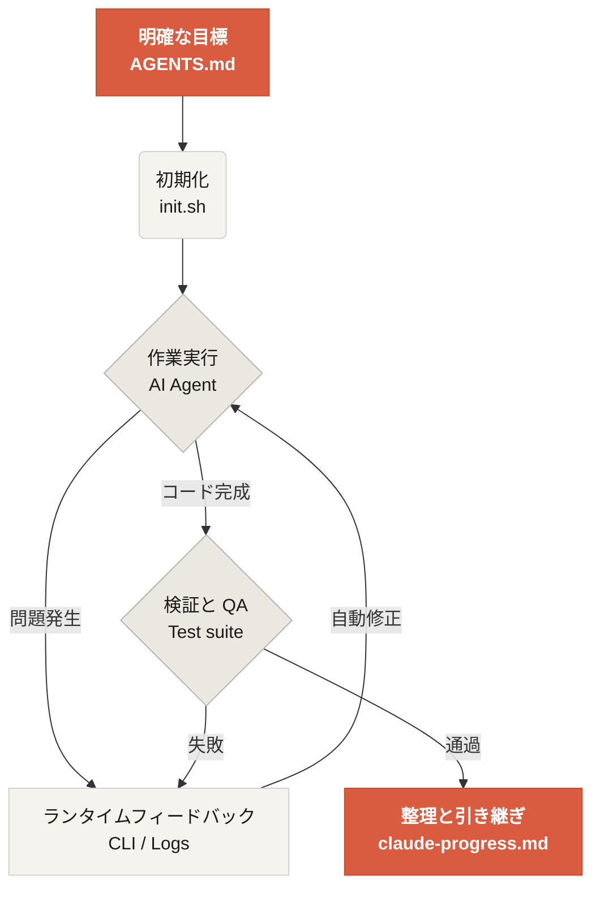

# Learn Harness Engineeringへようこそ

Learn Harness Engineering は、AI コーディングエージェント(coding agent)のエンジニアリングに焦点を当てた講座です。私たちは、業界で最も先進的なハーネスエンジニアリング(Harness Engineering)の理論と実践を深く学び、整理してきました。主な参考資料は次のとおりです。

- [OpenAI: Harness engineering: leveraging Codex in an agent-first world](https://openai.com/index/harness-engineering/)
- [Anthropic: Effective harnesses for long-running agents](https://www.anthropic.com/engineering/effective-harnesses-for-long-running-agents)
- [Anthropic: Harness design for long-running application development](https://www.anthropic.com/engineering/harness-design-long-running-apps)
- [Awesome Harness Engineering](https://github.com/walkinglabs/awesome-harness-engineering)

この講座では、体系的な環境設計、状態(state)管理、検証(verification)、制御(control)システムを通じて、Codex や Claude Code のようなエージェント型コーディングツールを実際に信頼できるものにする方法を学びます。明示的なルールと境界によって AI コーディング支援ツールを制約し、機能の実装、バグ修正、開発作業の自動化を支援します。

> 見慣れない用語が多くても問題ありません。主要概念の韓国語・英語対応表は [用語集](./resources/reference/glossary.md) にまとめています。

## 始める

学習の入口を選んで進んでください。講座は、理論講義、実践プロジェクト、すぐに使えるリソース集で構成されています。

  <a href="./lectures/lecture-01-why-capable-agents-still-fail/" class="card">
    <h3>講義(Lectures)</h3>
    
高性能なモデルがなぜなお失敗するのかを理解し、効果的なハーネスの理論を学びます。

  </a>
  <a href="./projects/" class="card">
    <h3>プロジェクト(Projects)</h3>
    
信頼できるエージェント環境を、最初から自分で作ってみる実践です。

  </a>
  <a href="./resources/" class="card">
    <h3>リソース集(Resource Library)</h3>
    
自分のリポジトリですぐに使える、コピペ用テンプレート(AGENTS.md, feature_list.json など)です。

  </a>

## ハーネスの中核メカニズム

ハーネス(harness)は、モデルを「より賢く」するための道具ではありません。代わりに、モデルのための閉ループ(closed loop)な**作業システム**を作ります。中核となる流れは、次の図で理解できます。

## この講座で学ぶこと

この講座をやり切ると、次のような重要概念を扱えるようになります。

<ul class="index-list">
  <li><strong>エージェントの動作制約</strong>: 明示的なルールと境界によって、エージェントの行動範囲を限定します。</li>
  <li><strong>コンテキスト(context)保持</strong>: 長時間・複数セッションの作業でも、コンテキストを失わないようにします。</li>
  <li><strong>性急な完了宣言の防止</strong>: エージェントが早すぎる段階で「終わった」と宣言できないようにします。</li>
  <li><strong>作業の検証</strong>: 全体パイプラインのテストと自己点検(self-reflection)で成果物を検証します。</li>
  <li><strong>可観測性の確保</strong>: ランタイムを観測・デバッグ可能にします。</li>
</ul>

## 次のステップ

主要概念に慣れてきたら、次の資料へ進んでみてください。

<ul class="index-list">
  <li><a href="./lectures/lecture-01-why-capable-agents-still-fail/">講義 01: 有能なエージェントがなお失敗する理由</a> — ハーネスエンジニアリングの理論的出発点です。</li>
  <li><a href="./projects/project-01-baseline-vs-minimal-harness/">プロジェクト 01: ベースライン(Baseline) vs ミニマルハーネス(Minimal Harness)</a> — 最初の実課題を一から進めてみます。</li>
  <li><a href="./resources/templates/">テンプレート(Templates)</a> — ミニマルハーネスパック(AGENTS.md, feature_list.json, claude-progress.md)を自分のプロジェクトにそのまま適用してみてください。</li>
</ul>
