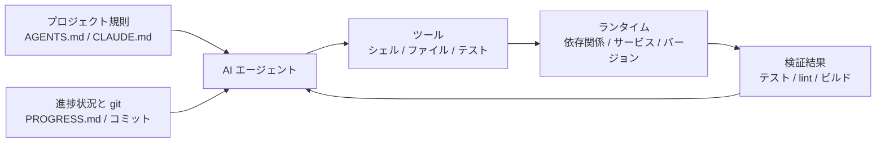

[中国語版 →](../../../zh/lectures/lecture-02-what-a-harness-actually-is/)

> コード例: [code/](https://github.com/walkinglabs/learn-harness-engineering/blob/main/docs/en/lectures/lecture-02-what-a-harness-actually-is/code/)
> 実践プロジェクト: [Project 01. Prompt-only vs. rules-first](./../../projects/project-01-baseline-vs-minimal-harness/index.md)

# 講義 02. ハーネスとは実際には何か

「ハーネス(harness)」という言葉は AI コーディングエージェントの分野でよく耳にしますが、率直に言えば、多くの人がハーネスと呼んでいるものはただの「プロンプトファイル」です。それはハーネスではありません。材料だけあって、コンロも、包丁も、レシピも、盛り付けのワークフローもないままレストランを開こうとしているようなものです。それはレストランではありません。冷蔵庫です。

この講義では、ハーネスの正確で実行可能な定義を示します。学術的な抽象論ではなく、今日すぐに使えるフレームワークです。ハーネスは、明確な責任と評価基準を持つ 5 つのサブシステムで構成されます。

## 比喩から始める

ドキュメントもなく、コードコメントもなく、テストの実行方法を誰も教えてくれず、CI 設定はどこかに埋もれているプロジェクトに、突然放り込まれた新米エンジニアを想像してください。良いコードを書けるでしょうか。十分に賢く、忍耐強ければ、できるかもしれません。ですが、「問題を解くこと」よりも「このプロジェクトが何なのかを把握すること」に、圧倒的に多くの時間を使うことになります。

AI エージェントもまったく同じ状況に置かれます。しかも、もっと不利です。人間なら同僚に聞けますが、エージェントが見られるのは目の前にあるファイルと実行可能なコマンドだけです。隣の人をつついて「このプロジェクトってどの ORM のバージョンを使ってますか？」と尋ねることはできません。

OpenAI は中核原則を「repo が spec である」と表現しています。必要な context はすべてリポジトリ内にあり、構造化された指示ファイル、明示的な verification コマンド、明確なディレクトリ構成を通じて伝えられるべきだという考え方です。Anthropic の長時間実行エージェントに関するドキュメントも、state の永続性、明示的な復旧経路、構造化された進捗追跡を強調しています。両社は異なる側面に焦点を当てていますが、言っていることは同じです。**モデルの外側にあるエンジニアリング基盤全体が、モデルの能力を実際にどれだけ引き出せるかを決めるのです。**

すでに使い慣れたツールを見てみましょう。

**Claude Code** はハーネス思考を体現しています。リポジトリ内の `CLAUDE.md` を読み込み(レシピ棚)、シェルコマンドを実行でき(包丁ラック)、ローカル環境で動作し(コンロ)、セッション履歴を保持し(仕込み台)、テストを実行して結果を確認できます(品質確認窓)。ただし、テストの実行方法を教えなければ、品質確認窓は役に立ちません。料理が十分に火が通っているか、誰にも分からないからです。

**Cursor** も同じ考え方に従っています。`.cursorrules` ファイルがレシピ棚で、ターミナルが包丁ラックであり、プロジェクト構造と lint 設定を読むことがコンロです。ただし Cursor の state 管理は相対的に弱く、IDE を閉じて開き直すと以前の context は失われます。

**Codex**(OpenAI のコーディングエージェント)は、git worktree を使って各タスクの実行環境を分離し、ローカル observability スタック(log, metric, trace)と組み合わせて、すべての変更が独立した環境で検証されるようにします。`AGENTS.md` と明確な verification コマンドがあるリポジトリでは、「素の」リポジトリよりもはるかに良い性能を発揮します。

**AutoGPT** は警告事例です。構造化された state 管理がないため、長時間タスクで context が蓄積し、精密なフィードバック機構がないため、エージェントがループに陥ります。多くの人が AutoGPT は「動かない」と言いますが、実際には AutoGPT のハーネスが動いていないのです。壊れたコンロの上に料理人を乗せても、どれだけ良い食材があっても料理にはなりません。

## 核心概念

- **ハーネス(harness)とは何か**: モデルの重みの外側にあるエンジニアリング基盤全体です。OpenAI はエンジニアの中核業務を 3 つに整理しています。環境設計、意図の表現、フィードバックループの構築です。Anthropic は自社の Claude Agent SDK を「汎用エージェントハーネス」と呼んでいます。
- **リポジトリは単一の真実の源(SoR)である**: エージェントが見られないものは、事実上存在しないのと同じです。OpenAI はリポジトリを「system of record(SoR)」として扱います。必要な context はすべて、構造化されたファイルと明確なディレクトリ構成を通じてリポジトリ内に置く必要があります。
- **地図は渡すが、マニュアルは渡すな**: OpenAI の経験では、`AGENTS.md` は百科事典ではなく、ディレクトリ案内であるべきです。100 行程度が適切です。それより長いなら `docs/` ディレクトリに分割し、エージェントに必要なときに読ませてください。
- **制約はするが、マイクロマネジメントはしない**: 良いハーネスは、実行可能なルールでエージェントを制約しますが、指示を一つ一つ細かく並べたりはしません。OpenAI は「不変条件は強制しつつ、実装には細かく干渉しない」ように言っています。Anthropic は、エージェントが自分の作業を過信して褒めがちだと発見し、解決策として「作業する人」と「検証する人」を分けました。
- **コンポーネントを一つずつ外す**: 各ハーネスコンポーネントの価値を定量化するには、一つずつ外してみて、どの削除が最も大きな性能低下を引き起こすかを確認してください。Anthropic はこの方法を使い、モデルが強くなるほど一部のコンポーネントは必須ではなくなる一方で、新しいコンポーネントは依然として必要であり続けることを見出しました。

## 5 つのサブシステムによるハーネスモデル

再び台所の比喩に戻りましょう。完全なキッチンには 5 つの機能領域があり、ハーネスにも 5 つのサブシステムがあります。



**指示サブシステム(レシピ棚)**: `AGENTS.md`(または `CLAUDE.md`)を作成し、次を含めてください。プロジェクト概要と目的(1 文)、技術スタックとバージョン(Python 3.11、FastAPI 0.100+、PostgreSQL 15)、最初の実行コマンド(`make setup`, `make test`)、交渉不可能な HARD 制約("すべての API は OAuth 2.0 を使う必要がある")、より詳しいドキュメントへのリンク。

**ツールサブシステム(包丁ラック)**: エージェントに十分なツールアクセス権を持たせてください。「セキュリティ」を理由にシェルを無効化しないでください。エージェントが `pip install` すら実行できなければ、どうやって作業するのでしょうか。とはいえ、すべてを開放してはいけません。最小権限の原則に従ってください。

**環境サブシステム(コンロ)**: 環境状態が自己記述的になるようにしてください。依存関係の固定には `pyproject.toml` または `package.json` を、ランタイムバージョンには `.nvmrc` または `.python-version` を、再現性には Docker または devcontainers を使ってください。

**state サブシステム(仕込み台)**: 長時間の作業には進捗追跡が必要です。簡単な `PROGRESS.md` ファイルで記録してください。完了したこと、進行中のこと、ブロックされていることを書きます。各セッションの終了前に更新し、次のセッションが始まったら読みます。

**フィードバックサブシステム(品質確認窓)**: これが投資対効果の最も高いサブシステムです。`AGENTS.md` に verification コマンドを明示的に列挙してください。
```
検証コマンド:
- テスト: pytest tests/ -x
- 型チェック: mypy src/ --strict
- lint: ruff check src/
- 全体検証: make check (上記すべてを含む)
```

サブシステムが 1 つでも欠けると、キッチンの機能領域が 1 つないのと同じです。料理はできますが、常に不便です。

**ハーネス品質診断**: 「等方的モデル制御(isometric model control)」を使ってください。モデルは固定したまま、サブシステムを 1 つずつ取り外し、どの削除が最も大きな性能低下を生むかを測定します。それがボトルネックです。そこに集中してください。キッチンのボトルネックを見つけるのと同じです。レシピ棚をなくしてどれだけ遅くなるかを見て、コンロを止めて影響を確認します。

## あるチームの実話

あるチームは、TypeScript + React フロントエンドアプリ(約 20,000 行)に GPT-4o を使いました。必須のキッチン設備を 1 つずつ追加する 4 段階を経ています。

**ステージ 1 — 空のキッチン**: README に基本的なプロジェクト説明しかない状態です。5 回中 1 回成功(20%)。主な失敗要因は、誤ったパッケージマネージャ選択(npm vs yarn)、コンポーネント命名規則の不一致、テストを実行できないことでした。

**ステージ 2 — レシピ棚を設置**: 技術スタックのバージョン、命名規則、主要なアーキテクチャ判断を含む `AGENTS.md` を追加しました。成功率は 60% に上がりました。残る失敗は主に環境問題と検証漏れでした。

**ステージ 3 — 品質確認窓を開放**: `AGENTS.md` に検証コマンドを列挙しました。`yarn test && yarn lint && yarn build`。成功率は 80% に上がりました。

**ステージ 4 — 仕込み台を整備**: エージェントが各実行ごとに完了した作業と未完了の作業を記録する進捗ファイルテンプレートを導入しました。成功率は 80-100% に安定しました。

4 回の反復で、モデルは一切変えていないのに成功率は 20% からほぼ 100% に上がりました。それがハーネスエンジニアリングの力です。より高価な材料を買ったわけではありません。キッチンをきちんと整えたのです。

## 要点

- ハーネス = 指示 + ツール + 環境 + state + フィードバック。キッチンの 5 つの機能領域のように、5 つのサブシステムはすべて必要です。
- モデルの重み以外のすべてがハーネスです。ハーネスが、モデル能力を実際にどれだけ引き出せるかを決めます。
- 5 つのサブシステムのうち、フィードバックサブシステムは一般的に最も少ない投資で最も大きな効果を生みます。検証コマンドを最初に整えてください。品質確認窓が最も価値の高いアップグレードです。
- 「等方的モデル制御」を使って、各サブシステムの限界寄与を定量化してください。直感に頼らないでください。
- ハーネスはコードのように劣化します。定期的に監査し、技術的負債を返済するようにハーネスの負債も返済してください。

## さらに読む

- [OpenAI: Harness Engineering](https://openai.com/index/harness-engineering/)
- [Anthropic: Effective Harnesses for Long-Running Agents](https://www.anthropic.com/engineering/effective-harnesses-for-long-running-agents)
- [HumanLayer: Harness Engineering for Coding Agents](https://humanlayer.dev/articles/harness-engineering-for-coding-agents/)
- [SWE-agent: Agent-Computer Interfaces](https://github.com/princeton-nlp/SWE-agent)
- [Thoughtworks: Harness Engineering on Technology Radar](https://www.thoughtworks.com/radar)

## 演習問題

1. **5 サブシステムハーネス監査**: AI エージェントを使っているプロジェクトを 1 つ取り、5 サブシステムのフレームワークで完全な監査を行ってください。各サブシステムを 1-5 点で採点します。最も点数の低いサブシステムを見つけ、30 分かけて改善し、エージェント性能の変化を観察してください。

2. **等方的モデル制御の実験**: 1 つのモデルと 1 つの難しいタスクを選びます。指示(AGENTS.md を削除)、フィードバック(検証コマンドを与えない)、state(進捗ファイルなし)を順番に取り除きますが、一度に 1 つだけ取り除き、性能低下を測定してください。結果をもとに、プロジェクト内でのサブシステムの重要度を順位付けしてください。

3. **アフォーダンス分析**: プロジェクト内で、エージェントが「やりたいができない」状況を見つけてください(例: パラメータ化クエリを使うべきだが、プロジェクトの ORM パターンを知らない場合)。これが実行のギャップ(Gulf of Execution, 方法が分からない)なのか、評価のギャップ(Gulf of Evaluation, 正しいか分からない)なのかを分析し、それを解消するハーネス改善案を設計してください。
