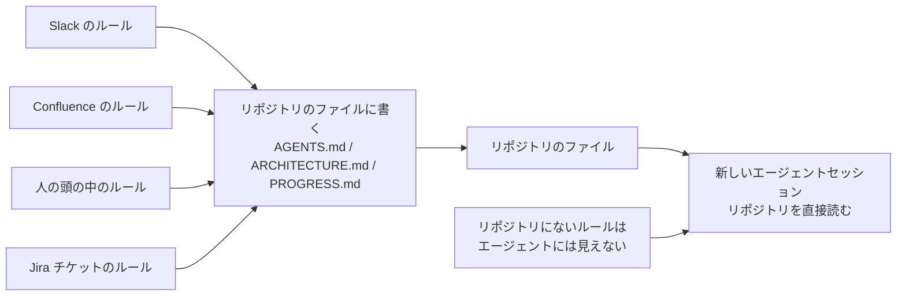
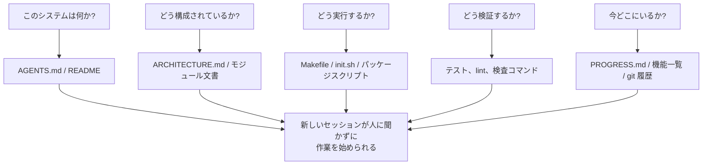

[中国語版 →](../../../zh/lectures/lecture-03-why-the-repository-must-become-the-system-of-record/)

> コード例: [code/](https://github.com/walkinglabs/learn-harness-engineering/blob/main/docs/en/lectures/lecture-03-why-the-repository-must-become-the-system-of-record/code/)
> 実習プロジェクト: [Project 02. Agent-readable workspace](./../../projects/project-02-agent-readable-workspace/index.md)

# 講義 03. リポジトリを単一の信頼できる情報源にせよ

チームのアーキテクチャ判断は、Confluence、Slack、Jira、そして何人かのシニアエンジニアの頭の中に散らばっています。人間にとっては、これはなんとか回ります。その場で同僚に聞き、チャット履歴を検索し、文書を掘り返せばよいからです。どうしても無理なら、休憩室で誰かをつかまえることもできます。ですが AI エージェント(agent)にとって、リポジトリ(repository)にない情報は、単純に存在しません。

これは誇張ではありません。エージェントへの入力が実際には何かを考えてみてください。システムプロンプトと作業説明、リポジトリ内のファイル内容、そしてツール実行結果です。それだけです。Slack の履歴、Jira チケット、Confluence ページ、金曜の午後に同僚とコーヒーを飲みながら決めたアーキテクチャ判断。エージェントはそのどれも見ることができません。「誰かに聞く」ことも「チャット履歴を検索する」こともできません。リポジトリの中に閉じ込められたエンジニアであり、外側のことは何も知りません。

では、問いはこうです。このエンジニアに、よい地図を渡せていますか。

## 地図に何を載せるべきか

OpenAI はこれを明確に述べています。**リポジトリにない情報は、エージェントにとって存在しない。** 彼らはこれを「リポジトリを spec にする」原則と呼んでいます。つまり、リポジトリそのものが最高権威の仕様書です。

Anthropic の長時間稼働するエージェント向けドキュメントも同じことを示しています。永続的な状態(state)は、長期タスクを継続するための必要条件です。セッションをまたいで知識を復元できるかどうかが、仕事の成功率を直接左右します。そして、その状態はリポジトリに置かなければなりません。エージェントが安定してアクセスできる、唯一の保管場所だからです。

「うちのチームは小さいから、知識はみんなの頭の中にあるし、それでうまくいっている」と思うかもしれません。人間にとってはそうでしょう。ですがエージェントを使うなら、この事実を受け入れる必要があります。エージェントは人に聞けません。知るべきことはすべて、明文化して検索できる場所に置かなければなりません。

これは「もっと文書を書く」ことではありません。「決定に関する情報を、正しい場所に置く」ことです。`src/api/` ディレクトリの 50 行の `ARCHITECTURE.md` は、誰も保守しない Confluence の 500 ページの設計書より、はるかに役立ちます。机に貼った手書きのオフィス地図と、書庫に鍵をかけてしまった美しい建築図面の違いです。前者は必要なときにそこにありますが、後者は技術的には優れていても、現場では使い物になりません。

## 知識の可視性



地図が十分かどうかをどうテストするか。**コールドスタートテスト(cold-start test)** を実行してください。リポジトリの内容だけを使ってまったく新しいエージェントセッションを開き、次の 5 つの基本的な質問に答えられるかを確認します。



答えられないなら、地図に空白があります。地図に空白があれば、エージェントは推測します。そして、誤った推測はバグになり、過剰な推測はコンテキスト(context)を浪費します。しかも新しいセッションのたびに、また同じ推測を繰り返します。推測のコストは、最初からきちんと地図を描くコストより、常に高くつきます。

## 中核概念

- **知識可視性ギャップ(Knowledge Visibility Gap)**: リポジトリに存在しないプロジェクト知識の割合です。このギャップが大きいほど、エージェントの失敗率は高くなります。このプロジェクトについて、頭の中にどれだけ暗黙知があるかを数えてください。そのうちどれだけがリポジトリに入っているかを確認してください。その差が可視性ギャップです。
- **システム・オブ・レコード(SoR, System of Record)**: プロジェクトの決定、アーキテクチャ上の制約、実行状態、検証基準についての権威ある出典としてのコードリポジトリです。リポジトリが最終的な発言権を持ち、他のどこも認定されません。「通行止め」と書かれた地図のようなものです。その道には入らない。ただし、その情報が Zhang さんの頭の中にしかないなら、毎回 Zhang さんに聞かなければなりません。
- **コールドスタートテスト(Cold-Start Test)**: 上の 5 つの質問です。いくつ答えられるかが、地図の完全性を示します。
- **探索コスト(Discovery Cost)**: エージェントがリポジトリから重要情報を見つけるために消費するコンテキスト予算の量です。情報が隠れているほど探索コストは高くなり、実作業に残る予算は減ります。重要情報を 10 個のディレクトリの奥の README に隠すのは、地下室の金庫に消火器を鍵で閉じ込めるようなものです。存在はしていても、必要なときに見つけられません。
- **知識劣化率(Knowledge Decay Rate)**: 単位時間あたりに古くなる知識項目の割合です。文書がコードと同期していないことが最大の敵です。文書がないことより悪い場合があります。
- **ACID の類推**: データベースのトランザクション原則(原子性、一貫性、分離性、耐久性)を、エージェント状態管理に当てはめることです。以下で詳しく説明します。

## よい地図の描き方

**原則 1: 知識はコードのそばに置く。** API エンドポイントの認証に関するルールは、巨大な全体文書の中に埋めるのではなく、API コードの隣に置いてください。各モジュールディレクトリには、そのモジュールの責務、インターフェース、特別な制約を説明する短い文書を置きましょう。図書館の棚ラベルのようなものです。歴史の本が欲しければ、「歴史」と書かれた棚へまっすぐ行けます。図書館全体を探し回る必要はありません。

**原則 2: 標準化された入口ファイルを使う。** `AGENTS.md`(または `CLAUDE.md`) は、エージェントの「ランディングページ」です。すべてを入れる必要はありませんが、少なくとも 3 つの質問に素早く答えられるようにしてください。`「このプロジェクトは何か」`、`「どう実行するか」`、`「どう検証するか」` です。50〜100 行あれば十分です。

**原則 3: 最小限だが完全に。** すべての知識には明確な用途が必要です。ある規則を削除してもエージェントの判断品質に影響しないなら、その規則は存在しないほうがよいです。ただし、コールドスタートテストのすべての質問には答えが必要です。これは繊細なバランスです。多すぎず、少なすぎず、ちょうどよく。

**原則 4: コードと一緒に更新する。** 知識の更新をコード変更に紐づけてください。最も簡単な方法は、アーキテクチャ文書をそのモジュールのディレクトリに置くことです。コードを修正するとき、自然とその文書も目に入ります。コード変更後に、文書更新が必要かどうかを CI で確認するようにしてもよいでしょう。

**具体的なリポジトリ構造**:

```
project/
├── AGENTS.md              # 入口: プロジェクト概要、実行コマンド、HARD 制約
├── src/
│   ├── api/
│   │   ├── ARCHITECTURE.md  # API レイヤーのアーキテクチャ判断
│   │   └── ...
│   ├── db/
│   │   ├── CONSTRAINTS.md   # データベース作業の HARD 制約
│   │   └── ...
│   └── ...
├── PROGRESS.md             # 現在の進捗: 完了、進行中、ブロック中
└── Makefile                # 標準化されたコマンド: setup, test, lint, check
```

## ACID 原則でエージェント状態を管理する

この類推はデータベースのトランザクション管理から来ています。やや複雑にしすぎているように見えるかもしれませんが、実際にはとても実用的な枠組みを与えてくれます。

- **原子性(Atomicity)**: 各「論理作業」(例: 「新しいエンドポイントを追加してテストを更新する」) に対して、1 つの git コミットを作ります。途中で失敗したら `git stash` でロールバックします。すべてか無かです。「半分だけ終わった」状態はありません。
- **一貫性(Consistency)**: 「一貫した状態」の検証条件を定義してください。すべてのテストが通ること、lint エラーがないことです。エージェントは各作業のあとに検証を実行します。一貫しない中間状態はコミットしません。銀行振込のようなものです。入金なしに出金はできません。
- **分離性(Isolation)**: 複数のエージェントが同時に作業するときは、状態ファイルが競合状態を避けられるように設計してください。簡単な方法は、各エージェントが自分専用の進捗ファイルを使うか、分離のために git ブランチを使うことです。2 人の料理人が同じ鍋の味付けを同時にすることはできません。しょっぱくなったら、誰の責任でしょうか。
- **耐久性(Durability)**: 重要なプロジェクト知識は git で追跡されるファイルに置いてください。一時的な状態はセッションメモリにあってもかまいませんが、セッションをまたぐ知識はファイルに永続化しなければなりません。頭の中にあるものは認められません。紙にあるものだけが認められます。

## 実際の変換例

約 30 個のマイクロサービスで構成された E コマースプラットフォームを保守しているチームがありました。アーキテクチャ判断(サービス間通信プロトコル、データ整合性戦略、API バージョニング規則) は、次の場所に散らばっていました。Confluence(一部は古い)、Slack(検索しづらい)、何人かのシニアエンジニアの頭の中(拡張不能)、断片的なコードコメント(体系的でない)。

AI エージェントを導入した後、70% の作業で人間の介入が必要でした。失敗のほとんどは、エージェントが「みんな知っているが、誰も書いていない」暗黙の制約を破ることに関係していました。ちょうど、新人に「昼食の注文はグループチャットに投稿しないといけない」と誰も教えていなかったようなものです。間違って推測し、叱られますが、叱られた後も誰もルールを教えてくれません。

チームは変換を実施しました。
1. リポジトリルートに `AGENTS.md` を作成し、プロジェクト概要、技術スタックのバージョン、全体の HARD 制約を記載
2. 各マイクロサービスディレクトリに、責務、インターフェース、依存関係を説明する `ARCHITECTURE.md` を追加
3. 明示的な「MUST / MUST NOT」表現で HARD 制約をまとめた中央集約型の `CONSTRAINTS.md` を作成
4. 各サービスディレクトリに、現在の作業状態を追跡する `PROGRESS.md` を追加

変換後は、同じエージェントがコールドスタートで主要なプロジェクト質問すべてに答えられるようになり、作業完了の品質も大きく向上しました。

## 要点

- リポジトリにない知識は、エージェントにとって存在しません。重要な決定をリポジトリに置くことは、最も基本的なハーネス投資です。道に迷わないよう、よい地図を描いてください。
- **コールドスタートテスト** を使ってリポジトリ品質を評価してください。新しいセッションが、リポジトリの内容だけで 5 つの基本的な質問に答えられるか。
- 知識はコードの近くに、最小限だが完全に、そしてコードと一緒に更新されるべきです。より多くの文書を書くことではなく、情報を正しい場所に置くことです。
- ACID 原則をエージェント状態に適用してください。原子的なコミット、一貫性の検証、同時実行の分離、重要知識の耐久性です。
- 知識の劣化が最大の敵です。コードと同期していない文書は、文書がないことより危険な場合があります。エージェントを正しい方向に向かせているつもりで、実際には誤った方向へ送ってしまうからです。

## さらに読む

- [OpenAI: Harness Engineering](https://openai.com/index/harness-engineering/)
- [Anthropic: Effective Harnesses for Long-Running Agents](https://www.anthropic.com/engineering/effective-harnesses-for-long-running-agents)
- [Infrastructure as Code — Martin Fowler](https://martinfowler.com/bliki/InfrastructureAsCode.html)
- [ADR: Architecture Decision Records](https://adr.github.io/)
- [The Twelve-Factor App](https://12factor.net/)

## 練習問題

1. **コールドスタートテスト**: プロジェクトで完全に新しいエージェントセッションを開いてください(口頭コンテキストなし、リポジトリ内容のみ)。次の 5 つの質問をしてください。このシステムは何か? どう構成されているか? どう実行するか? どう検証するか? 現在の進捗は? 答えられない内容を記録し、エージェントが答えられるようになるまでリポジトリを改善してください。

2. **知識の外部化を定量化する**: プロジェクトの開発作業に重要な、すべての決定と制約を列挙してください。それぞれをリポジトリ内か外部かで分類します。知識可視性ギャップ(リポジトリ外の割合) を計算してください。これを 10% 未満に下げる計画を立ててください。

3. **ACID 評価**: この講義の ACID 類推を使って、プロジェクトの状態管理を評価してください。原子性 — エージェント作業をきれいにロールバックできるか? 一貫性 — 「一貫した状態」の検証があるか? 分離性 — 同時実行するエージェント同士が干渉していないか? 耐久性 — セッションをまたぐ知識がすべて永続化されているか?
