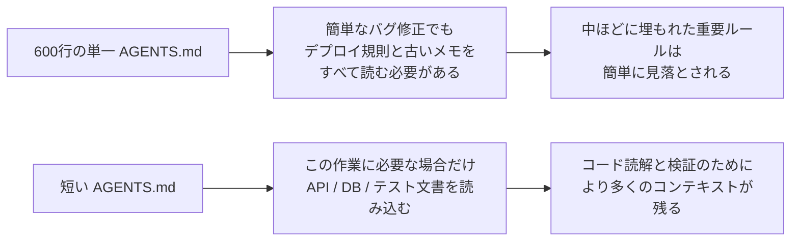
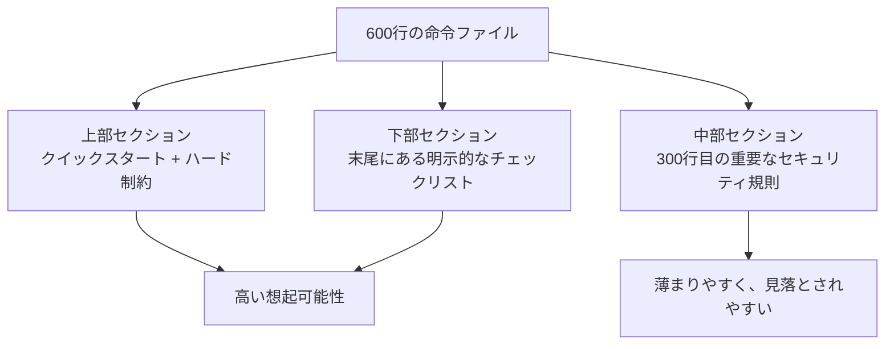

[中国語版 →](../../../zh/lectures/lecture-04-why-one-giant-instruction-file-fails/)

> コード例: [code/](https://github.com/walkinglabs/learn-harness-engineering/blob/main/docs/en/lectures/lecture-04-why-one-giant-instruction-file-fails/code/)
> 実践プロジェクト: [Project 02. エージェントが読み取れるワークスペース](./../../projects/project-02-agent-readable-workspace/index.md)

# 講義 04. 命令ファイルを複数のファイルに分散せよ

ハーネスエンジニアリング(harness engineering)に本気で取り組み始めました。`AGENTS.md` を作り、思いつく限りのルール、制約、教訓をそこにぎっしり詰め込みました。1か月後、ファイルは300行に膨れ上がり、2か月後には450行、3か月後には600行になっていました。ところが、エージェント(agent)の性能はむしろ悪化していることに気づきます。簡単なバグ修正でも、エージェントは不要なデプロイ手順の処理にコンテキスト(context)を浪費し、300行目に埋もれた重要なセキュリティ制約は完全に見落とし、互いに矛盾する3つのコードスタイル規則から毎回適当に1つを選んで従ってしまいます。

これが「巨大な命令ファイル」の罠です。旅行かばんを詰め込みすぎるのと同じです。どれも必要そうに見えるので、次々と押し込んでいくうちに、ファスナーが今にも壊れそうになります。下着1枚を取り出すには、かばんの中身を全部出さなければなりません。パンパンのかばんを持ち歩いていても、実際に取り出して使う物はその3分の1にも満たないのです。

## 根本原因: 悪循環

最もよくある悪循環は次のように進みます。エージェントがミスをすると、「これを防ぐルールを追加しよう」と考えて AGENTS.md にルールを足します。しばらくは効果があります。別のミスが起きると、またルールを追加します。これを繰り返すうちに、ファイルは手がつけられないほど大きくなります。

これはあなたのせいではありません。「問題が起きたらルールを追加する」という反応は、とても自然です。外出のたびに「念のため」と物を1つずつかばんに入れていくのと同じです。けれど、その累積効果は致命的です。何が具体的にまずいのかを見ていきましょう。

**コンテキスト予算が侵食されます。** エージェントのコンテキストウィンドウ(context window)は有限です。たとえばエージェントに200Kトークンのウィンドウがあるとしましょう。肥大化した命令ファイルだけで10〜20Kトークンを消費することがあります。まだ余裕があるように見えるでしょうか。けれど、複雑な作業では数十個のソースファイルを読む必要があり、ツール実行結果もコンテキストを食い、会話履歴も積み上がります。エージェントがコードを理解すべき段階になったときには、もう予算がかなり逼迫しています。「念のため」に詰め込んだ物でいっぱいのかばんに、ノートパソコンを入れる余地がないのと同じです。

**中ほどで見失います(Lost in the Middle)。** 「Lost in the Middle」論文(Liu et al., 2023)は、LLM が長いテキストの中間にある情報を、冒頭や末尾の情報よりはるかに効果的でなく扱うことを明確に示しました。AGENTS.md が600行あり、300行目に「すべてのデータベースクエリはパラメータ化クエリを使うこと」という重要なセキュリティ制約があるなら、それは中間に埋もれているため、エージェントはほぼ確実に見落とします。詰め込みすぎた旅行かばんの底にある日焼け止めのようなものです。そこにあるのは分かっていても、3回かき回しても見つからず、結局新しいものを買うことになります。

**優先順位の衝突が起きます。** ファイルの中には、譲れないハード制約("絶対に eval() を使うな")、重要な設計指針("関数型スタイルを優先せよ")、特定の歴史的教訓("先週 WebSocket のメモリリークを直したので、似たパターンに注意せよ")が混在しています。これら3つは重要度がまったく違いますが、ファイル上では同じように見えます。エージェントにはそれを見分ける信頼できる手がかりがありません。旅行かばんの中でパスポートと充電ケーブルが絡み合っているようなもので、どちらを先に取り出すべきか判断できないのです。

**保守が崩壊します。** 大きなファイルは本質的に保守が難しいものです。古い命令はなかなか削除されません。削除したときの影響が読めないからです("もしかすると別のルールがこれに依存しているかもしれない")。一方で、新しい命令を追加するのはほとんど無料に見えます。その結果、ファイルは増える一方で減らず、シグナル対ノイズ比(SNR)は継続的に低下します。これはソフトウェアにおける技術的負債の蓄積とまったく同じです。

**矛盾が積み上がります。** さまざまな時点で追加された命令同士が、やがて衝突し始めます。片方は「TypeScript の strict モードを使え」と言い、もう片方は「一部のレガシーなファイルでは any 型を許可する」と言います。エージェントはそのたびにどれか1つを適当に選んで従います。母親に「暖かくしていきなさい」と言われ、父親に「厚着しすぎるな」と言われて、玄関でどちらを聞けばいいのか分からない状況と同じです。

## 核心概念

- **命令の肥大化(Instruction Bloat)**: 命令ファイルがコンテキストウィンドウの10〜15%を超えると、コードを読むためと作業を推論するための予算を食い始めます。600行の `AGENTS.md` は10,000〜20,000トークンを消費しうるため、エージェントが作業を始める前に、128Kウィンドウの8〜15%が消費されることになります。
- **中間喪失効果(Lost in the Middle Effect)**: Liu et al. の2023年の研究は、LLM が長いテキストの中間情報を、冒頭や末尾の情報よりはるかに効果的でなく利用することを証明しました。600行ファイルの300行目に埋もれた重要な制約は、実質的に無視される可能性が非常に高いです。
- **命令のシグナル対ノイズ比(SNR)**: ファイル内の命令のうち、現在の作業に関連する割合です。バグ修正中にデプロイ手順を50行も読まなければならないなら、それは低い SNR です。
- **ルーティングファイル(Routing File)**: すべてを載せるのではなく、エージェントをより詳細な文書へ案内することが主な役割の短い入口ファイルです。50〜200行で十分です。
- **段階的開示(Progressive Disclosure)**: まず概要を提示し、必要になったときに詳細を見せます。良いハーネス設計は良い UI 設計と同じで、すべての選択肢を一度にユーザーへ投げつけたりはしません。
- **優先順位のあいまいさ(Priority Ambiguity)**: すべての命令が同じ形式と場所に現れると、エージェントは譲れないハード制約と推奨レベルのソフトガイドラインを区別できません。

## 命令アーキテクチャ





## 分散のしかた

基本原則は、よく使う情報は手の届く場所に置き、たまに使う情報はしまい、二度と使わない情報は捨てることです。

入口ファイルである `AGENTS.md` は50〜200行に保ち、最も頻繁に使う項目だけを入れます。プロジェクト概要(1〜2文)、最初の実行コマンド(`make setup && make test`)、全体に適用されるハード制約(譲れないルールを最大15個)、そしてテーマ別文書へのリンク(1行の説明 + 適用条件)です。

```markdown
# AGENTS.md

## プロジェクト概要
Python 3.11 FastAPI バックエンド、PostgreSQL 15 データベース。

## クイックスタート
- インストール: `make setup`
- テスト: `make test`
- 全体検証: `make check`

## ハード制約
- すべての API は OAuth 2.0 認証を使うこと
- すべてのデータベースクエリは SQLAlchemy 2.0 の構文を使うこと
- すべての PR は pytest + mypy --strict + ruff check を通過すること

## テーマ別文書
- [API 設計パターン](docs/api-patterns.md) — エンドポイントを追加するときは必読
- [データベース規則](docs/database-rules.md) — データベース処理を変更するときは必読
- [テスト標準](docs/testing-standards.md) — テストを書くときに参照
```

各テーマ文書は50〜150行で、`docs/` ディレクトリか、該当モジュールの近くにテーマごとに整理します。エージェントは必要なときだけ読みます。旅行かばんの中のパッキングキューブのようなものです。下着は1つのキューブに、洗面用具は別のキューブに、充電器は3つ目のキューブに。かばん全体をひっくり返さなくても、欲しいものを見つけられます。

一部の情報は、コードの中に直接置く方がよい場合があります。型定義、インターフェースのコメント、設定ファイル内の説明などです。エージェントはコードを読むときに自然とそれらを見るので、命令ファイルに重複させる必要はありません。

すべての命令には、出典("このルールはなぜ追加されたのか?")、適用条件("このルールはいつ必要なのか?")、失効条件("どの状況でこのルールを削除できるのか?")が必要です。定期的に監査し、古いもの、重複したもの、矛盾したものを削除します。コードの依存関係を管理するのと同じように命令を管理してください。使っていない依存関係は削除すべきです。そうしないと、システムが遅くなるだけです。

命令がどうしても入口ファイルに必要なら、先頭か末尾に置いてください。中ほどに置いてはいけません。"中間喪失"効果は、LLM が両端の情報を中間よりずっとよく利用することを示しています。ただし、よりよい方法は、命令をテーマ文書へ移し、必要なときだけ読み込ませることです。

OpenAI と Anthropic の両方が、暗黙のうちに分散アプローチを支持しています。OpenAI は入口ファイルは「短く、ルーティング中心」であるべきだと言い、Anthropic は長時間実行エージェントの制御情報は「簡潔で優先度が高い」べきだと言っています。どちらも同じことを言っているのです。すべてを1つのファイルに詰め込むな、ということです。旅行かばんも整理が必要です。ただし、むやみに詰め込むのではなく。

## 実例

ある SaaS チームの `AGENTS.md` は50行から600行へと膨れ上がりました。内容は、技術スタックのバージョン、コーディング標準、過去のバグ修正メモ、API の利用ガイド、デプロイ手順、チームメンバーの個人的な好みが混在していました。旅行かばんは今にも破裂しそうでした。

エージェントの性能は目に見えて低下し始めました。簡単なバグ修正の最中でさえ、エージェントは関係のないデプロイ手順を処理するために多くのコンテキストを浪費し、「すべてのデータベースクエリはパラメータ化クエリを使うこと」というセキュリティ制約は300行目に埋もれてしばしば見落とされ、互いに矛盾する3つのコードスタイル規則がエージェントの気まぐれな振る舞いを引き起こしました。

チームは「旅行かばんの整理」を実行しました。
1. `AGENTS.md` を80行に削減: プロジェクト概要、実行コマンド、全体のハード制約15個だけを残した
2. テーマ文書を作成: `docs/api-patterns.md`(120行), `docs/database-rules.md`(60行), `docs/testing-standards.md`(80行)
3. ルーティングファイルにテーマ文書へのリンクを追加
4. 過去のメモはテストケースへ移すか削除

リファクタリング後、同じ種類の作業では無関係な手順を読む時間が減り、セキュリティ制約も見落とされにくくなりました。これは、ファイルの中ほどからルーティングファイルの上部へ移したことで、もう「中ほどで見失う」ことがなくなったからです。

## 要点

- 「ルールを追加する」のは短期的には鎮痛剤ですが、長期的には毒です。ルールを追加する前にまず問いましょう: これはテーマ文書の方が適切ではないか? かばんに物を詰め込み続けないでください。
- 入口ファイルは百科事典ではなくルーターです。50〜200行に、概要、ハード制約、リンクだけを入れましょう。
- 「中間喪失」効果を活用してください: 重要な情報は上か下に置き、重要度の低い情報はテーマ文書へ移します。
- 命令の肥大化は技術的負債として扱ってください。定期監査を行い、すべての命令には出典・適用条件・失効条件が必要です。
- 分散後は SNR が改善し、エージェントは関係のない命令を処理する代わりに、実際の作業により多くのコンテキスト予算を使えるようになります。

## さらに読む

- [OpenAI: Harness Engineering](https://openai.com/index/harness-engineering/)
- [Anthropic: Effective Harnesses for Long-Running Agents](https://www.anthropic.com/engineering/effective-harnesses-for-long-running-agents)
- [Lost in the Middle: How Language Models Use Long Contexts](https://arxiv.org/abs/2307.03172)
- [HumanLayer: Harness Engineering for Coding Agents](https://humanlayer.dev/articles/harness-engineering-for-coding-agents/)
- [Nielsen Norman Group: Progressive Disclosure](https://www.nngroup.com/articles/progressive-disclosure/)

## 練習問題

1. **SNR 監査**: 現在の入口命令ファイルを取り出し、すべての命令項目を列挙してください。よくある作業タイプを5つ選び、それぞれの命令がその作業に関連しているかを示してください。各作業タイプごとに SNR を計算してください。ほとんどの作業でノイズになる命令は、テーマ文書へ移すべきです。

2. **段階的開示のリファクタリング**: 300行を超える命令ファイルがあるなら、次のように分割してください: (a) 100行未満のルーティングファイル、(b) 3〜5個のテーマ文書。分割前と分割後で同じ作業セット(少なくとも5個)を実行し、成功率を比較してください。

3. **中間喪失の検証**: 長い命令ファイルで重要な制約をそれぞれ先頭、中間、末尾に配置し、同じ作業セットを実行してください(各位置につき少なくとも5回)。遵守率に差があるか確認してください。位置効果がどれほど強いかに驚くかもしれません。
