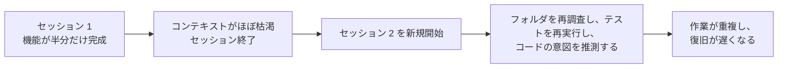
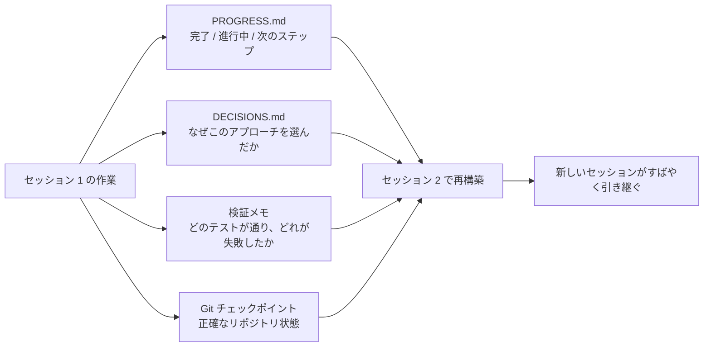

[中国語版 →](../../../zh/lectures/lecture-05-why-long-running-tasks-lose-continuity/)

> コード例: [code/](https://github.com/walkinglabs/learn-harness-engineering/blob/main/docs/en/lectures/lecture-05-why-long-running-tasks-lose-continuity/code/)
> 実践プロジェクト: [Project 03. マルチセッション連続性](./../../projects/project-03-multi-session-continuity/index.md)

# 講義 05. セッションをまたいでコンテキストを保ち続ける

Claude Code に完全な機能の実装を依頼します。30分ほど動かすと、たいていの作業は終わりますが、コンテキスト(context)がほとんど尽きます。続けるために新しいセッションを始めると、前回どんな判断が下されたのか、なぜオプション A ではなくオプション B が選ばれたのか、どのファイルがすでに変更済みなのか、テストの状態がどうなっているのかを覚えていないことに気づきます。すると、プロジェクトの再調査に15分を費やし、前回のやり方と一貫しない実装になるかもしれません。

毎朝目覚めるたびに、すべてを忘れてしまう職人を想像してください。現場全体を最初から把握し直さなければなりません。どの壁が途中までできているのか、なぜ青いレンガではなく赤いレンガを選んだのか、配管工事はどこまで進んでいるのか、といった具合です。さらに厄介なのは、昨日すでに取り付けた窓を、完了したことを覚えていないせいで外してしまうかもしれないことです。

これが、長期タスクにおける AI コーディングエージェント(agent)のジレンマです。この講義では、エージェントが長期作業の途中でなぜ「ブラックアウト」するのか、そして構造化された状態(state)の永続化が、エージェントを信頼できる日誌付きの職人に変える方法を説明します。相変わらず忘れっぽいですが、日誌がすべてを覚えてくれます。

## コンテキストウィンドウは無限ではありません

コンテキストウィンドウは有限です。これはモデルのアップグレードでは解決できない問題です。ウィンドウが 1M トークンまで広がっても、複雑なタスクはいずれ枯渇します。エージェントは単にコードを生成しているわけではありません。コードベースを理解し、自分の判断履歴を追跡し、ツール出力を処理し、会話コンテキストを維持しています。これらすべての情報は、ウィンドウ拡張よりも速く増えていきます。

さらに深い問題があります。エージェントが生み出す情報は、すべて同じ重要度ではないということです。途中の推論ステップには、判断の「なぜ」が含まれています。なぜオプション A ではなくオプション B を選んだのか、なぜこのライブラリをあのライブラリの代わりに使ったのか、なぜ特定の最適化を見送ったのか、という理由です。最終出力には「何をしたか」しか残りません。つまりコードそのものです。通常、コンパクション(compaction)戦略は後者を保持しますが、前者を失います。次のセッションはコードを見られても、なぜそう書かれたのか分からず、意図的な設計判断を「最適化」してしまうことさえあります。

Anthropic は長期実行エージェントの研究で、興味深い事実を見つけました。エージェントがコンテキスト残量が少ないと感じると、「早期収束」行動を示すのです。つまり、今の作業を急いで終わらせ、検証ステップを飛ばし、最適解ではなく簡単な解を選びます。試験で残り時間が少ないと気づいて、残りの多肢選択問題を急いで適当に埋めるのに似ています。Anthropic はこれを「context anxiety」と呼んでいます。

## セッション連続性の流れ

連続性の成果物(continuity artifacts)がなければ、新しいセッションは毎回災害です。



連続性の成果物があれば、新しいセッションはすばやく引き継げます。



## 重要な概念

- **コンテキストウィンドウは有限です**: どれだけ大きなウィンドウが主張されていても(128K、200K、1M)、長い作業はいずれ枯渇します。枯渇後は、コンパクション(情報損失)かリセット(新規セッション)が必要です。どちらも何かを失います。
- **連続性の成果物**: 新しいセッションが、前のセッションの中断地点から明確に再開できるようにする永続化された状態ファイルです。基本形は、進捗ログ + 検証(verification)記録 + 次の行動です。あの職人の日誌です。
- **再構築コスト(Rebuild cost)**: 新しいセッションが実行可能な状態に到達するまでに必要な時間。よいハーネスは、再構築コストを 15 分から 3 分へ減らせます。
- **ドリフト(Drift)**: エージェントの理解とコードリポジトリ(repository)の実際の状態とのずれです。すべてのセッション境界はドリフトを生み、制御しなければ蓄積します。
- **コンテキスト不安(Context anxiety)**: Anthropic が観測した現象で、エージェントが認識上のコンテキスト限界に近づくと早期収束行動を取り、情報損失を避けようとして作業を早めに終えます。非合理的なリソース不安です。
- **コンパクション vs リセット**: コンパクションは同一セッション内で最初の対話を要約します("何を"は残るが、"なぜ"は失われることがある)。リセットは新しいセッションを開き、永続化された状態から再構築します(きれいですが、成果物の完全性に依存します)。

## 連続性が崩れると何が起きるか

前のセッションでは、かなりのコンテキスト予算を使って 3 つのアプローチを検討し、オプション B を選びました。今回のセッションのエージェントはその分析を知らず、不完全な情報をもとにもう一度判断してしまうかもしれません。赤いレンガが選ばれた理由を覚えていない忘れっぽい職人が、今日たまたま青いレンガのほうがきれいだと思い、昨日積んだ壁を壊して作り直すようなものです。

さらに悪いのは、重複作業です。エージェントは、ある作業がすでに完了しているか確認できず、同じことをもう一度やってしまうかもしれません。あるいはもっと悪く、途中まで進めたあとで既存の実装と衝突していると気づき、やり直しになります。建設現場で 2 つのチームが同じ壁を同時に作ることはできません。しかし進捗記録がなければ、新しいチームは誰かがすでに作業していることに気づけません。

複数セッションにまたがるうちに、実装の方向が元の要件から静かにずれていることもあります。新しいセッションごとに、プロジェクト目標の理解が少しずつ違うのです。伝言ゲームのように、10人も経由すると「コーヒーを一杯取ってきて」が「コーヒーマシンを買ってきて」になります。

検証の抜けもあります。前のセッションでの検証結果(どのテストが通り、失敗し、なぜ失敗したのか)が残っていません。新しいセッションは、今の状態を理解するためにすべての検証をやり直さなければなりません。毎セッション最初から診断し、そのたびに貴重なコンテキストを浪費するのです。

OpenAI と Anthropic の両方が、自社ドキュメントで構造化された状態永続化を強調しています。OpenAI のハーネスエンジニアリング記事では、リポジトリを「運用記録」として扱います。すべての作業結果が、追跡可能な証拠としてリポジトリに残るべきだとしています。Anthropic の長期実行エージェント文書でも、「handoff」ファイルが明示的に推奨されています。現在状態、既知の問題、次の行動を含む構造化文書です。

## 忘れっぽい職人のための日誌

核心となるアプローチは、**エージェントを忘れっぽい優秀なエンジニアとして扱うこと**です。退勤する前に、次の「交代」エージェントがすばやく引き継げるよう、重要情報を書き残しておく必要があります。

**ツール 1: 進捗ファイル(PROGRESS.md)**。最も基本的な連続性の成果物であり、日誌の中心です。

```markdown
# プロジェクト進捗

## 現在の状態
- 最新コミット: abc1234 (feat: add user preferences endpoint)
- テスト状態: 42/43 通過 (test_pagination_edge_case が失敗)
- lint: 通過

## 完了済み項目
- [x] ユーザーモデルとデータベースマイグレーション
- [x] 基本 CRUD エンドポイント
- [x] 認証ミドルウェアの統合

## 進行中
- [ ] ページネーション機能 (90% - エッジケーステストが失敗中)

## 既知の問題
- test_pagination_edge_case が空の結果セットで 500 を返す
- 削除済みユーザーを一覧に表示すべきか確認が必要

## 次のステップ
1. ページネーションのエッジケースのバグを修正
2. "deleted users included" のクエリパラメータを追加
3. API ドキュメントを更新
```

**ツール 2: 決定ログ(DECISIONS.md)**。重要な設計判断と、その理由を記録します。詳細な設計書は必要ありません。必要なのは「何を、なぜ、いつ」だけです。日誌のメモです。

```markdown
# 設計上の決定

## 2024-01-15: ユーザー設定キャッシュに Redis を使用
- 理由: 読み取り頻度が高い(すべての API 呼び出し)、データサイズが小さい
- 不採用案: PostgreSQL のマテリアライズドビュー(変更頻度が高く、保守コストに見合わない)
- 制約: キャッシュ TTL 5 分、書き込み時は能動的に無効化
```

**ツール 3: Git コミットをチェックポイントにする。** 原子的な作業単位が終わるたびにコミットします。コミットメッセージは、何をしたか、なぜそうしたかを説明するべきです。これは無料で自動的に履歴管理される状態スナップショットです。

**ツール 4: init.sh またはハーネス初期化フロー。** `AGENTS.md` に「出勤」と「退勤」のルーチンを明記します。

```markdown
## セッション開始時 (出勤)
1. PROGRESS.md を読んで現在状態を把握する
2. DECISIONS.md を読んで重要な判断を把握する
3. make check を実行してリポジトリが一貫した状態か確認する
4. PROGRESS.md の「次のステップ」から続ける

## セッション終了前 (退勤)
1. PROGRESS.md を更新する
2. make check を実行して一貫性を確認する
3. 完了した作業をすべてコミットする
```

**混合戦略**: すべての作業でコンテキストのリセットが必要なわけではありません。短い作業(30分以下)は 1 セッション内で完了できます。長い作業(複数セッションにまたがるもの)は、連続性のために進捗ファイルと決定ログを使うべきです。判断基準は、作業にウィンドウの 60% 以上が必要なら、handoff の準備を始めることです。

### コンテキスト不安を深く見る

Anthropic の 2026 年 3 月の研究では、コンテキスト不安の具体的な現れがさらに明らかになりました。Sonnet 4.5 では、コンテキストがウィンドウ限界に近づくと、エージェントが強い「早期収束」行動を示します。試験の残り時間がほとんどないと気づいて、多肢選択問題に急いで適当な答えを埋めるようなものです。

これに対して、2 つの戦略があります。

**コンパクション**: 同じセッション内で最初の対話を要約します。利点: 連続性を保ちながら、エージェントが「何を」見られます。欠点: 「なぜ」は要約からしばしば失われます。なぜオプション B がオプション A ではなく選ばれたのか、なぜ特定の最適化が見送られたのか、という理由です。さらに重要なのは、コンパクションはコンテキスト不安を消さないことです。エージェントは、コンテキストが一時的に大きかったことを知っていても、心理的にはやはり終わりを急ぎがちです。

**コンテキストリセット**: コンテキストを完全に消し、新しいセッションを開き、永続化された成果物から再構築します。利点: すっきりした心的状態で新しいセッションを始められ、「時間が足りない」という不安がありません。欠点: handoff 成果物の完全性に依存します。日誌に重要な情報が抜けていれば、新しいセッションが誤った方向に時間を浪費する可能性があります。

Anthropic の実データでは、Sonnet 4.5 ではコンテキスト不安が深刻で、コンパクションだけでは不十分であり、コンテキストリセットがハーネス設計の重要な要素になります。しかし Opus 4.5 ではこの行動が大幅に減っており、コンパクションによってリセットに頼らずコンテキストを管理できます。つまり、**ハーネス設計には対象モデルの具体的な理解が必要であり、画一的なテンプレートではない**ということです。

> 出典: [Anthropic: Harness design for long-running application development](https://www.anthropic.com/engineering/harness-design-long-running-apps)

## 実例

ユーザー認証付きのブログシステムの実装をエージェントに任せました。機能ポイントは 12 個、予想では 5 セッション必要です。

**日誌なしのベースライン**: セッション 1 でユーザーモデルと基本ルートを実装しました。セッション 2 では、エージェントが認証ミドルウェアのインターフェース契約を覚えておらず、前回の設計意図を推測するのに約 15 分を使いました。セッション 3 では、累積したドリフトのせいで、エージェントがすでに完了した機能の再実装を始めました。セッション 5 ではリポジトリに重複コードが増えていたのに、肝心の認証機能はまだ end-to-end テストに通りませんでした。12 個の機能ポイントのうち 7 個しか完了せず、3 個には隠れた正確性の問題がありました。日誌をつけない職人のように、5 日目の現場は混乱です。ある壁は 2 回建てられ、建てられるはずだった別の壁はそもそも着手されていませんでした。

**日誌ありの場合**: 進捗ファイル、決定ログ、検証記録、git チェックポイントを使いました。各セッションの終了時に、状態レポートが自動で更新されました。セッション 2 の再構築コストは約 3 分まで下がりました。セッション 5 では、12 個の機能ポイントすべてが完了し、検証されました。

定量比較: 再構築時間は約 78% 減少し、機能完了率は 58% から 100% に、隠れた欠陥率は 43% から 8% に下がりました。職人は相変わらず忘れっぽいですが、日誌のおかげで毎日、前日が止まったところから始められます。最初からではなく。

## まとめ

- コンテキストウィンドウは有限な資源です。長い作業はセッションをまたぎ、セッションは情報を失います。毎日忘れる職人のように、これは客観的な現実です。
- 解決策は、より大きなウィンドウではありません。より良い状態の永続化です。進捗ファイル + 決定ログ + git チェックポイントで、忘れっぽい職人に信頼できる日誌を渡しましょう。
- エージェントは、忘れっぽいエンジニアとして扱ってください。退勤前に、何をしたか、なぜしたか、次は何かを書き残します。
- 再構築コストが重要指標です。よいハーネスは、新しいセッションが 3 分以内に実行可能な状態へ到達できるようにすべきです。
- 混合戦略: 短い作業はセッション内で、長い作業は構造化された成果物で連続性を保ちます。

## さらに読む

- [Anthropic: Effective Harnesses for Long-Running Agents](https://www.anthropic.com/engineering/effective-harnesses-for-long-running-agents)
- [OpenAI: Harness Engineering](https://openai.com/index/harness-engineering/)
- [Lost in the Middle: How Language Models Use Long Contexts](https://arxiv.org/abs/2307.03172)
- [Claude Code Documentation](https://docs.anthropic.com/en/docs/claude-code)
- [HumanLayer: Harness Engineering for Coding Agents](https://humanlayer.dev/articles/harness-engineering-for-coding-agents/)

## 練習問題

1. **連続性損失の測定**: 少なくとも 3 セッション必要な開発タスクを選んでください。連続性の成果物を与えず、各セッション開始時にエージェントが「前回何が起きたか」を把握するためにどれだけのコンテキストを消費するか記録してください。各セッション後に進捗ファイルを作成し、次のセッションがそれを起点にするようにします。進捗ファイルあり / なしで再構築コストを比較してください。

2. **handoff テンプレートの設計**: 4 つのフィールドを持つ最小限の handoff テンプレートを設計してください。保存状態(コミットハッシュ)、実行状態(テスト通過率)、ブロック項目、次の行動です。まったく新しいエージェントセッションに、このテンプレートだけを使ってプロジェクト状態を復元させてください。復元中に出会った曖昧さを記録し、テンプレートを改善してください。

3. **混合戦略の実験**: 5 セッションの開発タスクで 3 つの戦略を比較してください。(a) 毎回新規セッション + 進捗ファイル、(b) 1 セッションでできるだけ進める(コンテキストコンパクション)、(c) 混合戦略(短い作業はセッション内、長い作業はセッション間 + 進捗ファイル)。再構築時間、機能完了率、判断の一貫性を比較してください。
