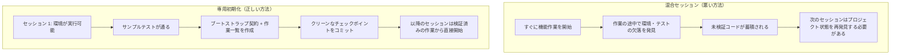

[中国語版 →](../../../zh/lectures/lecture-06-why-initialization-needs-its-own-phase/)

> コード例: [code/](https://github.com/walkinglabs/learn-harness-engineering/blob/main/docs/en/lectures/lecture-06-why-initialization-needs-its-own-phase/code/)
> 実践プロジェクト: [Project 03. マルチセッション継続性](./../../projects/project-03-multi-session-continuity/index.md)

# 講義 06. すべてのエージェントセッションの前に初期化せよ

新しいエージェント(agent)セッションを始めて、「検索機能を追加して」と伝えます。エージェントはすぐにコーディングに飛び込みます。意欲的で立派です。20分後、テストフレームワークが正しく設定されていないことに気づき、それを直すのにさらに10分かかります。すると今度は、データベースマイグレーションスクリプトの形式が間違っていることが分かり、また修正します。検索機能は最終的に追加されますが、セッション全体は非効率でした。大半の時間は、検索機能を書くことではなく、「このプロジェクトがどう動くのかを把握すること」に費やされました。

より良い方法はこうです。エージェントが作業を始める前に、別のステップを使って基本環境を整え、検証コマンドが通るようにし、プロジェクト構造を理解します。家を建てるのと同じです。基礎を打ちながら同時に壁を立てることはしません。そんなことをすれば、基礎が固まる前に壁が立ち上がり、建物全体を壊してやり直すことになります。まず基礎を打ち、固めてから、壁を建てます。きれいで効率的です。

この講義では、なぜ初期化(initialization)が実装と混ざるのではなく、独立したフェーズであるべきかを説明します。

## 基礎と壁: 根本的に異なる2つの作業

初期化と実装は、まったく異なる最適化目標を持っています。実装フェーズは、検証済み機能の量と品質を最大化することを最適化します。初期化(initialization)フェーズは、その後すべての実装の信頼性と効率を最大化することを最適化します。

初期化と実装を混ぜると、エージェントは多目的最適化の問題に直面します。インフラを構築しながら、機能コードも書かなければなりません。明確な優先順位がないと、エージェントは自然とコード作成を優先します（直接見える出力だからです）。インフラは後回しになります（その価値は後続セッションでしか見えないからです）。これは、建設チームに基礎打ちと壁の建設を同時にやらせるようなものです。壁は見えるし人に見せやすいので、チームはそちらを急ぎます。しかし、基礎が悪い家は、後になって体系的な問題を抱えます。

## 初期化のライフサイクル



## 混ぜたときに何が起こるか

最も直接的な問題は、基礎がきちんと固まらないことです。エージェントが機能コードに80%の労力を使い、インフラ設定に20%を一時的に充てる、という形になりがちです。テストフレームワークは設定されたものの検証されておらず、lint ルールは設定されたものの甘すぎて、進行ファイルは作られていません。この欠陥は最初のセッションでは明確に見えません（エージェントが何をしたかをまだ覚えているからです）。しかし、2回目のセッションで表面化します。新しいエージェントは、どう実行するのか、どうテストするのか、状況がどうなっているのかを知りません。基礎が粗雑だと、建物は揺れます。

より見えにくいコストは、「未検証の蓄積」です。テストフレームワークが整う前に書かれた機能コードは、検証されていないコードです。ようやくそのコードにテストを追加しようと戻ったとき、最初から設計が間違っていたと気づくかもしれません。最初に知っていれば、別の実装にしていたはずです。濡れたコンクリートの上にタイルを貼るようなものです。床が平らでないと分かったら、タイルを全部はがしてやり直しです。

セッション予算も無駄になります。初期化作業（環境設定、テスト構成、プロジェクト構造の理解）がかなりの予算を消費し、実際の機能実装に残るものが少なくなります。結果として、1回目のセッションでは機能が半分しか終わらず、2回目のセッションはプロジェクトを再理解するところから始まります。基礎に予算を使ったのに、その基礎も十分に強固ではありません。どちらの目標も達成できません。

最も見落としやすい問題は、暗黙の前提の地雷原です。エージェントが初期化中に下した決定（どのテストフレームワークを使うか、ディレクトリ構成をどうするか、依存関係をどう管理するか）が明示的に記録されていなければ、後続セッションはそれらの選択を理解できません。さらに悪いことに、後続セッションが矛盾する選択をしてしまうこともあります。最初の建設チームがコンクリート基礎を使ったのに、2番目のチームはそれを知らず、その上に木の杭を打ち込むようなものです。基礎はひび割れます。

Anthropic の長期実行アプリケーション開発研究でも、初期化と実装を分けることが明示的に推奨されています。同社の実験データでは、専用の初期化フェーズを使ったプロジェクトは、マルチセッションのシナリオで、混合アプローチよりも機能完了率が31%高くなりました。重要な洞察は、初期化フェーズに投じた時間は、その後の3〜4セッションで完全に回収されるということです。基礎がしっかりしているほど、壁は速く立ち上がります。

OpenAI の Codex ハーネスエンジニアリングガイドでも、「リポジトリを操作記録として扱う」原則が強調されています。最初の実行で明確な運用構造を確立するか、すべての新しいセッションがプロジェクトの慣習を毎回推測し直すかのどちらかです。

## 核心概念

- **初期化フェーズ(Initialization Phase)**: エージェントのライフサイクルにおける最初のフェーズで、機能実装は行わず、その後のすべての実装フェーズの前提条件を整えることだけを行います。出力はコードではなく、インフラです。
- **ブートストラップ契約(Bootstrap Contract)**: 新しいエージェントセッションがプロジェクトを明確に運用できるための条件です。開始でき、テストでき、進捗を確認でき、次のステップを把握できなければなりません。この4つの条件がすべて必要です。
- **コールドスタート(Cold Start) vs ウォームスタート(Warm Start)**: コールドスタートは、エージェントがプロジェクト構造を推測しなければならない空のディレクトリから始めることです。ウォームスタートは、インフラがすでに整っているテンプレートや既存プロジェクトから始めることです。ウォームスタートはコールドスタートよりはるかに優れています。水道と電気が通った現場で作業を始めるのと、荒れ地で始めるのとの違いです。
- **ハンドオフ準備性(Handoff Readiness)**: いつでもプロジェクトが新しいエージェントに引き継がれる状態にあること。口頭説明は不要で、リポジトリの内容だけで十分です。
- **初回検証までの時間(Time to First Verification)**: プロジェクト開始から、最初の機能ポイントが検証を通過するまでの時間。初期化の効率を測る重要指標です。
- **下流での使いやすさ(Downstream Usability)**: 初期化品質を測る最良の方法です。暗黙知に頼らずに成功裏に作業を実行できる後続セッションの割合です。

## 初期化を正しく行う方法

**初期化を独立したフェーズとして扱ってください。** 最初のセッションは初期化だけを行います。ビジネス機能のコードは一切ありません。初期化が作るものは次のとおりです。

**1. 実行可能な環境。** プロジェクトが起動し、依存関係がインストールされ、環境問題がありません。基礎を打ち、ひび割れもありません。

**2. 検証可能なテストフレームワーク。** 少なくとも1つのサンプルテストが通ります。これにより、テストフレームワーク自体が正しく設定されていることが証明されます。基礎の上に柱を立てて、荷重に耐えられることを証明するようなものです。

**3. ブートストラップ契約の文書。** 後続セッションに次のことを伝える明確な文書:
```markdown
# 初期化契約

## 開始コマンド
- 依存関係のインストール: `make setup`
- 開発サーバーの起動: `make dev`
- テストの実行: `make test`
- 全体検証: `make check`

## 現在の状態
- すべての依存関係がインストールされ、ロック済み
- テストフレームワーク設定済み (Vitest + React Testing Library)
- サンプルテスト通過 (1/1)
- lint ルール設定済み (ESLint + Prettier)

## プロジェクト構造
- src/ — ソースコード
- src/components/ — React コンポーネント
- src/api/ — API クライアント
- tests/ — テストファイル
```

**4. 作業の分解。** プロジェクト全体を順序付きの作業一覧に分け、各作業に明確な受け入れ基準を付けます。
```markdown
# 作業分解

## 作業 1: ユーザー認証の基礎
- JWT 認証ミドルウェアを実装
- ログイン/サインアップのエンドポイントを追加
- 受け入れ基準: pytest tests/test_auth.py がすべて通る

## 作業 2: ユーザープロフィールページ
- ユーザープロフィールの CRUD を実装
- プロフィール編集フォームを追加
- 受け入れ基準: pytest tests/test_profile.py がすべて通る

## 作業 3: 検索機能
- ...
```

**5. Git コミットをチェックポイントにする。** 初期化が完了したら、クリーンなチェックポイントをコミットします。その後の作業はすべて、このチェックポイントから始めます。

**ウォームスタート戦略**: 空のディレクトリから始めないでください。プロジェクトテンプレート(create-react-app, fastapi-template など)を使って、標準的なディレクトリ構成、依存関係設定、テストフレームワークを事前に整えてください。一般的な初期化の手順をテンプレートに焼き込み、プロジェクト固有の初期化作業だけを残します。水道と電気が通った現場で作業を始めるようなものです。荒れ地から始めるより、1万倍ましです。

**初期化完了の基準**: 「どれだけコードを書いたか」ではなく、ブートストラップ契約の4条件が満たされているかどうかです。開始でき、テストでき、進捗を確認でき、次のステップを把握できなければなりません。このチェックリストで初期化を検証してください。

```markdown
## 初期化の受け入れチェックリスト
- [ ] `make setup` が最初から成功する
- [ ] `make test` に少なくとも1つの通るテストがある
- [ ] 新しいエージェントセッションが、リポジトリの内容だけで「実行方法」と「テスト方法」に答えられる
- [ ] 少なくとも3つの作業がある作業分解ファイルが存在する
- [ ] すべてが git にコミットされている
```

## 実例

React フロントエンドプロジェクトに対する2つの初期化アプローチ:

**混合アプローチ（基礎を打ちながら同時に壁を立てる）**: エージェントはセッション 1 で、プロジェクトのスキャフォールディングと最初の機能実装を同時に行いました。セッション終了時点でリポジトリには実行可能なコードがありましたが、明示的な開始/テストコマンドの文書はなく、進捗追跡ファイルもなく、作業分解もありませんでした。セッション 2 は、プロジェクト構造、テストフレームワーク、ビルドプロセスを推測するのに約20分を費やしました。現場に着いた新しい建設チームが、基礎がどれだけ進んでいるか、配管工事がどこまで進んでいるか分からず、1つずつ穴を掘って確認しなければならないようなものです。

**専用初期化（まず基礎）**: セッション 1 では初期化だけを行いました。テンプレートからディレクトリ構造を作り、テストフレームワーク(Vitest + React Testing Library)を設定し、1つのサンプルテストを書いて検証し、ブートストラップ契約の文書と作業分解ファイルを作成し、初期チェックポイントをコミットしました。セッション 2 の立ち上がり時間は3分未満で、作業一覧からすぐに作業を始められました。チームが到着して、青写真を一度見ただけで、どこから引き継ぐか正確に分かるようなものです。

プロジェクト全体のサイクルを比較すると、混合アプローチの総立ち上がり時間（全セッション合計）は、専用初期化アプローチより約60%多くなりました。初期化に使った追加の20分は、その後のセッションで何倍にも回収されました。強固な基礎が壁の立ち上がりを早くするのと同じです。遅いことが速いのです。

## 要点

- 初期化と実装は最適化目標が異なります。混ぜると両方を悪化させます。まず基礎を打ち、次に壁を建ててください。
- 初期化の出力はコードではありません。インフラです: 実行可能な環境、検証可能なテスト、ブートストラップ契約、作業分解。
- ブートストラップ契約の4条件で初期化を検証してください: 開始でき、テストでき、進捗を確認でき、次のステップを把握できること。
- ウォームスタートはコールドスタートより優れています。プロジェクトテンプレートを使って標準化されたインフラを事前に整えてください。
- 初期化に投じた時間は、その後の3〜4セッションで完全に回収されます。これは追加コストではありません。先行投資です。基礎が強いほど、建物は速く立ち上がります。

## さらに読む

- [Anthropic: Effective Harnesses for Long-Running Agents](https://www.anthropic.com/engineering/effective-harnesses-for-long-running-agents)
- [OpenAI: Harness Engineering](https://openai.com/index/harness-engineering/)
- [HumanLayer: Harness Engineering for Coding Agents](https://humanlayer.dev/articles/harness-engineering-for-coding-agents/)
- [Infrastructure as Code — Martin Fowler](https://martinfowler.com/bliki/InfrastructureAsCode.html)
- [SWE-agent: Agent-Computer Interfaces](https://github.com/princeton-nlp/SWE-agent)

## 練習問題

1. **ブートストラップ契約の設計**: 開発中のプロジェクトに対する完全なブートストラップ契約を書いてください。次に、まったく新しいエージェントセッションを開き、リポジトリの内容だけを見せて（口頭のコンテキストなしで）、プロジェクトを開始し、テストを実行し、現在の進捗を理解させてください。遭遇する問題をすべて記録してください。それぞれがブートストラップ契約の欠落した条項に対応します。

2. **比較実験**: 適度に複雑な新規プロジェクトを選んでください。アプローチ A: エージェントに初期化と最初の実装を同時にやらせる。アプローチ B: 1つのセッションを専用初期化に使い、セッション 2 で実装を開始する。4セッション後に比較してください: 初回検証までの時間、立ち上がりコスト、機能完了率。

3. **初期化の受け入れチェックリスト**: プロジェクト用の初期化受け入れチェックリストを設計してください。新しいエージェントセッションに各チェック項目を実行させ、何が通り、何が失敗するかを記録してください。失敗した項目が、ハーネスを強化すべき箇所です。
