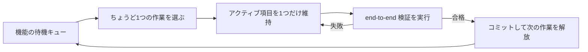
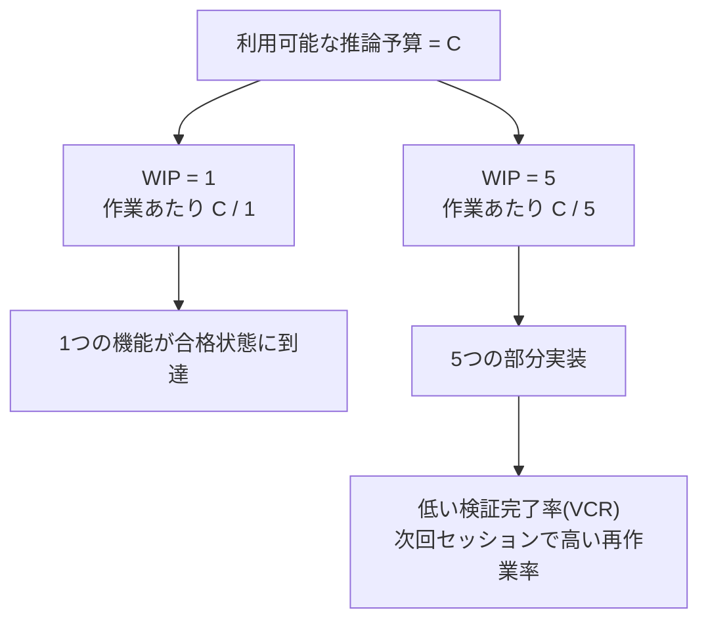

[中国語版 →](../../../zh/lectures/lecture-07-why-agents-overreach-and-under-finish/)

> コード例: [code/](https://github.com/walkinglabs/learn-harness-engineering/blob/main/docs/en/lectures/lecture-07-why-agents-overreach-and-under-finish/code/)
> 実習プロジェクト: [プロジェクト 04. ランタイムフィードバックと範囲(scope)制御](./../../projects/project-04-incremental-indexing/index.md)

# 講義 07. エージェントには明確な作業境界が必要です

Claude Code に「このプロジェクトにユーザー認証を追加して」と指示すると、エージェント(agent)はデータベーススキーマを修正し、ルートを追加し、フロントエンドコンポーネントを変更し、そのついでにエラー処理ミドルウェアまでリファクタリングし始めます。2時間後に確認すると、修正されたファイルは12個、新しいコードは800行、そして単一の機能も end-to-end では動いていません。

「一度にかじりすぎる」 - この表現は AI エージェントに特によく当てはまります。エージェントは「少し余分にやっておこう」という衝動に引っ張られます。関連するものが見えると、まとめて処理してしまうのです。まるで醤油を1本買いにスーパーへ行ったのに、気づけばカートがいっぱいになっている人のようです。問題は、人間が買いすぎても無駄になるのはお金だけですが、エージェントが一度にやりすぎると、どれもきちんと終わらなくなることです。

Anthropic の「長時間実行エージェントのための効果的なハーネス(harness)」に関するエンジニアリング記事は、はっきり述べています。プロンプトの範囲が広すぎると、エージェントは「1つを先に終える」よりも「複数を同時に始める」傾向があります。OpenAI の Codex エンジニアリング実践例でも同じ現象が観測されています。明示的な範囲制御のないタスクは、完了率が大きく落ちます。これはモデルの問題ではありません。ハーネスの問題です。境界を与えていないのです。

## 注意力は有限な資源です

これは比喩ではなく、数学です。エージェントの context 容量を C とし、k 個のタスクを同時に有効化すると仮定すると、各タスクに割り当てられる平均推論資源は C/k になります。C/k が単一タスクを完了するために必要な最小閾値を下回ると、何も完成しません。胃が1つしかないのに餃子を10個いっぺんに詰め込めば、消化しきれず、10個すべてもたれます。

Claude Code の実際の挙動がこれをよく示しています。「ユーザー登録機能を追加して」と頼むと、次のように進むことがあります。

1. User モデルを作成
2. 登録ルートを作成
3. メール認証が必要だと気づき、メールサービスを追加
4. パスワードのハッシュ化が必要だと確認し、bcrypt を導入
5. エラー処理に一貫性がないことを見つけ、グローバルなエラーミドルウェアをリファクタリング
6. テストファイル構成が雑だと判断し、ディレクトリを再構成

6段階を終えても、1つも完了していません。end-to-end の検証(verification)はなく、未完成コード同士の複雑な結合だけが残り、次に引き継ぐセッションは完全に迷子になります。まるで6種類の料理を同時に作っている人のようです。すべて鍋の中にはあるのに、皿に盛られたものは1つもありません。全部焦げます。

Anthropic の実験データはこれを直接裏づけています。「小さな次のステップ」戦略(WIP=1 に相当)を使ったエージェントは、広いプロンプトを使ったエージェントよりも、タスク完了率が37%高くなりました。さらに興味深いのは、エージェントが生成したコード行数と、実際に完了した機能数の間に弱い負の相関が見られることです。コードを書けば書くほど、完了した機能は減ります。データで証明された過剰介入(overreach)です。

## WIP=1 ワークフロー





## 基本概念

- **過剰介入(Overreach)**: エージェントが単一セッションで、最適値より多くのタスクを有効化することです。定量化できます。5個の機能を扱ったのに、end-to-end を通過したものが0個なら、それは過剰介入です。
- **未完了(Under-finish)**: 有効化された全タスクのうち、end-to-end 検証を通過したタスクの割合が閾値を下回る状態です。コードは書いたがテストが通らないなら、それは未完了です。
- **WIP 制限(Work-in-Progress Limit)**: カンバン(Kanban)手法から来た概念です。核心は、同時進行中の作業数を制限することです。エージェントには WIP=1 が最も安全なデフォルトです。1つ終えてから、次を始めます。ビュッフェのように、皿を積み上げず、1皿を食べ終えてから次の皿を取ります。カンバンは製造業から生まれたワークフロー管理手法で、仕掛かり品(WIP)の制限によって流れの効率を最大化するのが基本原理です。
- **完了の証拠(Completion Evidence)**: タスクが「進行中」から「完了」に移るために満たすべき、検証可能な条件です。これがなければ、エージェントは「コードは問題なさそうだ」を「動作がテストに通った」にすり替えます。
- **範囲表面(Scope Surface)**: 各ノードが作業単位で、エッジが依存関係である DAG 構造です。状態は4つに限定されます。not_started, active, blocked, passing。
- **完了圧力(Completion Pressure)**: ハーネスが WIP 制限と完了証拠の要件を通じて与える制約力で、エージェントが新しいタスクを始める前に現在のタスクを終わらせるよう強制します。

## 過剰介入と未完了は共生関係です

この2つの問題は独立ではありません。互いを増幅し合います。過剰介入は注意力を希釈し、希釈された注意力は未完了を招き、残された半完成コードはシステムの複雑さを高め、それが次のタスクでさらに大きな過剰介入を呼びます。悪循環です。

カンバン用語で言えば、リトルの法則(Little's Law)は L = lambda * W だと教えてくれます。仕掛かり品(WIP)の L が高すぎると(同時にやりすぎると)、各タスクのリードタイム W は必然的に伸びます。エージェントにとってこれは、各機能が開始から検証済みの完了に至るまでにより長くかかり、失敗確率も高くなることを意味します。

これは人間の世界でも昔からある問題です。Steve McConnell は『Rapid Development』で、スコープクリープ(scope creep)がプロジェクト失敗の主要因だと記しています。ただ、人間には少なくとも「ここでやめておこう」という直感があります。エージェントにはそれがありません。次のアイデアを生成するための追加トークンコストはほぼ 0 です。あれも直そう、これも直そうと書くこと自体はモデルにとってほとんど負担ではありませんが、その追加修正のたびにエージェントの注意力は希釈されます。1皿追加するコストがほぼ 0 のビュッフェでも、胃袋は1つしかないのと同じです。

## 正しいやり方

### 1. WIP=1 を強制する

最も直接的で効果的な方法です。ハーネスからエージェントへ明示的に指示してください。**どの時点でも、"active" 状態にある作業は1つだけであること。** Claude Code の CLAUDE.md や Codex の AGENTS.md には、次のように書きます。

```
## 作業ルール
- 一度に1つの機能だけを作業します
- 現在の機能が end-to-end 検証を通過してから、次の機能を開始します
- 機能 A を実装している間に、機能 B を「ついでに」リファクタリングしません
```

ビュッフェで食べるように。1皿ずつ取り、食べ終えてからまた取りに行きます。

### 2. すべてのタスクに明示的な完了証拠を定義する

完了とは「コードが書かれた」ではなく、「動作検証に合格した」です。機能一覧(feature list)の各項目には、検証コマンドが必要です。

```
F01: ユーザー登録
  検証: curl -X POST /api/register -d '{"email":"test@example.com","password":"123456"}' | jq .status == 201
  状態: passing
```

### 3. 範囲表面を外部化する

機械可読なファイル(JSON または Markdown)を使って、すべてのタスク状態を記録してください。新しいセッションはこのファイルを読めば、すぐに分かります。どのタスクが active なのか。どの動作が完了と見なされるのか。どの検証が通ったのか。

### 4. 検証完了率(VCR)を監視する

ハーネスは VCR(Verified Completion Rate) = 検証済みタスク / 有効化されたタスク を継続的に追跡しなければなりません。VCR < 1.0 のときは、新しいタスクの有効化を止めます。

## 実例

8個の機能を持つ REST API プロジェクトで、2つの戦略を比較します。

**ビュッフェモード(制約なし)**: エージェントはセッション1で5個の機能を同時に有効化します。12ファイルにまたがって約800行を生成します。end-to-end テストの通過率は20%です。ユーザー登録だけが動作します。残りの4機能は、データベーススキーマは生成されたがバリデーションロジックがなく、ルートは定義されたが誤ったレスポンス形式を返します。まるで6種類の料理を同時に作って、なんとか1つだけ食べられるようなものです。セッション3の終了時点で、8個中3個の機能しか完了していません。

**単一皿モード(WIP=1)**: エージェントはセッション1でユーザー登録だけに集中します。4ファイルに約200行を生成します。end-to-end テストは100%通過です。検証済みのクリーンな実装をコミットします。セッション4の終了時点で、8個中7個の機能が完了しています(残りの1個は外部依存でブロックされています)。

結果: 総コード量は少ないのに(800行対1200行)、より効果的なコードです。完了率は87.5%対37.5%です。1回にひと口ずつ食べれば、実際にはより多く食べられます。

## 要点

- **WIP=1 はエージェントハーネスの基本的な安全設定です** - 1つ完了してから次を始めてください。並列化しようとしないでください。ひと口で太ることはできません。
- **完了の証拠は実行可能でなければなりません** - 「コードが問題なさそう」は対象外です。「curl が 201 を返す」が対象です。
- **範囲表面はファイルとして外部化すべきです** - 会話の中だけで触れるのではなく、リポジトリ内の機械可読な形式で記録してください。
- **過剰介入と未完了は共生関係です** - 片方を解決すれば、もう片方も解決します。
- **「少なく作って、きちんと終える」ことは、常に「たくさん作って半分残す」より優れています** - エージェントのコード行数と機能完了率には負の相関があります。品質は常に量に勝ちます。

## さらに読む

- [Effective harnesses for long-running agents - Anthropic](https://www.anthropic.com/engineering/effective-harnesses-for-long-running-agents) — Anthropic のエンジニアリング記事。「小さな次のステップ」戦略について詳しく解説しています
- [Harness Engineering - OpenAI](https://openai.com/index/harness-engineering/) — OpenAI によるハーネスエンジニアリングの包括的な解説
- [Kanban: Successful Evolutionary Change - David Anderson](https://www.goodreads.com/book/show/1070822.Kanban) — WIP 制限に関する定番資料
- [Rapid Development - Steve McConnell](https://www.goodreads.com/book/show/125171.Rapid_Development) — スコープクリープがプロジェクト失敗の主要因であることを示す実証データ

## 練習問題

1. **作業の原子化**: 広い要件(例: 「ユーザー管理システムを実装する」)を選び、少なくとも5つの原子的な作業単位に分解してください。各単位について次を明記します: (a) 単一の動作説明、(b) 実行可能な検証コマンド、(c) 依存関係。分解が WIP=1 制約を満たすことを確認してください。

2. **比較実験**: 同じプロジェクトを2回実行してください。1回は制約なし、もう1回は WIP=1 を強制適用します。比較する項目: 検証完了率、総コード行数、有効コード比率。

3. **完了証拠監査**: 直近のエージェント実行結果を確認し、各コード変更を「完了した動作」「未完了の動作」「スキャフォールディング」に分類してください。各未完了動作について、足りない検証コマンドを追加してください。
