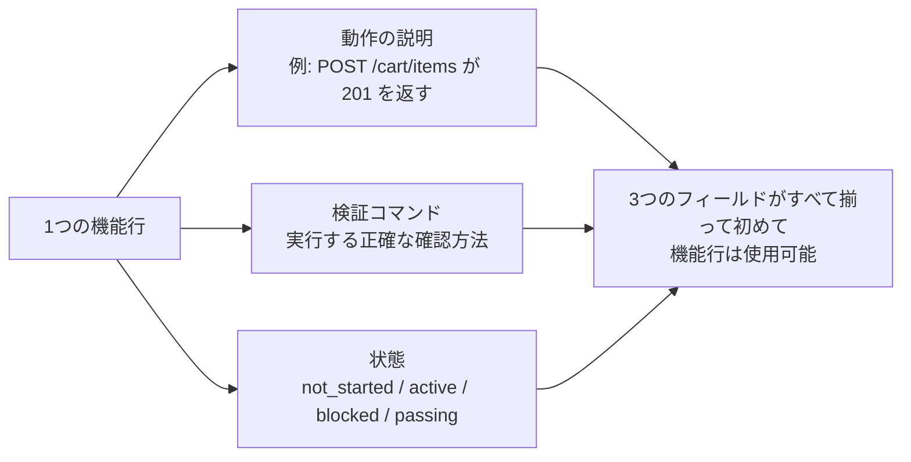
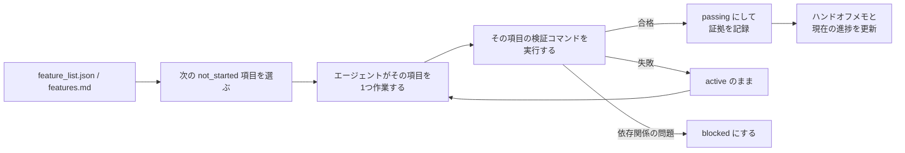

[中国語版 →](../../../zh/lectures/lecture-08-why-feature-lists-are-harness-primitives/)

> コード例: [code/](https://github.com/walkinglabs/learn-harness-engineering/blob/main/docs/en/lectures/lecture-08-why-feature-lists-are-harness-primitives/code/)
> 実習プロジェクト: [プロジェクト 04. ランタイムフィードバックとスコープ制御](./../../projects/project-04-incremental-indexing/index.md)

# 講義 08. 機能一覧はハーネスのプリミティブである

エージェントに EC サイトの構築を依頼します。完了後、エージェントは「完了しました」と言います。ところがコードを確認すると、ユーザー認証は動いているのに、カートの決済ボタンは何もせず、決済フローはまったくつながっていません。問題は、「完了」が何を意味するのかを一切伝えていなかったため、エージェントが独自の基準を使ってしまったことです。基準は「たくさんコードを書いたし、かなり完成して見える」というものです。

機能一覧(feature list)は、多くの人にとっては単なるメモに見えます。忘れないように書いておくもの、そして脇に置いておくものです。しかしハーネス(harness)の世界では、機能一覧は人間向けのメモではありません。ハーネス全体の背骨(backbone)です。scheduler はこれをもとに作業を選び、verifier はこれをもとに完了を判定し、handoff レポーターはこれをもとに要約を生成します。背骨が折れれば、全身が機能しなくなります。

Anthropic も OpenAI も強調しています。**成果物(artifact)は外部化されるべきです。** 機能の状態は、構造化されていない会話テキストではなく、リポジトリ内の機械可読なファイルとして存在していなければなりません。

## エージェントは「完了」の意味を知らない

Claude Code も Codex も、「完了」が何を意味するのかを自動では知りません。「カート機能を追加して」と言えば、モデルの解釈は「Cart コンポーネントと addToCart メソッドを書くこと」かもしれません。しかし、あなたが意図していたのは「ユーザーが商品を閲覧し、カートに追加し、決済を完了できるエンドツーエンドの流れ」でした。この認識のずれは、機能一覧がない限りずっと残ります。エージェントは独自の暗黙基準を使います。たいていは「コードに明らかな文法エラーがない」です。あなたに必要なのはエンドツーエンドの動作検証です。友人に果物を買ってきてもらうときに「果物買ってきて」とだけ伝えたらレモンを持ってくるようなものです。友人の果物とあなたの果物は、同じ果物ではありません。

次のような一般的な進捗メモを見てください:

```
ユーザー認証完了、カートはほぼ完了、決済はまだ必要
```
新しいエージェントセッションは、このメモから次の質問に答えられるでしょうか。「ほぼ完了」とは何を意味するのか。カートに対してどのテストが通ったのか。決済を妨げているものは何か。答えはすべて「誰にも分からない」です。医者に「お腹が痛いんですが、最近は大丈夫です」と言うようなものです。どんな薬を出せるでしょうか。

その結果、新しいセッションはプロジェクトの状態推定に 20 分を費やし、すでに完了した機能を再実装してしまうことさえあります。Anthropic のエンジニアリングデータによれば、優れた進捗記録はセッション開始時の診断時間を 60〜80% 短縮します。

## 機能状態マシン





## 基本概念

- **機能一覧はハーネスのプリミティブ(primitive)です**: 「任意の計画ツール」ではなく、他のすべてのハーネス構成要素が依存する基盤データ構造です。データベースのテーブル定義のようなものです。つまり、「主キーは省略しよう」とは言えません。「プリミティブ」とは、システムの中でこれ以上分解できない基本部品であり、他のすべての抽象化はその上に成り立ちます。
- **三重構造**: 各機能項目は `(動作の説明, 検証コマンド, 現在の状態)` という三重構造です。どれか 1 つでも欠けると、その項目は不完全です。
- **状態マシンモデル**: 各機能項目は `not_started`, `active`, `blocked`, `passing` の 4 つの状態を持ちます。状態遷移はエージェントではなく、ハーネスが制御します。
- **パス状態ゲーティング(Pass-state gating)**: 機能が `active` から `passing` に移る唯一の方法は、検証コマンドが成功することです。これは取り消せません。`passing` になったら戻れません。試験に合格したら合格であり、後から点数を書き換えられないのと同じです。
- **単一の真実の源(Single source of truth)**: 「何をすべきか」に関する情報は、すべて 1 つの機能一覧から導かれるべきです。機能一覧と会話履歴の間に矛盾があってはいけません。
- **逆圧(back-pressure)**: まだ通過していない機能の数は、ハーネスがエージェントに与える圧力です。圧力が 0 なら、プロジェクト完了です。

## なぜ機能一覧は「プリミティブ」であるべきか

ドキュメントは人間が読むためのもので、プリミティブはシステムが実行するためのものです。ドキュメントは無視できますが、プリミティブは迂回できません。

データベースのトリガー制約とアプリケーション層のチェックを考えてみてください。前者はデータベースエンジンが強制し、どんな SQL もすり抜けられません。後者はアプリケーションコードの正しさに依存し、うっかり回避されることがあります。ハーネスのプリミティブとしての機能一覧は、具体的に次の 4 つのハーネス構成要素を支えます。

1. **Scheduler**: 状態を読み取り、次の `not_started` 機能を選びます。工場の生産計画システムのようなものです。
2. **Verifier**: 検証コマンドを実行し、状態遷移を許可するかどうかを決めます。品質検査のようなものです。
3. **Handoff reporter**: 機能一覧から、セッション引き継ぎ用の要約を自動生成します。自動の交代勤務報告のようなものです。
4. **Progress tracker**: 状態分布を集計し、プロジェクトの健全性指標を提供します。ダッシュボードのようなものです。

## 正しいやり方

### 1. 最小限の機能一覧形式を定義する

複雑なシステムは必要ありません。構造化された Markdown または JSON ファイルで十分です。重要なのは、各項目が三重構造を持つことです。

```json
{
  "id": "F03",
  "behavior": "POST /cart/items with {product_id, quantity} returns 201",
  "verification": "curl -X POST http://localhost:3000/api/cart/items -H 'Content-Type: application/json' -d '{\"product_id\":1,\"quantity\":2}' | jq .status == 201",
  "state": "passing",
  "evidence": "commit abc123, test output log"
}
```

### 2. ハーネスに状態遷移を制御させる

エージェントは機能の状態を直接 `passing` に変更できません。検証リクエストを送るだけです。するとハーネスが検証コマンドを実行し、遷移を許可するかを判断します。これが「パス状態ゲーティング」です。

### 3. CLAUDE.md にルールを書く

```
## 機能一覧ルール
- 機能一覧ファイル: /docs/features.md
- 一度に有効化できる機能は1つだけ
- passing と表示する前に検証コマンドが通っていること
- 機能一覧の状態を直接修正しないこと — 検証スクリプトが自動で更新します
```

### 4. 粒度を調整する

各機能項目は「1つのセッション内で完了できる」範囲であるべきです。広すぎると完了せず、狭すぎると管理オーバーヘッドが増えます。「ユーザーがカートに商品を追加できる」は適切な粒度です。「カートを実装する」は広すぎます。「Cart モデルに name フィールドを追加する」は狭すぎます。ステーキを切るようなものです。丸ごとでも、ひき肉でもなく、ちょうどいい一口サイズにします。

## 実例

10 個の機能を持つ EC プラットフォームを考えます。2 つの追跡方法を比較します。

**メモモード**: エージェントは構造化されていないメモを使います。3 セッション後、メモは「ユーザー認証と商品一覧は完了、カートはほぼ完了だがバグあり、決済は未着手」になります。新しいセッションは状態推定に 20 分かかり、最終的に完了済みの機能を再実装します。買い物リストに「牛乳、パン、あれ」と書いてあるようなもので、店に行っても何を買うべきか分からないのと同じです。

**背骨モード**: すべての機能に明確な状態と検証コマンドがあります。新しいセッションは機能一覧を読めば 3 分で把握できます。F01-F05 は `passing`、F06 は `active`、F07-F10 は `not_started` です。F06 からそのまま引き継ぎ、手戻りなく進めます。

定量的な結果として、構造化された機能一覧を使うプロジェクトは、自由形式の進捗管理と比べて機能完了率が 45% 高く、重複実装はゼロです。

## 要点

- **機能一覧はハーネスの背骨です**。人間向けのメモではありません。scheduler、verifier、handoff reporter はすべてこれに依存します。
- **各機能項目は三重構造を持つ必要があります**。動作の説明 + 検証コマンド + 現在の状態です。1 つでも欠ければ不完全です。三脚の脚が 1 本ない椅子のようなものです。
- **状態遷移はハーネスが制御します**。エージェントは単独で状態を変えられません。検証に合格することが唯一の更新経路です。
- **機能一覧はプロジェクトの単一の真実の源です**。「何をすべきか」に関するすべての情報は、1 つの一覧から導かれます。
- **粒度は「1 つのセッション内で完了できる」ように調整してください。**

## さらに読む

- [Effective harnesses for long-running agents - Anthropic](https://www.anthropic.com/engineering/effective-harnesses-for-long-running-agents) — 機能一覧を premature completion や scope drift への対策として使う実例を示しています
- [Harness Engineering - OpenAI](https://openai.com/index/harness-engineering/) — 「成果物の外部化」の原則を強調しています
- [Design by Contract - Bertrand Meyer](https://www.goodreads.com/book/show/130439.Object_Oriented_Software_Construction) — 契約による設計の原則であり、機能一覧の理論的基盤です
- [How Google Tests Software](https://www.goodreads.com/book/show/13563030-how-google-tests-software) — テストピラミッドと動作仕様のエンジニアリング実践

## 練習問題

1. **機能一覧の設計**: 最小限の機能一覧 JSON スキーマを定義してください。含める項目: id、動作の説明、検証コマンド、現在の状態、証拠参照。これを使って、5 つの機能を持つ実際のプロジェクトを説明してください。

2. **検証の厳密さの比較**: 3 つの機能を選び、「緩い」検証(例: 「コードに文法エラーがない」)と「厳密な」検証(例: 「エンドツーエンドテストが通る」)の両方を設計してください。各方法での偽陽性率を比較してください。

3. **単一の真実の源の原則の監査**: 既存のエージェントプロジェクトをレビューし、機能一覧と矛盾するスコープ情報(会話中の暗黙的要件、コード内の TODO コメントなど)を見つけてください。すべての情報を機能一覧に統合する計画を設計してください。
