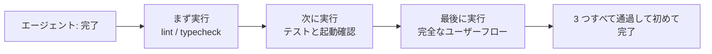
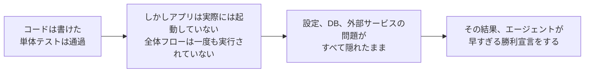

[中国語版 →](../../../zh/lectures/lecture-09-why-agents-declare-victory-too-early/)

> この講義のコード例: [code/](https://github.com/walkinglabs/learn-harness-engineering/blob/main/docs/en/lectures/lecture-09-why-agents-declare-victory-too-early/code/)
> 実習プロジェクト: [プロジェクト 05. エージェントに自分の作業を自己検証させる](./../../projects/project-05-grounded-qa-verification/index.md)

# 講義 9. エージェントに早すぎる勝利宣言をさせない

エージェントに「パスワード再設定」機能の実装を依頼したとします。エージェントはデータベーススキーマを変更し、API エンドポイントを実装し、メールテンプレートを追加し、単体テストを実行しました。すべて成功です。そして自信満々に「完了しました」と報告します。ところが実際に動かしてみると、パスワード再設定リンクは送信できず（メールサービスの設定が不足）、データベースマイグレーションは途中で失敗し（スキーマ不整合）、エンドツーエンドの流れは一度も実行されていませんでした。

この感覚には覚えがあるはずです。試験用紙を埋め尽くして、誰よりも早く自信満々に提出したのに、返却されたら不合格だった、という状況と同じです。用紙が埋まっていることと、答えが正しいことは別です。

これは一度きりの珍事ではありません。2017 年に Guo らが発表した ICML の古典的な論文は、**現代のニューラルネットワークは体系的に自信過剰である**ことを示しました。モデルが報告する信頼度は、実際の正解率より有意に高いのです。AI コーディングエージェント(agent)にも同じことが当てはまります。エージェントは完了した「つもり」になっていても、実際にはまだかなり手前にいることがあります。あなたのハーネス(harness)は、エージェントの「感覚」を、外部化された実行ベースの検証(verification)に置き換えなければなりません。

## すべりやすい坂道

早すぎる勝利宣言は、ほとんどの場合、同じパターンをたどります。コードは見た目上は問題なさそうです。構文は正しく、ロジックももっともらしく見え、静的解析でも明白なエラーは出ません。しかしハーネスが包括的な実行検証を強制しないため、エージェントは実際の実行を省略したり、部分的なテストしか行わなかったりします。単体テストは実行するが統合テストは省略する。テストは実行するがカバレッジは確認しない。最終的に、「コードがまともに見える」ことが「機能が完成した」証拠として扱われます。そして答案は提出されます。

情報は各段階で失われます。要求仕様からコード実装、そして実行時の挙動へと進むにつれて、どの変換でも偏りは入り得ますし、省略された検証はすべて情報の非対称性を悪化させます。

## 3 段階の終了検査





## 核心概念

- **早すぎる勝利宣言(Premature Completion Declaration)**: エージェントが作業は完了したと主張しているのに、まだ満たされていない正しさの要件が残っている状態です。核心的な問題は、エージェントがコードレベルの局所的な確信だけで判断する一方で、システムレベルの正しさには全体的な検証が必要だという点です。
- **信頼度較正バイアス(Confidence Calibration Bias)**: エージェントが自己申告する完了への自信と、実際の完了品質との間にある体系的なずれです。複雑な複数ファイルの作業では、このバイアスは有意に正に振れます。つまり、エージェントは実際の成果より常に自信満々です。試験後に毎回自分の点数を盛って見積もる学生のようなものです。
- **終了条件(Termination Criteria)**: ハーネス側で定義された、明確で実行可能な判定条件の集合です。エージェントは完了を宣言する前に、すべての条件を満たさなければなりません。これにより「完了」は主観的な判断から客観的な決定へと変わります。
- **検証-妥当性確認の二重ゲート(Verification-Validation Dual Gate)**: 1 つ目の検証レイヤーは「コードが仕様どおりの動作を正しく実装しているか」を確認し、2 つ目の妥当性確認レイヤーは「システムレベルの動作がエンドツーエンドの要件を満たしているか」を確認します。完了とみなすには、両方を通過しなければなりません。
- **実行時フィードバック信号(Runtime Feedback Signals)**: プログラム実行から得られるログ、プロセス状態、ヘルスチェックです。ハーネスが完了品質を判断するための客観的な根拠になります。
- **完了優先順位制約(Completion Priority Constraint)**: まず機能の正しさを検証し、次に性能を扱い、最後にスタイルを扱います。重要機能が検証されるまではリファクタリングは禁止です。

## 単体テスト通過 != 作業完了

これが最もよくある落とし穴であり、最も危険でもあります。エージェントがコードを書き、単体テストを実行し、すべて成功し、「完了」と言いました。しかし単体テストの設計思想、つまり対象を分離して依存関係をモック(mocking)すること自体が、単体テストではコンポーネント間の問題を検出できない理由です。

**インターフェース不整合**: レンダープロセスが preload スクリプトへ渡すファイルパスは相対パスなのに、preload スクリプトは絶対パスを期待しています。各単体テストはすべてモックを使っており、通過していました。問題が見つかるのはエンドツーエンドテストのときだけです。バンドの各メンバーが個別練習では完璧なのに、一緒に演奏すると音が合わないことに気づくようなものです。

**状態伝播エラー**: データベースマイグレーションがテーブルスキーマを変更したのに、ORM のキャッシュレイヤーは古いスキーマのキャッシュ項目をまだ保持しています。単体テストは毎回新しいモック環境を用意するため、このクロスレイヤーな状態不整合は表に出ません。

**環境依存性**: コードはテスト環境（すべてがモック化されている）では正しく動くのに、本番環境では設定差分、ネットワーク遅延、あるいはサービスの利用不可により失敗します。練習室では完璧に歌えても、ステージでは音響機材の問題に直面するようなものです。

### 「ついでにリファクタリング」は完了判断の毒

Claude Code によくある振る舞いがあります。核となる機能が検証を通る前に、コードのリファクタリング、性能最適化、スタイル改善を始めてしまうことです。Knuth の有名な言葉「早すぎる最適化は諸悪の根源」は、エージェントの文脈では新たな意味を持ちます。リファクタリングは、検証済みコードと未検証コードの境界を変えてしまい、それまで暗黙に正しかったコード経路を壊す可能性があるからです。数学の記述問題を最後まで解く前に、選択式の解答をきれいに書き直すようなものです。時間の無駄であるだけでなく、書き写し間違えるかもしれません。

### 自己評価の体系的な偏り

Anthropic は 2026 年の研究で、より深い失敗パターンを見つけました。**エージェントに自分の作業を評価させると、人間の観察者から見れば品質が明らかに基準未満である場合でも、体系的に過度に肯定的な評価を返します。** 学生に自分の試験を採点させるようなものです。自分の解答には、どうしても甘くなります。

この問題は、デザインの美しさのような主観的な作業では特に深刻です。「レイアウトは洗練されているか」は判断の問題であり、エージェントは信頼できるほど肯定寄りに傾きます。さらに、検証可能な成果がある作業であっても、エージェントの評価は誤った判断に引きずられることがあります。

解決策は、エージェントを「もっと客観的」にすることではありません。同じモデルが生成と評価の両方を担う限り、本質的に自分に甘くなりがちだからです。**解決策は「作業者」と「検査者」を分けることです。** 学生が自分の試験を採点してはいけないのと同じです。独立した採点者が必要です。

「厳しめ」に調整された独立評価エージェントは、生成エージェントが自分自身を評価するよりはるかに効果的です。Anthropic の実験データは次のとおりです。

| アーキテクチャ | 実行時間 | コスト | 核心機能の動作 |
|----------|-----------|------|---------------------|
| 単一エージェント(bare run) | 20 分 | $9 | いいえ(ゲームオブジェクトが入力に反応しない) |
| 3 エージェント(planner + generator + evaluator) | 6 時間 | $200 | はい(ゲームを完全にプレイ可能) |

これは、まったく同じモデル(Opus 4.5)に、まったく同じプロンプト（「2D レトロゲームエディタを構築せよ」）を与えたものです。違うのはハーネスだけです。つまり、「bare 実行」から「プランナーが要件を分解 → ジェネレーターが機能ごとに実装 → 評価者が Playwright を使って実際にクリックテストを実施」へ変わった点だけです。

> 出典: [Anthropic: 長時間アプリケーション開発のためのハーネス設計](https://www.anthropic.com/engineering/harness-design-long-running-apps)

## 早すぎる提出を防ぐ方法

### 1. 終了判断を外部化する

完了判断はエージェント自身が下してはいけません。ハーネスは、ランタイム信号を入力として独立に終了妥当性確認を実行し、エージェントの信頼度を使ってはなりません。`CLAUDE.md` には次のように明確に書いてください。

```
## 完了の定義
- 機能完了 = エンドツーエンド検証の通過であり、「コードが書かれた」ことではない
- 必要な検証レベル:
  1. 単体テスト通過
  2. 統合テスト通過
  3. エンドツーエンドフロー検証通過
- レベル 1 が失敗したらレベル 2 には進まない
- レベル 2 が失敗したらレベル 3 には進まない
```

### 2. 3 段階の終了妥当性確認を構築する

- **レイヤー 1: 構文と静的解析**。コストが最も低く、情報量も最も少ないですが、必ず通過しなければなりません。これは最低限の確認です。ほかを見る前に、まずスペルと構文を正しくしておく必要があります。
- **レイヤー 2: 実行時動作の検証**。テスト実行、アプリ起動確認、主要経路の妥当性確認。これが完了の中核的な証拠です。書くだけでは不十分で、実際に動かなければなりません。
- **レイヤー 3: システムレベルの確認**。エンドツーエンドテスト、統合妥当性確認、ユーザーシナリオのシミュレーション。早すぎる宣言に対する最後の防波堤です。動かすだけでは不十分で、正しく動かなければなりません。

### 3. エージェント向けの良い「赤ペン修正」設計

OpenAI は Codex の実践の中で、とくに効果的なパターンを紹介しています。**エージェント向けのエラーメッセージには修正指示を含めるべきだ**ということです。怠けた採点者のように大きな赤い X だけを付けるのではなく、よい先生のように「ここをこう直してください」と余白に書き込みましょう。`"テスト失敗"` ではなく、`"テスト失敗: POST /api/reset-password が 500 を返しました。環境変数にメールサービス設定があるか確認してください。テンプレートファイルは templates/reset-email.html に存在する必要があります。"` のように書きます。こうした具体的で実行可能なフィードバックがあれば、エージェントは人手を介さず自力で修正できます。

### 4. ランタイム信号の収集

有効なランタイム信号には、次のようなものがあります。
- アプリケーションは正常に起動し、準備完了状態に達したか？
- 主要機能の経路は実行時に正常に動作したか？
- データベース書き込み、ファイル操作、その他の副作用は正しかったか？
- 一時リソースはクリーンアップされたか？

## 実例

**作業**: ユーザーのパスワード再設定機能を実装する。データベース操作、メール送信、API エンドポイント修正が含まれます。

**早すぎる提出の流れ**: エージェントがデータベーススキーマを変更し、API エンドポイントを実装し、メールテンプレートを追加し、単体テストを実行して（成功）、完了を宣言します。答案は埋まりました。

**実際の減点項目**: (1) エンドツーエンドフロー未テスト。再設定リンクの実際の送信と検証が一度も確認されていない。(2) データベースマイグレーションが部分実行後に失敗し、スキーマ不整合が発生。(3) 対象環境でメールサービス設定が不足。

**ハーネスの介入**: 終了妥当性確認を強制実行します。(1) アプリ全体を起動して、再設定エンドポイントへの到達性を確認する。(2) 再設定フロー全体を実行する。(3) データベース状態の整合性を検証する。すべての欠陥はセッション内で見つかり、後から直す場合の 5〜10 倍のコストを節約できました。独立した採点者が本当の問題を見つけたのです。

## 要点

- **エージェントは体系的に自信過剰です**。信頼度較正バイアスは客観的な事実です。答案を埋め尽くしても、答えが正しいとは限りません。
- **完了判断は外部化しなければなりません**。ハーネスが独立して検証し、エージェントの「感覚」を信じてはいけません。学生は自分の試験を採点できません。
- **3 段階の妥当性確認はすべて必須です**。構文を通し、動作を通し、システムを通し、段階的に進めます。
- **エラーメッセージは、よい先生の赤ペン修正のようであるべきです**。エージェントが自力で直せるよう、具体的な修正手順を含めてください。
- **重要機能が検証されるまではリファクタリングしないでください**。完了優先順位制約が、早すぎる最適化を防ぐ核心です。

## さらに読む

- [On Calibration of Modern Neural Networks - Guo et al.](https://arxiv.org/abs/1706.04599) — 現代の深層ニューラルネットワークが体系的に自信過剰であることを示した研究
- [Building Effective Agents - Anthropic](https://www.anthropic.com/research/building-effective-agents) — 完了判断における実行時証拠の重要な役割
- [Harness Engineering - OpenAI](https://openai.com/index/harness-engineering/) — 早すぎる完了宣言がエージェントの主要な失敗モードの 1 つであること
- [The Art of Software Testing - Myers](https://www.goodreads.com/book/show/137543.The_Art_of_Software_Testing) — テスト手法の階層と有効性に関する古典的な参考書

## 練習問題

1. **終了妥当性確認関数の設計**: データベースマイグレーションと API 修正を含む作業について、完全な終了妥当性確認を設計してください。必要なランタイム信号と、それぞれの通過/失敗基準を列挙してください。実際の作業に適用し、どの隠れた問題が見つかるか記録してください。

2. **較正バイアスの測定**: 10 種類の異なるコーディング作業を選び、エージェントの自己申告による完了への自信と、実際の完了品質を記録してください。バイアス値を計算し、作業の複雑さとの関係を分析してください。

3. **多層防御の実験**: 同じ作業セットに対して 3 つの構成を実行してください。(a) 静的解析のみ、(b) 単体テストを追加、(c) 完全な 3 段階妥当性確認。早すぎる完了宣言の割合と、見逃された欠陥数を比較してください。
