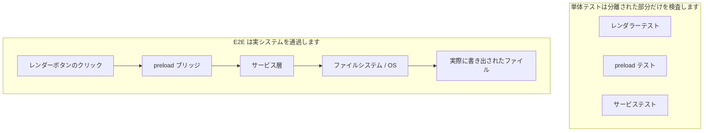
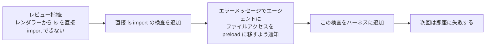

[英語版 →](../../../en/lectures/lecture-10-why-end-to-end-testing-changes-results/)

> この講義のコード例: [code/](https://github.com/walkinglabs/learn-harness-engineering/blob/main/docs/en/lectures/lecture-10-why-end-to-end-testing-changes-results/code/)
> 実習プロジェクト: [Project 05. エージェントに自分の作業を自分で検証させる](./../../projects/project-05-grounded-qa-verification/index.md)

# 講義 10. エンドツーエンドテスト(end-to-end testing)は結果を変える

エージェントに Electron アプリへファイル書き出し機能を追加するよう依頼します。エージェントはレンダープロセスのコンポーネント、preload スクリプト、サービス層のロジックを書きます。各コンポーネントに対する単体テスト(unit test)はすべて通過します。エージェントは「完了しました」と宣言します。ところが、実際に書き出しボタンをクリックすると、ファイルパスの形式が間違っており、進捗バーは更新されず、大きなファイルを書き出すとメモリリークが発生します。5つのコンポーネント境界の欠陥があったのに、単体テストは1つも検出できなかったのです。

これは、合唱のリハーサルで各パートが個別に練習している間は完璧に聞こえるのに、合わせて歌うとソプラノがベースより半拍早く、伴奏が主旋律より半音低い、という状況に似ています。各パートは個別には「正しい」ものの、全体としてはずれてしまいます。

テスティングピラミッド(Testing Pyramid)は、まさにこのことを示しています。大量の単体テストが土台になりますが、そこで止まるとコンポーネント間の相互作用の問題を体系的に見逃してしまいます。AI コーディングエージェント(coding agent)にとって、この問題はさらに深刻です。エージェントは最速のテストだけを実行して完了を宣言しがちだからです。**エンドツーエンドテストは、単体テストや統合テストだけでは見えにくいシステムレベルの欠陥を表面化させます。ただし、どのテスト層も欠陥が存在しないことを証明するものではありません。**

## 単体テストの盲点

単体テストの設計思想は分離(isolation)です。依存関係をモック(mocking)し、テスト対象の単位だけに集中します。この考え方は単体テストを高速かつ精密にしますが、同時に体系的な盲点も生みます。合唱のリハーサルで各パートがヘッドホンを付けて練習するようなものです。自分には問題なく聞こえても、全員が集まったときに初めて問題が見えます。

**インターフェース不一致**: レンダープロセスが preload スクリプトに渡すファイルパスは相対パスですが、preload スクリプトは絶対パスを期待しています。それぞれの単体テストはすべてモックを使っていたため通過しました。エンドツーエンドの流れが動いて初めて問題が発見されます。まるで2つのパートがそれぞれ練習して「問題ない」と思っていたのに、アンサンブルでは片方が4/4拍子、もう片方が3/4拍子で歌っていると分かるようなものです。

**状態伝播エラー(State Propagation Errors)**: データベースのマイグレーションでテーブルスキーマが変更されたのに、ORM のキャッシュ層がまだ古いスキーマのキャッシュ項目を保持しています。単体テストは毎回まったく新しいモック環境を用意するため、こうした層をまたぐ状態の不一致を露呈しません。歌詞を変えたのに、誰かがまだ前の版で歌っているようなものです。

**リソースのライフサイクル問題**: ファイルハンドル、データベース接続、ネットワークソケットの取得と解放は、複数のコンポーネントにまたがります。単体テストは各テストのために独立したリソースを生成・破棄するため、リソース競合やリークを明らかにできません。リハーサルでは各パートが順番にマイクを使えても、本番で全員が同時に舞台に上がるとマイクが足りなくなるのと同じです。

**環境依存性**: コードはテスト環境(すべてがモックされている環境)では正しく動くのに、設定差分、ネットワーク遅延、またはサービスの利用不可によって実環境では失敗します。リハーサル室では完璧に歌えていたのに、野外フェスで音のフィードバックと風の干渉に遭うようなものです。

## エンドツーエンドテストは結果だけでなく行動も変える

多くの人が見落としていることがあります。エージェントが自分の仕事にエンドツーエンドテストが課されると分かった瞬間、コーディングの振る舞いが変わるのです。

1. **コンポーネント相互作用を考慮する**: コードを書きながら「このインターフェースは upstream とどうつながるのか」を考えるようになります。単一の関数だけに集中しません。やがて一緒に歌うことになると分かっているので、練習中から他のパートの音を聴くようなものです。
2. **アーキテクチャ境界を守る**: アーキテクチャ制約のあるシステムでは、エンドツーエンドテストがエージェントに境界ルールの遵守を強います。譜面に「ここで crescendo」と書かれていれば、従うしかないのと同じです。
3. **エラー経路を扱う**: エンドツーエンドテストには通常、失敗シナリオが含まれるため、エージェントは例外処理を考えるようになります。リハーサル中に「マイクが急に切れたらどうするか」をシミュレートすることで、本番でどう対処するかを学ぶようなものです。

## テスティングピラミッドとレビュー指摘の昇格





Codex のエンジニアリング実践で OpenAI は次の点を強調しています。**エージェント向けに書くエラーメッセージには、修正の指示を含めるべきです。** `"レンダラーからの直接のファイルシステムアクセス"` とだけ書くのではなく、`"レンダラーからの直接のファイルシステムアクセス。すべてのファイル操作は preload ブリッジ経由で行う必要があります。この呼び出しを preload/file-ops.ts に移し、window.api を通して呼び出してください。"` と書くべきです。これによって、アーキテクチャ規則が自動修正ループになります。指揮者がただ「そこは違う」と言うのではなく、「ここは半拍早い。アルトのリズムを聴いて、32小節目で入って」と伝えるようなものです。

## 基本概念

- **コンポーネント境界の欠陥(Component Boundary Defects)**: コンポーネント A と B がそれぞれの単体テストには通るのに、相互作用が誤った動作を生みます。これはエンドツーエンドテストが最もよく検出する問題です。個別には正しいのに、合わせるとずれる合唱パートのようなものです。
- **テスト妥当性の組み合わせ(Testing Adequacy Mix)**: 単体テスト、統合テスト、エンドツーエンドテストは、それぞれ異なる欠陥を見つけやすい層です。層が上がるほど実システムに近い振る舞いを確認できますが、下位のテストを置き換えるものではありません。
- **アーキテクチャ境界の強制ルール(Architectural Boundary Enforcement Rules)**: アーキテクチャ文書のルール(例: "レンダープロセスはファイルシステムに直接アクセスできない") を実行可能な自動化チェックに変換します。つまり、「文書に書いてある」から「CI で実行される」へです。
- **レビュー指摘の昇格(Review Feedback Promotion)**: 繰り返し出るコードレビューコメントを自動化されたテストへ変換します。繰り返し問題が見つかるたびにルールを追加すれば、ハーネス(harness)は自動的に強化されます。指揮者がよくあるリハーサルのミスをウォームアップ練習に変えるようなもので、次に同じミスが起きたときは、練習そのものが指揮者の一言を待たずに問題を示します。
- **エージェント指向のエラーメッセージ(Agent-Oriented Error Messages)**: 失敗メッセージは単に「何が悪いか」を示すだけでなく、エージェントにどう直すかまで正確に伝えるべきです。これがテスト失敗を自己修正フィードバックループに変えます。

## どう進めるか

### 0. まずアーキテクチャ境界を定義し、その後で E2E テストを書く

エンドツーエンドテストの前提は、明確なシステム境界です。アーキテクチャがスパゲッティの山のようなら、エンドツーエンドテストは単に「このスパゲッティは動く」ことを証明するだけで、どこで設計意図が破られているのかは教えてくれません。合唱でパート分けすらされていない状態のようなもので、どれだけリハーサルしても改善しません。

OpenAI の経験では、**エージェントが生成するコードベースでは、アーキテクチャ制約はチームが大きくなってから考える事項ではなく、1日目に確立すべき初期前提条件です。** 理由は単純で、エージェントはリポジトリ内の既存パターンをコピーする傾向があり、そのパターンがばらついていても、あるいは最適でなくても同じだからです。アーキテクチャ制約がなければ、エージェントはセッションごとにさらに多くのばらつきを持ち込みます。

OpenAI は "Layered Domain Architecture" を採用しています。各ビジネスドメインは固定の階層に分かれます: Types → Config → Repo → Service → Runtime → UI。依存関係は厳密に前方へだけ流れ、ドメイン間の関心事は明示的な Provider インターフェースを通じて入ってきます。それ以外の依存関係は禁止され、カスタム linting によって機械的に強制されます。

中心原則は、**不変条件は強制するが、実装の細部までは管理しない** です。たとえば、「データは境界でパースされるべき」とは要求しても、どのライブラリを使うかまでは指示しません。エラーメッセージには修正指示を含めるべきです。単に「違反」と言うのではなく、エージェントにどう変更すべきかを正確に伝えます。

> 出典: [OpenAI: Harness engineering: leveraging Codex in an agent-first world](https://openai.com/index/harness-engineering/)

### 1. ハーネスには必ずエンドツーエンド層を含める

検証フローの中で明示してください。コンポーネント間の変更を含む作業では、エンドツーエンドテストを通すことが完了の前提条件です。

```
## 検証レイヤー構成
- レベル 1: 単体テスト (必須通過)
- レベル 2: 統合テスト (必須通過)
- レベル 3: エンドツーエンドテスト (クロスコンポーネント変更時は必須通過)
- 必須レベルのスキップ = 完了ではない
```

### 2. アーキテクチャルールを実行可能なチェックへ変換する

すべてのアーキテクチャ制約には、対応するテストまたは lint ルールが必要です。

```bash
# レンダープロセスが Node.js API を直接呼んでいないか確認する
grep -r "require('fs')" src/renderer/ && exit 1 || echo "OK: no direct fs access in renderer"
```

### 3. エージェント指向のエラーメッセージを設計する

失敗メッセージには3つの要素を含めます。何が悪いのか、なぜなのか、どう直すのか。

```
ERROR: Found direct import of 'fs' in src/renderer/App.tsx:12
WHY: Renderer process has no access to Node.js APIs for security
FIX: Move file operations to src/preload/file-ops.ts and call via window.api.readFile()
```

### 4. レビュー指摘の昇格プロセスを確立する

コードレビューで新しい種類のエージェントのミスが見つかるたびに、それを自動化されたチェックへ変換してください。1か月後には、ハーネスは1か月前より大幅に強化されているはずです。合唱のリハーサルノートのようなものです。各リハーサルで見つかった問題を書き留めておけば、次のリハーサルの前に確認できます。時間がたつほど、よくあるミスは減り、音楽はより調和します。

## 実例

**作業**: Electron アプリにファイル書き出し機能を実装する。レンダープロセス UI、preload スクリプトのファイルシステムプロキシ、サービス層のデータ変換を含みます。

**各パートを個別に練習(単体テスト通過)**: レンダーコンポーネントテスト(通過、ファイル操作はモック)、preload スクリプトテスト(通過、ファイルシステムはモック)、サービス層テスト(通過、データソースはモック)。エージェントは完了を宣言します。

**合わせて歌う(エンドツーエンドテストで判明した欠陥)**:

| 欠陥 | 説明 | 単体テスト | E2E |
|------|------|-----------|-----|
| インターフェース不一致 | ファイルパスの形式が一致しない | 見逃し | 検出 |
| 状態伝播 | エクスポート進捗が IPC 経由で UI に伝わらない | 見逃し | 検出 |
| リソースリーク | 大きなファイルの書き出しでハンドルが解放されない | 見逃し | 検出 |
| 権限問題 | パッケージ化環境で権限差がある | 見逃し | 検出 |
| エラー伝播 | サービス層の例外が UI 層まで届かない | 見逃し | 検出 |

5つの欠陥はすべてエンドツーエンドテストで検出され、単体テストは1つも見つけられませんでした。追加コストはテスト時間が2秒から15秒に増えたことだけでした。エージェントのワークフローでは十分に許容できます。各パートが個別にどれだけうまく歌えても、全体のアンサンブルリハーサルには勝てません。

## 要点

- **単体テストはコンポーネント境界の欠陥に体系的に盲目です**。分離という設計自体が、相互作用の問題を検出できなくします。全員が正しく歌っていても、合唱はずれることがあります。
- **エンドツーエンドテストは欠陥を検出するだけでなく、エージェントのコーディング行動も変えます**。統合と境界により注意を向けさせます。
- **アーキテクチャルールは実行可能であるべきです**。読まれるのを待つ文書に書くのではなく、すべてのコミットで自動検査されるべきです。
- **エラーメッセージはエージェント向けに設計されるべきです**。どう修正するかという具体的な手順を含め、自己修正ループを形成しなければなりません。
- **レビュー指摘の昇格がハーネスを自動的に強化します**。検出された欠陥の各カテゴリが恒久的な防御線になります。

## さらに読む

- [How Google Tests Software - Whittaker et al.](https://www.goodreads.com/book/show/13563030-how-google-tests-software) — テスティングピラミッドモデルの古典的な出典
- [Harness Engineering - OpenAI](https://openai.com/index/harness-engineering/) — アーキテクチャ制約を自動的に実行するためのエンジニアリング実践
- [Chaos Engineering - Netflix (Basiri et al.)](https://ieeexplore.ieee.org/document/7466237) — システムの復元力を検証するための能動的な障害注入
- [QuickCheck - Claessen & Hughes](https://www.cs.tufts.edu/~nr/cs257/archive/john-hughes/quick.pdf) — 例示テストと形式検証の間に位置するプロパティベーステストの手法

## 練習問題

1. **クロスコンポーネント欠陥の検出**: 最低3つのコンポーネントが関与する修正作業を選んでください。まず単体テストだけを実行して結果を記録し、その後エンドツーエンドテストを実行します。追加で見つかった各欠陥が、どの種類の層間相互作用の問題に当たるかを分析してください。

2. **アーキテクチャルールの自動化**: プロジェクト内のアーキテクチャ制約を1つ選び、実行可能なチェック(エージェント指向のエラーメッセージを含む)へ変換してください。ハーネスに組み込み、基準タスクで効果を検証してください。

3. **レビュー指摘の昇格**: コードレビュー履歴から繰り返し出るコメントの種類を見つけ、5段階のプロセスを使って自動化されたチェックへ変換してください。昇格の前後で、その問題の頻度を比較してください。
