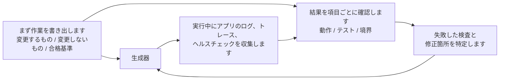

[英語版 →](../../../en/lectures/lecture-11-why-observability-belongs-inside-the-harness/)

> コード例: [code/](https://github.com/walkinglabs/learn-harness-engineering/blob/main/docs/en/lectures/lecture-11-why-observability-belongs-inside-the-harness/code/)
> 実習プロジェクト: [Project 06. 完全なハーネス (Capstone)](./../../projects/project-06-runtime-observability-and-debugging/index.md)

# 講義 11. エージェントのランタイムを観測可能にする

## この講義が解決する問題

エージェントに機能の実装を依頼します。20分ほど実行し、複数のファイルを変更したあとで、「完了しましたが、2つのテストが失敗しています」と報告してきます。なぜ失敗しているのか尋ねると、「よくわかりません。タイミングの問題かもしれません」と返ってきます。どの重要な経路を変更したのか尋ねると、「コードを見直します...」と言います。

これはエージェントの能力不足ではありません。ハーネスが十分な観測可能性（observability）を備えていないのです。**観測可能性がなければ、エージェントは不確実なまま判断し、評価は主観的になり、再試行は盲目的な探索になります。** OpenAI と Anthropic はどちらも、信頼性を証拠の問題として捉えています。ハーネスは、ランタイムの振る舞いと評価シグナルを、次の判断に使える形で露出させなければなりません。

## コア概念

- **ランタイム観測可能性（Runtime observability）**: ログ、トレース（trace）、プロセスイベント、ヘルスチェックなど、システムレベルのシグナルです。「システムが何をしたか」に答えます。分散システムのリクエストトレーシングと同じように、エージェントの各動作を文脈付きで記録します。
- **プロセス観測可能性（Process observability）**: 計画、採点ルーブリック（rubric）、受け入れ基準など、ハーネスの意思決定成果物に対する可視性です。「なぜこの変更を受け入れるべきか」に答えます。
- **タスクトレース（Task trace）**: タスク開始から完了までの完全な意思決定経路の記録です。分散システムのリクエストトレーシングと同じように、エージェントがたどるすべてのステップを文脈付きで記録します。
- **スプリント契約（Sprint contract）**: コーディングを始める前に交わす短期の合意です。作業範囲、検証基準、除外事項を明示します。プロセス観測可能性を支える重要な手段です。
- **評価者ルーブリック（Evaluator rubric）**: 品質評価を主観的な判断から、証拠に基づく構造化採点へ変換します。異なる評価者でも同じ出力に対して近い結果を出せるようにします。
- **階層化された観測可能性（Layered observability）**: システム層とプロセス層の両方で観測可能性を設計し、互いを強化します。ランタイムシグナルは振る舞いを説明し、プロセス成果物は意図を説明します。

## 階層化された観測可能性



## なぜこれが起こるのか

### 観測可能性がない場合の実際のコスト

ハーネスに観測可能性がないと、4種類の問題が体系的に現れます。

**「正しい」と「正しそう」を区別できない**: コードレビューでは関数が完璧に見えます。構文は正しく、ロジックも堅牢そうです。しかしランタイムでは、エッジケース処理の不具合が特定の入力で誤った結果を生みます。実際の実行経路が期待から外れていたことは、ランタイムトレースでしか明らかになりません。

**評価が神秘主義になる**: 採点ルーブリックと受け入れ基準がなければ、評価者（人間でもエージェントでも）は暗黙の前提に依存します。同じ出力でも、評価者によってまったく異なる評価になることがあります。品質評価は再現できなくなります。

**再試行が盲目的な推測になる**: エージェントが失敗理由を知らなければ、再試行の方向はランダムになります。本当の根本原因を無視して、無関係なコード経路を修正しながら、見当違いの試行を繰り返すことがあります。盲目的な再試行は、どれもトークンと時間を消費します。

**セッション引き継ぎ（handoff）時の情報の断絶**: 未完了の作業が次のセッションへ引き継がれると、観測可能性がない場合、新しいセッションはシステム状態をゼロから診断し直す必要があります。Anthropic の公開事例でも、progress notes と git log を読ませ、起動時に基本動作を確認することで、前セッションからの状態把握を助けています。

### 実際の Claude Code シナリオ

「planner-generator-evaluator」の 3 役ワークフローを使うハーネスが、「アプリにダークモードを追加する」作業を実行している場面を想像してください。

**観測可能性がない場合**: プランナーは曖昧な説明を出します。ジェネレーターはその曖昧さに基づいてダークモードを実装しますが、プランナーの暗黙の期待には合いません。評価者は自分の暗黙の基準で却下しますが、何が問題なのか具体的には言えません。ジェネレーターは曖昧な却下理由を頼りに、盲目的な再試行を繰り返し、ようやく受け入れ可能な出力になります。

**完全な観測可能性がある場合**: プランナーがスプリント契約を出力します。修正するコンポーネント、各検証基準、除外事項（印刷スタイルの処理はしない）を列挙します。ジェネレーターは契約に従って実装します。ランタイム観測可能性が、各コンポーネントのスタイルの読み込みと適用の過程を記録します。評価者は採点ルーブリックを使って観点ごとに評価し、具体的な証拠を引用します。短い反復で高品質な結果を得やすくなります。

3 倍の効率差です。変わったのは観測可能性だけです。

### エージェントが自力では解決できない理由

「エージェント自身がログを出せばよいのでは？」と思うかもしれません。問題は次の通りです。

1. エージェントは自分が知らないことを知らないため、必要だと気づかないシグナルは自発的に記録しません。
2. ログ形式が一貫しません。異なるセッションが異なる形式を使うと、体系的な分析ができません。
3. プロセス観測可能性はログだけでは解決できません。スプリント契約と採点ルーブリックは、ハーネスレベルの支援が必要な構造化成果物です。

## 正しく行う方法

### 1. ランタイムシグナル収集をハーネスに組み込む

エージェント自身のログ出力に頼らないでください。ハーネスがこれらのシグナルを自動で収集する必要があります。

- **アプリケーションのライフサイクル**: 起動、準備完了、実行、終了の各段階の状態
- **機能経路の実行**: エントリポイント、チェックポイント、終了を含む重要経路の実行記録
- **データフロー**: コンポーネント間のデータの流れの記録
- **リソース使用**: 異常なリソース使用パターン（例: 伸び続けるメモリ）
- **エラーと例外**: エラーメッセージだけでなく、完全なエラーコンテキスト

### 2. スプリント契約を実装する

各タスクの開始前に、ジェネレーターと評価者（同じエージェントの別呼び出しでもよい）が契約に合意します。

```markdown
# スプリント契約: ダークモード対応

## 範囲
- テーマ切り替えコンポーネントの修正
- グローバル CSS 変数の更新
- ダークモードのテスト追加

## 検証基準
- 各コンポーネントの視覚回帰テストを通過
- 主要フローのエンドツーエンドテストを通過
- スタイルが当たっていないコンテンツのフラッシュ（FOUC）がない

## 除外事項
- 印刷スタイルは扱わない
- サードパーティコンポーネントのダークモード対応はしない
```

### 3. 評価者ルーブリックを定める

「良いか悪いか」を、定量化可能な採点に変換します。

```markdown
# 採点ルーブリック

| 観点 | A | B | C | D |
|------|---|---|---|---|
| コードの正確性 | すべてのテストが通過 | 主要フローが通過 | 一部通過 | ビルド失敗 |
| アーキテクチャ適合 | 完全に適合 | 軽微な逸脱 | 明確な逸脱 | 重大な違反 |
| テストカバレッジ | 主要 + エッジケース | 主要フローのみ | 骨組みのみ | テストなし |
```

### 4. OpenTelemetry で標準化する

各ハーネスセッションに対するトレース（trace）、各タスクに対するスパン（span）、各検証ステップに対する子スパンを生成してください。標準属性を使って主要情報に注釈を付けられます。これにより、観測可能性データを標準ツールチェーン（Jaeger、Zipkin）と統合できます。

## 実例

planner-generator-evaluator ワークフローを使うハーネスが、「ダークモード対応の追加」を実行します。

**観測不可能なバージョン**: 複数回の盲目的な再試行、なんとか受け入れ可能な出力。評価者は「なんとなく良くない」と言うものの、具体的に何が悪いのかは言えません。ジェネレーターは誤った方向にかなりの時間を浪費します。

**完全に観測可能なバージョン**:
- スプリント契約が範囲、基準、除外事項を明確化
- ランタイムトレースが各コンポーネントのスタイル読み込みプロセスを記録
- 採点ルーブリックが観点ごとの構造化評価を提供
- 具体的な証拠に沿って短い反復で高品質な結果を得やすい

3 倍の効率向上、より安定した品質、再現可能な評価です。

## 重要ポイント

- **観測可能性はハーネスアーキテクチャの属性です**。後付けの機能ではなく、設計時に考慮すべき中核能力です。
- **2 層の観測可能性がどちらも必要です**。ランタイムシグナルは「何が起きたか」を説明し、プロセス成果物は「なぜそうしたか」を説明します。
- **スプリント契約は事前の整合を行います**。生成者が構築したものを、評価者が予測可能な理由で即座に却下する事態を防ぎます。
- **採点ルーブリックは評価を再現可能にします**。異なる評価者が同じ出力に対して似た点数を付けられます。
- **観測可能性がないと、セッション冒頭の重複診断が増えます。**

## さらに読む

- [Observability Engineering - Charity Majors](https://www.honeycomb.io/blog/observability-engineering-book) — 現代の観測可能性エンジニアリングに関する理論と実践のフレームワーク
- [Dapper - Google (Sigelman et al.)](https://research.google/pubs/pub36356/) — 大規模分散トレーシングの先駆的な実践
- [Harness Design - Anthropic](https://www.anthropic.com/engineering/harness-design-long-running-apps) — スプリント契約と評価者ルーブリックの紹介
- [Site Reliability Engineering - Google](https://sre.google/sre-book/table-of-contents/) — 本番システムへの観測可能性の体系的な適用

## 演習問題

1. **観測可能性ギャップの分析**: 現在のハーネスにおけるシステム層とプロセス層の観測可能性を評価してください。既存のシグナルでは区別できないシステム状態を特定し、追加すべきものを提案してください。

2. **スプリント契約の演習**: 実際の作業に対するスプリント契約を書いてください。エージェントに契約に従って実行させ、契約の有無による効率と品質を比較してください。

3. **タスクトレースの構築**: 完全なコーディング作業の間、エージェントの作業のすべてのステップを記録します。OpenTelemetry のセマンティック規約に沿って注釈を付けることもできます。トレース内の情報ボトルネックを分析し、どのステップが判断に必要な十分なシグナルを欠いているかを特定してください。
