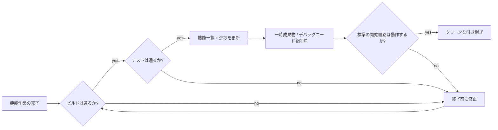
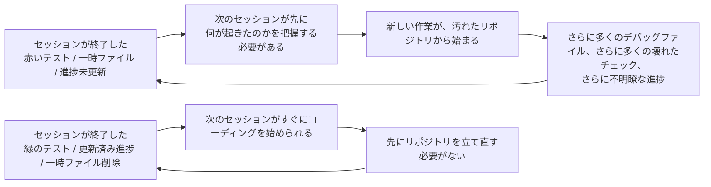

[英語版 →](../../../en/lectures/lecture-12-why-every-session-must-leave-a-clean-state/)

> コード例: [code/](https://github.com/walkinglabs/learn-harness-engineering/blob/main/docs/en/lectures/lecture-12-why-every-session-must-leave-a-clean-state/code/)
> 実習プロジェクト: [Project 06. 完全なハーネス (capstone)](./../../projects/project-06-runtime-observability-and-debugging/index.md)

# 講義 12. すべてのセッションはクリーンな状態(clean state)で終わらなければならない

## この講義が解決する問題

エージェントが午後いっぱい稼働し、20 個のファイルを変更し、コードをコミットして、セッションが終了します。次のエージェントセッションが始まると、すぐに問題が見えてきます。ビルドは壊れており、テストは赤く、一時的なデバッグファイルがあちこちに残り、機能一覧は更新されておらず、進捗状況もまったく分かりません。新しいセッションは、「前のセッションが実際に何をしたのか」を把握するだけで、最初の 30 分を費やします。

OpenAI と Anthropic はどちらも明確に述べています。**長期的な信頼性は、単発の実行成功ではなく、運用上の規律にかかっています。** セッション終了時点の状態の質が、次のセッションの効率を直接左右します。Git のベストプラクティスを思い浮かべてください。すべてのコミットは原子的で、コンパイル可能な変更でなければならず、中途半端なコードの寄せ集めであってはなりません。

## 核心概念

- **クリーン状態(Clean state)**: セッション終了時に、システムが 5 つの条件を満たしている状態です。ビルドが通り、テストが通り、進捗が記録され、古い成果物がなく、開始経路が使えること。どれか 1 つでも欠けていれば、そのセッションは「完了」していません。
- **セッションの整合性(Session integrity)**: データベースのトランザクションに似ています。完全にコミットしてクリーンな状態を残すか、最後の整合した状態へロールバックするかのどちらかです。中間はありません。
- **品質ドキュメント(Quality document)**: 各モジュールの品質ランクを継続的に記録する、動的な成果物です。一度きりの評価ではなく、コードベースが時間とともに強くなっているのか、弱くなっているのかを示すトラッカーです。
- **クリーンアップループ(Cleanup loop)**: コードベースのエントロピー(entropy)を体系的に下げるための定期メンテナンスセッションです。緊急修正ではなく、日常運用の一部です。
- **ハーネスの簡素化(Harness simplification)**: モデルの能力が向上するにつれて、もはや不要になったハーネス構成要素を定期的に取り除くことです。今日必要な制約が、3 か月後には不要なオーバーヘッドになっているかもしれません。
- **冪等なクリーンアップ(Idempotent cleanup)**: 何回実行しても同じ結果になる整理作業です。失敗と再試行のシナリオでも、安全にクリーンアップできることを保証します。

## クリーン状態の 5 つの側面





## なぜこうなるのか

### エントロピー増大がデフォルト状態である

ソフトウェア進化に関する Lehman の法則によれば、継続的に変更されるシステムは、積極的に管理しなければ複雑さが避けられず増加します。これは AI コーディングエージェントに特に当てはまります。毎セッション変更を導入し、終了時に整理しなければ、技術的負債は指数関数的に積み上がります。

この講義では、次のような想定例で差を考えます。

- 整理戦略なし: 週を追うごとにビルドとテストの失敗が増え、新しいセッションはまず状態復元に時間を使う。
- 整理戦略あり: 各セッションの終了時にビルド、テスト、進捗、成果物、起動経路を確認し、次のセッションがすぐ作業に入れる状態を保つ。

ここで重要なのは、特定の数値ではなく傾向です。クリーンな終了条件を持たないプロジェクトは、時間の経過とともに「作る時間」より「状態を戻す時間」が増えていきます。

### クリーン状態の 5 つの側面

クリーン状態は、単に「コードがコンパイルされる」ことではありません。以下の 5 つの側面をまとめて評価します。

**ビルドの側面**: コードはエラーなくビルドできるか。これが最も基本です。次のセッションがビルドエラーの修正から始めなければならない状態は避けるべきです。

**テストの側面**: すべてのテストが通るか。セッション以前から存在していたテストも含みます。セッションには、既存機能を壊さない責任があります。そして「自分の環境では動く」ではなく、CI で検証されていなければなりません。

**進捗の側面**: 現在の進捗が機械可読な成果物に記録されているか。合格基準付きで完了したサブタスク、現在の状態が記録された進行中だが未完了のサブタスク、まだ開始していないサブタスク。良い進捗記録は、セッション開始時の診断を減らします。

**成果物の側面**: 古い、あるいは曖昧な一時成果物はないか。デバッグログ、一時ファイル、コメントアウトされたコード、TODO マーカー。これらはすべて、次のセッションの認知負荷を上げます。

**開始の側面**: 標準の開始経路は使えるか。次のセッションが手動介入なしで作業を始められるか。環境初期化、コードベースの読み込み、コンテキスト取得、作業選択。これらの経路は壊れていてはいけません。

### 「あとで整理する」は、実質的に整理しないという意味だ

最もよくある心理的な落とし穴は、「今回は整理する時間がないから、次回やろう」です。しかし次のエージェントセッションは、あなたが残したものを知りません。コードの山と不確かな状態を見ます。そして、「このコードのどこが意図的で、どこが一時的なのか」を推測するのにかなりの時間を使います。

さらに悪いことに、すべてのセッションにはそれぞれの作業目標があります。新しいセッションは、前のセッションの混乱を片付けるためではなく、新しい作業をするために来ています。混乱を無視してその上に新しい作業を始め、さらにその上に別の混乱を重ねます。これがエントロピーの正のフィードバックループです。

## 正しく行う方法

### 1. クリーン状態を完了条件として定義する

ハーネスで明示的に定義してください。**セッション完了 = 作業の検証が通る AND クリーン状態のチェックが通る。** どちらか 1 つでも欠ければ、そのセッションは完了していません。CLAUDE.md に書きます。

```
## セッション終了チェックリスト
- [ ] ビルド通過 (npm run build)
- [ ] すべてのテスト通過 (npm test)
- [ ] 機能一覧が更新済み
- [ ] デバッグコードなし (console.log, debugger, TODO)
- [ ] 標準開始経路が使用可能 (npm run dev)
```

### 2. 二重モードのクリーンアップ戦略を組み合わせる

2 つのクリーンアップモードを組み合わせます。

**即時クリーンアップ（すべてのセッション終了時）**: セッション中に作られた一時成果物を片付け、機能一覧の状態を更新し、ビルドとテストが通ることを確認します。これは「参照カウント」型のクリーンアップです。

**定期クリーンアップ（週次）**: システム全体のスキャンを行い、蓄積した構造的問題を処理し、品質ドキュメントを更新し、ベンチマークテストを実行してドリフトを検出します。これは「トレース」型のクリーンアップです。

### 3. 品質ドキュメントを維持する

品質ドキュメントは、各モジュールを継続的に採点する動的な成果物です。

```markdown
# 品質ドキュメント

## ユーザー認証モジュール (品質: A)
- 検証通過: はい
- エージェントが理解可能: はい
- テストの安定性: 安定
- アーキテクチャ境界: 遵守
- コード規約: 適合

## 決済モジュール (品質: C)
- 検証通過: 一部 (決済コールバックが未テスト)
- エージェントが理解可能: 難しい (ロジックが 3 ファイルに分散)
- テストの安定性: 不安定 (2 件の不安定テスト)
- アーキテクチャ境界: 違反あり
- コード規約: 部分的に適合
```

新しいセッションはこのドキュメントを読めば、どこを優先すべきかすぐに分かります。最も点数の低いモジュールから修正します。

### 4. 定期的にハーネスを簡素化する

Anthropic の重要な洞察です。**すべてのハーネス構成要素は、モデルが何かを安定して自力でできないから存在しています。しかしモデルが向上するにつれて、その前提は古くなります。** 3 か月前には必須だった制約が、今日は不要なオーバーヘッドかもしれません。

推奨される実践: 毎月 1 つのハーネス構成要素を選び、一時的に無効化し、ベンチマーク作業を実行します。結果が低下しなければ、恒久的に削除します。低下した場合は、元に戻すか、より軽い代替手段に置き換えます。

### 5. クリーンアップ作業は冪等でなければならない

クリーンスクリプトは、繰り返し実行しても安全でなければなりません。

```bash
# 冪等なクリーンアップ作業
rm -f /tmp/debug-*.log  # -f はファイルがなくてもエラーにならないことを保証
git checkout -- .env.local  # 既知の状態へ復元
npm run test  # クリーンアップで何も壊れていないことを確認
```

## 実例

エージェントで継続開発した Electron アプリを想定し、2 つのアプローチを比較します。

**クリーンアップ戦略なし**（対照群）: セッション終了時に一時成果物、赤いテスト、曖昧な進捗メモが残ります。次のセッションは、まず何が意図的な変更で何が一時状態なのかを切り分ける必要があります。

**クリーンアップ戦略あり**（実験群）: すべてのセッション終了時に完全なクリーン状態チェックと定期的なクリーンアップループを走らせます。次のセッションは、標準の起動経路と進捗記録からそのまま作業を再開できます。

この例で見るべき点は、クリーンアップが美観の問題ではなく、次のセッションの立ち上がりと検証可能性を守るための完了条件だということです。

## 要点まとめ

- **クリーン状態は、セッション完了の必要条件です**。選択的な整理ではなく、「完了の定義」の一部です。
- **5 つの側面すべてが必要です**。ビルド、テスト、進捗、成果物、開始。それぞれを明示的に確認しなければなりません。
- **品質ドキュメントは、コードベースの健全性を追跡可能にします**。劣化していることを認識できて初めて、修正できます。
- **定期的にハーネスを簡素化しましょう**。モデルの能力が上がるにつれて、もはや不要な制約を取り除きます。
- **「あとで整理する」は、実質的に整理しないという意味です**。エントロピー増大がデフォルトであり、能動的なクリーンアップだけがそれを抑えられます。

## さらに読む

- [Clean Code - Robert C. Martin](https://www.goodreads.com/book/show/3735293-clean-code) — コードの清潔さに関する体系的な原則
- [Harness Engineering - OpenAI](https://openai.com/index/harness-engineering/) — コアなハーネス設計要件としての再現性
- [Effective Harnesses - Anthropic](https://www.anthropic.com/engineering/effective-harnesses-for-long-running-agents) — 長期的な信頼性のためにクリーンなセッション終了が果たす重要な役割
- [Programs, Life Cycles, and Laws of Software Evolution - Lehman](https://ieeexplore.ieee.org/document/1702314) — 能動的な保守なしにはシステムの複雑さが避けられず増加することを示すソフトウェア進化の法則

## 練習問題

1. **クリーン状態チェックリスト**: 5 つの側面すべてを含む、コードベース向けのセッション終了チェックリストを設計してください。連続 5 セッションに適用し、側面ごとの違反を記録してください。

2. **ベンチマーク比較**: 2 種類のハーネス変種（クリーン状態要件あり / なし）で、固定された作業セットを使ってください。完了率、再試行回数、欠陥流出率を比較してください。

3. **ハーネス簡素化の演習**: 1 つのハーネス構成要素を選び、一時的に無効化して、ベンチマーク作業を実行してください。ある場合とない場合の結果を比較してください。維持するか、削除するか、置き換えるかを決定してください。
