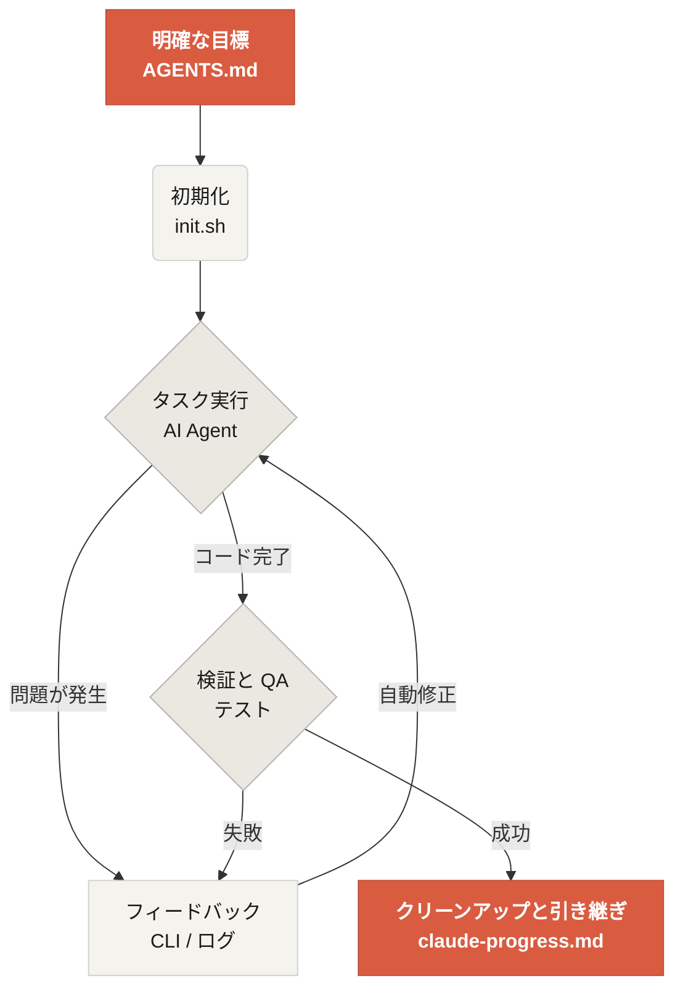

# Learn Harness Engineering へようこそ

Learn Harness Engineering は、コーディング向け AI エージェントのためのハーネス工学を学ぶコースです。業界で最も先進的な Harness Engineering の理論と実践を深く調査し、整理しています。主な参照元は次のとおりです。
- [OpenAI: Harness engineering: leveraging Codex in an agent-first world](https://openai.com/index/harness-engineering/)
- [Anthropic: Effective harnesses for long-running agents](https://www.anthropic.com/engineering/effective-harnesses-for-long-running-agents)
- [Anthropic: Harness design for long-running application development](https://www.anthropic.com/engineering/harness-design-long-running-apps)
- [Awesome Harness Engineering](https://github.com/walkinglabs/awesome-harness-engineering)

環境のシステム設計、状態管理、検証、制御を通じて、Codex や Claude Code のようなエージェント向けツールを本当に信頼できるものにする方法を学びます。明示的なルールと境界で AI アシスタントを制約しながら、機能の実装、バグ修正、開発作業の自動化を進められるようになります。

## はじめ方

学習の進め方を選んでください。コースは、理論講義、実践プロジェクト、そしてそのままコピーして使える資料集に分かれています。

  <a href="./lectures/lecture-01-why-capable-agents-still-fail/" class="card">
    <h3>講義</h3>
    
強力なモデルでも失敗する理由を理解し、効果的な harness の理論を学びます。

  </a>
  <a href="./projects/" class="card">
    <h3>プロジェクト</h3>
    
信頼できるエージェント環境をゼロから実践的に構築します。

  </a>
  <a href="./resources/" class="card">
    <h3>資料ライブラリ</h3>
    
自分のリポジトリで使える完成済みテンプレート（AGENTS.md、feature_list.json）を用意しています。

  </a>

## harness の基本メカニズム

Harness は「モデルを賢くする」ものではありません。モデルのための閉じた **作業システム** を作ります。基本的なワークフローは、次のシンプルな図で理解できます。

## 学べること

身につける主要な概念は次のとおりです。

<ul class="index-list">
  <li><strong>エージェントの振る舞いを制約する</strong>ための明示的なルールと境界。</li>
  <li><strong>コンテキストを保持する</strong>ための、セッションをまたぐ長時間タスクの扱い。</li>
  <li><strong>エージェントに</strong>成功を早まって宣言させないための工夫。</li>
  <li><strong>作業を検証する</strong>ためのエンドツーエンドテストと自己反省。</li>
  <li><strong>runtime を可観測にする</strong>ための仕組み。</li>
</ul>

## 次のステップ

基礎を理解したら、次の資料でさらに深く学べます。

<ul class="index-list">
  <li><a href="./lectures/lecture-01-why-capable-agents-still-fail/">講義 01: なぜ強力なエージェントでも失敗するのか</a>: harness engineering の理論から始めてください。</li>
  <li><a href="./projects/project-01-baseline-vs-minimal-harness/">プロジェクト 01: ベースラインと最小構成の harness</a>: 最初の実践課題に取り組みます。</li>
  <li><a href="./resources/templates/">テンプレート</a>: 自分のプロジェクトで使える最小セット（AGENTS.md、feature_list.json、claude-progress.md）を活用してください。</li>
</ul>
