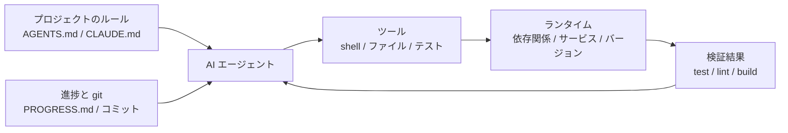

[中国語版 →](../../../zh/lectures/lecture-02-what-a-harness-actually-is/)

> コード例: [code/](https://github.com/walkinglabs/learn-harness-engineering/blob/main/docs/en/lectures/lecture-02-what-a-harness-actually-is/code/)
> 実践プロジェクト: [Project 01. Prompt-only vs. rules-first](./../../projects/project-01-baseline-vs-minimal-harness/index.md)

# 講義 02. harness とは実際には何を指すのか

「harness」という言葉は AI コーディングエージェントの文脈でよく使われますが、実際には、多くの人が「プロンプトを書いたファイル」程度の意味で使っています。それは harness ではありません。たとえるなら、調理器具も包丁もレシピも配膳手順もないのに、食材だけを並べて「これはレストランだ」と言っているようなものです。レストランではなく、ただの冷蔵庫です。

この講義では、harness の正確で実用的な定義を学びます。学術的な抽象論ではなく、今日から使えるフレームワークです。harness は 5 つのサブシステムで構成され、それぞれに明確な責務と評価基準があります。

## まずはたとえ話から

新しく採用されたエンジニアとして、ドキュメントのないプロジェクトに放り込まれた場面を想像してください。README はなく、コードコメントもなく、テストの実行方法も誰も教えてくれず、CI の設定はどこか奥深くに埋もれています。そんな状況でも、良いコードを書けるでしょうか。たぶん可能です。十分に賢くて、忍耐強ければ。ただし、時間の大半は「このプロジェクトは何なのか」を解き明かすことに消え、本来解くべき課題には使われません。

AI エージェントも、まったく同じ状況に置かれます。しかも条件はさらに厳しいです。あなたなら同僚に聞けますが、エージェントが見られるのは、あなたが渡したファイルと実行できるコマンドだけです。誰かの肩をたたいて「この ORM は何バージョンですか」と聞くこともできません。

OpenAI はこの中心原則を「the repo IS the spec」と表現しています。必要なコンテキストはすべてリポジトリ内に置き、構造化された指示ファイル、明示的な検証コマンド、分かりやすいディレクトリ構成を通じて伝えるべきだ、という考え方です。Anthropic の長時間稼働するエージェントに関するドキュメントでは、状態の永続性、明確な復帰経路、構造化された進捗管理が重視されています。両社は別々の側面を見ていますが、言っていることは同じです。**モデルの外側にあるエンジニアリング基盤のすべてが、モデルの能力のうち実際にどの部分が発揮されるかを決める**のです。

身近なツールを見てみましょう。

**Claude Code** は harness 思考を体現しています。リポジトリから `CLAUDE.md` を読み込みます（レシピ棚）。shell コマンドを実行できます（包丁置き場）。ローカル環境で動作します（調理台）。セッション履歴を保持します（下ごしらえ用の作業台）。さらに、テストを実行して結果を確認できます（品質確認の窓口）。ただし、テストの実行方法が明記されていなければ、その品質確認の窓口は壊れているのと同じです。料理ができたのか、誰にも分かりません。

**Cursor** も同じ発想です。`.cursorrules` はレシピ棚、ターミナルは包丁置き場、プロジェクト構造やリンターの設定は調理台に相当します。ただし、Cursor の状態管理は比較的弱く、IDE を閉じて開き直すと、それまでのコンテキストは失われます。

**Codex**（OpenAI のコーディングエージェント）は、各タスクのランタイム環境を分離するために git worktree を使い、さらにローカルの observability スタック（ログ、メトリクス、トレース）を組み合わせています。これにより、各変更を独立した環境で検証できます。`AGENTS.md` と分かりやすい検証コマンドがあるリポジトリは、何も整っていないリポジトリよりずっとよく動きます。

**AutoGPT** は分かりやすい反面教師です。構造化された状態管理がないと、長いタスクではコンテキストがどんどん積み上がり、厳密なフィードバック機構がないと、エージェントは同じ場所をぐるぐる回るだけになります。AutoGPT は「動かない」と言われがちですが、実際には AutoGPT の harness が動いていないのです。調理台が壊れていれば、どれだけ良い食材があっても料理はできません。

## 重要な概念

- **harness とは何か**: モデルの重み以外にある、すべてのエンジニアリング基盤です。OpenAI はエンジニアの主な仕事を、環境設計、意図の表現、フィードバックループの構築の 3 つに要約しています。Anthropic は Claude Agent SDK を「エージェント向けの汎用 harness」と呼んでいます。
- **リポジトリが唯一の正**: エージェントから見えないものは、実務上は存在しないのと同じです。OpenAI はリポジトリを「system of record」とみなし、必要なコンテキストは構造化されたファイルと分かりやすいディレクトリ構成を通じてそこに置くべきだとしています。
- **教科書ではなく地図を渡す**: OpenAI の経験では、`AGENTS.md` は百科事典ではなく目次であるべきです。100 行前後で十分です。収まりきらない内容は `docs/` ディレクトリに分け、必要に応じてエージェントに読ませてください。
- **マイクロマネジメントではなく制約を与える**: よい harness は、エージェントに命令を一つずつ並べるのではなく、実行可能なルールで制約します。OpenAI は「実装を細かく指示するのではなく、不変条件を強制せよ」と述べています。Anthropic は、エージェントが自分の作業を過剰に褒める傾向を見つけたため、「作業する役」と「検証する役」を分けることを解決策にしました。
- **部品は 1 つずつ外して測る**: harness の各部品の価値を測るには、1 つずつ取り外して、どの削除が最も性能を落とすかを確認します。Anthropic は実際にその方法を取り、モデルが強くなるにつれて重要でなくなる部品もある一方で、常に新しいボトルネックが生まれることを見つけました。

## 5 つのサブシステムからなる harness モデル

厨房のたとえに戻りましょう。まともな厨房には 5 つの機能領域があります。harness も同じく 5 つのサブシステムで成り立ちます。



**指示サブシステム（レシピ棚）**: `AGENTS.md`（または `CLAUDE.md`）を用意し、プロジェクトの概要と目的を 1 文で示し、スタックとバージョン（Python 3.11、FastAPI 0.100+、PostgreSQL 15）、初回実行コマンド（`make setup`、`make test`）、譲れない厳格な制約（「すべての API は OAuth 2.0 を使うこと」）、さらに詳しいドキュメントへのリンクを記載してください。

**ツールサブシステム（包丁置き場）**: エージェントに十分なツール権限があることを確認してください。安全性を理由に shell を無効化しないでください。`pip install` すら実行できないなら、どうやって作業するのでしょうか。ただし、何でも開放するのも駄目です。最小権限の原則に従ってください。

**環境サブシステム（調理台）**: 環境状態を自己記述的にしてください。`pyproject.toml` や `package.json` で依存関係を固定し、`.nvmrc` や `.python-version` でランタイムのバージョンを固定し、Docker や devcontainer で再現性を確保します。

**状態サブシステム（下ごしらえ用の作業台）**: 長いタスクには進捗管理が必要です。`PROGRESS.md` のような簡単なファイルを用意し、何を終えたか、何を進行中か、何がブロックされているかを記録してください。各セッションの終わりに更新し、次のセッションの始めに読みます。

**フィードバックサブシステム（品質確認の窓口）**: これが最も ROI の高いサブシステムです。`AGENTS.md` には検証コマンドを明示的に書いてください。
```
検証コマンド:
- テスト: pytest tests/ -x
- 型チェック: mypy src/ --strict
- リント: ruff check src/
- 完全な検証: make check（上記すべてを含む）
```

どれか 1 つでも欠けると、厨房の機能領域が 1 つ足りないのと同じです。料理はできても、ずっと不便になります。

**harness の品質診断**: 「モデルの等容制御」を使ってください。モデルは固定したまま、サブシステムを 1 つずつ取り外し、どの削除が性能を最も落とすかを測ります。それがボトルネックです。そこに力を集中させます。厨房でボトルネックを探すのと同じです。レシピ棚を外して、どれだけ遅くなるかを見る。調理台を止めて、その影響を測る。

## あるチームの実話

あるチームは、TypeScript + React のフロントエンド（約 20,000 行）で GPT-4o を使っていました。彼らは 4 つの段階を経て、厨房設備を 1 台ずつ増やすように改善していきました。

**段階 1 - 空の厨房**: README に基本的なプロジェクト説明があるだけでした。5 回の実行のうち成功は 1 回（20%）でした。主な失敗は、パッケージマネージャーの選択ミス（npm か yarn か）、コンポーネント命名規則の不一致、テストを実行できないことでした。

**段階 2 - レシピ棚を設置**: スタックのバージョン、命名規則、主要なアーキテクチャ判断を含む `AGENTS.md` を追加しました。成功率は 60% に上がりました。残った失敗の主因は、環境の問題と検証不足でした。

**段階 3 - 品質確認の窓を開けた**: `AGENTS.md` に検証コマンドを列挙しました。`yarn test && yarn lint && yarn build` です。成功率は 80% に上がりました。

**段階 4 - 下ごしらえ用の作業台を整備**: 各実行で、エージェントが終えたことと残っていることを記録する進捗ファイルのテンプレートを導入しました。成功率は 80〜100% で安定しました。

4 回の反復で、モデル自体は一切変えていません。それでも成功率は 20% からほぼ 100% まで上がりました。これが harness engineering の力です。より高価な食材を買ったわけではありません。厨房を整えただけです。

## 要点

- Harness = 指示 + ツール + 環境 + 状態 + フィードバック。5 つのサブシステムがあり、厨房の 5 つの機能領域と同じく、どれも欠かせません。
- モデルの重み以外はすべて harness です。harness が、モデル能力のうちどれだけが実際に使えるかを決めます。
- 5 つのサブシステムの中では、通常、フィードバックサブシステムが最も初期投資が少なく、見返りが大きいです。まず検証コマンドを整備し、品質確認の窓口を最優先で改善してください。
- 各サブシステムの寄与を定量評価するには、「モデルの等容制御」を使ってください。感覚ではなく、数値で測るのです。
- harness もコードと同じように劣化します。定期的に見直し、harness 負債を技術的負債と同じように返済してください。

## さらに読む

- [OpenAI: Harness Engineering](https://openai.com/index/harness-engineering/)
- [Anthropic: Effective Harnesses for Long-Running Agents](https://www.anthropic.com/engineering/effective-harnesses-for-long-running-agents)
- [HumanLayer: Harness Engineering for Coding Agents](https://humanlayer.dev/articles/harness-engineering-for-coding-agents/)
- [SWE-agent: Agent-Computer Interfaces](https://github.com/princeton-nlp/SWE-agent)
- [Thoughtworks: Harness Engineering on Technology Radar](https://www.thoughtworks.com/radar)

## 演習

1. **5 つで harness を監査する**: AI エージェントを使っているプロジェクトを 1 つ取り上げ、5 つのコンポーネントからなるフレームワークで完全に監査してください。各サブシステムを 1〜5 で評価します。最も低い評価のサブシステムを見つけ、30 分かけて改善し、エージェントの挙動がどう変わるか観察してください。

2. **モデルの等容制御を使った実験**: 1 つのモデルと 1 つの難しい課題を選びます。指示を順に取り除き（`AGENTS.md` を削除する）、フィードバックを取り除き（検証コマンドを与えない）、状態を取り除き（進捗ファイルを使わない）、毎回 1 つだけ外して性能低下を測ってください。その結果をもとに、あなたのプロジェクトにおけるサブシステムの重要度を順位付けします。

3. **affordance の分析**: プロジェクトの中で、エージェントが「やりたいのにできない」場面を 1 つ見つけてください（たとえば、パラメータ化クエリが必要だと分かっていても、あなたのプロジェクトでの ORM パターンを知らない場合など）。それが Gulf of Execution（どうやるか分からない）の問題か、Gulf of Evaluation（正しくできたか分からない）の問題かを整理してください。次に、そのギャップを埋めるための harness 改善を設計してください。
