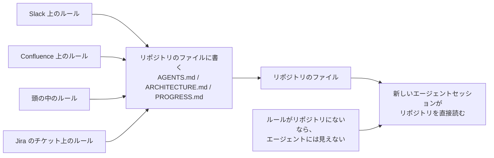
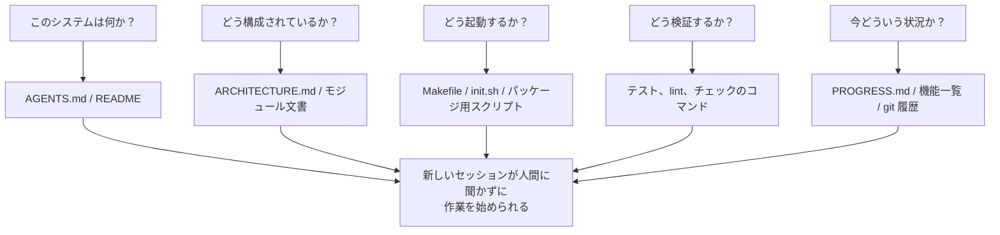

[中国語版 →](../../../zh/lectures/lecture-03-why-the-repository-must-become-the-system-of-record/)

> コード例: [code/](https://github.com/walkinglabs/learn-harness-engineering/blob/main/docs/en/lectures/lecture-03-why-the-repository-must-become-the-system-of-record/code/)
> 実践プロジェクト: [Project 02. Agent-readable workspace](./../../projects/project-02-agent-readable-workspace/index.md)

# 講義 03. リポジトリを唯一の信頼できる情報源にする

チームのアーキテクチャ判断は、Confluence、Slack、Jira、そして数人のシニアの頭の中に散らばっています。人間なら、なんとかやりくりできます。同僚に聞く、チャットを探す、ドキュメントを掘る。最悪の場合は、喫煙所で誰かをつかまえることもできるでしょう。ですが、リポジトリにない情報は、AI エージェントにとっては存在しないのと同じです。

これは大げさな話ではありません。エージェントへの入力が何かを考えてみてください。システムプロンプトとタスク説明、リポジトリ内のファイル内容、ツールの出力。それだけです。Slack の履歴、Jira のチケット、Confluence のページ、そして金曜の午後に同僚とコーヒーを飲みながら話したアーキテクチャの決定を、エージェントは一切見られません。「聞きに行く」ことも「チャットを探す」こともできません。リポジトリの中に閉じ込められたエンジニアであり、外に何があるかは知りようがないのです。

では、問いはこうなります。このエンジニアに、きちんとした地図を渡せていますか。

## 地図に何を載せるべきか

OpenAI ははっきり述べています。**リポジトリにない情報は、エージェントにとって存在しない。** 彼らはこれを「repo as spec」の原則と呼んでいます。つまり、リポジトリそのものが最上位の仕様書なのです。

Anthropic の長時間稼働エージェント向けドキュメントも同じことを述べています。永続的な状態は、長いタスクを続けるための必須条件です。セッションをまたいで知識を復元できるかどうかが、タスクの成功率を直接左右します。そして、その状態はリポジトリに置くべきです。なぜなら、それがエージェントにとって唯一安定してアクセスできる保管場所だからです。

「うちは小さなチームだし、知識は頭の中にあるから問題ない」と思うかもしれません。人間にとってはそうかもしれません。ですが、エージェントを使うなら、その前提は捨ててください。エージェントは誰にも聞けません。必要なことはすべて書き出し、エージェントが見つけられる場所に置く必要があります。

これは「もっとドキュメントを書く」話ではありません。「意思決定に関する情報を、正しい場所に置く」話です。`ARCHITECTURE.md` が `src/api/` に 50 行あるほうが、誰も保守していない 500 ページの設計ドキュメントが Confluence にあるより、ずっと役に立ちます。これは、机に貼られた手描きのオフィス地図と、ロッカーにしまわれた美しい設計図の違いです。前者は必要なときにすぐ手元にあり、後者は技術的には優れていても、肝心の瞬間には役に立ちません。

## 知識の可視性



地図が十分かどうかは、どう確かめればよいのでしょうか。「コールドスタートテスト」を実行してください。まっさらなエージェントセッションを開き、リポジトリの内容だけを渡して、次の 5 つの基本質問に答えられるかを確認します。



答えられないなら、地図には空白があります。地図に空白がある場所では、エージェントは推測します。不正確な推測はバグになり、過剰な推測はコンテキストを食いつぶします。そして新しいセッションが始まるたびに、また同じ推測を繰り返します。推測にかかるコストは、地図を一度きちんと描くコストより、常に高くつきます。

## 重要な概念

- **Knowledge Visibility Gap**: プロジェクトに関する共通知識のうち、リポジトリに入っていない割合です。ギャップが大きいほど、エージェントの失敗率は高くなります。あなたの頭の中にある暗黙知はどれくらいありますか。全部洗い出し、どれだけがリポジトリに入っているかを見てください。その差が visibility gap です。
- **System of Record**: プロジェクトの決定、アーキテクチャ上の制約、実行状態、検証基準についての権威ある情報源としてのコードリポジトリです。リポジトリが最終決定権を持ち、それ以外は認めません。道路閉鎖と書かれた地図のようなものです。そこには行きません。そしてその情報が「老張」の頭の中にしかないなら、毎回その人のところへ聞きに行くしかありません。
- **Cold-Start Test**: 先ほどの 5 つの質問そのものです。どれだけ答えられるかが、あなたの地図の充実度です。
- **Discovery Cost**: エージェントがリポジトリ内で重要な情報を見つけるために消費するコンテキスト予算です。情報が深く隠れているほど検索コストは上がり、タスク本体に使える予算は減ります。重要な情報を 10 階層目の README に隠すのは、消火器を地下の金庫にしまうようなものです。存在はしていても、必要なときには取り出せません。
- **Knowledge Decay Rate**: 時間あたりに陳腐化する知識記録の割合です。コードと食い違うドキュメントは、ドキュメントがないことよりも厄介です。
- **ACID Analogy**: データベースのトランザクション原則（原子性、一貫性、分離性、永続性）を、エージェント状態の管理に当てはめたものです。後で詳しく見ていきます。

## よい地図の描き方

**原則 1: 知識はコードの近くに置く。** API エンドポイントの認証ルールは、巨大な全体文書の奥深くではなく、API のコードの近くに置くべきです。各モジュールのディレクトリに、そのモジュールの責務、インターフェース、特別な制約を短く書いた文書を置きましょう。図書館の棚札のようなものです。歴史の本が欲しければ、「歴史」の棚へ直接行けばよい。図書館全体を歩き回る必要はありません。

**原則 2: 標準化された入口ファイルを使う。** `AGENTS.md`（または `CLAUDE.md`）はエージェントの「ランディングページ」です。すべてを書く必要はありませんが、「このプロジェクトは何か」「どう起動するか」「どう検証するか」という 3 つの問いにはすぐ答えられるようにすべきです。50〜100 行あれば十分です。

**原則 3: 最小限だが十分にする。** それぞれの知識には、明確な使用シナリオが必要です。あるルールを削除してもエージェントの意思決定品質が落ちないなら、そのルールは不要です。ただし、cold-start テストの各質問には答えが必要です。多すぎても少なすぎてもだめで、必要な分だけを用意するという微妙なバランスです。

**原則 4: コードと一緒に更新する。** 知識の更新をコード変更に結びつけてください。最も簡単なのは、アーキテクチャ文書を対応するモジュールのディレクトリに置くことです。コードを変えれば、自然に文書にも目が行きます。変更後は CI で、ドキュメント更新が必要か確認するよう促すこともできます。

**具体的なリポジトリ構成**:

```
project/
├── AGENTS.md              # 入口: プロジェクト概要、起動コマンド、厳しい制約
├── src/
│   ├── api/
│   │   ├── ARCHITECTURE.md  # API 層のアーキテクチャ判断
│   │   └── ...
│   ├── db/
│   │   ├── CONSTRAINTS.md   # DB 取り扱いの厳しい制約
│   │   └── ...
│   └── ...
├── PROGRESS.md             # 現在の進捗: 完了、進行中、ブロック中
└── Makefile                # 標準化されたコマンド: setup, test, lint, check
```

## ACID 原則によるエージェント状態の管理

この比喩は DB のトランザクション管理から来ています。大げさに見えるかもしれませんが、実際にはとても実用的な枠組みを与えてくれます。

- **Atomicity（原子性）**: 1 つの「論理操作」（たとえば「新しいエンドポイントを追加してテストを更新する」）につき、git コミット 1 つにします。何か問題が起きたら、`git stash` で戻せるようにします。全部やるか、何もやらないかです。中途半端はありません。
- **Consistency（一貫性）**: 「一貫した状態」を判定する検証条件を定義します。たとえば、すべてのテストが通ること、lint にエラーがないことです。エージェントは各操作の後に検証を実行し、一貫しない中間状態はコミットしません。銀行振込のように、引き落としだけして入金しない、ということはできません。
- **Isolation（分離性）**: 複数のエージェントが並行して作業するなら、状態ファイルの設計で競合を避けます。簡単な方法は、各エージェントに専用の進捗ファイルを持たせること、あるいは git ブランチで分離することです。2 人の料理人が同じ鍋に同時に塩を入れることはできません。入れすぎたら、誰の責任でしょうか。
- **Durability（永続性）**: プロジェクトに関する重要な知識は git 管理下のファイルに置きます。一時的な状態はセッションのメモリに残してもよいですが、セッションをまたぐ知識はファイルに永続化しなければなりません。頭の中にあるものは数えません。紙に書かれたものだけが有効です。

## 実際の変革事例

あるチームは、約 30 個のマイクロサービスを持つ eコマースプラットフォームを運用していました。アーキテクチャ上の決定（サービス間通信プロトコル、データ整合性戦略、API バージョニングルール）は、Confluence（部分的に古い）、Slack（検索しにくい）、数人のシニアの頭の中（スケールしない）、そして断片的なコードコメント（体系的でない）に散らばっていました。

AI エージェントを導入した後、タスクの 70% で人間の介入が必要でした。失敗のほとんどは、エージェントが「みんな知っているが、誰も書いていない」暗黙の制約を破ったことに起因していました。これは、新人に「昼食の注文はグループに書く必要がある」と誰も教えていないのと同じです。本人は推測し、叱られますが、叱られた後もルールは結局伝わりません。

チームは次のような変革を行いました。
1. リポジトリのルートに、プロジェクト概要、スタックのバージョン、全体的な厳しい制約をまとめた `AGENTS.md` を作成した
2. 各マイクロサービスのディレクトリに、責務、インターフェース、依存関係を説明する `ARCHITECTURE.md` を追加した
3. `MUST/MUST NOT` を明示した、中央集約型の `CONSTRAINTS.md` を作成した
4. 各サービスのディレクトリに、現在の作業状況を追跡する `PROGRESS.md` を追加した

変革後は、同じエージェントがコールドスタートでもプロジェクトに関する主要な質問すべてに答えられるようになり、タスク遂行の品質も大きく向上しました。

## まとめ

- リポジトリにない知識は、エージェントにとって存在しません。重要な判断をリポジトリに置くことは、harness への最も基本的な投資です。迷わないよう、よい地図を描いてください。
- リポジトリの品質は「コールドスタートテスト」で評価します。新しいセッションが、リポジトリの内容だけで 5 つの基本質問に答えられるでしょうか。
- 知識はコードの近くに置き、最小限でありながら十分な形にし、コードと一緒に更新します。大事なのは、もっとドキュメントを書くことではなく、情報を正しい場所に置くことです。
- エージェント状態には ACID 原則を使います。原子的なコミット、整合性の検証、並行処理の分離、重要知識の永続化です。
- 知識の陳腐化こそ最大の敵です。コードと食い違うドキュメントは、ドキュメントがないことより危険です。エージェントを誤った方向へ導き、本人は正しいと思い込んでしまうからです。

## 参考文献

- [OpenAI: Harness Engineering](https://openai.com/index/harness-engineering/)
- [Anthropic: Effective Harnesses for Long-Running Agents](https://www.anthropic.com/engineering/effective-harnesses-for-long-running-agents)
- [Infrastructure as Code — Martin Fowler](https://martinfowler.com/bliki/InfrastructureAsCode.html)
- [ADR: Architecture Decision Records](https://adr.github.io/)
- [The Twelve-Factor App](https://12factor.net/)

## 演習

1. **コールドスタートテスト**: プロジェクト内で、まったく新しいエージェントセッションを開いてください（口頭のコンテキストなし、リポジトリの内容のみ）。次の 5 つを質問します: このシステムは何か。どう構成されているか。どう起動するか。どう検証するか。現在の進捗はどうか。答えられない点を記録し、答えられるようになるまでリポジトリを改善してください。

2. **知識の外部化の定量評価**: プロジェクト開発に重要なすべての決定と制約を列挙してください。それぞれについて、リポジトリ内か外かを判定します。knowledge visibility gap（外にある割合）を計算し、10% 未満に下げる計画を立ててください。

3. **ACID 評価**: この講義の ACID 比喩を使って、プロジェクトの状態管理を評価してください。原子性 - エージェント操作はきれいに巻き戻せるか。一貫性 - 「一貫した状態」の検証はあるか。分離性 - 並行するエージェント同士は干渉しないか。永続性 - セッションをまたぐ知識はすべて永続化されているか。
