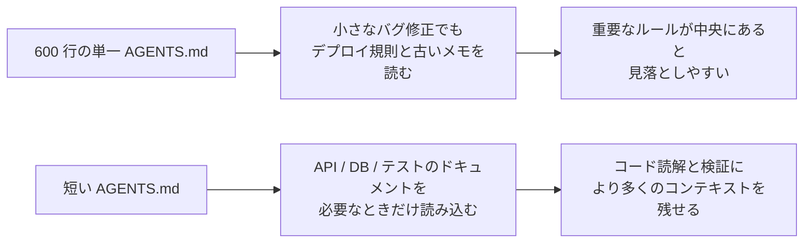
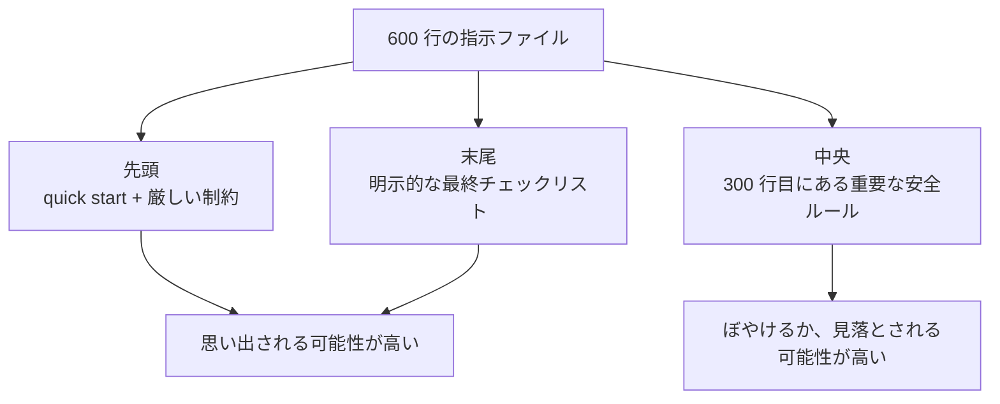

[中国語版 →](../../../zh/lectures/lecture-04-why-one-giant-instruction-file-fails/)

> コード例: [code/](https://github.com/walkinglabs/learn-harness-engineering/blob/main/docs/en/lectures/lecture-04-why-one-giant-instruction-file-fails/code/)
> 実践プロジェクト: [Project 02. Agent-readable workspace](./../../projects/project-02-agent-readable-workspace/index.md)

# 講義 04. 指示はファイルごとに分ける

harness engineering に本気で取り組み始めると、`AGENTS.md` を作って、思い出せる限りのルール、制約、学びを全部詰め込みたくなります。1か月後には 300 行、2か月後には 450 行、3か月後には 600 行にまで膨れ上がり、やがて気づきます。実は、エージェントの仕事の質が下がっているのです。単純なバグ修正でも、不要なデプロイ手順にコンテキストを大量に使ってしまう。300 行目に埋もれた重要な安全ルールは見落とされる。3つの矛盾するスタイルルールのせいで、毎回エージェントがどれか1つを偶然選ぶしかなくなる。

これは「巨大な指示ファイル」の罠です。まるでスーツケースに詰め直すように、どれも役に立つ気がして、ファスナーが壊れるまで押し込んでしまう。下着を探すには、スーツケースを丸ごとひっくり返さなければなりません。持ち運んでいたのは満杯のスーツケースなのに、実際に使っていたのは中身の3分の1ほどでした。

## 根本にある悪循環

よくある悪循環はこうです。エージェントがミスをする、あなたは「同じことが起きないようにルールを足そう」と考える、`AGENTS.md` に追記する、いったんはうまくいく、別のミスが起きる、さらにルールを足す、また繰り返す、そしてファイルが制御不能に膨らんでいく。

これはあなたのせいではありません。何か問題が起きるたびに「ルールを追加する」のは、とても自然な反応です。出かけるたびに「念のため」でバッグへもう1つ物を入れるのと同じで、一見すると合理的に見えます。ですが、積み重なると破壊的になります。何が具体的にまずいのかを見ていきましょう。

**コンテキスト予算を容赦なく食い尽くす。** エージェントのコンテキストウィンドウには限りがあります。たとえば、エージェントのウィンドウが 200K トークンだとします（Claude の標準的な想定です）。肥大化した指示ファイルだけで 10〜20K トークンを消費するかもしれません。まだ十分空いているように見えるでしょうか。ですが、複雑なタスクでは何十ものソースファイルを読む必要があり、ツールの出力もコンテキストを使い、会話履歴も積み重なります。コードを理解すべきタイミングには、すでに予算が圧迫されているのです。まるで「念のため」で荷物を詰め込みすぎたスーツケースのように、ノートPC を入れる余地が残っていません。

**Lost in the Middle。** 「Lost in the Middle」の研究（Liu ら, 2023）は、LLM が長文の中央付近の情報を、冒頭や末尾ほどはうまく使えないことを明確に示しました。600 行の `AGENTS.md` の 300 行目に「すべての DB クエリは必ずパラメータ化すること」という重要な安全要件が書いてあっても、それは真ん中に埋もれているため、エージェントはほぼ確実に見落とします。まるで、パンパンのスーツケースの底に入った日焼け止めのようなものです。あるのは分かっているのに、何度探しても見つからず、結局また新しいものを買うことになる。

**優先度の衝突。** ファイルの中には、議論の余地がない強い制約（「`eval()` は絶対に使うな」）、重要な設計上の推奨（「関数型スタイルを優先すること」）、特定の過去の教訓（「先週 WebSocket のメモリリークを直したので、似たパターンに注意」）が混在します。この3つは重要度がまったく違うのに、ファイル上では同じ見た目をしています。エージェントにはそれらを見分ける信頼できる手がかりがありません。まるで、パスポートと充電器が同じスーツケースの中でごちゃ混ぜになっているようなものです。どれが本当に重要なのか判別できません。

**保守による劣化。** 大きなファイルは構造的に保守しづらいものです。古い指示は削除されにくくなります。消したときの影響が読めないからです（「何か別のルールが依存しているかもしれない」）。一方で新しい指示を足すのは無料に見えます。結果として、ファイルは増える一方で減らず、シグナル対ノイズ比が下がっていきます。これはソフトウェアにおける技術的負債の蓄積とまったく同じです。

**矛盾の蓄積。** 別々の時期に追加された指示は、やがて互いに食い違い始めます。ある指示は「TypeScript は strict mode を使え」と言い、別の指示は「レガシーなファイルの一部では any を許可する」と言う。エージェントは毎回どちらかを適当に選ぶしかありません。まるで母親が「暖かくして行きなさい」と言い、父親が「着込みすぎるな」と言うようなものです。玄関で、どちらに従うべきか分からず立ち尽くすことになります。

## 重要な概念

- **Instruction Bloat**: 指示ファイルがコンテキストウィンドウの 10〜15% を超えると、コードを読むための予算や課題を理解するための予算を圧迫し始めます。600 行の `AGENTS.md` は 10,000〜20,000 トークンを消費しうるため、128K ウィンドウでは、エージェントが作業を始める前に 8〜15% が失われます。
- **Lost in the Middle Effect**: Liu らによる 2023 年の研究は、LLM が長文の中央の情報を、冒頭や末尾ほどはうまく使えないことを示しました。600 行のファイルの 300 行目に埋もれた重要な制約は、実質的に無視される可能性が非常に高くなります。
- **Instruction Signal-to-Noise Ratio (SNR)**: 現在の課題に関連する指示の割合です。バグ修正のために 50 行ものデプロイ手順を読まされるなら、それは低い SNR です。
- **Routing File**: より詳細な文書へエージェントを案内することを主目的とした、短い入口ファイルです。すべてを詰め込む場所ではありません。50〜200 行で十分です。
- **Progressive Disclosure**: まず概要を示し、詳細は必要に応じて見せる設計です。良い harness 設計は良い UI 設計と同じで、すべての選択肢を最初から一気に見せません。
- **Priority Ambiguity**: すべての指示が同じ書式・同じ位置にあると、エージェントは議論の余地がない強い制約と、推奨レベルのやわらかい助言を区別できません。

## 指示のアーキテクチャ





## 分割のしかた

基本原則は、よく使うものは手元に置く、たまに使うものは少し奥にしまう、二度と使わないものは捨てる、です。

入口の `AGENTS.md` は 50〜200 行に収め、最も頻繁に使う内容だけを置きます。プロジェクトの概要（1〜2 文）、初回実行コマンド（`make setup && make test`）、グローバルな厳格制約（議論の余地がないルールは 15 個以内）、そして条件付きで参照するテーマ別ドキュメントへのリンク（1 行の説明 + 適用条件）です。

```markdown
# AGENTS.md

## プロジェクト概要
Python 3.11 の FastAPI バックエンド、PostgreSQL 15 データベース。

## クイックスタート
- インストール: `make setup`
- テスト: `make test`
- 完全検証: `make check`

## 厳格な制約
- すべての API は OAuth 2.0 認証を使うこと
- すべてのデータベースクエリは SQLAlchemy 2.0 の構文を使うこと
- すべての PR は `pytest` + `mypy --strict` + `ruff check` を通過すること

## テーマ別ドキュメント
- [API Design Patterns](docs/api-patterns.md) — エンドポイントを追加するときは必読
- [Database Rules](docs/database-rules.md) — データベース操作を変更するときに必要
- [Testing Standards](docs/testing-standards.md) — テストを書くときの参照先
```

各テーマ別ドキュメントは 50〜150 行に収め、`docs/` 配下のテーマ別ディレクトリや、対応するモジュールの近くに配置します。エージェントは必要なときだけそれらを読みます。スーツケースの仕切りのようなものです。下着はここ、化粧品はここ、充電器はここ。何かを探すたびに、スーツケース全体をひっくり返す必要はありません。

情報の一部は、コードの中に直接置くほうがよい場合もあります。型定義、インターフェースのコメント、設定ファイル内の説明などです。エージェントはコードを読むときに自然にそれらを目にするので、指示に重複して書く必要はありません。

すべての指示には、出典（「なぜこのルールを追加したのか」）、適用条件（「いつ必要なのか」）、失効条件（「どの状況になったら削除できるのか」）が必要です。定期的に見直し、古くなったもの、重複したもの、矛盾したものを削除してください。指示は依存関係のように管理します。使っていないものは削除しないと、システムを遅くするだけです。

ある指示を入力ファイルに含める必要があるなら、中央ではなく先頭か末尾に置きます。「Lost in the Middle」効果は、LLM が中央より端の情報をはるかによく使うことを示しています。ただし、最善策は指示をテーマ別ドキュメントに分け、必要に応じて読み込むことです。

OpenAI も Anthropic も、暗黙のうちに分割アプローチを支持しています。OpenAI は入力ファイルは「短く、ルーティング用」であるべきだと言い、Anthropic は長寿命エージェント向けの管理情報は「簡潔で、高優先度」であるべきだと言います。どちらも同じことを言っています。全部を 1 つのファイルに詰め込むな、ということです。スーツケースは整理するものであって、何でもかんでも押し込むものではありません。

## 実例

ある SaaS チームの `AGENTS.md` は、50 行から 600 行に膨れ上がりました。中身には、スタックのバージョン、コーディング標準、バグ修正のメモ、API ガイド、デプロイ手順、チームメンバーの個人的な好みまで混ざっていました。まるで縫い目が弾けそうなスーツケースです。

エージェントの仕事の質は目に見えて低下しました。単純なバグ修正では、不要なデプロイ指示に大量のコンテキストを費やす。安全制約の「すべての DB クエリはパラメータ化すること」は 300 行目に埋もれていて、たびたび無視される。3つの矛盾したスタイルルールのせいで、挙動が毎回ぶれる。

チームは「スーツケースの再整理」を行いました。
1. `AGENTS.md` を 80 行に圧縮し、プロジェクト概要、起動コマンド、15 個のグローバルな厳格制約だけを残した
2. テーマ別ドキュメントを作成した: `docs/api-patterns.md`（120 行）、`docs/database-rules.md`（60 行）、`docs/testing-standards.md`（80 行）
3. ルーティングファイルにテーマ別ドキュメントへのリンクを追加した
4. 過去のメモはテストケースに変換するか、削除した

リファクタリング後、同じ種類のタスクでは無関係な手順を読む時間が減り、安全制約も見落とされにくくなりました。なぜなら、そのルールはファイルの中央からルーティングファイルの先頭へ移動し、もう「中に埋もれる」ことがなくなったからです。

## 要点

- 「ルールを追加する」のは短期的には痛み止め、長期的には毒です。ルールを追加する前に、テーマ別ドキュメントに入れたほうがよいかを考えてください。スーツケースに詰め込むだけではだめです。
- 入口ファイルは百科事典ではなくルーターです。50〜200 行で、概要、厳格制約、リンクだけに絞ります。
- `lost in the middle` 効果を利用してください。重要なものは先頭か末尾へ、重要でないものはテーマ別ドキュメントへ移します。
- 指示の肥大化は技術的負債として扱ってください。定期的に見直し、各指示には出典・適用条件・失効条件を持たせます。
- 分割すると SNR が上がり、エージェントは不要な指示の解釈ではなく、タスクそのものにより多くのコンテキスト予算を使えるようになります。

## さらに読む

- [OpenAI: Harness Engineering](https://openai.com/index/harness-engineering/)
- [Anthropic: Effective Harnesses for Long-Running Agents](https://www.anthropic.com/engineering/effective-harnesses-for-long-running-agents)
- [Lost in the Middle: How Language Models Use Long Contexts](https://arxiv.org/abs/2307.03172)
- [HumanLayer: Harness Engineering for Coding Agents](https://humanlayer.dev/articles/harness-engineering-for-coding-agents/)
- [Nielsen Norman Group: Progressive Disclosure](https://www.nngroup.com/articles/progressive-disclosure/)

## 演習

1. **SNR の監査**: 現在使っている指示ファイルを取り出し、すべての項目を書き出してください。よくある 5 種類のタスクを選び、それぞれの指示について関連性があるかを判定します。タスクごとに SNR を計算してください。大半のタスクでノイズになる指示は、テーマ別ドキュメントへ移してください。

2. **Progressive disclosure に向けたリファクタリング**: 300 行を超える指示ファイルがあるなら、次の 2 つに分割してください。(a) 100 行未満のルーティングファイル、(b) 3〜5 個のテーマ別ドキュメント。同じタスクセットを 5 件以上、変更前と変更後で実行し、成功率を比較してください。

3. **lost in the middle の確認**: 長い指示ファイルの中で、重要な制約を先頭・中央・末尾に順番に置き、毎回同じタスクセットを実行してください（各位置につき最低 5 回）。遵守状況に差があるか確認します。位置の影響がどれほど大きいか、驚くかもしれません。
