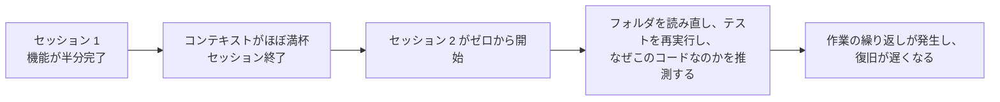
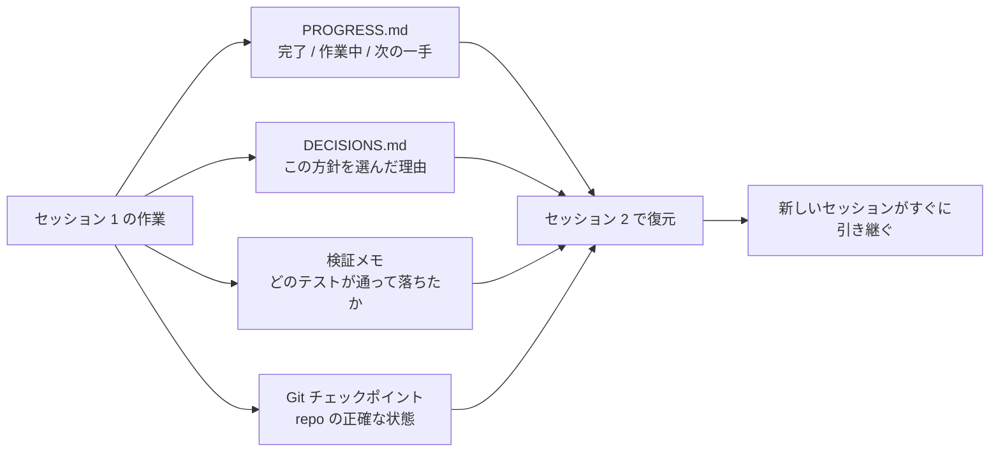

[中国語版 →](../../../zh/lectures/lecture-05-why-long-running-tasks-lose-continuity/)

> コード例: [code/](https://github.com/walkinglabs/learn-harness-engineering/blob/main/docs/en/lectures/lecture-05-why-long-running-tasks-lose-continuity/code/)
> 実践プロジェクト: [プロジェクト 03. 複数セッションの継続](./../../projects/project-03-multi-session-continuity/index.md)

# 講義 05. セッション間でコンテキストを維持する

Claude Code にひとつの機能実装を丸ごと任せたとします。30 分ほど動き、大半は片付きましたが、コンテキストが尽きかけています。続けるために新しいセッションを開くと、どんな判断が下されたのか、なぜ A ではなく B が選ばれたのか、どのファイルがすでに変更済みなのか、テストがどの状態なのかを何も覚えていないことに気づきます。そこから 15 分かけてプロジェクトを読み直し、前の方針と食い違う動きをしてしまうかもしれません。

毎朝起きるたびにすべてを忘れる職人を想像してください。どの壁が未完成なのか、なぜ青いレンガではなく赤いレンガを選んだのか、配管工事がどこまで進んだのかを、現場全体でもう一度把握し直さなければなりません。さらに悪いことに、昨日すでに取り付けた窓のことを忘れていて、それを壊してしまうかもしれません。

複数セッションにまたがるタスクで AI エージェントが置かれているのは、まさにその状況です。この講義では、長いタスクの途中でなぜエージェントが「切れる」のか、そして構造化された状態保存がどうすれば、毎日の作業日誌をきちんと付ける職人のように変えられるのかを説明します。相変わらず健忘症ではありますが、日誌だけはすべてを覚えています。

## コンテキストウィンドウは無限ではない

コンテキストウィンドウには上限があります。これはモデルを更新すれば解決する話ではありません。たとえウィンドウが 1M トークンまで広がっても、複雑なタスクなら結局は使い切ってしまいます。エージェントは単にコードを生成しているのではなく、コードベースを読み、意思決定の履歴を追跡し、ツール出力を処理し、会話の文脈も維持しています。こうした情報は、ウィンドウの拡張よりも速く増えていきます。

より本質的な問題は、エージェントが生み出す情報は重要度が同じではないことです。推論の途中にあるステップには、意思決定の「なぜ」が含まれます。なぜ B が A より選ばれたのか、なぜこのライブラリで別のものではなかったのか、なぜ特定の最適化が見送られたのか。最終的な出力には「何が」だけ、つまりコードそのものしか残りません。圧縮の戦略は通常後者は残せますが、前者を失います。次のセッションはコードを見ても、なぜその形になっているのかが分からず、意図した設計判断を「最適化」してしまうかもしれません。

Anthropic は長時間動作するエージェントの研究で興味深い現象を見つけました。エージェントがコンテキストの終わりを感じると、「早すぎる収束」のような振る舞いを示し、現在の作業を急いで終わらせようとしたり、検証手順を飛ばしたり、最適解ではなく簡単な解を選んだりします。これは、試験中に残り時間が少ないと気づいて、残った選択問題を雑にマークしてしまうのに似ています。Anthropic はこれを「コンテキスト不安」と呼んでいます。

## セッション継続の流れ

継続性のアーティファクトがなければ、新しいセッションは毎回カタストロフです。



継続性のアーティファクトがあれば、新しいセッションはすばやく作業を引き継げます。



## 重要な概念

- **コンテキストウィンドウには限界がある**: どれだけ大きいと謳われていても（128K、200K、1M など）、長いタスクはいつか必ず使い切ります。使い切った後は、圧縮（情報を失う）かリセット（新しいセッション）しかありません。どちらも何かを失います。
- **継続性のアーティファクト**: 新しいセッションが前回の続きから一意に再開できるようにする保存済み状態ファイルです。基本形は、進捗ログ + 検証記録 + 次の作業です。いわば職人の日誌です。
- **復旧コスト**: 新しいセッションが作業可能な状態に戻るまでに必要な時間です。よい harness はこれを 15 分から 3 分に短縮します。
- **ドリフト (drift)**: エージェントの理解と実際の repo の状態とのずれです。セッションの境界は毎回ドリフトを生み、制御しなければ蓄積していきます。
- **コンテキスト不安**: Anthropic が観測した現象で、エージェントは知覚したコンテキスト上限が近づくと、情報損失を避けるためにタスクを早めに終えようとする早すぎる収束を示します。これは非合理的なリソース不安です。
- **圧縮とリセットの違い**: 圧縮は同じセッション内でコンテキストを要約します（「何が」は残るが「なぜ」は失われうる）。リセットは新しいセッションを開き、保存済み状態から復元します（すっきりするが、アーティファクトの完全性に依存する）。

## 継続性が壊れると何が起きるか

前のセッションは、3 つの案を分析して B を選ぶためにかなりのコンテキスト予算を使いました。現在のセッションはその分析を知らないため、不完全な情報だけをもとに再判断し、A を選んでしまうかもしれません。なぜ赤いレンガが選ばれたのかを覚えていない健忘症の職人が、今日は青いレンガを見てこちらのほうがきれいだと思い、昨日の壁を壊して作り直すようなものです。

さらに悪いのは、作業の重複です。エージェントはある作業がすでに終わっているのか確信できず、もう一度やってしまいます。あるいは、もっと悪いことに、途中までやって既存実装との衝突を見つけ、やり直しを強いられます。現場では 2 つの班が同じ壁を同時に作ることはできませんが、進捗記録がなければ新しい班は誰かがすでにその壁を担当していることを知りません。

数回のセッションを経るうちに、実装の方向性は当初の要件から静かにずれていくことがあります。新しいセッションは、プロジェクトの目的を少しずつ違う形で理解します。「伝言ゲーム」と同じで、10 回伝えたあとには「コーヒーを買ってきて」が「コーヒーマシンを買ってきて」になっているかもしれません。

検証にも穴が生まれます。前のセッションでの検証結果（どのテストが通り、どれが落ち、なぜ落ちたのか）が記録されていないため、新しいセッションは現在の状態を把握するために検証をすべてやり直さざるを得ません。各セッションがゼロから診断するので、そのたびに貴重なコンテキストが消費されます。

OpenAI も Anthropic も、ドキュメントの中で構造化された状態保存の重要性を強調しています。OpenAI のハーネスエンジニアリングの記事では、repo を「運用ログ」と見なしており、各操作の結果は repo に追跡可能な痕跡を残すべきだとしています。Anthropic の長時間動作するエージェント向けドキュメントも、現在の状態、既知の問題、次の作業を含む構造化文書である「引き継ぎファイル」を明確に推奨しています。

## 健忘症の職人のための日誌

基本方針は、**エージェントを健忘症の天才エンジニアとして扱うことです。**「退勤」する前に、次の「交代要員」がすぐに作業を引き継げるよう、重要な情報を書き残しておかなければなりません。

**ツール 1: 進捗ファイル (PROGRESS.md)。** 最も基本的な継続性アーティファクトは、日誌の核です。

```markdown
# 進捗

## 現在の状態
- 最新コミット: abc1234 (feat: add user preferences endpoint)
- テスト状況: 42/43 通過 (test_pagination_edge_case が失敗中)
- lint: 通過

## 完了済み
- [x] ユーザーモデルとデータベースマイグレーション
- [x] 基本的な CRUD エンドポイント
- [x] 認証ミドルウェアの統合

## 進行中
- [ ] ページネーション機能 (90% - 境界ケースのテストが失敗中)

## 既知の問題
- test_pagination_edge_case は空の結果セットで 500 を返す
- 削除済みユーザーを一覧に含めるべきか確認する必要がある

## 次の手順
1. ページネーションの境界ケースの不具合を修正する
2. `"include deleted users"` クエリパラメータを追加する
3. API ドキュメントを更新する
```

**ツール 2: 決定ログ (DECISIONS.md)。** 重要な設計判断とその理由を書き残します。詳細な設計書は不要です。「何を決めたか、なぜ、いつ」を残すだけで十分です。日誌のメモとして機能します。

```markdown
# 設計判断

## 2024-01-15: ユーザー設定のキャッシュに Redis を使う
- 理由: 読み取り頻度が高く（API 呼び出しのたびに使う）、データサイズが小さいため
- 採用しなかった案: PostgreSQL のマテリアライズドビュー（変更頻度が高く、保守コストに見合わないため）
- 制約: キャッシュ TTL は 5 分、書き込み時は能動的に無効化する
```

**ツール 3: Git コミットをチェックポイントとして使うこと。** ひとまとまりの作業単位が終わるたびにコミットします。コミットメッセージでは、何をしたのか、なぜそうしたのかを説明してください。これは無料で使える、自動的に版管理される状態スナップショットです。

**ツール 4: init.sh あるいは harness の初期化手順。** `AGENTS.md` には「出勤」と「退勤」の手順を明記します。

```markdown
## セッション開始時（出勤）
1. PROGRESS.md を読んで現在の状態を確認する
2. DECISIONS.md を読んで重要な判断を確認する
3. `make check` を実行して repo の状態が一貫していることを確認する
4. PROGRESS.md の「次の手順」から作業を続ける

## セッション終了前（退勤）
1. PROGRESS.md を更新する
2. `make check` を実行して状態の一貫性を確認する
3. 完了した作業をすべて commit する
```

**ハイブリッド戦略**: どのタスクにもコンテキストのリセットが必要なわけではありません。短いタスク（30 分未満）は 1 セッションで終えられます。長いタスク（複数セッションにまたがるもの）は、継続性のために進捗ファイルと決定ログを必ず使うべきです。目安は、タスクがウィンドウの 60% を超えるなら引き継ぎの準備を始めることです。

### コンテキスト不安をさらに詳しく見る

Anthropic の 2026 年 3 月の研究は、コンテキスト不安の具体的な現れを明らかにしました。Sonnet 4.5 では、コンテキストがウィンドウ上限に近づくと、エージェントは顕著な「早すぎる収束」行動を示します。これは、試験で残り時間がほとんどないと分かったときに、適当に答えを埋めてしまうのに似ています。

この問題には 2 つの戦略があります。

**圧縮**: 同じセッション内で、初期の会話を要約する方法です。利点は継続性を保てること、つまりエージェントが「何が起きたか」を見続けられることです。欠点は、要約の中で「なぜ」が失われやすいことです。なぜ B が A より選ばれたのか、なぜ特定の最適化が見送られたのかが抜け落ちます。さらに重要なのは、圧縮ではコンテキスト不安そのものは解消されないことです。エージェントは、かつてコンテキストが大きかったことを知っているため、心理的には依然として早く閉じようとします。

**コンテキストのリセット**: コンテキストを完全に消し、新しいセッションを開いて保存済みアーティファクトから復元する方法です。利点は、頭の中がきれいになることです。新しいセッションには「そろそろ時間が尽きる」という不安がありません。欠点は、引き継ぎアーティファクトの完全性に依存することです。日誌に重要情報がなければ、新しいセッションは誤った方向に進みながら時間を使ってしまうかもしれません。

Anthropic の実測データでは、Sonnet 4.5 ではコンテキスト不安が非常に深刻で、圧縮だけでは不十分です。コンテキストのリセットがハーネス設計の重要な要素になります。一方で Opus 4.5 ではこの挙動はかなり弱まり、圧縮だけでリセットに頼らずコンテキストを管理できます。つまり、**ハーネスの設計は対象のモデルに合わせるべきであり、万能テンプレートを流用すべきではありません。**

> 出典: [Anthropic: 長時間アプリケーション開発のためのハーネス設計](https://www.anthropic.com/engineering/harness-design-long-running-apps)

## 実例

ユーザー認証付きのブログシステムを実装するよう、エージェントに依頼したとします。12 個の機能があり、見積もりでは 5 セッション必要でした。

**日誌なしの基本ケース**: セッション 1 ではユーザーモデルと基本ルートを実装しました。セッション 2 は auth-middleware のインターフェース契約を覚えておらず、以前の設計意図を取り戻すのに約 15 分を費やしました。セッション 3 になると、蓄積したドリフトによって、すでに完成した機能まで作り直し始めました。セッション 5 では repo に冗長コードが増えていましたが、肝心の認証機能はまだエンドツーエンドテストに通っていませんでした。完了したのは 12 機能中 7 つだけで、3 つには隠れた正しさの問題がありました。日誌を書かない職人のように、5 日目には現場が混乱し、ある壁は二重に作られ、ある壁はまだ着工すらされていません。

**日誌あり**: 進捗ファイル、決定ログ、検証記録、git チェックポイントを使いました。状態レポートは各セッションの終わりに自動更新されます。セッション 2 の復旧コストは約 3 分まで下がりました。セッション 5 までに 12 機能すべてが完了し、検証も済みました。

定量比較では、復旧時間は約 78% 短縮し、完了機能率は 58% から 100% に、隠れた不具合率は 43% から 8% に下がりました。職人は相変わらず健忘症ですが、日誌があれば、毎日は前日が終わったところから始まり、ゼロからではありません。

## 主要な結論

- コンテキストウィンドウは有限な資源です。長いタスクは複数セッションにまたがり、セッションは情報を失います。毎日忘れる職人のように、それは避けられない現実です。
- 解決策は大きなウィンドウではなく、よりよい状態保存です。進捗ファイル + 決定ログ + git チェックポイントで、健忘症の職人に信頼できる日誌を持たせてください。
- エージェントは健忘症のエンジニアとして扱ってください。「退勤」前に、何をしたか、なぜそうしたか、次に何をするかを書き残します。
- 復旧コストは重要な指標です。よい harness は新しいセッションを 3 分で作業可能な状態に戻せるべきです。
- ハイブリッド戦略が有効です。短いタスクは 1 セッション内、長いタスクは構造化された継続性アーティファクトを通して扱います。

## 参考資料

- [Anthropic: 長時間動作するエージェントのための効果的なハーネス](https://www.anthropic.com/engineering/effective-harnesses-for-long-running-agents)
- [OpenAI: ハーネスエンジニアリング](https://openai.com/index/harness-engineering/)
- [真ん中で迷う: 言語モデルが長いコンテキストをどう使うか](https://arxiv.org/abs/2307.03172)
- [Claude Code ドキュメント](https://docs.anthropic.com/en/docs/claude-code)
- [HumanLayer: コーディングエージェント向けハーネスエンジニアリング](https://humanlayer.dev/articles/harness-engineering-for-coding-agents/)

## 演習

1. **継続性の損失を測る**: 少なくとも 3 セッション必要な開発タスクを 1 つ選びます。継続性アーティファクトなしで、各セッション開始時にエージェントが「前回何をしていたかを理解する」ためにどれだけコンテキストを使うかを記録してください。各セッションの終わりに進捗ファイルを作成し、次のセッションはそれを起点に始めます。進捗ファイルありとなしで復旧コストを比較してください。

2. **引き継ぎテンプレートを設計する**: repo 状態（commit hash）、実行時状態（通過テスト率）、ブロッカー、次の作業、という 4 つの項目を持つ最小限の引き継ぎテンプレートを作ります。完全に新しいエージェントのセッションに、このテンプレートだけを使ってプロジェクト状態を復元させてください。復元中に生じた曖昧さを記録し、テンプレートを反復的に改善してください。

3. **ハイブリッド戦略を試す**: 5 セッションのタスクで、3 つの戦略を比較してください。(a) 毎回新しいセッション + 進捗ファイル、(b) 1 セッションでできるだけ多く進める（コンテキスト圧縮）、(c) ハイブリッド戦略（短いタスクはセッション内、長いタスクはセッション間 + 進捗ファイル）。復旧時間、完了機能率、決定の一貫性を比較してください。
