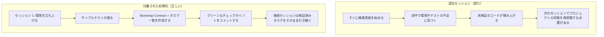

[中国語版 →](../../../zh/lectures/lecture-06-why-initialization-needs-its-own-phase/)

> コード例: [code/](https://github.com/walkinglabs/learn-harness-engineering/blob/main/docs/en/lectures/lecture-06-why-initialization-needs-its-own-phase/code/)
> 実践プロジェクト: [Project 03. Multi-session continuity](./../../projects/project-03-multi-session-continuity/index.md)

# レクチャー 06. エージェントの各セッション前にプロジェクトを初期化する

新しいエージェントセッションを開いて「検索を追加して」と伝えると、エージェントはすぐにコードを書き始めます。意欲的なのは悪くありませんが、20分後にテストフレームワークの設定ミスに気づき、さらに10分かけて直したと思えば、今度はマイグレーションスクリプトの形式が違うと分かってまた手間取る。結果として検索機能は追加できても、セッション全体としてはかなり非効率です。時間の大半が機能そのものではなく、「このプロジェクトの構造を理解すること」に消えてしまいます。

より良い方法は、エージェントに作業を始めさせる前に、別のフェーズで基盤となる環境、検証用コマンド、プロジェクト構造の理解を整えておくことです。これは家づくりと同じで、基礎工事と壁の施工を同時には進められません。そんなことをすれば、基礎が固まる前に壁が立ち上がり、建物全体を壊してやり直すことになります。先に基礎を打ち、しっかり固めてから壁を建てる。そうすれば、きれいで効率的です。

このレクチャーでは、なぜ初期化を実装とは別のフェーズに分けるべきなのかを説明します。

## 基礎と壁: 本質的に異なる2つの作業

初期化と実装では、最適化したい対象がまったく異なります。実装フェーズが最適化するのは、検証済み機能の量と質を最大化することです。初期化フェーズが最適化するのは、その後のすべての実装フェーズを、どれだけ安定して効率よく進められるかを最大化することです。

初期化と実装を混ぜると、エージェントは多目的最適化に直面します。つまり、インフラを整えながら機能コードも書くことになります。優先順位が明示されていないと、エージェントは自然とコードを書くことを優先しがちです。結果がすぐに見えるからです。一方でインフラは、その価値が次のセッション以降にならないと見えません。そのため、インフラは後回しにされます。これは、施工会社に「基礎を打ちながら壁も建てて」と頼むようなものです。目に見える成果がある壁のほうへ、作業は流れがちです。しかし基礎が弱い家には、あとから構造的な問題が出ます。

## 初期化のライフサイクル



## 混ぜると何が起きるか

もっとも直接的な問題は、基礎が十分に固まらないことです。エージェントは作業時間の80%を機能コードに、20%を場当たり的なインフラ整備に費やします。テストフレームワークは設定されていても、まだ検証されていません。リンタのルールも設定されていても、十分に厳密ではありません。進捗ファイルも作られていません。こうした欠陥は最初のセッションでは目立ちません。エージェント自身が何をしていたかをまだ覚えているからです。しかし次のセッションで表面化します。新しいエージェントは、どう起動するのか、どうテストするのか、今どこまで進んでいるのかを知りません。弱い基礎の上には、ぐらつく建物しか立ちません。

より見えにくいコストは、「未検証の蓄積」です。テストフレームワークを整える前に書かれた機能コードは、検証されていないコードです。あとからそのコードにテストを追加しようとしたとき、実は最初から設計が違っていたと判明することがあります。最初から分かっていれば、別の実装にしていたはずです。これは、まだ固まっていないコンクリートの上にタイルを貼るようなものです。床が傾いていると分かったときには、タイルを全部はがしてやり直すしかありません。

セッションの予算も無駄になります。初期化作業、つまり環境構築、テスト整備、プロジェクト構造の理解にはかなりの予算が必要で、その分だけ実際の機能実装に使える時間が減ります。その結果、1回目のセッションでは機能の半分しか進まず、2回目のセッションでもまたプロジェクトの整理から始めることになります。予算は基礎に使ったのに、基礎そのものも弱いままです。どちらの目的も達成できません。

見落としやすい問題が、暗黙の前提という「地雷」です。初期化の途中でエージェントが下した判断、たとえばどのテストフレームワークを使うか、ディレクトリをどう整理するか、依存関係をどう管理するかを明示的に記録していないと、後続セッションはそれを理解できません。さらに悪いことに、後続セッションが矛盾する判断を下すこともあります。最初の施工チームがコンクリート基礎を作り、次の施工チームがそれを知らずに木杭を打ち込んでしまう。そうなると、基礎はひび割れます。

長期実行型のアプリケーション開発に関する Anthropic の研究でも、初期化と実装を分けることが明確に推奨されています。彼らの実験データでは、初期化フェーズを分離したプロジェクトは、混在アプローチと比べて、複数セッションのシナリオで完了済み機能の割合が31%高くなりました。重要なのは、初期化フェーズに投じた時間は、その後の3〜4セッションで完全に回収されるという点です。基礎がしっかりしていれば、壁はより速く立ちます。

OpenAI Codex の harness engineering ガイドでも、「リポジトリは運用ログである」という原則が強調されています。最初の起動時に明確な運用構造を確立しなければ、あらゆる新しいセッションが毎回、プロジェクトの合意事項を一から推測し直すことになります。

## 重要な概念

- **初期化フェーズ**: エージェントのライフサイクルにおける最初のフェーズ。機能実装は行わず、後続のすべての実装フェーズの前提を整えるだけです。成果物はコードではなく、インフラです。
- **Bootstrap Contract**: 新しいエージェントセッションがプロジェクトを一意に扱えるための条件です。起動できる、テストできる、進捗を把握できる、次の作業を引き継げる、の4条件を満たす必要があります。
- **コールドスタートとウォームスタート**: コールドスタートは、エージェントがプロジェクト構造を推測しなければならない空のディレクトリから始める状態です。ウォームスタートは、テンプレートや既存プロジェクトのように、インフラがすでに整っている状態から始めることです。ウォームスタートはコールドスタートを大きく上回ります。資材も電気もない更地から始めるのと、水道と電気がある状態から始めるのでは、まったく違います。
- **handoff 可能性**: いつでも新しいエージェントが引き継げる状態にプロジェクトがあることです。口頭説明は不要で、リポジトリの中身だけで完結している必要があります。
- **最初の検証までの時間**: プロジェクト開始から最初の機能が検証を通るまでの時間です。初期化の効率を測る重要な指標です。
- **後続フェーズへの有用性**: 初期化の品質を測る最良の指標は、暗黙知に頼らずにタスクを正常に実行できた後続セッションの割合です。

## 正しい初期化の進め方

**初期化は独立したフェーズだと考えてください。** 最初のセッションは初期化だけを行い、ビジネスコードは書きません。初期化で作るものは次のとおりです。

**1. 起動可能な環境。** プロジェクトが起動でき、依存関係がインストールされ、環境面の問題がない状態です。基礎がひび割れずに打たれている状態です。

**2. 検証可能なテストフレームワーク。** 少なくとも1つのサンプルテストが通ること。これで、テストフレームワーク自体が正しく設定されていると証明できます。土台の上に柱を立てて、その重さを支えられるか確認するようなものです。

**3. bootstrap contract の文書。** 後続セッションに次のことを明確に伝える文書です。
```markdown
# Initialization Contract

## Start Commands
- Install dependencies: `make setup`
- Start dev server: `make dev`
- Run tests: `make test`
- Full verification: `make check`

## Current State
- All dependencies installed and locked
- Test framework configured (Vitest + React Testing Library)
- Example test passing (1/1)
- Lint rules configured (ESLint + Prettier)

## Project Structure
- src/ — Source code
- src/components/ — React components
- src/api/ — API client
- tests/ — Test files
```

**4. タスクの分解。** プロジェクト全体を順序立てたタスク一覧に分け、それぞれに明確な受け入れ条件を付けます。
```markdown
# Task Breakdown

## Task 1: User Authentication Basics
- Implement JWT auth middleware
- Add login/register endpoints
- Acceptance: pytest tests/test_auth.py all passing

## Task 2: User Profile Page
- Implement user profile CRUD
- Add profile edit form
- Acceptance: pytest tests/test_profile.py all passing

## Task 3: Search Feature
- ...
```

**5. チェックポイントとしての Git コミット。** 初期化が終わったら、きれいな状態でコミットしてください。その後の作業はすべて、そのコミットを起点に始まります。

**ウォームスタート戦略**: 空のディレクトリから始めないでください。テンプレートプロジェクト（`create-react-app`、`fastapi-template` など）を使って、標準的なディレクトリ構成、依存関係設定、テストフレームワークをあらかじめ用意します。共通の初期化手順はテンプレートに焼き込み、プロジェクト固有の作業だけを残します。水道と電気がある状態から建築を始めるようなもので、何もない更地から始めるより、はるかに良いです。

**初期化完了の基準**: 「どれだけコードを書いたか」ではなく、bootstrap contract の4条件が満たされているかです。つまり、起動できる、テストできる、進捗を把握できる、次の作業を引き継げる、の4つです。次のチェックリストで検証してください。

```markdown
## Initialization Acceptance Checklist
- [ ] `make setup` succeeds from scratch
- [ ] `make test` has at least one passing test
- [ ] A new agent session can answer "how to run" and "how to test" from repo contents alone
- [ ] Task breakdown file exists with at least 3 tasks
- [ ] Everything committed to git
```

## 実践例

React フロントエンドプロジェクトの初期化には、2つの進め方があります。

**混在アプローチ（基礎を打ちながら壁も建てる）**: セッション1でエージェントがプロジェクトのひな形を作りつつ、最初の機能も実装しました。セッション終了時点でリポジトリには動くコードがありましたが、起動コマンドやテストコマンドを明示した文書はなく、進捗追跡ファイルもなく、タスク分解もありませんでした。セッション2では、構造、テストフレームワーク、ビルド手順を再把握するのに約20分かかりました。まるで建築現場に入った新しい施工チームが、基礎がどこまでできていて、配管がどこを通っているのか分からず、それを確かめるために穴を掘り続けるようなものです。

**分離された初期化（先に基礎）**: セッション1は初期化だけに集中しました。テンプレートからディレクトリ構成を作成し、テストフレームワーク（Vitest + React Testing Library）を整備し、サンプルテストを1本作成して確認し、bootstrap contract 文書とタスク分解ファイルを作り、初期チェックポイントをコミットしました。セッション2での復旧時間は3分未満で、すぐにタスクリストに沿って作業を始められました。まるで施工チームが図面を一目見て、どこから続ければよいか即座に分かるようなものです。

プロジェクト全体のサイクルで比較すると、混在アプローチでは全セッション合計の復旧時間が、分離された初期化よりおよそ60%長くなっていました。初期化に追加で使った20分は、その後のセッションで何倍にもなって回収されました。強い基礎が壁の施工を加速させるように、最初に少し時間をかけることが、結果的には速く進むことにつながります。

## 主要な結論

- 初期化と実装では最適化目標が異なるため、混ぜると両方が悪化します。先に基礎、あとで壁です。
- 初期化の成果物はコードではなくインフラです。つまり、起動可能な環境、検証可能なテスト、bootstrap contract、タスク分解です。
- 初期化は bootstrap contract の4条件で検証してください。起動できる、テストできる、進捗を把握できる、次の作業を引き継げる、です。
- ウォームスタートはコールドスタートより優れています。標準的なインフラはテンプレートで先に用意しましょう。
- 初期化に投じた時間は、その後の3〜4セッションで十分に回収されます。これは追加コストではなく、先行投資です。基礎がしっかりしていれば、建物はより速く伸びます。

## 追加資料

- [Anthropic: Effective Harnesses for Long-Running Agents](https://www.anthropic.com/engineering/effective-harnesses-for-long-running-agents)
- [OpenAI: Harness Engineering](https://openai.com/index/harness-engineering/)
- [HumanLayer: Harness Engineering for Coding Agents](https://humanlayer.dev/articles/harness-engineering-for-coding-agents/)
- [Infrastructure as Code — Martin Fowler](https://martinfowler.com/bliki/InfrastructureAsCode.html)
- [SWE-agent: Agent-Computer Interfaces](https://github.com/princeton-nlp/SWE-agent)

## 演習

1. **Bootstrap contract の設計**: あなたが開発しているプロジェクト向けに、完全な bootstrap contract を書いてください。その後、完全に新しいエージェントセッションを開き、口頭コンテキストなしでリポジトリの内容だけを見せて、プロジェクトの起動、テスト実行、現在の進捗把握を求めます。発生した問題をすべて記録してください。各問題は、bootstrap contract の不足箇所に対応しています。

2. **比較実験**: 中程度に複雑な新規プロジェクトを使います。アプローチA: エージェントに初期化と最初の実装を連続でやらせる。アプローチB: 1セッションを初期化専用にし、実装は2セッション目から行う。4セッション後に、最初の検証までの時間、復旧コスト、完了済み機能の割合を比較してください。

3. **初期化受け入れチェックリスト**: あなたのプロジェクト向けに初期化の受け入れチェックリストを作成してください。新しいエージェントセッションに各項目を実行させ、どれが通り、どれが失敗するかを記録します。失敗する項目は、あなたの harness を強化する必要がある箇所です。
