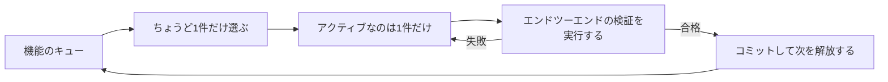
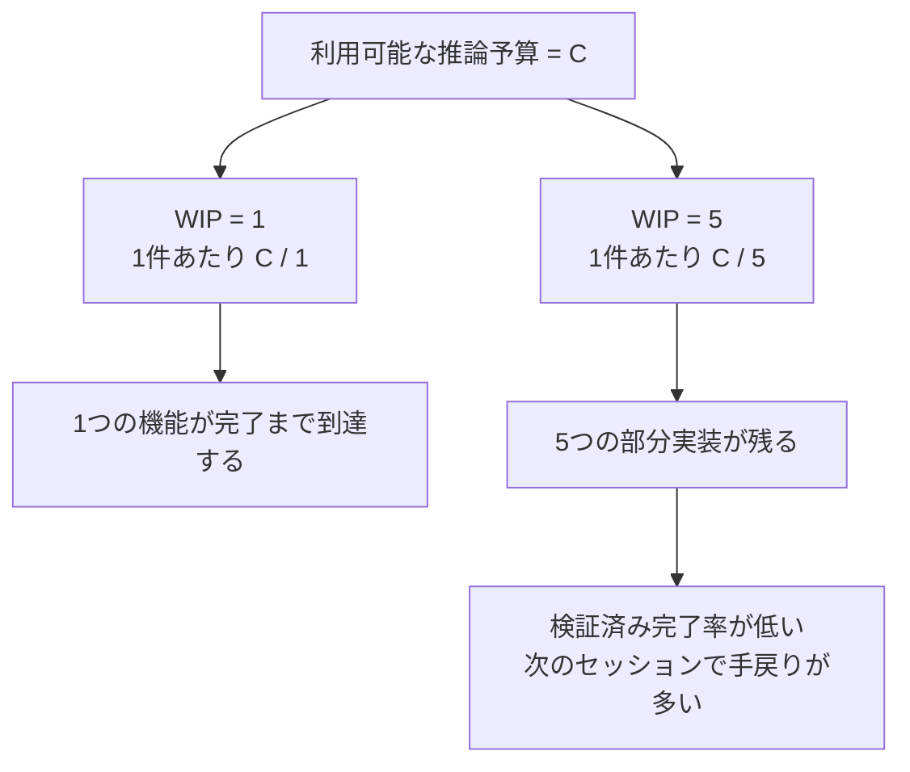

[中国語版 →](../../../zh/lectures/lecture-07-why-agents-overreach-and-under-finish/)

> コード例: [code/](https://github.com/walkinglabs/learn-harness-engineering/blob/main/docs/en/lectures/lecture-07-why-agents-overreach-and-under-finish/code/)
> 実践プロジェクト: [Project 04. Runtime feedback and scope control](./../../projects/project-04-incremental-indexing/index.md)

# 講義07. エージェントに明確なタスク境界を設定する

Claude Code に「プロジェクトにユーザー認証を追加して」と指示すると、DB スキーマを変更し、ルートを書き、フロントエンドコンポーネントを作り直し、そのうえエラーハンドリング middleware までリファクタリングし始めることがあります。2時間後に確認すると、12ファイルが変更され、800行の新しいコードが増えたのに、どの機能もエンドツーエンドでは動いていません。

「一口で食べきれない量を欲張るな」という言葉は、AI エージェントにぴったり当てはまります。エージェントには「少し多めにやる」本能があります。関連しそうなものを見つけると、ついそれも直してしまうのです。たとえば、醤油を1本買いに行っただけなのに、帰ってきたらカートいっぱいになっている人のようなものです。問題は、余計に買った人はお金を少し使っただけですが、同時にやりすぎるエージェントは何ひとつ最後まで終わらせられないことです。

Anthropic のエンジニアリングブログ「Effective harnesses for long-running agents」は、プロンプトが広すぎると、エージェントは「まず1つを終わらせる」より「いくつかを同時に始める」傾向があるとはっきり述べています。OpenAI Codex のエンジニアリング実践でも同じことが示されています。スコープ管理のないタスクは、完了率が大きく落ち込みます。これはモデルの問題ではなく、harness の問題です。境界を引いていないのです。

## 注意力は有限資源

これは比喩ではなく、数学の話です。エージェントのコンテキスト容量を C とし、同時に k 個のタスクを動かすとします。各タスクが受け取る推論資源は平均で C/k になります。C/k が、1つのタスクを終えるのに必要な最小閾値を下回ると、どれも最後まで到達しません。胃にも容量があります。餃子を10個いっぺんに詰め込めば、ひとつも消化できず、10回分の胃もたれを抱えることになります。

Claude Code の実際の挙動はわかりやすいです。「ユーザー登録を追加して」と頼むと、次のように動くことがあります。

1. `User` モデルを作る
2. 登録ルートを書く
3. メール認証が必要だと気づいて、メールサービスを追加する
4. パスワードをハッシュ化する必要があると判断して、bcrypt を組み込む
5. エラー処理が一貫していないと気づいて、グローバルな error-middleware をリファクタリングする
6. テストファイルの構成が雑だと判断して、ディレクトリを整理する

6段階進んだ時点で、それぞれが半分ずつしか終わっていません。エンドツーエンドの検証はなく、半端なコード同士の複雑な結合だけが残り、次のセッションでそれをほどこうとすると、さらに迷子になります。6つの料理を同時に作っている人のようなものです。どれもフライパンの中にはあるのに、皿には一皿も乗っていません。全部焦げます。

Anthropic の長時間稼働エージェントの事例でも、feature list から 1 つの機能を選び、各セッションで incremental progress を残す構成が紹介されています。これは WIP=1 に近い制約で、エージェントが一度に広く作りすぎて半端な状態を残す失敗を防ぐためのものです。書いたコード量ではなく、検証済みの小さな完了単位を増やすことが重要です。

## WIP=1 のワークフロー





## 重要な概念

- **Overreach（やりすぎ）**: 1回のセッションで、エージェントが最適量より多くのタスクを起動してしまうことです。これは測定できます。5機能のうちエンドツーエンドで通るものが0なら、それは overreach です。
- **Under-finish（未完了）**: 起動した全タスクのうち、エンドツーエンドの検証を通過した割合が閾値を下回ることです。コードは書けているのにテストは通らない。これが under-finish です。
- **WIP Limit（仕掛かり作業の上限）**: Kanban の概念です。考え方の中心は、同時に作業中のタスク数を制限することです。エージェントにとって、WIP=1 は最も安全なデフォルトです。1つ終えてから次に進む。スウェーデン式ビュッフェのように、山盛りにせず、1皿を食べ終えてから次の皿へ行くのです。
- **完了の証明**: タスクが「作業中」から「完了」に移るために満たすべき、検証可能な条件です。これがないと、エージェントは「コードは見た目がよさそう」を「挙動がテストを通る」と取り違えます。
- **スコープ面（Scope Surface）**: 各ノードが作業単位、各辺が依存関係である DAG 構造です。状態は `not_started`, `active`, `blocked`, `passing` の4つだけです。
- **完了圧**: harness が WIP 制限と完了証明の要件を通じてかける制約です。エージェントに、次のタスクを始める前に今のタスクを終わらせるよう強制します。

## Overreach と under-finish は共犯関係

この2つの問題は独立ではありません。互いを強化し合います。Overreach は注意を散らし、散らばった注意は under-finish を招き、未完のコードがシステムの複雑さを増し、それが次のタスクでさらに overreach を促します。悪循環です。

Kanban の文脈では、リトルの法則 `L = lambda * W` がそのまま当てはまります。仕掛かり作業量 `L` が大きすぎる、つまり同時にやることが多すぎると、各タスクのリードタイム `W` は必然的に伸びます。エージェントにとっては、各機能が開始から検証済み完了まで到達するまでの道のりが長くなり、失敗の確率も高くなるということです。

これは人間の世界でも昔からある問題です。Steve McConnell は *Rapid Development* で、スコープ拡大がプロジェクト失敗の主因だと記録しています。ただ、人間には少なくとも「もう十分やった」という直感があります。エージェントにはそれがありません。モデルに次のアイデアを生成させる追加コストは、トークン的にはほぼゼロです。「ついでにこれも直そう」と書くのはわずかな手間で済みますが、そのたびにエージェントの注意は薄まります。ビュッフェと同じで、余分な皿1枚の限界コストはほぼゼロでも、胃には制限があります。

## 正しいやり方

### 1. WIP=1 を強制する

最も直接的で効果的な方法です。harness でエージェントに明示してください。**どの時点でも `active` にあるタスクは1つだけ**です。CLAUDE.md（Claude Code）または AGENTS.md（Codex）には、次のように書きます。

```
## 作業ルール
- 1度に取り組む機能は1つだけにする
- 現在の機能がエンドツーエンドの検証を通過してから、次の機能に着手する
- 機能 A を実装している最中に、機能 B を「ついでにリファクタリング」しない
```

スウェーデン式ビュッフェと同じです。1皿ずつ取り、食べ終えてから次の皿に進みます。

### 2. 各タスクに明確な完了証明を定義する

「完了」とは「コードが書けた」ではなく、「挙動の検証が通った」という意味です。機能一覧の各項目には、検証コマンドが必要です。

```
F01: User Registration
  検証: curl -X POST /api/register -d '{"email":"test@example.com","password":"123456"}' | jq .status == 201
  状態: passing
```

### 3. スコープ面を外に出す

すべてのタスク状態を記録するために、機械可読なファイル（JSON または Markdown）を使ってください。新しいセッションはそのファイルを読めば、どのタスクが active なのか、何をもって「完了」とするのか、どの検証が通っているのかをすぐに把握できます。

### 4. 検証済み完了率を追跡する

harness は VCR（Verified Completion Rate）= 検証済みタスク / 起動済みタスク を継続的に追跡すべきです。VCR < 1.0 のときは新しいタスクの起動をブロックしてください。

## 実例

8機能ある REST API のプロジェクトで、2つの戦略を比較します。

**ビュッフェ方式（制限なし）**: セッション1で、エージェントが5機能を同時に起動します。約800行を12ファイルに生成します。エンドツーエンドテストの通過率は20%で、動くのは登録機能だけです。残りの4機能は、DB スキーマはできたがバリデーションがない、ルートは定義したがレスポンス形式が間違っている、といった状態です。6つの料理を一度に作る人のように、食べられるのはほぼ1皿だけです。セッション3の終わりでも、完了しているのは8機能中3つだけです。

**1皿方式（WIP=1）**: セッション1では、エージェントは登録機能だけに取り組みます。約200行を4ファイルに生成します。エンドツーエンドテストは100%通過します。クリーンで検証済みの実装をコミットします。セッション4の終わりには、8機能中7つが完了しています（8つ目は外部依存でブロック）。

結果として、総コード量は少なくなります（800行対1200行）が、実効コードは多くなります。完了率は87.5%対37.5%です。少しずつ食べれば、より多く食べられます。

## 重要ポイント

- **WIP=1 はエージェント harness の安全なデフォルトです** — 1つ終えてから次を始めてください。並列化しようとしてはいけません。一口で太ることはありません。
- **完了証明は実行可能であるべきです** — 「コードはよさそう」は不十分です。「`curl` が 201 を返す」が合格です。
- **スコープ面はファイルとして外部化すべきです** — 会話の中で触れるだけでなく、リポジトリ内に機械可読な形式で保存してください。
- **Overreach と under-finish は共犯関係です** — どちらかを解決すれば、もう一方も解決に近づきます。
- **「少なくても最後まで」は「多くても途中」より常に勝ちます** — エージェントのコード行数と機能完了率は負の相関があります。品質は常に量に勝ちます。

## さらに読む

- [Effective harnesses for long-running agents - Anthropic](https://www.anthropic.com/engineering/effective-harnesses-for-long-running-agents) — Anthropic のエンジニアリングブログ。「次の小さな一歩」戦略の詳しい説明
- [Harness Engineering - OpenAI](https://openai.com/index/harness-engineering/) — OpenAI による harness engineering の包括的な解説
- [Kanban: Successful Evolutionary Change - David Anderson](https://www.goodreads.com/book/show/1070822.Kanban) — WIP 制限に関する古典的な資料
- [Rapid Development - Steve McConnell](https://www.goodreads.com/book/show/125171.Rapid_Development) — スコープ拡大がプロジェクト失敗の主因であることを示す実証データ

## 演習

1. **タスクの原子化**: 「ユーザー管理システムを実装する」のような広い要件を取り上げ、少なくとも5つの原子的な作業単位に分解してください。各単位について、(a) ひとつの挙動の説明、(b) 実行可能な検証コマンド、(c) 依存関係 を書き出してください。分解結果が WIP=1 制約を満たすか確認してください。

2. **比較実験**: 同じプロジェクトを2回実行してください。1回は制限なし、もう1回は WIP=1 を強制します。次を比較してください。検証済み完了率、総行数、実効コードの割合。

3. **完了証明の監査**: 最近のエージェント実行ログを見直し、各コード変更を「完了した挙動」「未完了の挙動」「骨組み」のいずれかに分類してください。未完了の挙動ごとに、足りない検証コマンドを追加してください。
