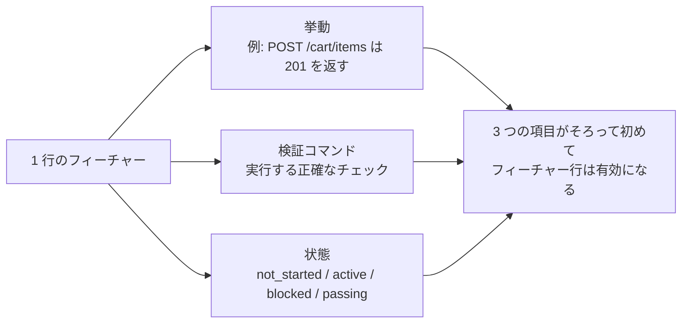
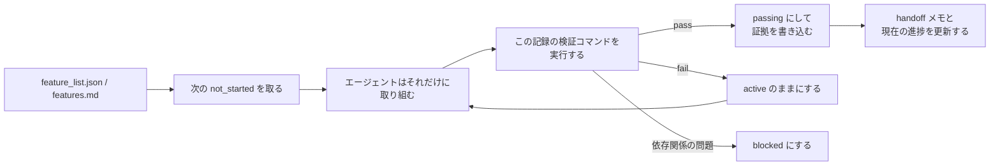

[中国語版 →](../../../zh/lectures/lecture-08-why-feature-lists-are-harness-primitives/)

> コード例: [code/](https://github.com/walkinglabs/learn-harness-engineering/blob/main/docs/en/lectures/lecture-08-why-feature-lists-are-harness-primitives/code/)
> 実践プロジェクト: [Project 04. Runtime feedback and scope control](./../../projects/project-04-incremental-indexing/index.md)

# 講義 08. フィーチャーリストを使ってエージェントの挙動を制御する

エージェントに EC サイトの構築を依頼したとします。作業が終わると、エージェントは「完了しました」と言います。ところがコードを確認すると、認証は動いている一方で、カートの注文確定ボタンは何もせず、決済は最初から接続されていません。問題は、「完了」の意味を一度も伝えていなかったことです。その結果、エージェントは独自の基準、つまり「たくさんコードを書いたし、それっぽく見える」を採用してしまったのです。

多くの人にとって、フィーチャーリストは単なるメモに見えます。忘れないように書いておいて、あとで参照するためのものです。しかし harness の世界では、フィーチャーリストは人間向けのメモではなく、harness 全体の背骨です。プランナーはタスクを選ぶためにこれを参照し、ベリファイアは完了判定のためにこれを参照し、handoff レポーターは要約を作るためにこれを参照します。背骨を折れば、体は動けません。

Anthropic も OpenAI も、**アーティファクトは外に出すべきだ**と強調しています。フィーチャーの状態は、会話の非構造化テキストではなく、リポジトリ内の機械可読なファイルとして存在しなければなりません。

## エージェントは「完了」の意味を知らない

Claude Code も Codex も、あなたが考える「完了」を自動では知りません。あなたが「カートを追加して」と言うと、モデルは「Cart コンポーネントと `addToCart` メソッドを書くこと」と解釈するかもしれません。しかし本当に意図していたのは、「ユーザーが商品を見て、カートに入れ、購入を完了できること」です。フィーチャーリストがなければ、この認識のズレは残り続けます。エージェントは暗黙の基準、たいていは「コードに目立つ構文エラーがないこと」を使います。あなたが必要としているのは、挙動のエンドツーエンドな検証です。これは、友人に果物を買ってきてと頼む場面に似ています。「果物を買って」と言ったら、相手はレモンを持ってくるかもしれません。あなたの果物と相手の果物は、同じ果物ではありません。

典型的な進捗メモを見てみましょう。

```
Did user auth, shopping cart mostly done, still need payments
```
新しいエージェントセッションは、この記録にどう返せばよいのでしょうか。「mostly done」とは何を意味するのでしょうか。カートはどのテストを通過したのでしょうか。決済を何が妨げているのでしょうか。答えはすべて、「誰にもわからない」です。これは医者に「最近はまあまあですが、腹が痛いです」とだけ伝えるようなものです。いったいどんな薬を出せばいいのでしょうか。

その結果、新しいセッションは状態の復元に 20 分を費やし、すでに完了しているフィーチャーを再実装してしまうことがあります。Anthropic のエンジニアリングデータによれば、良い進捗記録はセッション開始時の診断時間を 60〜80% 短縮します。

## フィーチャーの有限オートマトン





## 重要な概念

- **フィーチャーリストは harness のプリミティブ**: 「あれば便利な計画ツール」ではなく、harness の他のすべてのコンポーネントが依存する基礎データ構造です。データベースのテーブル構造のようなものです。「主キーなしで何とかしよう」とは言えません。
- **三項構造**: それぞれのフィーチャー記録は `(挙動の説明, 検証コマンド, 現在の状態)` の 3 要素です。どれか 1 つでも欠ければ、その記録は不完全です。
- **有限オートマトンモデル**: 各フィーチャー記録には `not_started`, `active`, `blocked`, `passing` の 4 状態があります。遷移を制御するのはエージェントではなく harness です。
- **passing 状態のゲート**: フィーチャーを `active` から `passing` に移す唯一の方法は、検証コマンドが成功することです。これは不可逆です。一度 `passing` になったら、元には戻れません。試験に合格したら合格であり、後から成績を変えることはできません。
- **単一の真実の源**: 「何をすべきか」という情報は、すべて 1 つのフィーチャーリストから来なければなりません。フィーチャーリストと会話履歴の間に矛盾があってはいけません。
- **逆圧**: まだ passing を得ていないフィーチャーの数は、harness がエージェントにかける圧力です。圧力が 0 なら、プロジェクトは完了しています。

## フィーチャーリストを「プリミティブ」にすべき理由

ドキュメントは人が読むためのもの、プリミティブはシステムが実行するためのものです。ドキュメントは無視できますが、プリミティブは回避できません。

これは、アプリケーションレベルのチェックと比べたときの、データベースにおけるトリガーや制約の違いに似ています。前者は DB エンジンによって保証され、どんな SQL でもすり抜けられません。後者はコードが正しく書かれていることに依存し、うっかり回避されることがあります。harness のプリミティブとしてのフィーチャーリストは、具体的には harness の次の 4 つのコンポーネントに役立ちます。

1. **プランナー**: 状態を読み取り、次の `not_started` フィーチャーを選びます。工場の生産計画システムのようなものです。
2. **ベリファイア**: 検証コマンドを実行し、状態変更を許可するかどうかを判断します。品質管理部門のようなものです。
3. **handoff レポーター**: フィーチャーリストからセッションの要約を自動生成します。自動的な引き継ぎ報告書のようなものです。
4. **進捗トラッカー**: 状態分布を集計し、プロジェクト健全性のメトリクスを示します。ダッシュボードのようなものです。

## 正しいやり方

### 1. 最小限のフィーチャーリスト形式を決める

複雑な仕組みは不要です。構造化された Markdown でも JSON でも構いません。重要なのは、それぞれの記録に三項構造があることです。

```json
{
  "id": "F03",
  "behavior": "POST /cart/items with {product_id, quantity} returns 201",
  "verification": "curl -X POST http://localhost:3000/api/cart/items -H 'Content-Type: application/json' -d '{\"product_id\":1,\"quantity\":2}' | jq .status == 201",
  "state": "passing",
  "evidence": "commit abc123, test output log"
}
```

### 2. 状態遷移の管理を harness に渡す

エージェントは、フィーチャーを直接 `passing` に変更できません。できるのは検証の要求を送ることだけです。harness が検証コマンドを実行し、遷移を許可するかどうかを判断します。これが「passing 状態のゲート」です。

### 3. ルールを CLAUDE.md に書く

```
## Feature List Rules
- Feature list file: /docs/features.md
- Only one feature active at a time
- Verification command must pass before marking as passing
- Don't modify feature list states yourself — the verification script updates them automatically
```

### 4. 粒度を調整する

それぞれのフィーチャー記録は、「1 回のセッションで完了できる」規模であるべきです。広すぎると終わりません。狭すぎると管理のオーバーヘッドが増えます。「ユーザーが商品をカートに追加できる」はちょうどよい粒度です。「カートを実装する」は広すぎます。「Cart モデルに `name` フィールドを作る」は狭すぎます。ステーキを切るように、丸ごとでもミンチでもいけません。

## 実例

10 個のフィーチャーを持つ EC プラットフォームを考えます。2 つの管理方法を比べてみましょう。

**メモモード**: エージェントは非構造化メモを使います。3 回のセッションが終わるころには、メモは「auth と商品一覧はやった、カートはほぼ終わりだがバグあり、決済は未着手」という状態になります。新しいセッションは状態の復元に 20 分を費やし、結局、完了済みのフィーチャーを再実装します。これは、買い物リストに「牛乳、パン、あのやつ」と書いてあるようなものです。店に行っても、結局何を買うべきか分かりません。

**背骨モード**: それぞれのフィーチャーに明確な状態と検証コマンドがあります。新しいセッションはフィーチャーリストを読んで、3 分で次のことを把握します。F01〜F05 は `passing`、F06 は `active`、F07〜F10 は `not_started`。すぐに F06 から引き継げるので、やり直しはありません。

数値化すると、構造化されたフィーチャーリストを使うプロジェクトは、自由形式の記録と比べて完了率が 45% 高く、実装の重複はゼロです。

## 主要な結論

- **フィーチャーリストは harness の背骨**であり、人間向けのメモではありません。プランナー、ベリファイア、handoff レポーターはすべてこれに依存します。
- **各フィーチャー記録には三項構造が必要**です。挙動の説明 + 検証コマンド + 現在の状態。1 要素でも欠ければ不完全です。脚を 1 本失った三脚のスツールのようなものです。
- **状態遷移を管理するのは harness** です。エージェントは自分で状態を変えられません。検証に通ることが、ステータスを上げる唯一の道です。
- **フィーチャーリストはプロジェクトの単一の真実源**です。何をすべきかという情報はすべて 1 つのリストから来ます。
- **粒度は「1 回のセッションで実行可能」になるように調整してください。**

## 参考文献

- [Effective harnesses for long-running agents - Anthropic](https://www.anthropic.com/engineering/effective-harnesses-for-long-running-agents) — フィーチャーリストが、完了の早合点とスコープ逸脱をどう抑えるかを示しています
- [Harness Engineering - OpenAI](https://openai.com/index/harness-engineering/) — 「アーティファクトを外に出す」という原則を強調しています
- [Design by Contract - Bertrand Meyer](https://www.goodreads.com/book/show/130439.Object_Oriented_Software_Construction) — コントラクトによる設計の原則であり、フィーチャーリストの理論的基盤です
- [How Google Tests Software](https://www.goodreads.com/book/show/13563030-how-google-tests-software) — テストピラミッドと、挙動仕様のためのエンジニアリング実践を扱っています

## 演習

1. **フィーチャーリストの設計**: フィーチャーリストの最小 JSON スキーマを定義してください。id、挙動の説明、検証コマンド、現在の状態、証拠へのリンクを含めてください。そして、それを 5 個のフィーチャーからなる実際のプロジェクトに適用してください。

2. **検証の厳密さを比較する**: 3 つのフィーチャーを取り上げて、「弱い」検証（たとえば「コードに構文エラーがない」）と「厳密な」検証（たとえば「エンドツーエンドテストが通る」）を設計してください。それぞれの方法で、誤検出率を比較してください。

3. **単一の真実源の監査**: 既存のエージェント付きプロジェクトを見直し、フィーチャーリストと矛盾するスコープ情報を探してください（会話に含まれる暗黙要件、コード内の TODO コメントなど）。その情報をすべてフィーチャーリストに統合する計画を立ててください。
