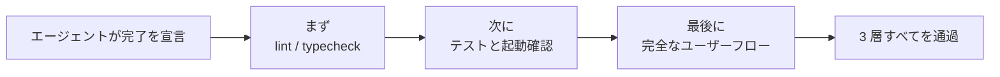
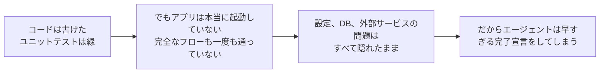

[中国語版 →](../../../zh/lectures/lecture-09-why-agents-declare-victory-too-early/)

> コード例: [code/](https://github.com/walkinglabs/learn-harness-engineering/blob/main/docs/en/lectures/lecture-09-why-agents-declare-victory-too-early/code/)
> 実践プロジェクト: [Project 05. エージェントに自分の作業を検証させる](./../../projects/project-05-grounded-qa-verification/index.md)

# 講義 09. エージェントが勝利宣言を早めてしまう理由

あなたはエージェントに「パスワードリセット」機能の実装を依頼します。するとエージェントはデータベーススキーマを変更し、API エンドポイントを書き、メールテンプレートを追加し、ユニットテストを実行します。すべてが通り、エージェントは自信満々に「完了しました」と報告します。しかし実際に動かしてみると、パスワードリセットのリンクは送信されておらず、データベースマイグレーションは途中で失敗し、エンドツーエンドのフローは一度も通っていません。

この感覚に覚えがないはずはありません。試験問題を全部埋め、自信満々に最初に提出したのに、採点で落ちるようなものです。解答欄が埋まっていることは、答えが正しいことを意味しません。

これは一度きりの話ではありません。ICML 2017 の Guo らによる古典的な論文は、**現代のニューラルネットワークは体系的に過信する**ことを示しました。つまり、モデルが示す確信度は、実際の正解率よりかなり高いのです。これはコーディング AI エージェントにも当てはまります。彼らは「終わった」と感じますが、実際には完成にはほど遠いのです。harness は、エージェントの「感覚」を、実行に基づく外部化された検証に置き換えなければなりません。

## ぬかるんだ坂

勝利宣言が早まるケースには、ほとんど決まったパターンがあります。コードは見た目には問題なさそうで、構文は正しく、ロジックももっともらしく、静的解析でも目立つエラーは出ません。しかし harness は実行の包括的な検証をしていないため、エージェントは実際の実行を飛ばすか、一部のテストしか走らせません。ユニットテストは実行しても、統合テストは省きます。テストは回しても、カバレッジは確認しません。結果として、「コードは問題なさそう」が「機能は完成した」の証拠として扱われてしまいます。そして試験問題は提出されます。

この過程では、各段階で情報が失われます。仕様からコード実装へ、そして runtime の挙動へと進むたびに、変換のたびに歪みが入り得ます。さらに、検証を省くほど、その情報の非対称性は大きくなります。

## 三層の完了確認





## 重要な概念

- **勝利宣言の早まり**: エージェントがタスク完了を主張しているのに、正しさに関する未達の要件がまだ残っている状態です。問題の核心は、エージェントがコード単体の局所的な確信だけで判断してしまうことにあります。一方で、システムとしての正しさには全体的な検証が必要です。
- **信頼度キャリブレーションの歪み**: エージェントが自分の完了確信を自己評価したときの値と、実際の完了品質との間にある体系的なズレです。複雑な複数ファイルのタスクでは、このズレは大きく正方向に寄りがちです。つまり、エージェントは実際の成果より常に自信過剰です。試験後に毎回自分の点数を高めに見積もる学生のようなものです。
- **完了条件**: harness によって定義された、明確で実行可能な条件の集合です。エージェントは「完了した」と宣言する前に、すべての条件を満たさなければなりません。「完了」は主観的な判断ではなく、客観的な定義になります。
- **検証-妥当性確認の二段ゲート**: 1 つ目の層は「コードが指定された挙動を正しく実装しているか」を検証し、2 つ目の層は「システム全体の挙動がエンドツーエンドの要件を満たしているか」を確認します。完了とみなすには、両方を通過する必要があります。
- **runtime シグナルのフィードバック**: プログラム実行時のログ、プロセス状態、ヘルスチェックです。これらは、完了品質を判断するための harness の客観的な根拠になります。
- **完了優先制約**: まず機能の正しさを検証し、次に性能、最後にスタイルを確認します。主要機能が検証されるまではリファクタリングを禁止します。

## ユニットテストに通った = 仕事が終わった、ではない

これは最もありがちで、しかも最も危険な落とし穴です。エージェントはコードを書き、ユニットテストを実行し、すべて緑になったので「完了」と言います。しかし、ユニットテスト設計の哲学は、テスト対象モジュールを孤立させ、依存関係をモック化することです。まさにそれが、コンポーネント間の相互作用の問題を見つけにくくしてしまいます。

**インターフェースの不一致**: レンダリングプロセスが preload スクリプトへ渡すファイルパスは相対パスですが、preload スクリプトは絶対パスを想定しています。それぞれのユニットテストはどちらもモックを使っていたため、両方とも通過しました。問題が見つかるのはエンドツーエンドテストだけです。バンドの各演奏者がそれぞれ完璧に演奏しているのに、一緒に演奏すると全員が別々の調で弾いていたと分かるようなものです。

**状態伝播の問題**: データベースマイグレーションがテーブルスキーマを変更しても、ORM のキャッシュ層には旧スキーマのキャッシュエントリが残ったままです。ユニットテストでは毎回クリーンなモック環境が与えられるため、こうした層をまたぐ状態の不整合は検出できません。

**環境依存**: コードはテスト環境では問題なく動いても、本番環境では設定差、ネットワーク遅延、サービス停止などの理由で失敗します。リハーサル室では完璧に歌えても、ステージ上では音響機器の問題でうまくいかないようなものです。

### 「ついでにリファクタしよう」は完了判定の毒

Claude Code にはよくある行動パターンがあります。主要機能の検証が終わる前に、コードのリファクタリングや性能最適化、スタイル改善を始めてしまうのです。クヌースの「早すぎる最適化は諸悪の根源」という言葉は、エージェントの文脈では新しい意味を持ちます。リファクタリングは、検証済みコードと未検証コードの境界を変えてしまい、以前は暗黙に正しかった実行経路を壊す可能性があるからです。まだ問題を解いている途中なのに下書きを清書し直すようなもので、時間の無駄になるだけでなく、誤って書き写してしまう危険もあります。

### 自己評価の体系的な歪み

Anthropic は 2026 年の研究で、より深刻な失敗パターンを見つけました。**エージェントに自分自身の作業を評価させると、第三者から見れば明らかに不十分な品質であっても、体系的に甘い評価を下す**のです。これは学生に自分の答案を採点させるようなもので、どうしても自分に甘くなります。

この問題は、とくに美的デザインのような主観的なタスクで顕著です。たとえば「レイアウトが洗練されているか」は主観的判断であり、エージェントは高めに偏りがちです。検証可能な成果物があるタスクでも、評価の弱さがエージェントの性能を制限することがあります。

解決策は、エージェントを「もっと客観的」にすることではありません。同じモデルが生成も評価も行う以上、本質的に自分に甘くなりやすいからです。**解決策は「実行者」と「検証者」を分けることです。** 学生が自分の試験を採点すべきではないのと同じで、独立した採点者が必要です。

「厳しめ」に調整された独立評価エージェントは、生成エージェント自身の自己評価よりもずっと効果的です。Anthropic の実験データは次のとおりです。

| アーキテクチャ | 時間 | コスト | 主要機能は動く？ |
|--------------|---------|------|------------------------|
| 単一エージェント（bare run） | 20 分 | $9 | いいえ（ゲーム内オブジェクトが入力に反応しない） |
| 3 エージェント（planner + generator + evaluator） | 6 時間 | $200 | はい（ゲームが完全にプレイ可能） |

これは同じモデル（Opus 4.5）に、同じプロンプト（「2D レトロゲームエディタを作成する」）を与えたものです。違いは harness だけです。つまり、「bare run」から「planner が要件を展開する → generator が機能ごとに実装する → evaluator が Playwright で実際にクリックテストする」へ変えたということです。

> 出典: [Anthropic: Harness design for long-running application development](https://www.anthropic.com/engineering/harness-design-long-running-apps)

## 早すぎる完了宣言を防ぐ方法

### 1. 完了判断を外部化する

完了かどうかの判断は、エージェント自身に委ねてはいけません。harness は、エージェントの確信ではなく runtime シグナルを入力として、完了を独立に検証する必要があります。これを `CLAUDE.md` に明確に書いてください。

```
## 完了の定義
- 機能が完了した = コードを書いた、ではなく、エンドツーエンドの検証を通過した
- 必要な検証レベル:
  1. ユニットテストに通過
  2. 統合テストに通過
  3. エンドツーエンドのフロー検証に通過
- レベル 1 に通らない限り、レベル 2 に進まない
- レベル 2 に通らない限り、レベル 3 に進まない
```

### 2. 三層の完了バリデーションを構築する

- **層 1: 構文と静的解析**。コストは最小で、得られる情報も最小ですが、必ず通すべき層です。まず単語を正しく書けなければ、その先はありません。
- **層 2: runtime 挙動の検証**。テストの実行、アプリ起動確認、重要経路の妥当性確認です。これが完了の主たる証拠になります。書くだけでは不十分で、実際に動かなければなりません。
- **層 3: システム全体の確認**。エンドツーエンドテスト、統合検証、ユーザーシナリオのシミュレーションです。早すぎる完了宣言に対する最後の防衛線です。動くだけでは不十分で、正しく動かなければなりません。

### 3. エージェント向けのよい「赤入れ」を作る

OpenAI は Codex の実践の中で、特に有効なパターンを導入しています。**エージェント向けのエラーメッセージには、修正方法の指示を含めるべきです。** 単に大きな赤いバツ印を出すだけの雑な検査役になってはいけません。よい先生のように、「どう直すべきか」を余白に書いてください。`"Test failed"` とだけ書くのではなく、`"Test failed: POST /api/reset-password returned 500. Check that the email service configuration exists in environment variables. The template file must be in templates/reset-email.html."` のように書きます。この具体的で実行可能なフィードバックがあれば、人手を介さずにエージェント自身が修正できます。

### 4. runtime シグナルを集める

有効な runtime シグナルには、次のようなものがあります。
- アプリが正常に起動し、ready 状態に到達したか
- 実行中に重要な機能パスが正しく動いたか
- DB 書き込み、ファイル操作、その他の副作用が正しかったか
- 一時リソースが適切にクリーンアップされたか

## 実例

**課題**: ユーザーのパスワードリセット機能を実装する。データベース操作、メール送信、API エンドポイントの修正が含まれます。

**早すぎる完了の流れ**: エージェントは DB スキーマを変更し、API エンドポイントを書き、メールテンプレートを追加し、ユニットテストを実行して通過し、完了を宣言します。試験問題はすべて埋まりました。

**実際の減点要因**: (1) エンドツーエンドのフローが未検証で、実際の送信とリセットリンクの検証は一度も確認されていませんでした。 (2) DB マイグレーションが部分実行後に失敗し、スキーマの不整合を引き起こしました。 (3) 目標環境にはメールサービスの設定がありませんでした。

**harness の介入**: 完了バリデーションを強制します。(1) 完全なアプリを起動して、リセットエンドポイントが到達可能か確認する。 (2) パスワードリセットの全フローを実行する。 (3) DB 状態の一貫性を検証する。セッション内でこれらの欠陥はすべて検出され、後続の修正コストを 5 倍から 10 倍節約できました。独立した検証者が本当の問題を見つけたのです。

## 要点

- **エージェントは体系的に過信する**。信頼度キャリブレーションの歪みは客観的な事実です。試験問題が埋まっていることと、答えが正しいことは別です。
- **完了判断は外部化すべき**。harness が独立に検証し、エージェントの「感覚」を信じてはいけません。学生は自分の試験を採点できません。
- **3 層すべての検証が必要**。構文が通り、挙動が通り、システムが通る。この順で進めます。
- **エラーメッセージはよい先生の赤入れのようにする**。エージェントが自力で直せるよう、具体的な修正手順を含めてください。
- **主要機能の検証前にリファクタリングしない**。完了優先制約は、早すぎる最適化を防ぐ鍵です。

## 参考文献

- [On Calibration of Modern Neural Networks - Guo et al.](https://arxiv.org/abs/1706.04599) — 現代の深層ネットワークが体系的に過信することを示す
- [Building Effective Agents - Anthropic](https://www.anthropic.com/research/building-effective-agents) — 完了判断における runtime 証拠の重要性
- [Harness Engineering - OpenAI](https://openai.com/index/harness-engineering/) — 早すぎる完了宣言は、エージェントの主要な失敗モードの 1 つ
- [The Art of Software Testing - Myers](https://www.goodreads.com/book/show/137543.The_Art_of_Software_Testing) — テスト手法の階層と有効性に関する古典的な参考書

## 演習

1. **完了バリデーション機能の設計**: DB マイグレーションと API 修正を含むタスク向けに、完全な完了バリデーションを設計してください。必要な runtime シグナルと、それぞれのシグナルに対する合格・不合格条件を列挙してください。実際のタスクに適用し、どの隠れた問題を検出したか記録してください。

2. **キャリブレーションの歪み測定**: 10 種類の異なるコーディングタスクを選び、完了時点でのエージェントの自己申告の確信度と、実際の完了品質を記録してください。ズレの値を算出し、タスクの難易度との関係を分析してください。

3. **多層防御の実験**: 1 つのタスクセットに対して、3 つの構成を実行してください。(a) 静的解析のみ、(b) ユニットテストを追加、(c) 完全な三層バリデーション。早すぎる完了宣言の割合と、見逃された欠陥の数を比較してください。
