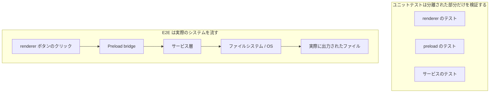
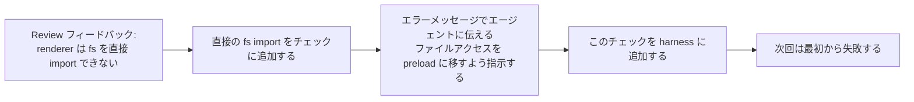

[中国語版 →](../../../zh/lectures/lecture-10-why-end-to-end-testing-changes-results/)

> コード例: [code/](https://github.com/walkinglabs/learn-harness-engineering/blob/main/docs/en/lectures/lecture-10-why-end-to-end-testing-changes-results/code/)
> 実践プロジェクト: [Project 05. Let the agent verify its own work](./../../projects/project-05-grounded-qa-verification/index.md)

# 講義 10. エンドツーエンドテストは結果を変える

あなたは Electron アプリにファイルのエクスポート機能を追加するようエージェントに依頼します。エージェントは renderer プロセスのコンポーネント、preload スクリプト、サービス層のロジックを書きます。各コンポーネントのユニットテストはすべて完璧に通ります。エージェントは「完了しました」と言います。ところが実際にエクスポートボタンを押すと、ファイルパスの形式が間違っていて、進捗バーは更新されず、大きなファイルのエクスポートではメモリリークが発生します。コンポーネント境界で 5 つの不具合がありましたが、ユニットテストは 1 つも検出できませんでした。

これは合唱のリハーサルのようなものです。各パートは個別には完璧に聞こえるのに、一緒に歌うとソプラノがバスより半拍速く、伴奏が主旋律と半音ずれてしまう。各部分は「正しい」かもしれませんが、全体としては不協和音です。

テストピラミッドが示しているのは、ユニットテストを大量に積み上げることは土台として重要だが、それだけで止まるとコンポーネント間の相互作用の問題を体系的に取りこぼす、ということです。AI コーディングエージェントにとってはこの問題はさらに深刻です。エージェントは最速のテストだけを実行して、仕事が終わったと宣言しがちだからです。**エンドツーエンドテストは、ユニットテストや統合テストだけでは見えにくい システム的な欠陥を明らかにできます。しかし、どのテスト層も欠陥が存在しないことを証明するものではありません。**

## ユニットテストの盲点

ユニットテスト設計の哲学は分離です。依存関係をモック化し、テスト対象のモジュールだけに集中します。この哲学はユニットテストを高速かつ正確にしますが、同時に体系的な盲点も生みます。まるでイヤホンを付けたまま合唱の練習をしているようなものです。個々には問題なく聞こえても、合唱したときにだけ問題が見つかります。

**インターフェースの不一致**: renderer プロセスから preload スクリプトへ渡されるファイルパスは相対パスなのに、preload スクリプトは絶対パスを期待している。両者のユニットテストはどちらもモックを使って通過していた。問題が見つかるのはエンドツーエンドの流れを実行したときだけです。まるで 2 つの声部が別々に練習していて調子は良いのに、合わせてみたら片方が 4/4、もう片方が 3/4 で歌っていた、というようなものです。

**状態伝播の誤り**: データベースのマイグレーションでテーブルスキーマが変わったのに、ORM のキャッシュ層には古いスキーマのキャッシュが残っている。ユニットテストは毎回まっさらなモック環境を使うため、こうした層をまたぐ状態の不整合を検出できません。歌詞が変わったのに、誰かがまだ古い版を歌っているようなものです。

**リソースライフサイクルの問題**: ファイルディスクリプタ、DB 接続、ネットワークソケットの取得と解放は複数のコンポーネントにまたがります。ユニットテストはテストごとに独立したリソースを作って破棄するため、リソース競合やリークを見逃します。まるで合唱団が順番にマイクを使うリハーサルでは問題ないのに、いざ全員が同時に舞台に立つとマイクが足りないようなものです。

**環境依存性**: コードはテスト環境では正しく動くのに、実環境では設定差、ネットワーク遅延、サービス停止によって失敗する。まるでリハーサル室では完璧なのに、野外フェスでは音響フィードバックや風の影響で崩れるようなものです。

## エンドツーエンドテストは結果を変えるだけでなく、振る舞いも変える

多くの人が見落としがちなのはここです。エージェントが自分の仕事にエンドツーエンドテストが課されると知っていると、コーディング時の振る舞いそのものが変わります。

1. **コンポーネント間の相互作用を意識する**: コードを書くとき、単一の関数だけでなく「このインターフェースは上流とどうつながるのか」を考えるようになります。最終的に一緒に歌うと分かっていれば、リハーサル中から他のパートに注意を払うのと同じです。
2. **アーキテクチャ境界を尊重する**: アーキテクチャ上の制約があるシステムでは、エンドツーエンドテストが境界ルールを守らせます。まるで「ここでクレッシェンド」と書かれた譜面の指示に従うようなものです。
3. **失敗経路を処理する**: エンドツーエンドテストには失敗シナリオが含まれることが多く、エージェントに例外処理を考えさせます。まるでリハーサルで「マイクが突然死んだらどうするか」をシミュレーションしておくようなものです。

## テストピラミッドと review フィードバックの前進





OpenAI のハーネスエンジニアリングでは、**エージェント向けのエラーメッセージには修正の指示を含めるべきだ**と強調されています。単に `"Direct filesystem access in renderer"` と書くのではなく、`"renderer からのファイルシステム直接アクセス。すべてのファイル操作は preload bridge 経由にしてください。この呼び出しを `preload/file-ops.ts` に移し、`window.api` 経由で呼び出してください。"` と書くべきです。これによって、アーキテクチャルールが自己修正ループに変わります。合唱の指揮者が単に「歌い方が違う」と言うのではなく、「ここは半拍速い。アルトのリズムを聞いて、32 小節目で入って」と具体的に伝えるのと同じです。

## 重要な概念

- **コンポーネント境界での欠陥**: コンポーネント A と B はそれぞれのユニットテストに通るのに、その相互作用が誤動作を生む。これはまさにエンドツーエンドテストが最もよく捉える種類の問題です。個別には正しいのに、合わさると不協和音になる合唱のようなものです。
- **テストレイヤーの組み合わせ**: ユニットテスト、統合テスト、エンドツーエンドテストは、それぞれ異なる種類の欠陥をよりよく捉えます。上位のレイヤーほど実システムの振る舞いに近いですが、下位のテストを置き換えるものではありません。
- **アーキテクチャ境界の強制**: アーキテクチャ文書にあるルール（たとえば「renderer プロセスはファイルシステムに直接アクセスできない」）を、実行可能で自動化されたチェックに変えることです。「紙に書いてある」から「CI で確実に守られる」へ移します。
- **review フィードバックの前進**: code review で繰り返し出るコメントを自動テストに変換することです。繰り返しの問題が見つかるたびにルールを追加し、harness を自動的に強化します。まるで指揮者がよくあるリハーサルミスをウォームアップに変えるように、次回からは同じミスが指揮者の助けなしに検出されます。
- **エージェント向けのエラーメッセージ**: 失敗メッセージは「何が起きたか」を伝えるだけでなく、どう直すかまで正確に伝えるべきです。これにより、テスト失敗が自己修正型のフィードバックループになります。

## 実践方法

### 0. まずアーキテクチャ境界を定義し、その後で E2E テストを書く

エンドツーエンドテストの前提は、明確なシステム境界です。アーキテクチャがスパゲッティ状態なら、エンドツーエンドテストは「このスパゲッティは動いている」とは示せても、設計意図がどこで壊れたかは教えてくれません。まるでパート分けすらされていない合唱のようなものです。どれだけ練習しても、うまくは聞こえません。

OpenAI の経験では、**エージェント生成コードベースでは、アーキテクチャ制約は最初から設定すべき初期条件であり、チームが大きくなってから考えるものではありません。** 理由は単純で、エージェントはリポジトリ内の既存パターンをそのままコピーするからです。たとえそのパターンが不揃いでも、最適でなくてもです。アーキテクチャ制約がなければ、エージェントはセッションごとに偏りをさらに増やしてしまいます。

OpenAI は「Multi-layer domain architecture」を採用しています。各ビジネスドメインは Types → Config → Repo → Service → Runtime → UI という固定された層に分かれています。依存関係は厳密に前方向へ流れ、ドメインをまたぐ処理は明示的な Providers インターフェースを通して入ります。それ以外の依存関係は禁止され、カスタムリンティングで機械的に強制されます。

重要な原則は、**実装を細かく指示するのではなく、不変条件を強制すること**です。たとえば「データは境界でパースされるべき」とは要求しても、どのライブラリを使うかまでは指定しません。エラーメッセージには修正手順を含めるべきです。単に「違反だ」と言うのではなく、エージェントにどう変えるべきかを正確に伝えます。

> Source: [OpenAI: Harness engineering: leveraging Codex in an agent-first world](https://openai.com/index/harness-engineering/)

### 1. Harness にエンドツーエンド層を含める

検証プロセスにこれを明示してください。コンポーネントをまたぐ変更を含むタスクでは、エンドツーエンドテストが通ることを完了条件にします。

```
## 検証の階層
- レベル 1: ユニットテスト（通過必須）
- レベル 2: 統合テスト（通過必須）
- レベル 3: エンドツーエンドテスト（コンポーネントをまたぐ変更では通過必須）
- 必須レベルのいずれかに失敗 = 未完了
```

### 2. アーキテクチャルールを実行可能なチェックに変える

各アーキテクチャ制約には、それに対応するテストかリンティングルールが必要です。

```bash
# renderer プロセスが Node.js API を直接呼んでいないか確認する
grep -r "require('fs')" src/renderer/ && exit 1 || echo "OK: renderer に direct fs access はない"
```

### 3. エージェント向けのエラーメッセージを設計する

失敗メッセージには 3 つの要素を含めます。何が起きたか、なぜか、どう直すかです。

```
ERROR: src/renderer/App.tsx:12 で 'fs' の直接 import を検出しました
WHY: renderer プロセスは安全上の理由から Node.js API にアクセスできません
FIX: ファイル操作を src/preload/file-ops.ts に移し、window.api.readFile() 経由で呼び出してください
```

### 4. review フィードバックの前進プロセスを確立する

code review で新しいタイプのエージェントの誤りが見つかるたび、それを自動チェックに変換します。1 か月後には、harness は開始時より大幅に強くなっています。まるで合唱リハーサルのメモのように、各回で見つかった問題を記録し、次回の前に確認するのです。時間がたつほど典型的なミスは減り、音楽はより調和します。

## 実例

**課題**: Electron アプリでファイルのエクスポート機能を実装する。renderer の UI、preload スクリプトによるファイルシステムのプロキシ、サービス層でのデータ変換が含まれます。

**パート練習（ユニットテスト通過）**: renderer コンポーネントのテスト（通過、ファイル操作はモック化）、preload スクリプトのテスト（通過、ファイルシステムはモック化）、サービス層のテスト（通過、データソースはモック化）。エージェントは完了を宣言します。

**合奏（エンドツーエンドテストで見つかった欠陥）**:

| 欠陥 | 説明 | ユニットテスト | E2E |
|--------|-------------|-----------|-----|
| インターフェースの不一致 | ファイルパス形式の不整合 | 見逃し | 検出 |
| 状態の伝播 | エクスポート進捗が IPC 経由で UI に戻らない | 見逃し | 検出 |
| リソースリーク | 大きなファイルのエクスポート時にディスクリプタが解放されない | 見逃し | 検出 |
| 権限の問題 | パッケージ化環境で権限が異なる | 見逃し | 検出 |
| エラー伝播 | サービス層の例外が UI 層まで届かない | 見逃し | 検出 |

5 つすべての欠陥がエンドツーエンドテストで検出され、ユニットテストは 1 つも捉えられませんでした。テスト時間が 2 秒から 15 秒に増えるコストは、エージェントの workflow では十分に許容できます。各パートがどれほど上手く個別に歌えても、全体の合奏リハーサルの代わりにはなりません。

## 重要なポイント

- **ユニットテストはコンポーネント境界の欠陥に体系的に弱い** - 分離という設計そのものが、相互作用の問題を見つけにくくしています。全員が正しく歌っているからといって、合唱が不協和音でないとは限りません。
- **エンドツーエンドテストは欠陥を見つけるだけでなく、エージェントのコーディング行動も変える** - 統合と境界により強く注意を向けるようになります。
- **アーキテクチャルールは実行可能であるべき** - 文書に書いておいて読まれるのを待つのではなく、各コミットで自動的に検証される必要があります。
- **エラーメッセージはエージェント向けに設計すべき** - 具体的な修正手順を含めて、自己修正ループを作ります。
- **review フィードバックの前進は harness を自動的に強化する** - 捕捉された欠陥の各カテゴリが、恒久的な防衛線になります。

## 追加の読み物

- [How Google Tests Software - Whittaker et al.](https://www.goodreads.com/book/show/13563030-how-google-tests-software) — テストピラミッドの古典的な資料
- [Harness Engineering - OpenAI](https://openai.com/index/harness-engineering/) — アーキテクチャ制約を自動的に実行するための実践
- [Chaos Engineering - Netflix (Basiri et al.)](https://ieeexplore.ieee.org/document/7466237) — システムの耐障害性を検証するための予防的な故障注入
- [QuickCheck - Claessen & Hughes](https://www.cs.tufts.edu/~nr/cs257/archive/john-hughes/quick.pdf) — 例示ベースのテストと形式検証の中間にある property ベーステストの手法

## 演習

1. **コンポーネント間欠陥の検出**: 少なくとも 3 つのコンポーネントを含む変更タスクを選びます。まずユニットテストだけを実行して結果を記録し、その後でエンドツーエンドテストを実行します。追加で見つかった各欠陥が、どの種類のクロスレイヤー相互作用に属するかを分析してください。

2. **アーキテクチャルールの自動化**: 自分のプロジェクトからアーキテクチャ制約を 1 つ選び、実行可能なチェックに変えます（エージェント向けのエラーメッセージ付きで）。それを harness に統合し、基本タスクで効果を検証してください。

3. **review フィードバックの前進**: code review の履歴から繰り返し出るコメントを 1 つ見つけ、5 段階のプロセスを使って自動チェックへ変換します。問題の発生頻度を、前後で比較してください。
