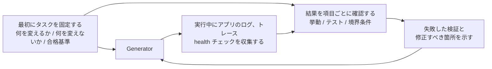

[中国語版 →](../../../zh/lectures/lecture-11-why-observability-belongs-inside-the-harness/)

> コード例: [code/](https://github.com/walkinglabs/learn-harness-engineering/blob/main/docs/en/lectures/lecture-11-why-observability-belongs-inside-the-harness/code/)
> 実践プロジェクト: [プロジェクト 06. 完全な harness (Capstone)](./../../projects/project-06-runtime-observability-and-debugging/index.md)

# 講義 11. エージェントのランタイムを観測可能にする

## この講義は何を解決するのか?

エージェントに機能の実装を依頼します。すると 20 分かけて大量のファイルを変更し、「完了しましたが、2 つのテストが失敗しています」と報告してきます。理由を尋ねると、「はっきりしません。タイミングの問題かもしれません」と返ってきます。どの重要な処理経路を変更したのかを尋ねると、「コードを見せてください…」となります。

問題はエージェントの能力不足ではありません。あなたの harness に十分な観測可能性がないのです。**観測可能性がなければ、エージェントは不確実な状況で判断し、評価は主観的な見解に変わり、リトライは盲目的な試行錯誤になります。** OpenAI も Anthropic も、信頼性を証拠の問題として定義しています。つまり harness は、次の判断を導ける形で、実行時の挙動と評価シグナルを明らかにしなければなりません。

## 重要な概念

- **ランタイム観測可能性**: ログ、トレース、プロセスイベント、ヘルスチェックといったシステムレベルのシグナルです。問いは「システムが何をしたか」です。
- **プロセス観測可能性**: harness の判断アーティファクト、つまり計画、評価ルーブリック、受け入れ基準の可視性です。問いは「なぜこの変更を受け入れるべきか」です。
- **タスクトレース**: 分散システムにおけるリクエストトレースに相当する、タスク開始から完了までの判断経路の完全な記録です。コンテキスト付きで、エージェントの各ステップを記録します。
- **Sprint contract**: コーディング開始前に合意する短期契約です。タスクのスコープ、検証基準、例外を定義します。プロセス観測可能性の中核です。
- **評価ルーブリック**: 品質評価を主観から、証拠に基づく構造化された採点体系へ変えます。同じ出力に対して、異なる評価者でも近い結果を出しやすくします。
- **多層観測可能性**: システムレベルとプロセスレベルの観測可能性を同時に設計し、互いを強化する考え方です。ランタイム信号は挙動を説明し、プロセスアーティファクトは意図を説明します。

## 多層観測可能性



## なぜそうなるのか

### 観測可能性がないことの本当のコスト

harness に観測可能性がないと、次の 4 種類の問題が体系的に発生します。

**「正しい」と「正しそうに見える」を区別できない**: コードレビューでは関数が完璧に見えます。構文は正しく、ロジックも筋が通っています。ですが実行時には、境界ケースの処理ミスにより、特定の入力で誤った結果が出ます。実際の実行経路が期待から外れていることを示せるのは、ランタイムトレースだけです。

**評価が神秘化する**: 評価ルーブリックや受け入れ基準がなければ、評価者（人でもエージェントでも）は暗黙の前提に頼ることになります。同じ出力でも、別々の確認者からまったく違う評価を受けることがあります。品質評価は再現不能になります。

**リトライが盲目的な推測になる**: 何が失敗したのかをエージェントが理解できないと、リトライの方向も偶然に左右されます。関係のないコード経路を直し続け、本当の根本原因を無視するかもしれません。盲目的なリトライは、そのたびにトークンと時間を消費します。

**セッション引き継ぎ時の情報断絶**: 未完了の作業を次のセッションへ引き継ぐとき、観測可能性が欠けていると、新しいセッションはシステム状態をゼロから診断しなければなりません。長時間稼働するエージェントに関する Anthropic の観察では、この余分な診断だけでセッション全体の 30〜50% を消費することがあります。

### Claude Code を使った実例

「planner-generator-evaluator」の 3 役ワークフローを持つ harness で、「アプリにダークテーマを追加する」タスクを考えてください。

**観測可能性がない場合**: planner は曖昧な説明を出します。generator はその曖昧さをもとにダークテーマを実装しますが、planner の暗黙の期待とは一致しません。evaluator は自分自身の暗黙の基準で結果を却下しますが、何が問題なのかを正確には説明できません。generator は曖昧な却下理由をもとに盲目的に再試行します。このサイクルが 3〜4 回繰り返され、約 45 分かかり、なんとか受け入れられる程度の成果しか得られません。

**完全な観測可能性がある場合**: planner は sprint contract を出します。そこには、変更対象のコンポーネント、各コンポーネントの検証基準、例外事項（印刷用スタイルは対象外）が含まれます。generator は契約に従って実装します。ランタイム観測可能性により、各コンポーネントのスタイル読み込みと適用の流れが記録されます。evaluator は証拠への具体的な参照を伴う、スコア付きルーブリックで評価します。1 回の反復で高品質な成果が得られ、所要時間は約 15 分です。

効率は 3 倍になります。変えたのは観測可能性だけです。

### なぜエージェント自身では解決できないのか

「なぜエージェント自身がログを出力しないのか」と思うかもしれません。問題は次のとおりです。

1. エージェントは、自分が知らないことを知らないため、必要だと気づいていないシグナルを自発的に記録しません。
2. ログ形式が統一されません。セッションごとにログ形式が異なるため、体系的な分析ができません。
3. プロセス観測可能性はログだけでは解決できません。sprint contracts や評価ルーブリックは構造化されたアーティファクトであり、harness レベルの支援が必要です。

## 正しいやり方

### 1. ランタイムシグナルの収集を harness に組み込む

エージェントが自分でログを出力することに期待してはいけません。harness が次のシグナルを自動収集すべきです。

- **アプリケーションのライフサイクル**: startup, ready, running, shutdown の各フェーズの状態
- **機能パスの実行**: エントリポイント、チェックポイント、出口を含む重要経路の実行記録
- **データフロー**: コンポーネント間のデータの流れに関する記録
- **リソース使用**: 異常なリソース使用パターン（たとえば、増え続けるメモリ）
- **エラーと例外**: 単なるエラーメッセージではなく、完全なエラーコンテキスト

### 2. Sprint Contract を導入する

各タスクを始める前に、generator と evaluator（同じエージェントの別呼び出しでもよい）が契約を合意します。

```markdown
# Sprint Contract: Dark Mode Support

## Scope
- Modify the theme toggle component
- Update global CSS variables
- Add dark mode tests

## Verification Standards
- Visual regression tests pass for each component
- Main flow end-to-end tests pass
- No flash of unstyled content (FOUC)

## Exclusions
- Not handling print styles
- Not handling third-party component dark mode
```

### 3. 評価ルーブリックを設定する

「良いか悪いか」を定量的な採点体系に変えます。

```markdown
# Scoring Rubric

| Dimension | A | B | C | D |
|-----------|---|---|---|---|
| Code correctness | All tests pass | Main flow passes | Partial pass | Build fails |
| Architecture compliance | Fully compliant | Minor deviations | Obvious deviations | Serious violations |
| Test coverage | Main + edge cases | Main flow only | Only skeleton | No tests |
```

### 4. OpenTelemetry で標準化する

harness の各セッションに trace を、各タスクに span を、各検証ステップに sub-span を作成します。重要情報の注釈には標準属性を使ってください。こうすることで、観測データを標準的なツールチェーン（Jaeger, Zipkin）へ統合できます。

## 実例

「planner-generator-evaluator」ワークフローを使い、「ダークテーマ対応を追加する」タスクを実行する harness を考えます。

**観測可能性なしの版**: 3〜4 ラウンドの盲目的なリトライ、45 分、なんとか受け入れられる程度の結果。評価者は「何か違う」と言うものの、何が違うのかは説明できません。generator は的外れな方向に多くの時間を費やします。

**完全に観測可能な版**:
- Sprint contract がスコープ、基準、例外を明確にする
- ランタイムトレースが各コンポーネントのスタイル読み込みプロセスを記録する
- スコア付きルーブリックが、測定軸ごとの構造化された評価を可能にする
- 1 回の反復で高品質な成果が得られ、所要時間は 15 分

効率は 3 倍になり、品質は安定し、評価は再現可能になります。

## 要点

- **観測可能性は harness のアーキテクチャ特性です** - 後付けの機能ではなく、設計時に考慮すべき中核能力です。
- **観測可能性は 2 層とも必要です** - ランタイム信号は「何が起きたか」を説明し、プロセスアーティファクトは「なぜそうしたか」を説明します。
- **Sprint contracts は事前に認識を揃えます** - 「generator は作ったが、evaluator が予測可能な理由で即座に却下する」状況を防ぎます。
- **スコア付きルーブリックは評価を再現可能にします** - 異なる評価者でも、同じ出力に対して似たスコアを出します。
- **観測可能性がないと、セッション時間の 30〜50% が余分な診断に消えます。**

## 参考文献

- [Observability Engineering — Charity Majors](https://www.honeycomb.io/blog/observability-engineering-book) — 現代の観測可能性エンジニアリングの理論と実践
- [Dapper — Google (Sigelman et al.)](https://research.google/pubs/pub36356/) — 大規模分散トレーシングの画期的な実践
- [Harness Design — Anthropic](https://www.anthropic.com/engineering/harness-design-long-running-apps) — sprint contracts と evaluator ルーブリックの導入
- [Site Reliability Engineering — Google](https://sre.google/sre-book/table-of-contents/) — プロダクションシステムにおける観測可能性の体系的な適用

## 演習

1. **観測可能性ギャップの分析**: 現在の harness を、システムレベルとプロセスレベルの観測可能性の観点から監査してください。既存のシグナルでは区別できないシステム状態を見つけ、追加案を提案してください。

2. **Sprint Contract の実践**: 実際のタスクに対する sprint contract を書いてください。エージェントに契約どおり実行させ、契約ありと契約なしで効率と品質を比較してください。

3. **タスクトレースの構築**: 完全なコーディングタスクの間、エージェントの各操作ステップを記録してください。OpenTelemetry の意味論的規約で注釈を付けてください。トレース内の情報のボトルネックを分析し、どのステップで意思決定に必要なシグナルが不足しているかを特定してください。
