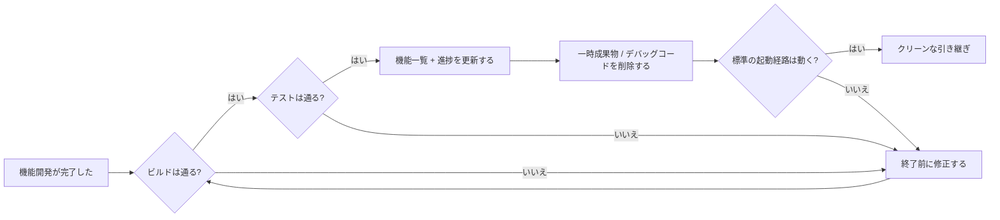
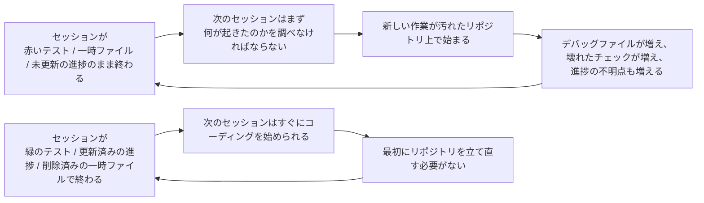

[中国語版へ →](../../../zh/lectures/lecture-12-why-every-session-must-leave-a-clean-state/)

> コード例: [code/](https://github.com/walkinglabs/learn-harness-engineering/blob/main/docs/en/lectures/lecture-12-why-every-session-must-leave-a-clean-state/code/)
> 実践プロジェクト: [プロジェクト 06. 本格的な harness (Capstone)](./../../projects/project-06-runtime-observability-and-debugging/index.md)

# 講義 12. 各セッションの最後には必ずクリーンな状態を残す

## この講義はどんな問題を解決するのか?

エージェントが1日中動き続け、20ファイルを変更し、コードをコミットして、セッションが終わります。次のエージェントのセッションが始まると、すぐにこう気づきます。ビルドは壊れ、テストは赤く、あちこちに一時的なデバッグファイルが残り、機能一覧は更新されておらず、進捗はまったく不明です。新しいセッションは最初の30分を、ただ「前のセッションは何をしていたのか」を解明することに費やします。

OpenAI も Anthropic もはっきり述べています。**長期的な信頼性は、1回の実行の成功だけでなく、運用上の規律に依存する**のです。セッション終了時の状態の質が、その次のセッションの効率を直接左右します。これは Git のベストプラクティスに似ています。各コミットは、未完成のコードの寄せ集めではなく、原子的でコンパイル可能な変更であるべきです。

## 重要な概念

- **クリーンな状態**: セッションの終わりに、システムが5つの条件を満たしていることです。ビルドが通り、テストが通り、進捗が記録され、古い成果物がなく、起動経路が使えることです。1つでも欠ければ、そのセッションは「完了」していません。
- **セッションの整合性**: DB トランザクションに似ています。完全にコミットしてクリーンな状態を残すか、最後の整合した状態まで巻き戻すかのどちらかです。中間はありません。
- **品質ドキュメント**: 各モジュールの品質評価を継続的に記録するアクティブな成果物です。一度きりの評価ではなく、コードベースが時間とともに強くなっているのか弱くなっているのかを示すトラッカーです。
- **cleanup loop**: コードベース内のエントロピーを体系的に減らすことを目的とした、定期的な保守セッションです。緊急対応ではなく、日常的な作業です。
- **harness の簡素化**: モデルの能力が向上するにつれて、もはや不要になった harness のコンポーネントを定期的に削除します。今日重要な制約が、3か月後には不要なオーバーヘッドになっているかもしれません。
- **冪等なクリーンアップ**: クリーンアップ操作は、何回実行しても同じ結果になります。これにより、「失敗して再試行」のシナリオでも安全にクリーンアップできます。

## クリーンな状態を構成する5つの観点





## なぜこうなるのか

### エントロピーの増大はデフォルトの状態

Lehman のソフトウェア進化の法則は、継続的に変更されるシステムは、積極的に管理しなければ必然的に複雑化することを示しています。これは AI コーディングエージェントで特に顕著です。各セッションが変更を持ち込み、出力時にクリーンアップしなければ、技術的負債は指数関数的に蓄積します。

実データはそれを雄弁に示しています。12週間、クリーンアップ戦略なしでエージェント開発を続けたプロジェクトでは:

- 1週目: ビルド成功率 100%、テスト成功率 100%、新しいセッションの開始 5分
- 4週目: ビルド 95%、テスト 92%、開始 15分
- 8週目: ビルド 82%、テスト 78%、開始 35分
- 12週目: ビルド 68%、テスト 61%、開始 60分超

同じプロジェクトをクリーンアップ戦略ありで進めると:

- 1週目: 100%、100%、5分
- 12週目: 97%、95%、9分

12週間後には、ビルド成功率は29ポイント差、新しいセッションの開始時間は85%差でした。これは理論ではなく、観測された差です。

### クリーンな状態を構成する5つの観点

クリーンな状態は、単に「コードがビルドできる」だけではありません。以下の5つの観点をまとめて評価します。

**ビルドの観点**: コードはエラーなくビルドできるか? これは最も基本的な条件です。次のセッションが最初にビルドエラーを直すところから始めるべきではありません。

**テストの観点**: すべてのテストは通るか? セッション以前から存在していたテストも含みます。セッションは既存機能を壊さない責任を負います。そして、それは「手元では動く」だけでなく、CI で確認されるべきです。

**進捗の観点**: 現在の進捗は機械可読な成果物に記録されているか? 完了したサブタスクと、その合格条件、開始済みだが未完了のサブタスクとその現状、まだ未着手のサブタスク。よい進捗記録は、セッション開始時の診断時間を60〜80%削減します。

**成果物の観点**: 古い、あるいは曖昧な一時成果物は残っていないか? デバッグログ、一時ファイル、コメントアウトされたコード、TODO マーカーなどは、次のセッションの認知負荷を高めます。

**起動の観点**: 標準の起動経路は利用できるか? 次のセッションは手動介入なしで作業を始められるか? 環境の初期化、コードベースの読み込み、コンテキスト取得、タスク選択といった経路は壊れていてはいけません。

### 「後で片付ける」は「結局片付けない」を意味する

最もよくある認知の罠は、「このセッションでは片付ける時間がない、次回やろう」です。しかし次のエージェントセッションは、あなたが何を残したかを知りません。コードの散らかりと不明確な状態しか見えません。そして「このコードのどこが意図的で、どこが一時的なのか」を調べるために、多くの時間を使います。

さらに悪いことに、各セッションにはそれぞれ別の目標があります。新しいセッションの目的は新しい作業をすることであって、前のセッションの散らかりを片付けることではありません。混乱の上にさらに新しい作業を重ね、その上にまた混乱を積み増します。これはエントロピーの正のフィードバックです。

## 正しいやり方

### 1. クリーンな状態を終了条件にする

harness で次のように明示してください。**セッション終了 = タスクの検証が通り、クリーンな状態のチェックも通ったとき**です。どちらか一方でも満たさなければ、セッションは終了していません。CLAUDE.md に次を記載します:

```
## セッション終了チェックリスト
- [ ] ビルドが通る (npm run build)
- [ ] すべてのテストが通る (npm test)
- [ ] 機能一覧が更新されている
- [ ] デバッグコードが残っていない (console.log, debugger, TODO)
- [ ] 標準の起動経路が使える (npm run dev)
```

### 2. 2モードのクリーンアップ戦略

2つのクリーンアップモードを組み合わせます。

**即時クリーンアップ（各セッションの終わり）**: セッション中に作られた一時成果物を削除し、機能一覧の状態を更新し、ビルドとテストが通ることを確認します。これは「参照カウント式」のクリーンアップです。

**定期クリーンアップ（毎週）**: システム全体を完全にスキャンし、蓄積した構造的問題を処理し、品質ドキュメントを更新し、ドリフト検出のためにベンチマークテストを実行します。これは「トレーシング式」のクリーンアップです。

### 3. 品質ドキュメントを維持する

品質ドキュメントは、各モジュールを継続的に評価するアクティブな成果物です:

```markdown
# 品質ドキュメント

## ユーザー認証モジュール (品質: A)
- 検証の通過: はい
- エージェントにとって理解しやすい: はい
- テストの安定性: 安定
- アーキテクチャ境界: 適合
- コーディング規約: 遵守

## 支払いモジュール (品質: C)
- 検証の通過: 一部のみ (payment callback 未テスト)
- エージェントにとって理解しやすい: 難しい (ロジックが3ファイルに分散)
- テストの安定性: 不安定 (flaky test が2件)
- アーキテクチャ境界: 違反あり
- コーディング規約: 一部遵守
```

新しいセッションはこのドキュメントを読めば、どこを優先すべきかすぐに分かります。まずは最も評価の低いモジュールを修正してください。

### 4. harness は定期的に簡素化する

Anthropic からの重要な示唆は、**harness の各コンポーネントは、モデルが自力で何かを確実にできないから存在している**ということです。しかし、モデルが改善するにつれて、その前提は古くなります。3か月前には重要だった制約が、今日では不要なオーバーヘッドになっているかもしれません。

推奨されるやり方は、毎月1つの harness コンポーネントを選び、一時的に無効化してベンチマークタスクを実行することです。結果が劣化しなければ、そのコンポーネントは完全に削除します。劣化するなら、復活させるか、より軽い代替に置き換えます。

### 5. クリーンアップ操作は冪等でなければならない

クリーンアップスクリプトは、繰り返し実行しても安全であるべきです:

```bash
# 冪等なクリーンアップ操作
rm -f /tmp/debug-*.log  # -f により、ファイルが存在しなくてもエラーにならない
git checkout -- .env.local  # 既知の状態に戻す
npm run test  # クリーンアップで壊れていないことを確認する
```

## 実例

12週間、エージェントで開発した Electron アプリの2つのアプローチ比較:

**クリーンアップ戦略なし**（対照群）: 12週目、ビルド成功率 68%、テスト成功率 61%、新しいセッションの開始 60分超、古い成果物 103件。

**クリーンアップ戦略あり**（実験群）: 各セッションの終わりにクリーンな状態を完全チェック + 毎週の cleanup loop。12週目、ビルド成功率 97%、テスト成功率 95%、新しいセッションの開始 9分、古い成果物 11件。

12週目時点で、実験群はビルド成功率が29ポイント高く、テスト成功率が34ポイント高く、新しいセッションの開始時間は85%短い結果でした。

## 重要な結論

- **クリーンな状態はセッション終了の必須条件です** - 任意の片付けではなく、「definition of done」の一部です。
- **5つの観点はすべて必須です** - ビルド、テスト、進捗、成果物、起動のすべてを明示的に確認する必要があります。
- **品質ドキュメントによりコードベースの健全性を追跡できます** - どこが劣化しているか分かって初めて、修正できます。
- **harness は定期的に簡素化してください** - モデルの能力向上に合わせて、もはや不要な制約は削除します。
- **「後で片付ける」は「片付けない」と同じです** - エントロピーの増大はデフォルトです。それに対抗するのは、能動的なクリーンアップだけです。

## さらに読む

- [Clean Code — Robert C. Martin](https://www.goodreads.com/book/show/3735293-clean-code) — コードのクリーンさに関する体系的な原則
- [Harness Engineering — OpenAI](https://openai.com/index/harness-engineering/) — harness 設計において再現性が重要な要件であること
- [Effective Harnesses — Anthropic](https://www.anthropic.com/engineering/effective-harnesses-for-long-running-agents) — 長時間稼働するエージェントにおいて、クリーンなセッション終了が長期的信頼性に果たす決定的役割
- [Programs, Life Cycles, and Laws of Software Evolution — Lehman](https://ieeexplore.ieee.org/document/1702314) — 積極的な保守がなければシステムの複雑さが必然的に増すことを示す、ソフトウェア進化の法則

## 演習

1. **クリーンな状態のチェックリスト**: あなたのコードベース向けに、5つの観点すべてをカバーするセッション終了チェックリストを設計してください。5回連続のセッションで運用し、各観点ごとの違反を記録してください。

2. **ベンチマーク比較**: クリーンな状態の要求あり / なしの2種類の harness で、固定されたタスクセットを使ってください。完了率、再試行回数、漏れた不具合の割合を比較してください。

3. **harness 簡素化の練習**: harness のコンポーネントを1つ選び、一時的に無効化してベンチマークタスクを実行してください。あり/なしで結果を比較し、維持するか、削除するか、置き換えるかを決めてください。
