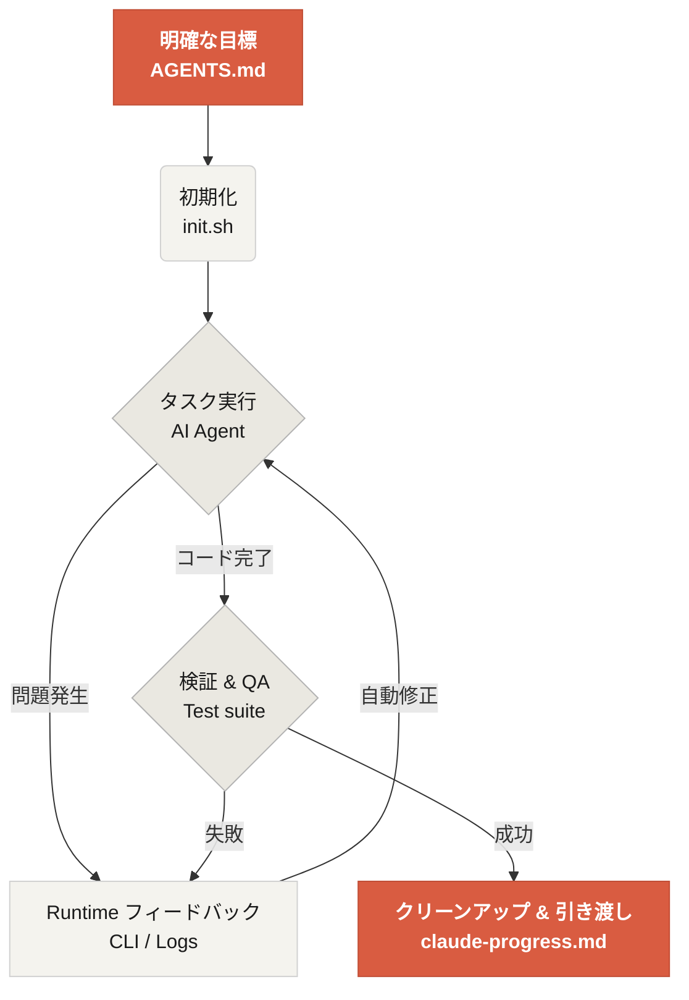

# Learn Harness Engineering へようこそ

Learn Harness Engineering は、AI coding agent の技術に特化したコースです。私たちは、業界で最先端の Harness Engineering に関する理論と実践を深く研究し、整理してきました。主要な参考資料は次のとおりです。
- [OpenAI: Harness engineering: leveraging Codex in an agent-first world](https://openai.com/index/harness-engineering/)
- [Anthropic: Effective harnesses for long-running agents](https://www.anthropic.com/engineering/effective-harnesses-for-long-running-agents)
- [Anthropic: Harness design for long-running application development](https://www.anthropic.com/engineering/harness-design-long-running-apps)
- [Awesome Harness Engineering](https://github.com/walkinglabs/awesome-harness-engineering)

システム的な環境設計、状態管理、検証、制御システムを通じて、このコースでは Codex や Claude Code のような agent 向けプログラミングツールを本当に信頼できるものにする方法を学びます。明確なルールと境界で AI アシスタントを制約することで、機能の実装、バグ修正、開発タスクの自動化を支えます。

## はじめに

学習の進め方を選んで始めましょう。コースは、理論講義、実践プロジェクト、すぐに使えるリソース集に分かれています。

  <a href="./lectures/lecture-01-why-capable-agents-still-fail/" class="card">
    <h3>講義</h3>
    
強力なモデルがそれでも失敗する理由を理解し、効果的な harness の背後にある理論を学びます。

  </a>
  <a href="./projects/" class="card">
    <h3>プロジェクト</h3>
    
信頼できる agent 環境をゼロから構築する実践に取り組みます。

  </a>
  <a href="./resources/" class="card">
    <h3>リソース集</h3>
    
自分のリポジトリで使える、そのままコピーできるテンプレート（AGENTS.md、feature_list.json）を集めています。

  </a>

## Harness の核心メカニズム

Harness はモデルを「賢くする」ものではありません。代わりに、モデルのための**閉ループの作業システム**を構築します。その基本的なワークフローは、次の簡単な図で理解できます。

## 学べること

次のような主要概念を理解できるようになります。

<ul class="index-list">
  <li><strong>agent の振る舞いを制約する</strong>ために、明確なルールと境界を設ける。</li>
  <li><strong>長期かつ複数セッションにまたがるタスクでも文脈を維持する</strong>。</li>
  <li><strong>agent が成功を早まって宣言するのを防ぐ</strong>。</li>
  <li><strong>エンドツーエンドのテスト</strong>と自己反省によって作業を検証する。</li>
  <li><strong>Runtime を可観測にする</strong>ことで、デバッグしやすくする。</li>
</ul>

## 次のステップ

基本概念を理解したら、次のガイドでさらに深く学べます。

<ul class="index-list">
  <li><a href="./lectures/lecture-01-why-capable-agents-still-fail/">講義 01: なぜ強力な Agent でも失敗するのか</a>: harness engineering の理論から始めます。</li>
  <li><a href="./projects/project-01-baseline-vs-minimal-harness/">プロジェクト 01: Baseline vs Minimal Harness</a>: 最初の実践タスクを順に進めます。</li>
  <li><a href="./resources/templates/">テンプレート</a>: 自分のプロジェクトで使える minimal harness 一式（AGENTS.md、feature_list.json、claude-progress.md）を入手します。</li>
</ul>
