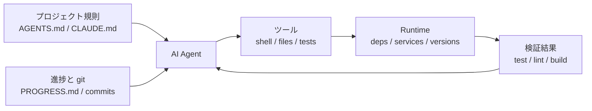

[英語版 →](../../../en/lectures/lecture-02-what-a-harness-actually-is/) | [中国語版 →](../../../zh/lectures/lecture-02-what-a-harness-actually-is/)

> ソースコードの例: [code/](https://github.com/walkinglabs/learn-harness-engineering/blob/main/docs/vi/lectures/lecture-02-what-a-harness-actually-is/code/)
> 実践プロジェクト: [プロジェクト 01. プロンプトのみ vs. ルール優先の最小 Harness](./../../projects/project-01-baseline-vs-minimal-harness/index.md)

# 講義 02. Harness とは実際には何か

AI coding agent の世界では「harness」という言葉が何度も出てきますが、率直に言うと、多くの人は harness と言いながら「prompt ファイル」を指しています。ですが、それは harness ではありません。たとえば、厨房も調理器具もレシピも配膳手順もないまま、材料だけでレストランを開こうとするようなものです。それはレストランではありません。単なる冷蔵庫です。

この講義では、実践的で正確な harness の定義を示します。学術的な抽象論ではなく、今日から使える枠組みです。harness は 5 つのサブシステムで構成され、それぞれに明確な責任と評価基準があります。

## まずはたとえ話から

あなたが新しく採用されたエンジニアだと想像してください。ドキュメントのないプロジェクトに放り込まれたとします。README はなく、コードにはコメントもなく、テストの実行方法も誰も教えてくれない。CI の設定はどこかに埋もれています。そんな状況でも、良いコードは書けるでしょうか。おそらく、十分に賢くて忍耐強ければ可能です。しかし実際には、「このプロジェクトは何をしているのか」を理解するために多くの時間を使うことになり、「問題を解決する」ために使える時間は減ってしまいます。

AI agent も、まさに同じ状況に置かれます。しかも、さらに厳しいです。少なくとも人間なら同僚に聞けますが、agent が見られるのは、目の前にあるファイルと、自分で実行できるコマンドだけです。「このプロジェクトの ORM は何を使っているんですか？」と誰かの肩を叩いて聞くことはできません。

OpenAI は核心原則を「repo が spec である」と表現しています。つまり、必要な文脈はすべてリポジトリの中にあり、構造化された指示ファイル、明確な検証コマンド、整理されたディレクトリ構成を通じて伝えるべきだということです。Anthropic の長時間稼働する agent に関する資料でも、状態の継続性、明確な復帰経路、構造化された進捗追跡が強調されています。両社は異なる観点から語っていますが、言っていることは同じです。**モデルの外側にある技術的な基盤が、そのモデルの能力をどれだけ実際に引き出せるかを決める**のです。

すでに知っているいくつかのツールを見てみましょう。

**Claude Code** は harness 的な考え方を体現しています。リポジトリから `CLAUDE.md` を読み込み（レシピ棚）、shell コマンドを実行でき（包丁置き場）、ローカル環境で動作し（厨房）、セッション履歴を保持し（仕込み台）、テストを実行して結果を確認できます（品質確認の窓口）。しかし、テストの実行方法を教えなければ、その品質確認の窓口は機能しません。料理が本当に火が通っているか、誰にも分からないからです。

**Cursor** も同じ論理で動いています。`.cursorrules` はレシピ棚、terminal は包丁置き場であり、プロジェクト構造や lint 設定を厨房として読み取ります。ただし Cursor の状態管理は比較的弱く、IDE を閉じて開き直すと、それ以前の文脈は消えてしまいます。

**Codex**（OpenAI の coding agent）は、各タスクの runtime を隔離するために git worktrees を使い、さらにローカルの可観測性スタック（logs、metrics、traces）と組み合わせることで、各変更を独立した環境で検証します。`AGENTS.md` と明確な検証コマンドがある repo では、何も整備されていない repo よりもずっとよく動きます。

**AutoGPT** は警告例です。構造化された状態管理がないため、長いタスクでは文脈が蓄積し続け、正確なフィードバック機構がないために agent がループに陥ります。多くの人は AutoGPT が「動かない」と言いますが、実際には AutoGPT の harness が動いていないのです。壊れたコンロを渡されては、どれほど良い材料があっても料理はできません。

## コア概念

- **Harness とは何か**: モデルの重みの外側にある技術的基盤すべてです。OpenAI は、エンジニアリングの中核業務を「環境設計」「意図の表現」「フィードバックループの構築」の 3 つに要約しています。Anthropic は Claude Agent SDK を「汎用 agent harness」と呼んでいます。
- **Repo が唯一の正本**: agent が見えないものは、実務上は存在しないのと同じです。OpenAI は repo を「記録システム」とみなし、必要な文脈はすべて、構造化されたファイルと明確なディレクトリ構成の中に置くべきだとしています。
- **百科事典ではなく地図を渡す**: OpenAI の経験では、`AGENTS.md` はディレクトリ一覧であるべきで、百科事典であってはなりません。100 行程度で十分です。収まらない内容は `docs/` に分け、agent が必要に応じて読むようにします。
- **マイクロマネジメントではなく制約を与える**: 良い harness は、agent を細かく逐一指示するのではなく、実行可能なルールで縛ります。OpenAI は「実装をマイクロマネジメントするのではなく、不変条件を強制せよ」と述べています。Anthropic は、agent が自分の仕事を自信満々に褒めてしまうことを見つけ、その解決策として「作業者」と「検査者」を分けています。
- **1 つずつ削る**: 各 harness 要素の価値を定量化するには、それらを 1 つずつ取り除き、どれを消すと性能が最も下がるかを見ます。Anthropic はこの手法を使い、モデルが強くなるにつれて不要になる要素もある一方で、新しい要素が常に必要になることを発見しました。

## 5 サブシステムの Harness モデル

厨房のたとえに戻りましょう。完全な厨房には 5 つの機能エリアがあり、harness にも 5 つのサブシステムがあります。



**指示サブシステム（レシピ棚）**: プロジェクトの概要と目的（1 文）、技術スタックとそのバージョン（Python 3.11、FastAPI 0.100+、PostgreSQL 15 など）、最初に実行するコマンド（`make setup`、`make test`）、譲れない厳格な制約（「すべての API は OAuth 2.0 を使うこと」）、さらに詳しい文書へのリンクを含む `AGENTS.md`（または `CLAUDE.md`）を作成します。

**ツールサブシステム（包丁置き場）**: agent が十分なツールアクセスを持てるようにします。「安全だから」という理由で shell を無効化してはいけません。`pip install` すら実行できないなら、どうやって作業するのでしょうか。ただし、すべてを開放するのも違います。最小権限の原則に従ってください。

**環境サブシステム（厨房）**: 環境状態を自己記述的にします。依存関係は `pyproject.toml` や `package.json` で固定し、実行環境のバージョンは `.nvmrc` や `.python-version` で管理し、Docker や devcontainer で再現性を確保します。

**状態サブシステム（仕込み台）**: 長いタスクには進捗追跡が必要です。`PROGRESS.md` のような簡単なファイルを用意し、完了したこと、進行中のこと、ブロックされていることを書きます。各セッションが終わる前に更新し、次のセッションが始まったら読み込みます。

**フィードバックサブシステム（品質確認の窓口）**: これが最も ROI の高いサブシステムです。`AGENTS.md` に検証コマンドを明確に列挙します。
```
検証コマンド:
- テスト: pytest tests/ -x
- 型チェック: mypy src/ --strict
- Lint: ruff check src/
- 完全検証: make check (上記すべてを含む)
```

どれか 1 つでも欠けていると、厨房の機能エリアが 1 つ欠けているのと同じです。料理はできますが、ずっとぎこちなくなります。

**harness の品質診断**: 「等圧モデル制御」を使います。モデルは固定したまま、サブシステムを 1 つずつ削除し、削除によってどれだけ性能が落ちるかを測定します。それがボトルネックです。厨房で詰まりを探すのと同じで、レシピ棚を取り払ってどれだけ遅くなるか、コンロを止めてどの程度影響が出るかを見ればよいのです。

## あるチームの実例

あるチームは、TypeScript + React のフロントエンドアプリケーション（約 20,000 行）で GPT-4o を使っていました。彼らは 4 つの段階を経ました。基本的には、厨房設備を 1 つずつ足していったようなものです。

**段階 1 - 空っぽの厨房**: README に基本的なプロジェクト説明があるだけ。成功率は 5 回中 1 回（20%）でした。主な失敗は、パッケージマネージャーの選択ミス（npm vs yarn）、コンポーネント命名規則の不遵守、テストの実行失敗でした。

**段階 2 - レシピ棚の設置**: 技術スタックのバージョン、命名規則、主要な設計判断を含む `AGENTS.md` を追加。成功率は 60% に上がりました。残る失敗は主に環境問題と検証不足でした。

**段階 3 - 品質確認の窓口を開放**: `AGENTS.md` に検証コマンドを列挙しました。`yarn test && yarn lint && yarn build`。成功率は 80% に上がりました。

**段階 4 - 仕込み台の整備**: 各 agent が毎回の実行で完了した作業と未完了の作業を記録する進捗ファイルのテンプレートを導入しました。成功率は 80-100% で安定しました。

4 回の反復で、モデル自体はまったく変わっていません。それでも成功率は 20% からほぼ 100% まで上がりました。これが harness engineering の力です。高価な材料を買い足したのではなく、厨房を正しく整えただけなのです。

## 覚えておくべき要点

- Harness = 指示 + ツール + 環境 + 状態 + フィードバック。5 つのサブシステムがあり、厨房の 5 つの機能エリアのように、どれも必要です。
- モデルの重み以外はすべて harness です。どれだけモデルの能力が実際に引き出されるかを、harness が決めます。
- 5 つのサブシステムの中でも、フィードバックサブシステムは投資コストが最も低く、効果が最も高いことが多いです。まず検証コマンドを正しく整備してください。品質確認の窓口は、最も価値のあるアップグレードです。
- 各サブシステムの限界的な貢献は「等圧モデル制御」で定量化してください。直感だけに頼ってはいけません。
- Harness もソースコードと同じように劣化します。定期的に見直し、技術的負債と同じように harness の負債も返済してください。

## さらに読む

- [OpenAI: Harness Engineering](https://openai.com/index/harness-engineering/)
- [Anthropic: Effective Harnesses for Long-Running Agents](https://www.anthropic.com/engineering/effective-harnesses-for-long-running-agents)
- [HumanLayer: Harness Engineering for Coding Agents](https://humanlayer.dev/articles/harness-engineering-for-coding-agents/)
- [SWE-agent: Agent-Computer Interfaces](https://github.com/princeton-nlp/SWE-agent)
- [Thoughtworks: Harness Engineering on Technology Radar](https://www.thoughtworks.com/radar)

## 演習

1. **5 要素 harness の監査**: AI agent を使っているプロジェクトを 1 つ選び、5 要素の枠組みで完全に監査してください。各サブシステムを 1〜5 点で採点します。最も低いサブシステムを見つけ、30 分かけて改善し、その後 agent の性能変化を観察してください。

2. **等圧モデル制御の実験**: 1 つのモデルと難しいタスクを選びます。次に、指示を削除し（`AGENTS.md` を消す）、フィードバックを削除し（検証コマンドを与えない）、状態を削除し（進捗ファイルを置かない）という操作を、毎回 1 つだけ行って性能低下を測定します。その結果をもとに、あなたのプロジェクトにおけるサブシステムの重要度を順位付けしてください。

3. **アフォーダンス分析**: あなたのプロジェクトで agent が「やりたいのにできない」状況を 1 つ見つけます（たとえば、パラメータ化されたクエリを使うべきだと分かっていても、プロジェクトの ORM パターンを知らない場合など）。それが Gulf of Execution（どうやるかが分からない）なのか、Gulf of Evaluation（正しいかどうかが分からない）なのかを分析し、そのギャップを埋める harness 改善を設計してください。
