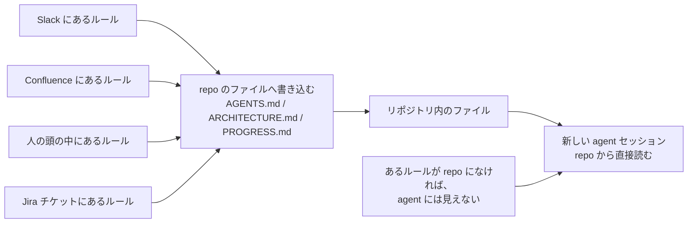
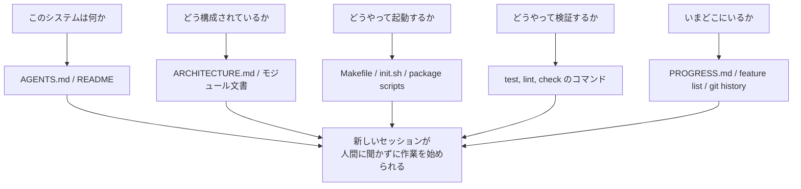

[英語版 →](../../../en/lectures/lecture-03-why-the-repository-must-become-the-system-of-record/) | [中国語版 →](../../../zh/lectures/lecture-03-why-the-repository-must-become-the-system-of-record/)

> ソースコードの例: [code/](https://github.com/walkinglabs/learn-harness-engineering/blob/main/docs/vi/lectures/lecture-03-why-the-repository-must-become-the-system-of-record/code/)
> 実践プロジェクト: [プロジェクト 02. Agent が読めるワークスペース](./../../projects/project-02-agent-readable-workspace/index.md)

# 講義 03. リポジトリを唯一の正本にする

あなたのチームのアーキテクチャ上の意思決定は、Confluence、Slack、Jira、そして一部の上級エンジニアの頭の中に散らばっています。人間にとっては、それでもなんとか回ります。同僚に聞く、チャット履歴を探す、資料を掘り返す。それでも見つからなければ、食堂で誰かを捕まえて聞くこともできるでしょう。ですが AI agent にとって、リポジトリにない情報は、最初から存在しないのと同じです。

これは大げさではありません。agent に実際に与えられるものを考えてみてください。system prompt とタスク説明、リポジトリから読み込んだファイルの内容、そしてツール実行の結果。これだけです。Slack の履歴も、Jira のチケットも、Confluence のページも、金曜の午後に同僚とコーヒーを飲みながら話したアーキテクチャ判断も、agent には見えません。agent は誰かに「聞く」ことも、チャット履歴を「検索する」こともできません。リポジトリの中に閉じ込められたエンジニアであり、外側のことは何も知りません。

では、問いはこうなります。このエンジニアに、きちんとした地図を渡すつもりはありますか。

## 地図に含まれるもの

OpenAI は明確に述べています。**repo にない情報は、agent にとって存在しません。** これを「repo is spec」という原則と呼び、リポジトリそのものを最も権威ある仕様書として扱います。

Anthropic の長時間稼働 agent に関する資料も、これと一致しています。継続的な状態は、長いタスクを続けるうえで不可欠です。セッションをまたいで知識を復元できるかどうかが、タスク成功率を直接左右します。そして、その状態はリポジトリに存在していなければなりません。agent が安定してアクセスできる、唯一の保存先だからです。

「うちは小さいチームだし、知識はみんなの頭の中にある。それでうまく回っている」と思うかもしれません。人間相手なら、その通りでしょう。ですが agent を使うなら、この事実を受け入れる必要があります。agent は人に聞けません。必要なことはすべて書き下し、見つけられる場所に置かなければなりません。

これは「もっとたくさん文書を書く」ことではありません。「判断に必要な情報を、正しい場所に置く」ことです。`src/api/` に置かれた 50 行の `ARCHITECTURE.md` は、Confluence にある 500 ページの設計資料より、保守されているかぎりはるかに役立ちます。手元の机に貼った手描きの社内地図と、ファイリングキャビネットにしまわれた美しい建築図面の違いに似ています。前者は必要なときにすぐ使えます。後者は見た目は立派でも、その瞬間には役に立ちません。

## 知識の可視性



地図が十分かどうかは、どう確認すればよいのでしょうか。`cold-start test` を実行します。つまり、repo の内容だけを使って完全に新しい agent セッションを開き、次の 5 つの基本質問に答えられるかを確認するのです。



答えられないなら、地図に穴があります。空白のある場所では、agent は推測します。推測が外れればバグになり、推測しすぎればコンテキストを浪費します。そして新しいセッションが始まるたびに、また同じ推測を繰り返します。最初から正しく地図を描くコストより、推測にかかるコストのほうが、常に高くつきます。

## 重要な概念

- **知識可視性ギャップ（Knowledge Visibility Gap）**: プロジェクト全体の知識のうち、リポジトリに入っていない割合です。ギャップが大きいほど、agent の失敗率は高くなります。このプロジェクトについて、あなたの頭の中にある知識はどれくらいあるでしょうか。すべて数え、そのうち repo に入っているものを数えれば、その差が可視性ギャップです。
- **正本（System of Record）**: コードリポジトリは、プロジェクトの意思決定、アーキテクチャ制約、実行状態、検証基準における権威ある情報源です。repo が最終判断を持ち、他のどこにも同じ効力はありません。たとえば地図に「通行止め」と書いてあれば、その道は使いません。ですが、その情報が Anh Nam の頭の中にしかないなら、毎回 Anh Nam に聞くしかありません。
- **コールドスタートテスト（Cold-Start Test）**: 上の 5 つの質問です。何問答えられるかが、地図の完成度を示します。
- **探索コスト（Discovery Cost）**: agent が repo 内で重要情報を見つけるために消費するコンテキスト予算です。情報が隠れているほど探索コストは高くなり、実際の作業に使える予算は少なくなります。重要情報を 10 階層深い README に隠すのは、地下の金庫に消火器をしまうようなものです。存在はしていても、必要なときに見つけられません。
- **知識劣化率（Knowledge Decay Rate）**: 知識項目が時間とともに古くなる割合です。コードと同期していない文書は最大の敵であり、文書がないより悪いことさえあります。
- **ACID の類推**: データベースのトランザクション原則（原子性、一貫性、独立性、永続性）を agent の状態管理に当てはめる考え方です。これについては後で詳しく説明します。

## よい地図の描き方

**原則 1: 知識はコードの近くに置く。** API エンドポイントの認証に関するルールは、API コードの近くに置くべきであり、巨大な全体文書に埋もれさせるべきではありません。各モジュールのディレクトリに短い文書を置き、そのモジュールの責務、インターフェース、特有の制約を説明しましょう。図書館の棚ラベルのようなものです。歴史書が欲しければ、「歴史」と書かれた棚にまっすぐ向かえばよいのです。図書館全体を探し回る必要はありません。

**原則 2: 標準化された入力ファイルを使う。** `AGENTS.md`（または `CLAUDE.md`）は agent の「着地ページ」です。すべての情報を入れる必要はありませんが、「このプロジェクトは何か」「どう起動するか」「どう検証するか」の 3 つにすぐ答えられる必要があります。50〜100 行あれば十分です。

**原則 3: 最小限で、しかし十分に。** 各知識項目には、明確な用途が必要です。あるルールを削除しても agent の判断品質が変わらないなら、そのルールは存在すべきではありません。ですが、コールドスタートテストの質問にはすべて答えが必要です。これは微妙なバランスです。多すぎず、少なすぎず、ちょうどよく。

**原則 4: コードと一緒に更新する。** 知識の更新をコード変更に結びつけます。最も単純な方法は、アーキテクチャ文書を対応するモジュールのディレクトリに置くことです。コードを変更すると、自然と文書が目に入ります。コード変更の後で、CI が文書更新の必要性を思い出させてくれることもあります。

**repo 固有の構成**:

```
project/
├── AGENTS.md              # 入力: プロジェクト概要、起動コマンド、厳格な制約
├── src/
│   ├── api/
│   │   ├── ARCHITECTURE.md  # API 層のアーキテクチャ判断
│   │   └── ...
│   ├── db/
│   │   ├── CONSTRAINTS.md   # データベース操作の厳格な制約
│   │   └── ...
│   └── ...
├── PROGRESS.md             # 現在の進捗: 完了、進行中、保留中
└── Makefile                # 標準化されたコマンド: setup, test, lint, check
```

## ACID 原則で agent の状態を管理する

この類推はデータベースのトランザクション管理に由来します。大げさに見えるかもしれませんが、実際にはとても実践的な枠組みを与えてくれます。

- **原子性（Atomicity）**: 各「論理的な作業単位」（例: 「新しい endpoint を追加し、test を更新する」）は 1 つの git commit にします。途中で失敗したら `git stash` で復元します。やるなら全部、やらないなら全部なし。中途半端はありません。
- **一貫性（Consistency）**: 「一貫した状態」を表す検証述語を定義します。たとえば、すべての test が通り、lint にエラーがないことです。agent は各作業の後に検証を実行し、一貫しない中間状態は commit しません。銀行振込と同じで、借方だけを書いて貸方を書かないことはできません。
- **独立性（Isolation）**: 複数の agent が同時に動くときは、状態ファイルを工夫して競合を避けます。単純な方法は、各 agent に独自の進捗ファイルを使わせるか、git branch で分離することです。2 人の料理人が同じ鍋を同時に味付けすることはできません。しょっぱくなったら誰の責任でしょうか。
- **永続性（Durability）**: 重要なプロジェクト知識は git で追跡されるファイルに置きます。一時状態はセッションメモリに置いてもよいですが、セッションをまたぐ知識はファイルへ保存しなければなりません。頭の中にあるだけでは数えません。紙に残っていてこそ数に入ります。

## 実際の移行事例

あるチームは、約 30 の microservices を持つ e-commerce 基盤を運用していました。アーキテクチャ上の意思決定（サービス間通信プロトコル、データ整合性戦略、API バージョニング規則）は、Confluence（一部は古い）、Slack（検索しづらい）、少数の上級エンジニアの頭の中（スケールしない）、そして散在するコードコメント（体系化されていない）にばらばらに存在していました。

AI agent を導入した後、70% のタスクで人間の介入が必要になりました。ほとんどのバグは、agent が「みんな知っているが誰も書いていない」隠れた制約を破ったことに起因していました。これは、新人に「昼食の注文はチャットに投稿しないといけない」と誰も教えないのと同じです。新人は推測して外し、叱られても、叱ったあとでさえルールは教えられません。

チームは次のように移行しました。
1. `AGENTS.md` を repo ルートに作成し、プロジェクト概要、tech stack のバージョン、グローバルな厳格制約を記載した
2. 各 microservice ディレクトリに `ARCHITECTURE.md` を追加し、責務、インターフェース、依存関係を説明した
3. 明確な「MUST/MUST NOT」表現で、厳格な制約をまとめた `CONSTRAINTS.md` を作成した
4. 各サービスディレクトリに `PROGRESS.md` を追加し、現在の作業状態を追跡した

移行後は、同じ agent がコールドスタート時に重要なプロジェクト質問すべてに答えられるようになり、タスク完了の品質も大きく改善しました。

## 要点のまとめ

- repo にない知識は、agent にとって存在しません。重要な判断を repo に置くことは、最も基本的な harness 投資です。迷わないように、まず地図を整えましょう。
- `cold-start test` を使って repo の質を評価します。新しいセッションが、repo の内容だけで 5 つの基本質問に答えられるかを確認してください。
- 知識はコードの近くに、最小限だが十分な形で、コードと一緒に更新されるべきです。重要なのは文書を増やすことではなく、情報を正しい場所に置くことです。
- agent の状態には ACID の原則を適用します。原子的に commit し、一貫性を検証し、同時実行を分離し、重要な知識を永続化します。
- 知識の劣化は最大の敵です。コードと同期していない文書は、文書がないより危険です。agent を「正しいと思い込んだまま誤った方向」に導いてしまうからです。

## 参考資料

- [OpenAI: Harness Engineering](https://openai.com/index/harness-engineering/)
- [Anthropic: Effective Harnesses for Long-Running Agents](https://www.anthropic.com/engineering/effective-harnesses-for-long-running-agents)
- [Infrastructure as Code — Martin Fowler](https://martinfowler.com/bliki/InfrastructureAsCode.html)
- [ADR: Architecture Decision Records](https://adr.github.io/)
- [The Twelve-Factor App](https://12factor.net/)

## 演習

1. **コールドスタートテスト**: あなたのプロジェクトで、完全に新しい agent セッションを開きます（会話コンテキストはなし、repo の内容のみ）。次の 5 問を投げてください。これは何のシステムか。どう構成されているか。どうやって起動するか。どうやって検証するか。現在の進捗は何か。答えられなかった内容を記録し、答えられるようになるまで repo を改善してください。

2. **知識の外部化を定量化する**: あなたのプロジェクト開発に必要な重要な判断と制約をすべて列挙します。それぞれについて、repo 内か repo 外かをマークします。知識可視性ギャップ（repo 外の割合）を計算し、10% 未満にする計画を立てます。

3. **ACID の評価**: この講義の ACID 類推を使って、プロジェクトの状態管理を評価してください。原子性 - agent の作業はきれいにロールバックできるか。一貫性 - 「一貫した状態」を検証できるか。独立性 - 同時実行する agent が互いに干渉しないか。永続性 - セッションをまたぐ知識はすべて保存されているか。
