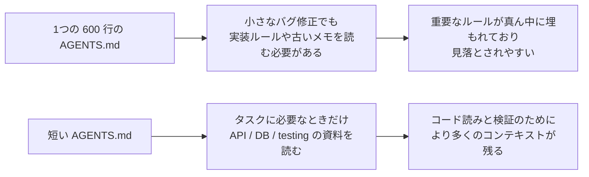
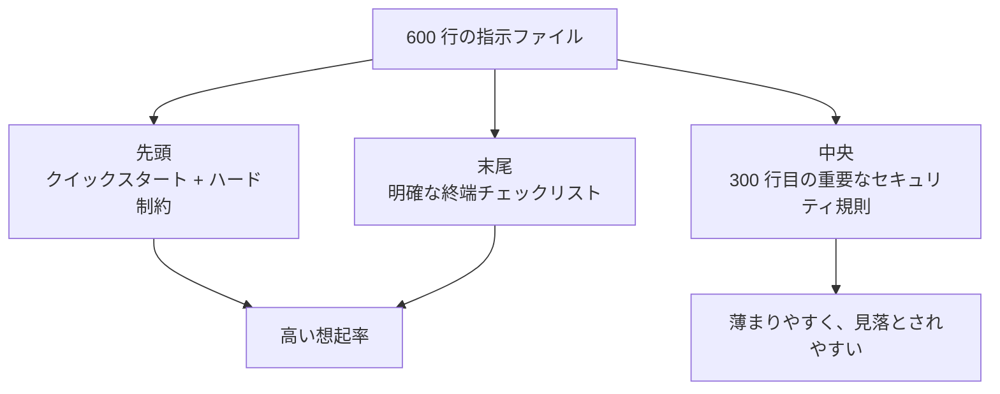

[英語版 →](../../../en/lectures/lecture-04-why-one-giant-instruction-file-fails/) | [中国語版 →](../../../zh/lectures/lecture-04-why-one-giant-instruction-file-fails/)

> コード例: [code/](https://github.com/walkinglabs/learn-harness-engineering/blob/main/docs/vi/lectures/lecture-04-why-one-giant-instruction-file-fails/code/)
> 実践プロジェクト: [プロジェクト 02. Agent が読めるワークスペース](./../../projects/project-02-agent-readable-workspace/index.md)

# 講義 04. 1つの巨大な指示ファイルが失敗する理由

harness engineering に真剣に取り組んできましたね。`AGENTS.md` を作り、思いつく限りのルール、制約、学びをそこに詰め込みました。1か月後には 300 行、2か月後には 450 行、3か月後には 600 行に膨らみます。すると、agent の実際の性能が下がっていることに気づきます。単純なバグ修正でさえ、agent は関係のない実装指示を処理するために大量のコンテキストを消費し、300 行目に埋もれた重要なセキュリティ制約は完全に見落とされ、相反する 3 つのコードスタイル規則のせいで、毎回どれかを適当に選ぶしかなくなります。

これが「巨大な指示ファイル」の罠です。まるでスーツケースに詰め込みすぎるのと同じで、何でも役立ちそうに見えるので全部入れてしまい、ついにはファスナーがはち切れそうになります。下着を探すにはバッグを全部ひっくり返すしかありません。スーツケースはいっぱいなのに、実際に使うのは中身の 3 分の 1 ほどしかありません。

## 悪循環の根っこ

もっともよくある悪循環は、次のように進みます。agent がミスをする。あなたは「これを防ぐルールを追加しよう」と考える。`AGENTS.md` に足す。一時的にはうまくいく。別のミスが起きる。別のルールを足す。これを繰り返す。結果、ファイルが制御不能なほど膨れ上がります。

これはあなたのせいではありません。とても自然な反応です。何か問題が起きるたびに「ルールを足す」のは理にかなって見えますし、外出するたびに「念のため」で持ち物を増やすのと同じ感覚です。しかし、累積効果は壊滅的です。何がまずいのかを具体的に見ていきましょう。

**コンテキスト予算が侵食される。** agent のコンテキストウィンドウには上限があります。たとえば、200K token のウィンドウがあるとします。巨大な指示ファイルは 10K〜20K token を消費することがあります。まだ余裕があるように見えますか。ですが、複雑なタスクでは何十ものソースファイルを読む必要があり、ツール実行結果もコンテキストを食い、会話履歴も積み上がります。agent がコードを理解すべき時点では、予算はもう逼迫しています。まるで、ノート PC を入れる場所すらなくなるほど詰まったスーツケースのようです。

**真ん中で迷子になる。** 2023 年の論文「Lost in the Middle」は、LLM が長文の中央にある情報を、先頭や末尾にある情報よりもかなりうまく使えないことを明確に示しました。600 行の `AGENTS.md` の 300 行目に「すべての DB クエリはパラメータ化クエリを使うこと」という重要なセキュリティ制約があったとしても、それは真ん中に埋もれているので、agent が見落とす可能性は非常に高くなります。ちょうど、詰め込みすぎたスーツケースの底にある日焼け止めのようなものです。そこにあるのは分かっていても、3 回探しても見つからず、結局別のものを買うことになります。

**優先順位が衝突する。** ファイルの中には、譲れないハード制約（`eval()` を絶対に使わない）、重要な設計指針（関数型スタイルを優先する）、そして特定の過去の学び（先週 WebSocket のメモリリークを直したので似たパターンに注意する）が混在します。これら 3 つは重要度がまったく違いますが、ファイルの中では同じ見た目で並んでいます。agent には信頼できる判別材料がありません。まるで、スーツケースの中でパスポートと充電ケーブルが混ざってしまい、どちらを優先すべきか分からないのと同じです。

**保守性が落ちる。** 巨大なファイルは、そもそも保守が難しいものです。古くなった指示はなかなか削除されません。削除すると何かが壊れるかもしれないという不確実さがある一方で、新しい指示を足すのは無料に見えるからです。その結果、ファイルは増える一方で減らず、シグナル対ノイズ比は下がり続けます。これは、ソフトウェアに技術的負債が溜まっていくのとまったく同じです。

**矛盾が蓄積する。** さまざまな時点で追加された指示は、やがて互いに矛盾し始めます。ある指示は「TypeScript strict mode を使う」と言い、別の指示は「一部の legacy ファイルでは `any` を許可する」と言います。agent は毎回、どれに従うかをランダムに選ぶしかありません。ちょうど、母親には「もっと暖かくしなさい」と言われ、父親には「着込みすぎるな」と言われ、玄関で誰の言うことを聞くべきか分からなくなるようなものです。

## 重要な概念

- **Instruction Bloat（指示の肥大化）**: 指示ファイルがコンテキストウィンドウの 10〜15% を超えると、コードを読むための予算やタスク推論のための予算を圧迫し始めます。600 行の `AGENTS.md` は 10,000〜20,000 token を消費する可能性があり、128K ウィンドウの 8〜15% が、agent が作業を始める前に消えてしまいます。
- **Lost in the Middle Effect（真ん中で迷子になる効果）**: Liu らによる 2023 年の研究は、LLM が長文の中央にある情報を、先頭や末尾の情報よりもかなりうまく使えないことを示しました。600 行のファイルの 300 行目に埋もれた重要な制約は、実際には見落とされる可能性が非常に高くなります。
- **Instruction SNR（指示のシグナル対ノイズ比）**: 現在のタスクに対して関連する指示の割合です。バグ修正中に、実装手順の 50 行を読まされるなら、それは SNR が低いということです。
- **ルーティングファイル**: より詳細な資料へ agent を案内することを主な役割とする、短い入力ファイルです。何でもかんでも 1 つに詰め込むのではありません。50〜200 行で十分です。
- **Progressive Disclosure（段階的開示）**: まず全体像を示し、必要になったら詳細を出す設計です。良い harness 設計は良い UI 設計に似ています。すべての選択肢を一度にユーザーへ押し付けないでください。
- **Priority Ambiguity（優先順位の曖昧さ）**: すべての指示が同じ形式、同じ場所にあると、agent は譲れないハード制約と、あくまで助言であるソフトな指示を見分けられません。

## 指示アーキテクチャ





## 分割のやり方

核心となる原則は、よく使う情報は手元に置き、ときどき使う情報はしまい込み、二度と使わないものは手放すことです。

入力ファイルである `AGENTS.md` は 50〜200 行に保ち、もっとも頻繁に使う項目だけを入れます。たとえば、プロジェクト概要（1〜2 文）、最初に実行するコマンド（`make setup && make test`）、全体共通のハード制約（譲れないルールは 15 個以内）、そして主題別ドキュメントへのリンク（1 行の説明 + 適用条件）です。

```markdown
# AGENTS.md

## プロジェクト概要
Backend FastAPI Python 3.11, PostgreSQL 15 データベース。

## クイックスタート
- セットアップ: `make setup`
- テスト: `make test`
- 完全な検証: `make check`

## ハード制約
- すべての API は OAuth 2.0 認証を使用すること
- すべてのデータベースクエリは SQLAlchemy 2.0 の構文を使用すること
- すべての PR は pytest + mypy --strict + ruff check を通過すること

## 主題別ドキュメント
- [API 設計パターン](docs/api-patterns.md) — エンドポイントを追加するときは必読
- [データベース規則](docs/database-rules.md) — DB 操作を変更するときは必須
- [Testing 標準](docs/testing-standards.md) — テストを書くときの参照
```

各主題別ドキュメントは 50〜150 行程度にし、`docs/` 配下または対応するモジュールの近くに主題ごとに整理します。agent は必要なときだけそれらを読みます。まるでスーツケースの中のポーチのように、下着用、洗面用、充電ケーブル用に分けるのです。探し物のために全部をひっくり返す必要はありません。

一部の情報は、型定義、インターフェースのコメント、設定ファイル内の説明のように、コードの中に直接置く方が適しています。agent はコードを読むときに自然にそれらを目にするので、指示にまで重複させる必要はありません。

各指示には、由来（なぜこのルールが追加されたのか）、適用条件（いつこのルールが必要なのか）、期限切れ条件（どんな状況なら削除できるのか）を持たせるべきです。定期的に見直し、古いもの、重複しているもの、矛盾しているものを削除してください。指示もコードの依存関係と同じように管理しましょう。使われない依存関係は削除すべきで、放置するとシステムを遅くするだけです。

どうしても入力ファイルに残す必要がある指示は、中央ではなく先頭か末尾に置いてください。真ん中で迷子になる効果が示すように、LLM は中央よりも両端の情報をかなりうまく使います。とはいえ、さらに良いのは、その指示を主題別ドキュメントへ移し、必要なときだけ読み込む形にすることです。

OpenAI も Anthropic も、暗黙のうちにこの分割アプローチを支持しています。OpenAI は入力ファイルを「短く、ルーティング向け」にすべきだと言い、Anthropic は長時間動作する agent の制御情報は「簡潔で優先度が高い」べきだと言っています。どちらも同じことを言っています。つまり、すべてを 1 つのファイルに詰め込むな、ということです。スーツケースは整理すべきであって、力任せに押し込むものではありません。

## 実例

ある SaaS チームでは、`AGENTS.md` が 50 行から 600 行に膨れ上がりました。中身は、技術スタックのバージョン、コーディング標準、過去のバグ修正メモ、API の使い方、デプロイ手順、メンバーの個人的な好みまで混在しており、まさにスーツケースが今にも破裂しそうな状態でした。

agent の性能は明らかに低下し始めました。単純なバグ修正の最中に、関係のないデプロイ手順の扱いに大量のコンテキストを費やし、「すべてのデータベースクエリはパラメータ化クエリを使用すること」というセキュリティ制約は 300 行目に埋もれて頻繁に見落とされ、3 つの相反するコードスタイル規則が agent の挙動を不安定にしていました。

チームは「スーツケースの再整理」を実施しました。
1. `AGENTS.md` を 80 行に削減し、プロジェクト概要、実行コマンド、15 個の全体ハード制約だけを残した
2. 主題別ドキュメントを作成した: `docs/api-patterns.md` (120 行), `docs/database-rules.md` (60 行), `docs/testing-standards.md` (80 行)
3. 主題別ドキュメントへのリンクをルーティングファイルに追加した
4. 過去のメモはテストケースへ変換するか、削除した

再構成後、同じ種類のタスクでは無関係な手順を読む時間が減り、セキュリティ制約も見落とされにくくなりました。これは、その制約がファイルの中央からルーティングファイルの先頭へ移動し、もう「真ん中で迷子になる」ことがなくなったからです。

## 覚えておくべき要点

- 「ルールを足す」は短期的な痛み止めであり、長期的には毒です。ルールを追加する前に、そのルールは主題別ドキュメントに置いた方がよくないかを自問してください。スーツケースに詰め続けてはいけません。
- 入力ファイルは百科事典ではなくルーターです。50〜200 行で、概要、ハード制約、リンクだけに絞ってください。
- 「真ん中で迷子になる」効果を活用してください。重要な情報は先頭か末尾に置き、重要でない情報は主題別ドキュメントへ移してください。
- 指示の肥大化は技術的負債のように管理してください。定期的に見直し、各指示には由来、適用条件、期限切れ条件を持たせてください。
- 分割した後は SNR が改善し、agent は関係のない指示の処理ではなく、実際のタスクにもっと多くのコンテキスト予算を使えるようになります。

## 参考文献

- [OpenAI: Harness Engineering](https://openai.com/index/harness-engineering/)
- [Anthropic: Effective Harnesses for Long-Running Agents](https://www.anthropic.com/engineering/effective-harnesses-for-long-running-agents)
- [Lost in the Middle: How Language Models Use Long Contexts](https://arxiv.org/abs/2307.03172)
- [HumanLayer: Harness Engineering for Coding Agents](https://humanlayer.dev/articles/harness-engineering-for-coding-agents/)
- [Nielsen Norman Group: Progressive Disclosure](https://www.nngroup.com/articles/progressive-disclosure/)

## 演習

1. **SNR の監査**: 現在の入力指示ファイルを取り出し、すべての指示項目を列挙してください。よくある 5 種類のタスクを選び、各指示がそのタスクに関連するかどうかを記録してください。タスクごとに SNR を計算してください。ほとんどのタスクにとってノイズでしかない指示は、主題別ドキュメントへ移してください。

2. **段階的開示の再構成**: 300 行を超える指示ファイルがあるなら、これを (a) 100 行未満のルーティングファイル、(b) 3〜5 個の主題別ドキュメントに分割してください。同じタスクセットを分割前後で少なくとも 5 つ実行し、成功率を比較してください。

3. **真ん中で迷子になる効果の検証**: 長い指示ファイルの中で、重要な制約を先頭・中央・末尾にそれぞれ置いてみてください。各配置で同じタスクセットを実行し、各位置ごとに少なくとも 5 回試してください。遵守率に差が出るか確認してください。位置効果の強さに驚くかもしれません。
