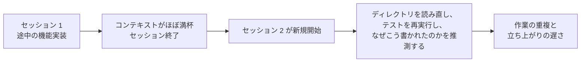
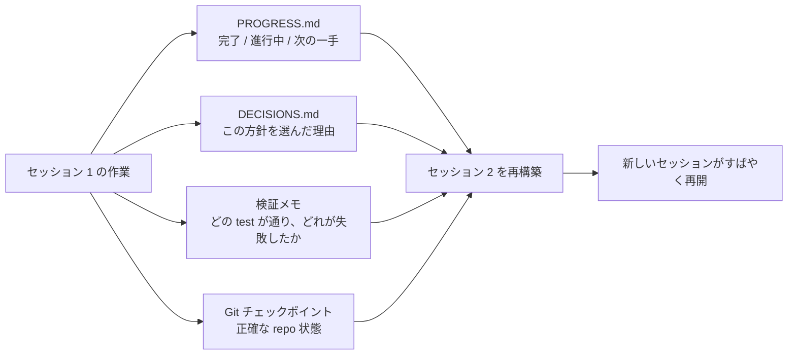

[英語版 →](../../../en/lectures/lecture-05-why-long-running-tasks-lose-continuity/) | [中国語版 →](../../../zh/lectures/lecture-05-why-long-running-tasks-lose-continuity/)

> ソースコード例: [code/](https://github.com/walkinglabs/learn-harness-engineering/blob/main/docs/vi/lectures/lecture-05-why-long-running-tasks-lose-continuity/code/)
> 実践プロジェクト: [プロジェクト 03. マルチセッション継続性](./../../projects/project-03-multi-session-continuity/index.md)

# 講義 05. セッションをまたいでコンテキストを維持する

Claude Code に完成度の高い機能実装を依頼したとします。30分ほど動いて多くの作業をこなしたものの、コンテキストが尽きかけています。そこで新しいセッションを開始して続きに取りかかると、前回どんな判断をしたのか、なぜ A ではなく B を選んだのか、どのファイルを変更したのか、テスト結果がどうだったのかを何も覚えていないことに気づきます。そこから15分かけてプロジェクトを再調査し、場合によっては前回とは食い違うやり方を選んでしまうかもしれません。

毎朝起きるたびに、すべてを忘れてしまう職人を想像してください。どの壁を作りかけていたのか、なぜ青いレンガではなく赤いレンガを選んだのか、水道管がどこまで通っていたのかを、そのたびにもう一度把握しなければなりません。さらに悪いことに、昨日取り付けた窓を、すでに終わっていたことを覚えていないせいで、外してしまうかもしれません。

これは、AI コーディング agent がセッションをまたぐタスクで直面する、まさに厄介な状況です。この講義では、なぜ長時間のタスクで agent が「記憶を失う」のか、そして構造化された状態保存によって、毎日きちんと日誌をつける信頼できる職人のように振る舞えるのかを説明します。職人自身の記憶は消えても、日誌がすべてを覚えている、というわけです。

## コンテキストウィンドウは無限ではない

コンテキストウィンドウには上限があります。これは、モデルを大きくすれば解決する話ではありません。仮にウィンドウサイズが 1M token に増えたとしても、複雑なタスクはそれを使い切ってしまいます。agent はコードを生成するだけではなく、コードベースを理解し、自身の判断履歴を追跡し、ツールの出力を処理し、会話のコンテキストを維持します。こうした情報は、ウィンドウの拡張よりも速く増えていきます。

さらに深刻なのは、agent が生成する情報は重要度が均一ではないことです。途中の推論ステップには、判断の「なぜ」が含まれます。なぜ A ではなく B を選んだのか、なぜこのライブラリなのか、なぜ特定の最適化を見送ったのか、という理由です。一方、最終成果物は「何をしたか」しか表しません。つまりコードそのものです。多くの圧縮戦略は後者は残せても、前者を失います。次のセッションはコードを見られても、そのコードがなぜそう書かれたのかを知りません。その結果、意図的な設計判断を「改善」してしまうことがあります。

Anthropic は長時間稼働する agent の研究で興味深い現象を見つけています。agent がコンテキスト切れを感じると、「早期収束」的な振る舞いを示すのです。つまり、今やっている作業を急いで終わらせ、検証を省略したり、最適解ではなく手っ取り早い解決策を選んだりします。試験の制限時間が迫ってきて、残りの選択問題を勘で埋め始めるのに似ています。Anthropic はこれを「コンテキスト不安」と呼んでいます。

## セッション継続の流れ

継続用の成果物がなければ、新しいセッションは毎回悲惨です。



継続用の成果物があれば、新しいセッションは素早く再開できます。



## 主要概念

- **コンテキストウィンドウは有限**: どれほど大きい値が謳われていても（128K、200K、1M など）、長いタスクはいずれそれを使い切ります。使い切った後は、圧縮するか（情報を失う）、リセットするか（新しいセッションにする）しかありません。どちらも何かを失います。
- **継続用成果物（Continuity Artifacts）**: 新しいセッションが曖昧さなく前回の続きから始められるようにする、保存された状態ファイル群です。基本形は、進捗ログ + 検証記録 + 次のアクションです。まさに職人の日誌です。
- **再構築コスト（Rebuild Cost）**: 新しいセッションが実行可能な状態に達するまでの時間です。良い harness なら、この再構築コストを 15 分から 3 分程度まで圧縮できます。
- **ドリフト（Drift）**: agent の理解と、実際のコードベース状態の差です。セッションの境界ごとにドリフトは発生し、放置すると蓄積します。
- **コンテキスト不安（Context Anxiety）**: Anthropic が観測した現象で、認知上のコンテキスト上限に近づくと agent が早期収束の行動を示し、情報を失う前にタスクを早めに終わらせようとします。非合理的なリソース不安です。
- **圧縮 vs. リセット（Compaction vs. Reset）**: 圧縮は同じセッション内でコンテキストを要約します（「何をしたか」は残るが、「なぜ」は失われやすい）。リセットは新しいセッションを開き、保存済み成果物から再構築します（きれいだが、成果物の完全性に依存します）。

## 継続が壊れると何が起きるか

前回のセッションは、3つのアプローチを分析して B 案を選ぶために、かなりのコンテキスト予算を使っていました。ところが今回の agent はその分析を知らないため、不完全な情報をもとに再び判断してしまい、A 案を選ぶかもしれません。まるで記憶を失った職人が、なぜ赤いレンガが選ばれたのかを覚えておらず、今日は青いレンガのほうがきれいだと思って、昨日の壁を壊して建て直すようなものです。

さらに悪いのは、作業の重複です。ある作業がすでに完了しているのか確信が持てず、同じ作業をやり直してしまうことがあります。あるいはもっと悪く、途中まで進めた後で既存実装と衝突していることに気づき、やり直しになることもあります。建設現場では、2つの班が同時に同じ壁を作ることはできませんが、進捗記録がなければ、新しい班は誰かがすでにその壁を担当していることすら分かりません。

複数セッションにまたがると、実装方針そのものが静かに要件からずれていくこともあります。新しいセッションごとに、プロジェクト目標の理解が少しずつ異なるからです。伝言ゲームを思い浮かべてください。10人も伝えると、「コーヒーを一杯買ってきて」が「コーヒーメーカーを買ってきて」になってしまうかもしれません。

検証の抜けもあります。前回のセッションでどの test が通り、どの test が失敗し、なぜ失敗したのかが記録されていません。新しいセッションは現在の状態を理解するために、すべての検証をやり直さなければなりません。毎回ゼロから診断し直すことになり、そのたびに貴重なコンテキストが失われます。

OpenAI と Anthropic の両方が、構造化された状態保存を自分たちの資料で重視しています。OpenAI の harness engineering に関する記事では、repo を「活動記録」として扱い、各操作の結果が repo に追跡可能な証拠を残すべきだとしています。Anthropic の長時間稼働 agent に関する文書では、特に「handoff file」を推奨しており、現在の状態、既知の問題、次のアクションを含む構造化された文書を用意するよう勧めています。

## 記憶を失う職人のための日誌

核となる考え方は、**agent を記憶を失った腕の良い技術者として扱うこと**です。agent が「退勤」する前に、次の agent がすぐに続けられるよう、重要情報を記録しておく必要があります。

**ツール 1: 進捗ファイル（PROGRESS.md）**。継続用成果物の基本であり、日誌の中心です。

```markdown
# プロジェクト進捗

## 現在の状態
- 最新 commit: abc1234 (feat: add user preferences endpoint)
- test 状態: 42/43 が通過済み (test_pagination_edge_case が失敗)
- lint: 通過

## 完了済み
- [x] User model と database migration
- [x] 基本 CRUD endpoints
- [x] auth middleware の統合

## 進行中
- [ ] pagination 機能 (90% - edge case test が失敗)

## 既知の問題
- test_pagination_edge_case が空の result set で 500 を返す
- 削除済み user を一覧に含めるべきか要確認

## 次のステップ
1. pagination の edge case を修正する
2. "include deleted users" query parameter を追加する
3. API documentation を更新する
```

**ツール 2: 決定ログ（DECISIONS.md）**。重要な設計判断と、その理由を記録します。詳細な設計書は不要です。「何を決めたか、なぜそうしたか、いつ決めたか」だけで十分です。日誌のメモのようなものです。

```markdown
# 設計上の決定

## 2024-01-15: ユーザー設定の cache に Redis を使う
- 理由: 読み取り頻度が高い（API 呼び出しごと）、データサイズが小さい
- 却下した案: PostgreSQL materialized view（変更頻度が高く、保守コストに見合わない）
- 制約: cache TTL は 5 分、書き込み時に能動的に無効化する
```

**ツール 3: Git commit を checkpoint として使う**。原子的な作業単位が終わるたびに commit します。commit message には、何をしたかだけでなく、なぜそれをしたかも書く必要があります。これはコストのかからない、自動版管理された状態スナップショットです。

**ツール 4: init.sh または harness の初期化フロー**。`AGENTS.md` に「セッション開始時」と「セッション終了時」の習慣を明示します。

```markdown
## セッション開始時（始業）
1. PROGRESS.md を読んで現在の状態を確認する
2. DECISIONS.md を読んで重要な判断を確認する
3. make check を実行して repo が整合状態にあることを確認する
4. PROGRESS.md の「次のステップ」から作業を再開する

## セッション終了時（終業）
1. PROGRESS.md を更新する
2. make check を実行して整合状態を確認する
3. 完了した作業をすべて commit する
```

**ハイブリッド戦略**: すべてのタスクでコンテキストリセットが必要なわけではありません。短いタスク（30分未満）は 1 セッションで完了できます。長いタスク（複数セッションにまたがるもの）は、継続性のために進捗ファイルと決定ログを使う必要があります。判断基準は、タスクがウィンドウの 60% を超えるなら、handoff の準備を始めることです。

### コンテキスト不安をさらに深掘りする

Anthropic の 2026年3月の研究では、コンテキスト不安の具体的な現れがさらに示されました。Sonnet 4.5 では、コンテキストがウィンドウ上限に近づくと、agent は強い「早期収束」行動を示します。試験終了間際だと気づいて、選択問題の答えを適当に埋め始めるようなものです。

これに対処する方法は 2 つあります。

**圧縮（Compaction）**: 同じセッション内で会話の前半を要約します。利点は継続性を保てることです。agent は「何をしたか」を見られます。欠点は、要約の中で「なぜ」が失われがちなことです。なぜ A ではなく B を選んだのか、なぜ特定の最適化を見送ったのか、という理由です。さらに重要なのは、圧縮ではコンテキスト不安そのものを取り除けないことです。agent はかつて大きなコンテキストを持っていたことを知っているため、心理的には依然として急いで終わらせようとしがちです。

**コンテキストリセット（Context Reset）**: コンテキストを完全に消し、新しいセッションを開き、保存された成果物から再構築します。利点は、心理状態がきれいにリセットされることです。新しいセッションには「時間が足りない」という不安がありません。欠点は、handoff 成果物が完全であることに依存する点です。日誌に重要情報が欠けていると、新しいセッションは誤った方向で時間を浪費する可能性があります。

Anthropic の実データでは、Sonnet 4.5 の場合、コンテキスト不安は圧縮だけでは十分に抑えられず、コンテキストリセットが harness 設計の重要な要素になります。一方で Opus 4.5 では、この挙動はかなり軽減され、リセットに頼らなくても圧縮でコンテキストを扱える可能性があります。つまり、**harness 設計は対象モデルに特化して考える必要があり、万能のテンプレートでは足りない**ということです。

> 参考: [Anthropic: Harness design for long-running application development](https://www.anthropic.com/engineering/harness-design-long-running-apps)

## 実例

ユーザー認証つきの blog system を実装するよう agent に依頼したとします。12 個の機能ポイントがあり、5 セッションかかる見込みです。

**日誌なし**: セッション 1 では user model と基本 route を実装します。セッション 2 が始まると、agent は auth middleware の interface contract を覚えておらず、前回の設計意図を推測するのに約15分使います。セッション 3 になるころには、累積したドリフトのせいで、完了済みの機能を再実装し始めます。セッション 5 では、repo には余分なコードが増えているのに、肝心の auth 機能はまだ end-to-end test を通っていません。12 個の機能ポイントのうち 7 個しか完了せず、3 個には隠れた正しさの問題があります。毎日記録をつけない職人のようなものです。5日目には現場が混乱し、いくつかの壁は二重に作られ、本来作るべき壁のいくつかは一度も着手されません。

**日誌あり**: 進捗ファイル、決定ログ、検証記録、git checkpoint を使います。状態報告は各セッションの終わりに自動更新されます。セッション 2 の再構築コストは約3分まで下がります。セッション 5 では、12 個すべての機能ポイントが完了し、検証も済みます。

定量比較では、再構築時間は約78%削減、機能完了率は 58% から 100% に向上、隠れた不具合率は 43% から 8% に低下します。職人は相変わらず記憶を失いますが、日誌があれば、毎日が昨日の続きから始まり、最初からやり直すことはありません。

## 要点

- コンテキストウィンドウは有限な資源です。長いタスクは複数セッションにまたがり、そのたびに情報は失われます。毎日忘れてしまう職人のように、これは避けられない現実です。
- 解決策は、より大きなウィンドウではなく、より良い状態保存です。進捗ファイル + 決定ログ + git checkpoint。記憶を失う職人に、信頼できる日誌を持たせるのです。
- agent は記憶を失った技術者として扱います。「退勤」前に、何をしたか、なぜそうしたか、次に何をするかを記録してください。
- 再構築コストは重要な指標です。良い harness は、新しいセッションを 3 分以内に実行可能な状態へ導くべきです。
- ハイブリッド戦略: 短いタスクは 1 セッションで、長いタスクは構造化された成果物で継続性を確保します。

## さらに読む

- [Anthropic: Effective Harnesses for Long-Running Agents](https://www.anthropic.com/engineering/effective-harnesses-for-long-running-agents)
- [OpenAI: Harness Engineering](https://openai.com/index/harness-engineering/)
- [Lost in the Middle: How Language Models Use Long Contexts](https://arxiv.org/abs/2307.03172)
- [Claude Code Documentation](https://docs.anthropic.com/en/docs/claude-code)
- [HumanLayer: Harness Engineering for Coding Agents](https://humanlayer.dev/articles/harness-engineering-for-coding-agents/)

## 演習

1. **継続性の喪失を測定する**: 少なくとも 3 セッション必要な開発タスクを 1 つ選びます。継続用成果物を一切与えず、各セッション開始時に agent が「前回何が起きたのか」を理解するためにどれだけコンテキストを使うかを記録してください。各セッション後に進捗ファイルを作成し、次のセッションがそこから始まるようにします。進捗ファイルの有無による再構築コストを比較してください。

2. **handoff テンプレートを設計する**: 最小限の handoff テンプレートを、4 つの項目で設計してください。repo 状態（commit hash）、runtime 状態（test の通過率）、障害、次のアクションです。完全に新しい agent セッションに、このテンプレートだけを使ってプロジェクト状態を復元させてください。復元時に遭遇した曖昧さを記録し、テンプレートを反復的に改善してください。

3. **ハイブリッド戦略を実験する**: 5 セッションの開発タスクで、次の 3 つの戦略を比較してください。(a) 毎回新しいセッションを開始し、進捗ファイルを使う、(b) できるだけ 1 セッションで進める（コンテキスト圧縮）、(c) ハイブリッド戦略（短いタスクは 1 セッション内、長いタスクは複数セッション + 進捗ファイル）。再構築時間、機能完了率、判断の一貫性を比較してください。
