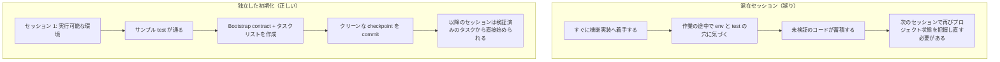

[英語版 →](../../../en/lectures/lecture-06-why-initialization-needs-its-own-phase/) | [中国語版 →](../../../zh/lectures/lecture-06-why-initialization-needs-its-own-phase/)

> ソースコード例: [code/](https://github.com/walkinglabs/learn-harness-engineering/blob/main/docs/vi/lectures/lecture-06-why-initialization-needs-its-own-phase/code/)
> 演習プロジェクト: [Project 03. マルチセッション継続性](./../../projects/project-03-multi-session-continuity/index.md)

# 講義 06. 各 Agent セッションの前に初期化を行う

新しい agent セッションを始めて、「検索機能を追加してください」と伝えます。すると、その agent は勢いよく実装に取りかかります。やる気があるのは良いことです。しかし 20 分後、テスト基盤が正しく整っていないことに気づき、さらに 10 分かけて修正し、その後でデータベース migration スクリプトの整形を誤って、また手が止まります。最終的に検索機能は追加されますが、セッション全体は非効率でした。時間の大半は検索機能を書くことではなく、「このプロジェクトがどう動くのかを理解すること」に費やされていたのです。

より良い方法があります。agent に作業を始めさせる前に、基盤環境を整え、検証コマンドが通る状態を作り、プロジェクト構造を把握するための専用フェーズを設けることです。家を建てるのと同じです。基礎工事と壁の建築を同時には行いません。もし同時に進めれば、基礎が固まる前に壁が立ち上がり、建物全体を壊して最初からやり直すことになります。まず基礎を打ち、固まるのを待ち、それから壁を建てる。そのほうが明快で効率的です。

この講義では、なぜ初期化を実装とは切り離した独立フェーズにすべきなのかを説明します。

## 基礎と壁: 本質的に異なる2つの作業

初期化と実装は、最適化の目的がまったく異なります。実装フェーズが最適化するのは、検証済みの機能をどれだけ多く、どれだけ高品質に届けられるかです。初期化フェーズが最適化するのは、その後に続くすべての実装を、どれだけ信頼性高く効率的に進められるかです。

初期化と実装を混ぜると、agent は多目的最適化を強いられます。つまり、インフラを整えながら機能コードも書くことになります。優先順位が明確でないと、agent は自然とコードを書くほうに寄ります。なぜなら、コードは目に見える成果だからです。一方で、インフラの価値は後のセッションになって初めて現れるため、後回しにされがちです。これは、建設チームに基礎工事と壁の建築を同時にやれと言うようなものです。見えて成果として示しやすい壁のほうを急いでしまうでしょう。しかし、基礎が弱い家はあとで構造的な問題を抱えます。

## 初期化のライフサイクル



## 混ぜると何が起きるか

最も直接的な問題は、基礎が正しく固まらないことです。agent が工数の 80% を機能コードに使い、残りの 20% で適当にインフラを整えるだけ、という状態になりがちです。テスト基盤は構成されていても一度も検証されず、lint ルールは設定されても緩すぎて、進捗ファイルも作られません。こうした欠陥は最初のセッションでは見えにくいです。agent は自分がやったことを覚えているからです。しかし 2 回目のセッションで問題が表面化します。新しい agent には、どう起動するのか、どう test するのか、何がどこにあるのかが分かりません。基礎が雑だと、建物はぐらつきます。

より見えにくいコストは「未検証の蓄積」です。テスト基盤が整う前に書かれた機能コードは、検証手段のないコードです。後になってそのコードに test を追加すると、そもそもの設計が間違っていたと分かることがあります。事前に分かっていれば、別の実装にしていたはずです。これは、固まっていないコンクリートの上にタイルを貼るようなものです。床が平らでないと分かったときには、タイルをすべて剥がしてやり直すしかありません。

セッション予算も無駄になります。初期化作業、つまり環境設定、test の整備、プロジェクト構造の理解にはかなりの予算が消費され、実際の機能実装に回せる分が減ります。その結果、1 回目のセッションでは機能を半分しか終えられず、2 回目のセッションではプロジェクト理解からやり直すことになります。基礎に予算を使ったのに、その基礎すら不十分です。どちらの目的も達成できません。

見落とされやすい問題は、暗黙の前提の落とし穴です。初期化の過程で agent が下す決定、たとえばどの test 基盤を使うか、フォルダをどう整理するか、依存関係をどう管理するかは、明示的に記録されていないと後のセッションでは理解できません。さらに悪いことに、後続のセッションが矛盾する選択をしてしまうこともあります。最初の建設チームはコンクリート基礎を使ったのに、2 番目のチームはそれを知らずに木杭を打ち込む。基礎がひび割れてしまいます。

Anthropic の長時間稼働するアプリケーション開発に関する研究でも、初期化を実装から分離する構成が紹介されています。公開記事で確認できる範囲では、専用の initializer が環境、feature list、progress record を用意し、その後の coding agent が段階的に進めます。重要なのは、初期化を実装と混ぜると、後続セッションの立ち上がりや判断が曖昧になるという点です。基礎がしっかりしているほど、壁は速く建ちます。

OpenAI の Codex harness engineering ガイドでも、「リポジトリは実行記録である」という原則が強調されています。最初の実行から明確な運用構造を整えておかなければ、新しいセッションは毎回プロジェクトの規約を推測し直さなければなりません。

## 重要概念

- **初期化フェーズ**: agent のライフサイクルにおける最初のフェーズです。機能は実装せず、その後のすべての実装フェーズに必要な前提条件だけを整えます。成果物はコードではなく、インフラです。
- **Bootstrap Contract**: 新しい agent セッションが曖昧さなく運用できるための条件です。起動できること、test できること、進捗が見えること、次に取るべき一手を選べること。この 4 条件がすべて必要です。
- **Cold Start vs. Warm Start**: Cold Start は、agent がプロジェクト構造を推測しなければならない空のディレクトリから始めることです。Warm Start は、すでにインフラが整ったテンプレートや既存プロジェクトから始めることです。Warm Start は Cold Start よりはるかに優れています。水道と電気が通った工事現場で作業を始めるのと、荒地から始めるのとでは大きな差があります。
- **Handoff Readiness**: 新しい agent が引き継げる状態に、プロジェクトがいつでもなっていることです。口頭説明は不要で、必要なのは repo の内容だけです。
- **Time to First Verification**: プロジェクト開始から、最初の機能スライスが検証を通過するまでの時間です。これは初期化の効率を測る中核指標です。
- **Downstream Usability**: 初期化品質を測る最良の指標です。後続のセッションが、暗黙知に頼らずにタスクを正常に実行できる割合を指します。

## 正しい初期化の進め方

**初期化は独立したフェーズとして扱います。** 最初のセッションは初期化だけを行い、業務機能のコードは一切書きません。初期化で作るものは次のとおりです。

**1. 実行可能な環境。** プロジェクトが起動し、dependencies がインストールされ、環境上の問題がありません。基礎が打たれ、ひび割れもありません。

**2. 検証可能な test 基盤。** 少なくとも 1 つのサンプル test が通ります。これにより、test 基盤そのものが正しく構成されていることが証明されます。基礎の上に柱を立てて、荷重に耐えられることを示すようなものです。

**3. bootstrap contract の文書。** 後続セッション向けの明確な文書です。
```markdown
# 初期化 Contract

## 起動コマンド
- dependencies をインストール: `make setup`
- dev server を起動: `make dev`
- test を実行: `make test`
- 全体を検証: `make check`

## 現在の状態
- すべての dependencies がインストールされ、固定されている
- test 基盤が構成済み（Vitest + React Testing Library）
- サンプル test が通過済み (1/1)
- lint ルールが構成済み（ESLint + Prettier）

## プロジェクト構造
- src/ — ソースコード
- src/components/ — React components
- src/api/ — API client
- tests/ — test ファイル
```

**4. タスク分割。** プロジェクト全体を順序付きのタスクリストに分割し、各タスクに明確な受け入れ基準を持たせます。
```markdown
# タスク分割

## タスク 1: 基本的なユーザー認証
- JWT auth middleware を実装
- ログイン/登録 endpoint を追加
- 受け入れ条件: `pytest tests/test_auth.py` がすべて通ること

## タスク 2: ユーザープロフィール画面
- ユーザープロフィールの CRUD を実装
- プロフィール編集フォームを追加
- 受け入れ条件: `pytest tests/test_profile.py` がすべて通ること

## タスク 3: 検索機能
- ...
```

**5. Git commit を checkpoint にする。** 初期化が終わったら、クリーンな checkpoint を commit します。その後の作業はすべてこの checkpoint から始めます。

**Warm Start 戦略**: 空のディレクトリから始めないでください。create-react-app や fastapi-template などのプロジェクトテンプレートを使って、標準的なフォルダ構成、dependencies 設定、test 基盤をあらかじめ用意します。一般的な初期化手順はテンプレートに焼き込み、プロジェクト固有の初期化だけを残します。水道と電気が通った現場で作業を始めるのと同じで、荒地から始めるより何万倍も良いのです。

**初期化完了の基準**: 「どれだけコードを書いたか」ではありません。bootstrap contract の 4 条件が満たされたかどうかです。つまり、起動できること、test できること、進捗が見えること、次の一手を選べることです。初期化の確認には次のチェックリストを使います。

```markdown
## 初期化の受け入れチェックリスト
- [ ] `make setup` が最初から成功する
- [ ] `make test` で少なくとも 1 つの test が通る
- [ ] 新しい agent セッションが、repo の内容だけを見て「どう起動するか」と「どう test するか」に答えられる
- [ ] 3 つ以上のタスクがあるタスク分割ファイルが存在する
- [ ] すべてが git に commit されている
```

## 実例

React frontend プロジェクトに対する 2 つの初期化アプローチを比較します。

**混在アプローチ（基礎工事と壁の建築を同時に行う）**: agent がセッション 1 で、プロジェクトの scaffold 作成と最初の機能実装を同時に行います。セッション終了時点で repo には動くコードがありますが、起動/test のコマンドを示す明確な文書はなく、進捗追跡ファイルもなく、タスク分割もありません。セッション 2 では、プロジェクト構造、test 基盤、build 手順を推測するのに約 20 分かかります。まるで、現場に新しく来た建設チームが、基礎がどこまで進んでいるのかも、水道管がどこにあるのかも分からず、場所ごとに穴を掘って確かめるようなものです。

**独立した初期化（基礎を先に作る）**: セッション 1 は初期化だけを行います。テンプレートからフォルダ構成を作り、test 基盤（Vitest + React Testing Library）を設定し、サンプル test を書いて検証し、bootstrap contract とタスク分割ファイルを作成し、最初の checkpoint を commit します。セッション 2 の再構築コストは 3 分未満で済み、タスクリストから直接作業を始められます。つまり、チームが図面を見て、どこから再開すべきかを正確に把握できる状態です。

プロジェクト全体のサイクルで比較すると、混在アプローチの総再構築時間は、独立初期化アプローチより約 60% 長くなります。初期化に追加した 20 分は、その後のセッションで何度も回収されます。しっかりした基礎があれば壁は速く建つのです。遅く始めるほうが、結果的には速いのです。

## 覚えておくべきポイント

- 初期化と実装は最適化の目的が異なります。混ぜると両方が弱くなります。まず基礎を打ち、それから壁を建てます。
- 初期化の成果物はコードではなくインフラです。実行可能な環境、検証可能な test、bootstrap contract、タスク分割がその成果です。
- 初期化は bootstrap contract の 4 条件で確認します。起動できること、test できること、進捗が見えること、次の一手を選べることです。
- Warm Start は Cold Start より優れています。標準化されたインフラを先に用意するために、プロジェクトテンプレートを活用してください。
- 初期化への投資は、後続セッションが毎回状態を推測し直すコストを減らします。これは余分なコストではなく、先行投資です。基礎がしっかりしているほど、建物は速く完成します。

## 参考文献

- [Anthropic: Effective Harnesses for Long-Running Agents](https://www.anthropic.com/engineering/effective-harnesses-for-long-running-agents)
- [OpenAI: Harness Engineering](https://openai.com/index/harness-engineering/)
- [HumanLayer: Harness Engineering for Coding Agents](https://humanlayer.dev/articles/harness-engineering-for-coding-agents/)
- [Infrastructure as Code — Martin Fowler](https://martinfowler.com/bliki/InfrastructureAsCode.html)
- [SWE-agent: Agent-Computer Interfaces](https://github.com/princeton-nlp/SWE-agent)

## 演習

1. **bootstrap contract を設計する**: 今開発中のプロジェクトに対して、完全な bootstrap contract を書いてください。そのあと、まったく新しい agent セッションを開き、repo の内容だけを見せます（会話の文脈なし）。その agent に、プロジェクトの起動、test 実行、現在の進捗把握を試させてください。発生した問題をすべて記録します。各問題は、あなたの bootstrap contract に不足している項目に対応します。

2. **比較実験**: 中規模の新規プロジェクトを 1 つ選びます。方法 A は、agent に初期化と最初の実装を同時にやらせます。方法 B は、初期化だけのセッションを 1 回確保し、実装はセッション 2 から始めます。4 セッション後に、Time to First Verification、再構築コスト、機能完了率を比較してください。

3. **初期化受け入れチェックリスト**: あなたのプロジェクト向けに、初期化受け入れチェックリストを設計してください。新しい agent セッションに、そのチェックリストの各項目を順番に実行させ、どれが通ってどれが失敗したかを記録します。失敗した項目は、あなたの harness を強化すべき箇所です。
