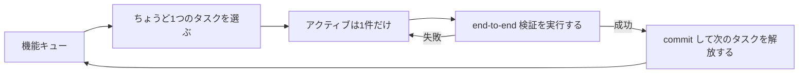
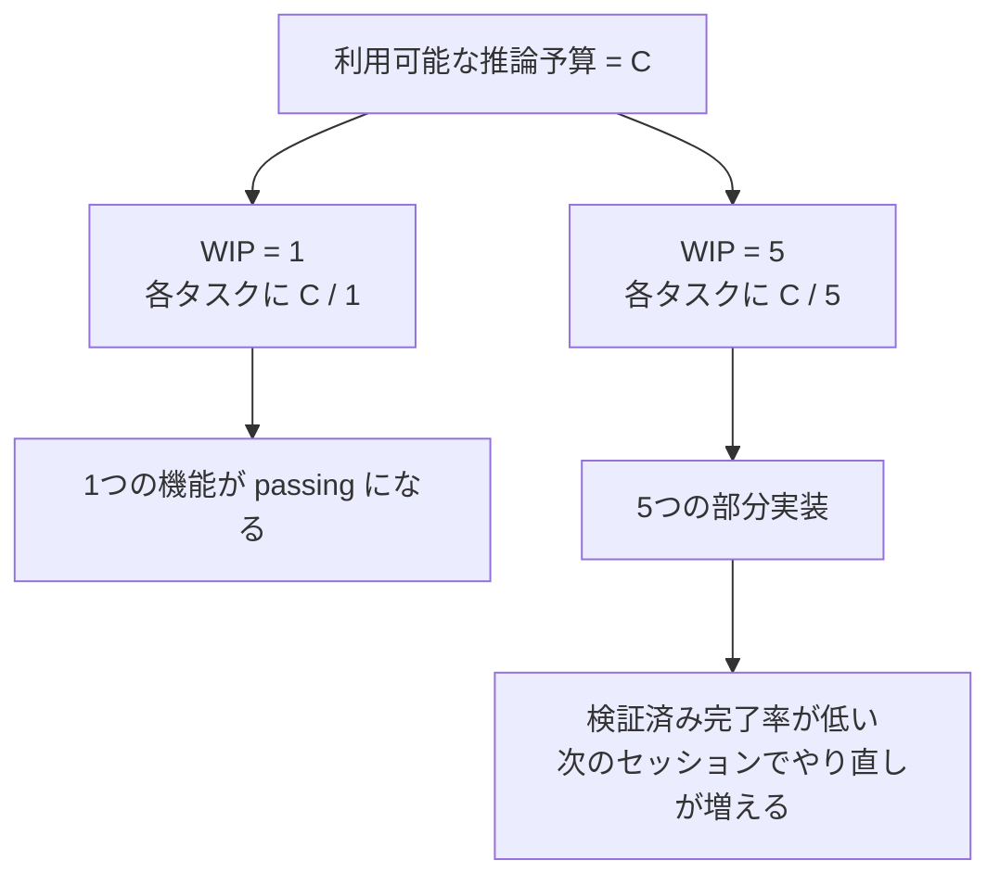

[英語版 →](../../../en/lectures/lecture-07-why-agents-overreach-and-under-finish/) | [中国語版 →](../../../zh/lectures/lecture-07-why-agents-overreach-and-under-finish/)

> コード例: [code/](https://github.com/walkinglabs/learn-harness-engineering/blob/main/docs/vi/lectures/lecture-07-why-agents-overreach-and-under-finish/code/)
> 実践プロジェクト: [プロジェクト 04. ランタイム・フィードバックとスコープ制御](./../../projects/project-04-incremental-indexing/index.md)

# レクチャー 07. Agent に明確な作業境界を引く

Claude Code に「このプロジェクトにユーザー認証を追加して」と伝えると、database schema を修正し、route を書き、frontend component を変え、ついでに error-handling middleware までリファクタリングし始めます。2時間後に確認すると、12ファイルが変更され、800行の新しいコードが増えたのに、end-to-end で動く機能は1つもありません。

「急いては事を仕損じる」は、特に AI agent に当てはまります。Agent には「もう少しだけやっておこう」という衝動があり、関係ありそうなものを見つけるとそのまま処理してしまいます。まるで、醤油1本だけ買うつもりでスーパーに入ったのに、帰りにはカートいっぱいの買い物を押しているようなものです。違いは、人間の買いすぎはお金の無駄で済むのに対し、agent のやりすぎは同時に進めた仕事のどれもがちゃんと終わらないことです。

Anthropic の技術ブログ「Effective harnesses for long-running agents」ははっきり述べています。prompt が広すぎると、agent は「1つを終えてから次へ」ではなく「いくつも同時に始める」傾向があります。OpenAI の Codex engineering の実践でも同じことが確認されています。スコープ制御が明確でないタスクでは、完了率が大きく落ちます。これはモデルの問題ではなく、harness の問題です。境界線が引かれていないのです。

## 注意力は有限資源

これは比喩ではなく、数学です。agent のコンテキスト容量を C とし、同時に k 個のタスクを動かしているとします。各タスクが受け取る推論資源の平均は C/k です。C/k が、1つのタスクを完了するのに必要な最小値を下回ると、そのどれも終わりません。胃袋にも限界があります。一度に10個の肉まんを詰め込めば、全部消化できるわけではなく、10回ぶんの消化不良になるだけです。

Claude Code の実際の挙動はかなり分かりやすいです。「ユーザー登録を追加して」と頼むと、次のようなことが起こりえます。

1. User model を作る
2. 登録用 route を書く
3. メール認証が必要だと気づき、mail service を追加する
4. パスワードの hash 化が必要だと気づき、bcrypt を導入する
5. error handling に一貫性がないと気づき、global error middleware をリファクタリングする
6. test ファイルの構成が乱れていると気づき、ディレクトリを整理する

6ステップ後には、どれも中途半端なままです。end-to-end の検証はなく、未完成のコードが複雑さを積み上げ、次の片付け用セッションは完全に迷子になります。まるで誰かが6品を同時に料理していて、どれもフライパンの中にあるのに、1皿も盛り付けられていないようなものです。全部焦げます。

Anthropic の実験データもこれを直接裏づけています。「次の小さな一歩」戦略、つまり WIP=1 に相当するやり方を使った agent は、広い prompt を使った agent よりもタスク完了率が 37% 高くなりました。さらに興味深いのは、agent が生成したコード行数は、実際の機能完了率と弱い負の相関を示したことです。コードを書けば書くほど、完了する機能は減るのです。データで証明された「急いては事を仕損じる」です。

## WIP=1 のワークフロー





## 重要な概念

- **Overreach（範囲の踏み越え）**: agent が、1セッションで最適量を超える数のタスクを起動してしまうこと。これは定量化できます。5機能を手がけて、end-to-end で1つも通っていなければ、それは overreach です。
- **Under-finish（完了不足）**: 起動したタスク総数に対して、end-to-end 検証を通過したタスクの割合がしきい値を下回ること。コードは書かれたのに test が通らない状態は under-finish です。
- **WIP 制限（Work-in-Progress Limit）**: Kanban 由来の用語です。要点は、同時に進めるタスク数を制限すること。agent にとっては WIP=1 が最も安全な既定値です。次を始める前に、今の1つを終える。ビュッフェと同じで、皿を積み上げず、1皿終えてから次を取りに行きます。
- **完了の証拠（Completion Evidence）**: タスクが「実行中」から「完了」に移るために満たすべき、検証可能な条件です。これがないと、agent は「test に通る振る舞い」ではなく「それっぽく見えるコード」を完了の代わりにしてしまいます。
- **スコープ面（Scope Surface）**: 各ノードが作業単位、各エッジが依存関係である DAG 構造。状態は not_started, active, blocked, passing の4つに限られます。
- **完了圧力（Completion Pressure）**: WIP 制限と完了証拠の要求を通じて harness が与える拘束力で、agent に今のタスクを終えるまで次を始めさせないようにします。

## 範囲の踏み越えと完了不足は相互に増幅する

この2つの問題は独立ではなく、互いを増幅します。範囲の踏み越えは注意力を分散させ、分散した注意力は完了不足を招き、さらに残った未完成コードがシステムの複雑さを増し、それが次のタスクでの範囲の踏み越えをまた促します。悪循環です。

Kanban の用語で言えば、リトルの法則は L = λ * W を教えてくれます。進行中の作業量 L が高すぎる、つまり同時にやりすぎると、各タスクの所要時間 W は必然的に伸びます。agent にとっては、各機能が開始から検証済み完了までにより長くかかり、失敗の確率も上がるということです。

これは人間の世界でも昔からある問題です。Steve McConnell は *Rapid Development* の中で、scope creep がプロジェクト失敗の主因だと記録しています。ただし人間には少なくとも「もう十分やった」という感覚があります。agent にはそれがありません。次のアイデアを出すコストはモデルにほとんど追加 token を必要としませんし、「ついでにここも直そう」と書くのもほぼ無視できるほど軽いです。しかし、修正を1つ追加するたびに agent の注意力は薄まります。ビュッフェで皿を1枚増やすコストはほぼゼロでも、胃袋には限界があるのと同じです。

## 正しいやり方

### 1. WIP=1 を徹底する

これが最も直接的で効果の高い方法です。harness の中で agent に明確に伝えてください。**どの時点でも "active" にできるタスクは1つだけです。** Claude Code の CLAUDE.md や Codex の AGENTS.md には、次のように書きます。

```
## 作業ルール
- 1度に1つの機能だけに取り組む
- 現在の機能が end-to-end 検証を通過してから、次の機能を始める
- 機能 A を実装しながら、機能 B を「ついでにリファクタリング」しない
```

ビュッフェと同じです。1皿ずつ取り、食べ終えてから次を取りに行きます。

### 2. 各タスクに明確な完了証拠を定義する

完了とは「コードを書いたこと」ではなく、「振る舞いが検証に通ったこと」です。feature list の各項目には、検証コマンドを1つ付けてください。

```
F01: ユーザー登録
  検証: curl -X POST /api/register -d '{"email":"test@example.com","password":"123456"}' | jq .status == 201
  状態: passing
```

### 3. スコープ面を外部化する

機械可読なファイル（JSON か Markdown）を使って、すべてのタスク状態を記録してください。新しいセッションはそのファイルを読めばすぐに、どのタスクが動いているか、何が完了と見なされるか、どの検証が通っているかを把握できます。

### 4. 検証済み完了率を追跡する

harness は VCR（Verified Completion Rate）= 検証済みタスク数 / 起動したタスク数 を継続的に追跡すべきです。VCR < 1.0 のときは、新しいタスクの起動を止めます。

## 実例

8機能を持つ REST API プロジェクトで、2つの戦略を比較した例です。

**ビュッフェ方式（制約なし）**: agent は第1セッションで5機能を同時に起動しました。結果は約800行、12ファイル。end-to-end test の通過率は20%で、動いたのはユーザー登録だけでした。残り4機能は、database schema は作られたものの検証ロジックがなく、route は定義されたものの誤ったレスポンス形式を返していました。まるで6品を同時に作って、1品だけ何とか食べられる状態のようです。第3セッション末には、8機能中3つしか完了していませんでした。

**1皿方式（WIP=1）**: agent は第1セッションでユーザー登録だけに取り組みました。結果は約200行、4ファイル。end-to-end test は100%通過。きれいに検証済みの実装を commit しました。第4セッション末には、8機能中7つが完了していました（8つ目は外部依存でブロック）。

結果として、総コード量は少ないのに（800行対1200行）、有効なコードは多くなりました。完了率は 87.5% 対 37.5% です。少しずつ食べれば、実際にはより多く食べられるのです。

## 覚えておくべき要点

- **WIP=1 は agent harness の安全な既定値です** — 1つ終えてから次へ進み、並列化しないでください。1回の食事で太ることはありません。
- **完了証拠は実行可能でなければなりません** — 「コードがそれっぽい」は無効で、「curl が 201 を返す」が有効です。
- **スコープ面はファイルとして外部化してください** — 会話の中で触れるだけでなく、repo 内に機械可読な形で残します。
- **範囲の踏み越えと完了不足は相互依存です** — 一方を直せば、もう一方も改善します。
- **「少なくても終わらせる」ことは、いつでも「多く作って半分残す」より良いです** — agent のコード行数と機能完了率は負の相関にあります。量より質です。

## 参考資料

- [Effective harnesses for long-running agents - Anthropic](https://www.anthropic.com/engineering/effective-harnesses-for-long-running-agents) — Anthropic の技術ブログ。「次の小さな一歩」戦略を詳しく扱っています
- [Harness Engineering - OpenAI](https://openai.com/index/harness-engineering/) — OpenAI による harness engineering の包括的な解説
- [Kanban: Successful Evolutionary Change - David Anderson](https://www.goodreads.com/book/show/1070822.Kanban) — WIP 制限に関する定番資料
- [Rapid Development - Steve McConnell](https://www.goodreads.com/book/show/125171.Rapid_Development) — scope creep がプロジェクト失敗の主因であるという実証データ

## 演習

1. **タスクの原子化**: 広い要求（例: 「ユーザー管理システムを実装する」）を選び、少なくとも5つの原子的な作業単位に分解してください。各単位について、(a) 単一の振る舞いの説明、(b) 実行可能な検証コマンド、(c) 依存関係を指定します。その分割が WIP=1 の制約を満たしているか確認してください。

2. **比較実験**: 同じプロジェクトを2回実行してください。1回は制約なし、もう1回は WIP=1 を適用します。比較するのは、検証済み完了率、総コード行数、有効コード率です。

3. **完了証拠の監査**: 直近の agent 実行結果を見直し、各コード変更を「完了した振る舞い」「未完了の振る舞い」「scaffolding」に分類してください。未完了の振る舞いそれぞれに、足りない検証コマンドを追加します。
