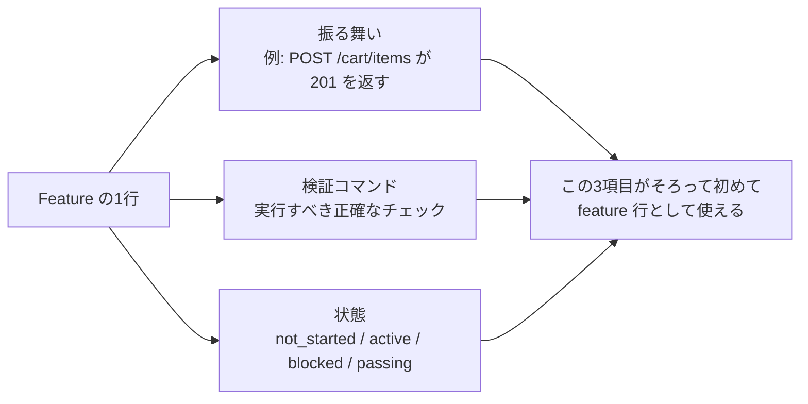
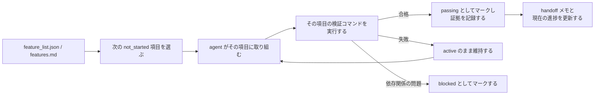

[英語版 →](../../../en/lectures/lecture-08-why-feature-lists-are-harness-primitives/) | [中国語版 →](../../../zh/lectures/lecture-08-why-feature-lists-are-harness-primitives/)

> ソースコード例: [code/](https://github.com/walkinglabs/learn-harness-engineering/blob/main/docs/vi/lectures/lecture-08-why-feature-lists-are-harness-primitives/code/)
> 演習プロジェクト: [プロジェクト 04. 実行時フィードバックとスコープ制御](./../../projects/project-04-incremental-indexing/index.md)

# レクチャー 08. Feature List で Agent の振る舞いを制約する

ある agent に EC サイトを作らせたとします。完了後、その agent はあなたに「終わりました」と言います。コードを見ると、ユーザー認証は動いていますが、カートの購入ボタンは何もせず、決済フローはまったくつながっていません。問題は、あなたが「終わり」の意味を定義していなかったことです。そのため agent は独自の基準を使いました。つまり、「たくさんコードを書いたし、それなりに完成して見える」という基準です。

多くの人にとって feature list は、忘れないように全部書いておくための単なるメモに見えるかもしれません。しかし harness の世界では、feature list は人間向けのメモではなく、harness 全体の背骨です。スケジューラはタスク選択のためにこれに依存し、verifier は完了判定のためにこれに依存し、handoff reporter は要約生成のためにこれに依存します。背骨を壊せば、身体全体が麻痺します。

Anthropic も OpenAI も、**artifact は外部化されるべきだ** と強調しています。feature の状態は、構造化されていない会話文ではなく、リポジトリ内の機械可読なファイルに置かれていなければなりません。

## Agent は「終わり」の意味を知らない

Claude Code も Codex も、あなたが「終わり」と言ったときに、その意味を自動では知りません。あなたが「カート機能を追加して」と言うと、モデルの解釈は「Cart component と addToCart method を書くこと」かもしれません。しかしあなたが本当に望んでいるのは、「ユーザーが商品を閲覧し、カートに追加し、end-to-end で決済を完了できること」です。この認識の差は、feature list がなければずっと残り続けます。agent は自分の暗黙の基準を使います。たいていは「明らかな構文エラーがないコード」です。必要なのは、end-to-end の振る舞いを検証することです。果物を買ってきてと頼む場面と同じです。「何か果物を買ってきて」と言うと、相手はレモンを持って帰ってくるかもしれません。相手の果物と、あなたの果物は同じ種類ではありません。

よくある進捗メモを見てください。

```
ユーザー認証は完了、カートはほぼ完了、決済はまだ必要
```
新しい agent のセッションは、このメモだけで次の問いに答えられるでしょうか。「ほぼ完了」とは何を意味するのか。カートはどのテストに合格したのか。決済を妨げているものは何か。答えはすべて「誰にも分からない」です。医師に「お腹が痛いですが、最近は少しマシです」とだけ伝えるようなものです。そこから、何を処方できるでしょうか。

その結果、新しいセッションはプロジェクト状態を推測するためにまとまった時間を費やし、完了済みの機能を再実装することすらあります。Anthropic の公開事例でも、progress file と git history を使って次の agent が状態を素早く理解できるようにする設計が紹介されています。

## Feature の状態機械





## 重要な概念

- **Feature list は harness の基本原理である**: これは「任意の計画ツール」ではなく、他のすべての harness コンポーネントが依存する基盤データ構造です。データベースのテーブル構造のようなものです。「主キーを無視してよい」とは言えません。
- **3 要素構造**: 各 feature 項目は `(behavior の説明, verification コマンド, 現在の状態)` の三つ組です。どれか 1 つでも欠けると不完全です。
- **状態機械モデル**: 各 feature 項目には `not_started`, `active`, `blocked`, `passing` の 4 状態があります。状態遷移は harness が制御し、agent が自由に変更することはできません。
- **Pass-state gating**: feature が `active` から `passing` に移る唯一の方法は、verification コマンドの成功実行です。これは逆戻りできません。試験に合格したら合格であり、後から点数を変えることはできないのと同じです。
- **単一の真実の源**: 「何をすべきか」に関するすべての情報は、1 つの feature list に由来していなければなりません。feature list と会話履歴の間に矛盾があってはいけません。
- **Back-pressure**: 未完了の feature 数が、harness が agent にかける圧力です。圧力がゼロなら、プロジェクトは完了です。

## なぜ Feature List が「基本原理」なのか

ドキュメントは人間が読むためのものですが、基本原理はシステムが実行するためのものです。ドキュメントは無視できますが、基本原理は迂回できません。

データベースのトリガ制約とアプリケーション層のチェックを比べてみてください。前者は DB エンジンによって実行されるため、どんな SQL でも迂回できません。後者はアプリケーションコードの正しさに依存しており、うっかりすり抜けることがあります。harness の基本原理としての feature list は、次の 4 つの具体的な harness コンポーネントに役立ちます。

1. **Scheduler**: 状態を読み取り、次の `not_started` feature を選びます。工場の生産計画システムのようなものです。
2. **Verifier**: 検証コマンドを実行し、状態遷移を許可するかどうかを判断します。品質検査のようなものです。
3. **Handoff Reporter**: feature list からセッション引き継ぎ要約を自動生成します。自動シフト報告のようなものです。
4. **Progress Tracker**: 状態分布を数え、プロジェクトの健全性メトリクスを提供します。ダッシュボードのようなものです。

## 正しいやり方

### 1. 最小限の Feature List 形式を定義する

複雑なシステムは必要ありません。構造化された Markdown または JSON ファイルで十分です。重要なのは、各項目が次の三つ組を持つことです。

```json
{
  "id": "F03",
  "behavior": "POST /cart/items は {product_id, quantity} で 201 を返す",
  "verification": "curl -X POST http://localhost:3000/api/cart/items -H 'Content-Type: application/json' -d '{\"product_id\":1,\"quantity\":2}' | jq .status == 201",
  "state": "passing",
  "evidence": "commit abc123, テスト出力ログ"
}
```

### 2. 状態遷移は Harness に制御させる

agent は feature の状態を直接 `passing` に変更できません。できるのは検証要求を送ることだけです。harness が検証コマンドを実行し、遷移を許可するかどうかを決めます。これが「pass-state gating」です。

### 3. ルールを CLAUDE.md に書く

```
## Feature List ルール
- feature list ファイル: /docs/features.md
- 一度に active なのは 1 feature のみ
- passing としてマークする前に検証コマンドが成功していなければならない
- feature list の状態を自分で変更しないこと。検証スクリプトが自動で更新する
```

### 4. 粒度を調整する

各 feature 項目は「1 セッションで完了できる範囲」でなければなりません。広すぎると終わらず、細かすぎると管理オーバーヘッドが増えます。「ユーザーが商品をカートに追加できる」はちょうどよい粒度です。「カートを実装する」は広すぎます。「Cart model に name フィールドを作る」は細かすぎます。ステーキを切り分けるのと同じです。1 枚丸ごとでも、ひき肉でもありません。

## 実例

10 個の feature を持つ EC プラットフォームを考えます。追跡方法を 2 つ比較します。

**メモ運用モード**: agent は非構造化メモを使います。3 セッション後、メモは「ユーザー認証と商品一覧はできた、カートはほぼ完了だがバグあり、決済は未着手」といった状態になります。新しいセッションは状態推測に 20 分かかり、最終的に完了済みの feature を再実装することになります。買い物リストに「牛乳、パン、それとあれ」と書いてあるようなものです。店に着いても、何を買うべきか結局分かりません。

**背骨運用モード**: 各 feature に状態と明確な検証コマンドがあります。新しいセッションは feature list を読めば、3 分で F01-F05 は `passing`、F06 は `active`、F07-F10 は `not_started` だと分かります。F06 からそのまま続行し、やり直しはありません。

この比較で重要なのは、構造化された feature list では完了条件と現在状態が機械可読に残るため、自由形式の追跡よりも「次に何をやるべきか」「何が完了済みか」を判断しやすいことです。

## 覚えておくべき要点

- **Feature list は harness の背骨であり、人間向けのメモではない**: スケジューラ、verifier、handoff reporter はすべてこれに依存します。
- **各 feature 項目は三つ組である**: 行動の説明 + 検証コマンド + 現在の状態。1 つでも欠けると不完全です。3 本脚の椅子の脚が 1 本足りないようなものです。
- **状態遷移は harness が制御する**: agent は状態を自分で変えられません。検証に合格することだけが唯一の昇格経路です。
- **feature list はプロジェクトの唯一の真実の源である**: 「何をすべきか」に関する情報はすべて、1 つのリストに由来します。
- **粒度は「1 セッションで完了できる」大きさに調整すること**

## 参考資料

- [Effective harnesses for long-running agents - Anthropic](https://www.anthropic.com/engineering/effective-harnesses-for-long-running-agents) — feature list を使って、早すぎる完了宣言や scope drift を減らす方法を説明しています
- [Harness Engineering - OpenAI](https://openai.com/index/harness-engineering/) — 「artifact の外部化」の原則を強調しています
- [Design by Contract - Bertrand Meyer](https://www.goodreads.com/book/show/130439.Object_Oriented_Software_Construction) — contract 設計の原則であり、feature list の理論的基盤です
- [The Practical Test Pyramid - Martin Fowler](https://martinfowler.com/articles/practical-test-pyramid.html) — テストピラミッドとユーザー視点の acceptance tests の実践

## 演習

1. **Feature List を設計する**: 最小限の feature list 用 JSON schema を定義してください。含める項目は、id、behavior の説明、verification コマンド、現在の状態、証拠参照です。これを使って、5 つの feature を持つ実際のプロジェクトを記述してください。

2. **検証の厳しさを比較する**: 3 つの feature を選び、「ゆるい」検証（例: 「コードに構文エラーがない」）と「厳しい」検証（例: 「end-to-end テストが通る」）の両方を設計してください。それぞれでの偽陽性率を比較してください。

3. **単一の真実の源を監査する**: 既存の agent プロジェクトを見直し、feature list と矛盾するスコープ情報（会話内の隠れた要件、コード内の TODO コメントなど）がないか確認してください。すべての情報を feature list に集約する計画を立ててください。
