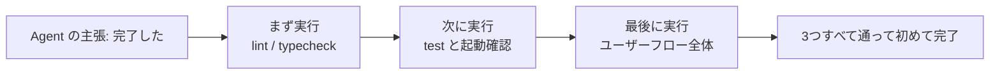
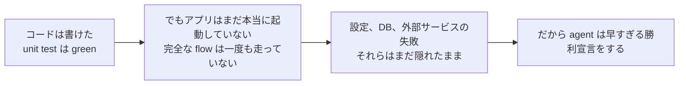

[英語版 →](../../../en/lectures/lecture-09-why-agents-declare-victory-too-early/) | [中国語版 →](../../../zh/lectures/lecture-09-why-agents-declare-victory-too-early/)

> この講義のサンプルコード: [code/](https://github.com/walkinglabs/learn-harness-engineering/blob/main/docs/vi/lectures/lecture-09-why-agents-declare-victory-too-early/code/)
> 演習: [Project 05. Agent に自分の作業を検証させる](./../../projects/project-05-grounded-qa-verification/index.md)

# 第9講. Agent が勝利宣言を早まるのを防ぐ

あなたは agent に「パスワード再設定」機能の実装を依頼します。agent はデータベース構造を変更し、API endpoint を書き、メールテンプレートを追加し、unit test を実行して、すべて成功しました。そこで agent は自信満々に「完了しました」と伝えます。ところが、実際に動かしてみると、パスワード再設定リンクは送信できず（メールサービスの設定が不足）、データベース migration は途中で失敗し（schema が不整合）、しかも全体の flow は一度も本番同様に実行されていません。

この感覚に覚えはないでしょうか。答案を全部埋めたので自信を持って最初に提出したのに、採点で落ちてしまう感覚に似ています。解答欄が埋まっていることと、答えが正しいことは別です。

これは珍しい事故ではありません。Guo らによる 2017 年の ICML の古典的論文は、**現代のニューラルネットワークはしばしば一貫して過信している**ことを示しました。モデルが報告する confidence は、実際の accuracy を大きく上回りがちです。これは AI coding agent にも当てはまります。agent は「終わった」と感じますが、実際にはまだ終わっていません。あなたの harness は、agent の「感覚」を実行ベースの外部検証に置き換えなければなりません。

## 滑りやすい坂

早すぎる完了宣言には、ほぼ決まったパターンがあります。コードは見た目上は問題なさそうです。構文は正しく、ロジックも妥当に見え、静的解析でも明白なエラーは出ません。しかし harness は包括的な実行検証を強制しないため、agent は実際にコードを動かすことを省略したり、テストの一部だけを走らせたりします。unit test は通すが integration test は飛ばす。テストは走らせるが coverage は確認しない。最後には、「コードがそれっぽく見える」ことが「機能は完了した」の証拠として扱われます。そして答案は提出されます。

各段階で情報は失われます。タスク仕様からコード実装へ、さらに runtime の挙動へと移るたびに、どこかでずれが入り込みます。しかも検証の段階を一つでも飛ばすと、その情報の非対称性はさらに悪化します。

## 3 層の終了確認





## 重要な概念

- **早すぎる完了宣言**: Agent がタスクは終わったと主張する一方で、まだ満たされていない仕様が残っている状態です。核心の問題は、agent がコード単体レベルの局所的な自信で評価してしまい、システム全体としての正しさには全体検証が必要だという点を見落とすことです。
- **confidence calibration のずれ**: Agent が自己申告する完了への自信と、実際の完了品質との系統的な差です。複数ファイルにまたがる複雑なタスクでは、このずれは大きく正方向に偏り、agent は実際の達成能力よりもはるかに自信過剰になります。試験後に自分の点数を高く見積もりすぎる学生のようなものです。
- **終了条件**: Harness 内で定義された、実行可能で明確な合格条件の集合です。Agent は「完了」と言う前に、その条件をすべて満たさなければなりません。「完了」は主観的な評価から客観的な判定へ変わります。
- **verification-validation の二重ゲート**: 最初の verification 層は「コードが指定された振る舞いを正しく実装しているか」を確認し、二つ目の validation 層は「システムとしての振る舞いが end-to-end 要件を満たしているか」を確認します。完了と見なすには両方を通過しなければなりません。
- **runtime フィードバック信号**: プログラム実行から得られる logs、process state、health check です。これは harness が完了品質を評価するための客観的な材料です。
- **完了優先制約**: まず機能の正しさを検証し、その後にパフォーマンス、最後に見た目やスタイルを扱います。refactoring は中核機能が検証されるまで禁止です。

## Unit Test に通った = タスク完了 ではない

これは最もよくある落とし穴であり、同時に最も危険でもあります。agent はコードを書き、unit test を実行し、すべて green になったので「完了しました」と言います。しかし unit test の設計思想は、検証対象の単位を孤立させ、依存関係を mock することです。そのため、コンポーネントをまたぐ問題を見つけるには本質的に不向きです。

**Interface mismatch**: render が preload script に渡す file path は相対パスなのに、preload script は絶対パスを期待しているケースがあります。それぞれの unit test は mock を使っていて通過します。問題が表面化するのは end-to-end の検証時だけです。ちょうど、オーケストラの各演奏者が一人で練習しているときは完璧なのに、合わせてみたら別の調にいたと気づくようなものです。

**state propagation errors**: データベース migration が table schema を変更したのに、ORM の cache 層は古い schema の cache entry を保持したまま、というケースです。Unit test は毎回新しい mock 環境を与えるので、このような層をまたいだ状態不整合は露出しません。

**environment dependency**: Test 環境では正しく動くのに、実環境では configuration の違い、network latency、あるいは service unavailable によって失敗するケースです。練習室では完璧に歌えても、本番では音響機器のトラブルで止まってしまうようなものです。

### 「ついでに refactor する」は完了判定にとって有害

Claude Code にはよくある挙動があります。中核機能が verification を通る前に、コードの refactor、performance の最適化、スタイル改善を始めてしまうのです。Knuth の「早すぎる最適化は諸悪の根源」という言葉は、agent の文脈ではさらに意味が重くなります。refactor は、検証済みと未検証のコードの境界を変えてしまい、それまで暗黙に正しいとみなされていた経路を壊す可能性があるからです。数学の記述問題をまだ終えていないのに、選択問題の解答を書き直して見栄えを整えるようなものです。時間の無駄であるだけでなく、書き間違える危険まであります。

### 自己評価における系統的なずれ

Anthropic は 2026 年の研究で、さらに深いエラーパターンを見つけました。**agent に自分の仕事を評価させると、たとえ人間の観察者なら明らかに基準未満とみなす品質でも、系統的に甘い評価を下します。** これは、学生に自分の試験を採点させるようなものです。自分の答えにはどうしても寛容になります。

この問題は、特に主観的なタスク（たとえばデザインの美しさ）のような場面で深刻です。「このレイアウトは洗練されているか」は判断の問題であり、agent は肯定側に寄りがちです。結果を検証できるタスクであっても、agent の判断力が低ければ性能は損なわれます。

解決策は agent を「もっと客観的」にすることではありません。同じモデルは、自分で作ったものを自分で評価すると甘くなりやすいからです。**解決策は「作る人」と「チェックする人」を分離することです。** 学生が自分の試験を自己採点すべきでないのと同じで、独立した採点者が必要です。

独立した評価用 agent を用意し、「厳しめ」に調整したほうが、agent に自己評価させるよりずっと有効です。Anthropic の実験データでは次のようになっています。

| Architecture | Runtime | Cost | Core Function Working? |
|--------------|---------|------|------------------------|
| Single Agent (bare run) | 20 minutes | $9 | No (game entities do not respond to input) |
| Three Agents (planner + generator + evaluator) | 6 hours | $200 | Yes (game is fully playable) |

これは同じ model（Opus 4.5）に同じ prompt（"build a 2D retro game editor"）を与えたものです。違いは harness だけです。つまり、「素の実行」から「planner が要件を細分化 → generator が機能を順に実装 → evaluator が Playwright で実際にクリック検証を行う」形へ変えたのです。

> Source: [Anthropic: Harness design for long-running application development](https://www.anthropic.com/engineering/harness-design-long-running-apps)

## 早すぎる提出を防ぐ方法

### 1. 完了判定を外部化する

完了の評価を agent 自身に任せてはいけません。Harness は、agent の自信ではなく runtime signal を入力として、終了判定を独立に実施しなければなりません。これを `CLAUDE.md` に明記します。

```
## 定義済みの完了条件 (Definition of Done)
- 機能の完了 = end-to-end verification が通ること。「コードを書いた」ことではない
- 必須の verification レベル:
  1. Unit tests pass
  2. Integration tests pass
  3. End-to-end flow verification passes
- level 1 が失敗しているなら level 2 に進まない
- level 2 が失敗しているなら level 3 に進まない
```

### 2. 3 層の終了確認を構築する

- **Layer 1: Syntax and Static Analysis**。最も安く、得られる情報は最も少ないですが、必ず通さなければなりません。これは最低限のチェックです。まず単語を正しく綴れていないと、他のことは何も始まりません。
- **Layer 2: Runtime Behavior Verification**。テストの実行、アプリの起動確認、重要な path の検証を行います。これが完了の核心的な証拠です。書かれているだけでは足りません。実際に動かなければなりません。
- **Layer 3: System-Level Validation**。end-to-end test、統合確認、ユーザーシナリオのシミュレーションです。早すぎる宣言に対する最後の防波堤です。動くだけではなく、正しく動かなければなりません。

### 3. Agent 向けに「赤ペンの指示」を設計する

OpenAI は、Codex の実践の中で特に有効なパターンを示しています。**agent 向けのエラーメッセージには、修正のための指示を含めるべきです。** ただ大きく赤い×印をつけるのではなく、よい教師のように「どう直せばいいか」を余白に書いてください。`"Test failed"` だけにせず、`"Test failed: POST /api/reset-password returned 500. Check that the email service config exists in environment variables. The template file should be at templates/reset-email.html."` のようにします。具体的で実行可能なフィードバックがあれば、agent は人の手を借りずに自己修正できます。

### 4. runtime signal を拾う

有効な runtime signal には次のようなものがあります。
- アプリは正常に起動し、ready state に到達したか？
- 重要な機能 path は runtime で正しく実行されたか？
- データベース書き込み、ファイル操作、その他の side effect は正しいか？
- 一時リソースはきちんとクリーンアップされたか？

## 実例

**タスク**: ユーザーのパスワード再設定機能を実装する。データベース操作、メール送信、API endpoint の変更を含む。

**早すぎる提出の流れ**: Agent はデータベース構造を変更し、API endpoint を書き、メールテンプレートを追加し、unit test を実行して（通過）、完了を宣言した。答案はすべて埋まっていた。

**実際の不備**: (1) end-to-end flow が検証されていなかった。実際にリンクを送信し、確認する流れは一度も確かめられていない。 (2) データベース migration は部分実行の後に失敗し、schema 不整合を生んだ。 (3) 対象環境にはメールサービスの設定がなかった。

**Harness の介入**: 終了確認が強制されました。(1) アプリ全体を起動して reset endpoint の到達性を確認する。 (2) パスワード再設定の flow 全体を実行する。 (3) データベース state の一貫性を確認する。これらの欠陥はすべてその場で見つかり、後続修正の 5〜10 倍のコストを節約できました。独立した採点者が、実際の問題を見つけたのです。

## 要点

- **Agent はしばしば系統的に過信する**。confidence calibration のずれは客観的な事実です。答案を埋めたからといって、正解したことにはなりません。
- **完了判定は外部化しなければならない**。Harness が独立に検証し、agent の「感覚」は信用しないでください。学生は自分の試験を自己採点できません。
- **3 つの validation 層はすべて必要です**。syntax を通し、behavior を通し、system を通す。段階的に進めてください。
- **エラーメッセージは優れた教師の赤ペンのようであるべきです**。agent が自分で直せるよう、具体的な修正手順を含めてください。
- **中核機能が検証されるまで refactoring はしない**。完了優先制約が、早すぎる最適化を防ぐ鍵です。

## 参考文献

- [On Calibration of Modern Neural Networks - Guo et al.](https://arxiv.org/abs/1706.04599) — 現代の深層ネットワークは一貫して過信しがちであることを示した論文
- [Building Effective Agents - Anthropic](https://www.anthropic.com/research/building-effective-agents) — 完了評価における runtime evidence の重要性
- [Harness Engineering - OpenAI](https://openai.com/index/harness-engineering/) — 早すぎる完了宣言は agent の主要な failure mode の一つ
- [The Art of Software Testing - Myers](https://www.goodreads.com/book/show/137543.The_Art_of_Software_Testing) — テスト手法の階層化と有効性に関する古典的な参考書

## 演習

1. **終了確認関数を設計する**: データベース migration と API 変更を含むタスクに対して、完全な終了確認プロセスを設計してください。必要な runtime signal と、それぞれの pass/fail 基準を列挙してください。実際のタスクで実行し、見つかった潜在的問題を記録してください。

2. **confidence calibration のずれを測定する**: 10 種類の異なる coding task を選び、agent の自己申告による完了への自信と、実際の完了品質を記録してください。ずれの値を算出し、タスクの複雑さとの関係を分析してください。

3. **多層防御を試す**: 同じタスク群に対して 3 つの構成を走らせてください。(a) 静的解析のみ、(b) unit testing を追加、(c) 3 層の完全な終了確認。早すぎる完了宣言の割合と、見逃された欠陥の数を比較してください。
