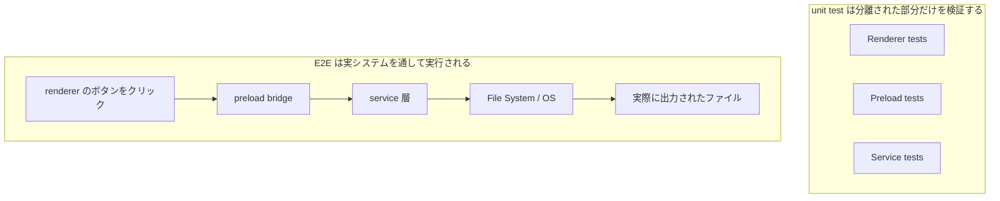
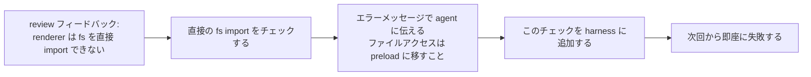

[英語版 →](../../../en/lectures/lecture-10-why-end-to-end-testing-changes-results/) | [中国語版 →](../../../zh/lectures/lecture-10-why-end-to-end-testing-changes-results/)

> この講義のコード例: [code/](https://github.com/walkinglabs/learn-harness-engineering/blob/main/docs/vi/lectures/lecture-10-why-end-to-end-testing-changes-results/code/)
> 実践: [プロジェクト 05. agent に自分自身の作業を検証させる](./../../projects/project-05-grounded-qa-verification/index.md)

# 講義 10. エンドツーエンドテストは結果を変える

あなたは agent に、Electron アプリへファイル出力機能を追加するよう依頼しました。agent は render process のコンポーネント、preload script、service 層のロジックを書きます。各コンポーネントの unit test はすべて完璧に通ります。agent は「完了しました」と言います。ところが、実際にエクスポートボタンを押すと、ファイルパスの形式が間違っていて、進捗バーは更新されず、大きなファイルを出力するとメモリリークが起きます。コンポーネント境界に 5 つも問題がありましたが、unit test は 1 つも検出できませんでした。

これは合唱のリハーサルに似ています。各パートはそれぞれ単独で歌えば完璧に聞こえるのに、一緒に歌うと、ソプラノはバスより半拍速く、伴奏は主旋律から半音ずれてしまう。個々の部分は「正しい」のに、全体としてはかみ合っていないのです。

テストピラミッドは、unit test を大量に持つことが土台だと教えてくれます。しかし、そこで止まるとコンポーネント間の相互作用に起因する問題を体系的に見落とします。AI coding agent にとっては、この問題はさらに深刻です。agent は最速のテストだけを実行して、すぐに完了を宣言しがちだからです。**エンドツーエンドテストは、unit test や integration test では見えにくいシステムレベルのバグを露呈させることができる。しかし、どの層のテストも、バグが存在しないことを証明できない。**

## unit testing の盲点

単体テストの設計思想は分離です。依存関係を mock し、テスト対象の単位だけに集中します。この考え方は unit testing を高速かつ正確にしますが、同時に体系的な盲点も生みます。合唱のリハーサルで、各パートがそれぞれイヤホンを付けて練習しているようなものです。本人たちには問題なく聞こえても、一緒に歌ったときにだけ問題が表面化します。

**インターフェース不整合**: render process から preload script に渡されたファイルパスは相対パスでしたが、preload script は絶対パスを期待していました。対応する unit test はどちらも mock を使っていたため通過しました。問題が見つかったのは、end-to-end の流れを実行したときだけです。これは、2 つのパートが別々に練習して問題ないと思っていたのに、本番の合奏で片方が 4/4 拍子、もう片方が 3/4 拍子で歌っていると気づくようなものです。

**状態伝播のバグ**: database migration によりテーブル schema が変更されたのに、ORM の caching 層が古い schema の cache entry を保持したままでした。unit test は毎回完全に新しい mock 環境を用意するため、このような層をまたぐ状態の不整合は表面化しません。これは、歌詞を新しくしたのに、誰かが昔の版をまだ歌っているようなものです。

**リソースのライフサイクル問題**: file handle、database connection、network socket の取得と解放は複数のコンポーネントにまたがります。unit test は各テストごとに独立してリソースを生成・破棄するため、競合やリークを露出できません。これは、リハーサルでは各パートが順番に microphone を使っているのに、舞台で全員が同時に出たら mic が足りなくなるのに似ています。

**環境依存**: test 環境では正しく動くコードが、本番環境では設定差、ネットワーク遅延、または利用不能なサービスのせいで失敗することがあります。すべてが mock された練習室では完璧に歌えるのに、屋外イベントでは音響の反響や風の影響を受けてしまうようなものです。

## エンドツーエンドテストは結果を変えるだけでなく、行動も変える

ここで重要なのは、多くの人が見落としている点です。agent が自分の仕事がエンドツーエンドテストを通ることを知っていると、プログラミング時の振る舞いそのものが変わります。

1. **コンポーネント間の相互作用を考慮する**: コードを書くとき、単一の関数だけに集中するのではなく、「このインターフェースが upstream とどうつながるか」を考えるようになります。最終的に一緒に歌うと分かっていれば、練習中から他のパートの存在を意識するのと同じです。
2. **アーキテクチャの境界を尊重する**: アーキテクチャ上の制約があるシステムでは、エンドツーエンドテストが agent に境界ルールの遵守を強制します。楽譜に「ここで音量を上げる」と書かれていれば、それに従うしかないのと同じです。
3. **エラー経路を扱う**: エンドツーエンドテストには失敗シナリオが含まれることが多く、agent は例外処理を考慮せざるを得ません。これは、リハーサル中に「もし mic が突然切れたらどうするか」をシミュレーションするようなものです。そうしておけば、実際に起きても対応できます。

## テストピラミッドと review フィードバックの上位層への押し上げ





Codex の実践では、OpenAI は次のように強調しています。**agent 向けに書くエラーメッセージには、修正方法を含めるべきです。** 単に `"Direct filesystem access in renderer"` と書くのではなく、`"Direct filesystem access in renderer. All file operations must go through the preload bridge. Move this call to preload/file-ops.ts and invoke it via window.api."` と書いてください。これにより、アーキテクチャルールが自己修復ループに変わります。合唱の指揮者が「音程が違う」と言うだけでなく、「ここは半拍速いです。alto の拍を聞いて、32 小節目で入ってください」と具体的に指示するのと同じです。

## 重要な概念

- **コンポーネント境界のバグ**: component A と B はそれぞれの unit test を通るのに、相互作用すると誤った振る舞いを生みます。これは、合唱の各パートは正しいのに、一緒になると不協和になる問題です。エンドツーエンドテストが最も得意とする種類の不具合です。
- **テスト適切性の組み合わせ**: unit test、integration test、end-to-end test は、それぞれ別の種類の欠陥を見つけやすいです。上位の層ほど実際のシステム挙動に近づきますが、下位の層を置き換えるものではありません。
- **アーキテクチャ境界の実行可能な強制**: アーキテクチャ文書にあるルール（たとえば「render process はファイルシステムに直接アクセスできない」）を、実行可能な自動チェックに変えます。つまり、「紙に書いてある」状態から「CI で走る」状態にします。
- **review フィードバックの昇格**: コード review で繰り返し指摘される内容を、自動テストに変換します。同じ問題が見つかるたびにルールを追加し、harness を自動的に強化していきます。合唱の指揮者が、よくあるミスをウォームアップ練習に変えるようなものです。次に同じミスをすると、指揮者が何も言わなくても練習自体が問題を露出します。
- **agent 向けエラーメッセージ**: エラーメッセージは「何が悪かったか」だけでなく、「どう直すか」も agent に具体的に伝えるべきです。これにより、テスト失敗が自己修復のフィードバックループになります。

## 実装方法

### 0. 先にアーキテクチャ境界を定義し、その後で E2E テストを書く

エンドツーエンドテストの前提は、システム境界が明確であることです。アーキテクチャがスパゲッティ皿のようなら、エンドツーエンドテストが証明できるのは「このスパゲッティは動く」ということだけで、設計意図のどこが破られたのかは分かりません。合唱で言えば、まだパート分けすらしていない状態です。どれだけ練習しても、いい音にはなりません。

OpenAI の経験則として、**agent によって作られる codebase では、アーキテクチャの制約はチームが大きくなってから検討するものではなく、最初の日から定める初期条件でなければなりません。** 理由は単純です。agent は、リポジトリ内の既存パターンを、そのパターンが不整合でも最適でなくても、繰り返してしまうからです。アーキテクチャ制約がなければ、agent はセッションごとに新しいズレを持ち込み続けます。

OpenAI は「レイヤード・ドメイン・アーキテクチャ」を採用しています。各業務ドメインは固定された層に分かれます: Types → Config → Repo → Service → Runtime → UI。依存は厳密に前方へ流れ、ドメインをまたぐ関心事は明示的な Provider インターフェース経由で入ります。それ以外の依存はすべて禁止され、カスタム lint によって機械的に強制されます。

重要な原則は、**不変条件を強制し、実装を細かく管理しないこと** です。たとえば「データは境界で parse されること」とは要求しますが、どのライブラリを使うかまでは指定しません。エラーメッセージには修正方法を含めるべきです。「違反している」と言うだけではなく、agent にどう変えるべきかを正確に伝えます。

> 出典: [OpenAI: Harness engineering: leveraging Codex in an agent-first world](https://openai.com/index/harness-engineering/)

### 1. harness には必ずエンドツーエンド層を含める

検証フローの中で明確にしてください。コンポーネントをまたぐ変更に関わるタスクでは、エンドツーエンドテストの通過が完了条件です:

````
## 検証の階層
- レベル 1: unit test (通過必須)
- レベル 2: integration test (通過必須)
- レベル 3: end-to-end test (component をまたぐ変更がある場合は通過必須)
- 必須レベルを 1 つでも飛ばす = 未完了
````

### 2. アーキテクチャルールを実行可能なチェックに変える

各アーキテクチャ制約には、対応する test か lint ルールが必要です:

```bash
# render process が Node.js API を直接呼んでいないか確認する
grep -r "require('fs')" src/renderer/ && exit 1 || echo "OK: no direct fs access in renderer"
```

### 3. agent 向けのエラーメッセージを設計する

エラーメッセージには 3 つの要素を含めるべきです。何が悪いのか、なぜそれが問題なのか、どう直すのかです:

````
エラー: src/renderer/App.tsx:12 で 'fs' の直接 import が見つかりました
理由: render process にはセキュリティ上の理由で Node.js API へのアクセス権がありません
修正方法: ファイル操作を src/preload/file-ops.ts に移し、window.api.readFile() 経由で呼び出してください
````

### 4. review フィードバックの昇格プロセスを整える

code review で新しい種類の agent のバグが見つかるたび、それを自動チェックに変換します。1 か月後には、harness は月初よりかなり強くなっています。これは合唱のリハーサルノートのようなものです。各回で見つかった問題を書き留めておけば、次の本番前に確認できます。時間がたつにつれて、よくあるミスは減り、音楽はより調和していきます。

## 実例

**タスク**: Electron アプリにファイル出力機能を実装する。UI render process、preload script によるファイルシステムの proxy、service 層のデータ変換が関係します。

**各パートを別々に歌う場合 (unit test は通過)**: Render component の test (通過、file operations は mock)、preload script の test (通過、filesystem は mock)、service 層の test (通過、data source は mock)。agent は完了を宣言しました。

**一緒に歌う場合 (end-to-end test が露呈した問題)**:

| 問題 | 説明 | Unit Test | E2E |
|-----|-------|-----------|-----|
| インターフェース不整合 | ファイルパスの形式が一貫していない | 見逃す | 検出 |
| 状態伝播 | エクスポート進捗が IPC 経由で UI に戻されていない | 見逃す | 検出 |
| リソースリーク | 大きなファイルの出力で file handle が解放されていない | 見逃す | 検出 |
| 権限の問題 | パッケージ化環境では権限が異なる | 見逃す | 検出 |
| エラー伝播 | service 層の例外が UI 層に届いていない | 見逃す | 検出 |

5 つすべてのバグを end-to-end test が検出し、unit test は 1 つも見つけられませんでした。代償は、テスト時間が 2 秒から 15 秒に増えたことです。agent のワークフローでは、これは十分に許容できます。各パートがどれだけ上手く歌えても、フル合奏のリハーサルには及びません。

## 覚えておくべき要点

- **unit test は component 境界のバグに体系的に弱い**: 分離を前提とした設計そのものが、相互作用の問題を見つけにくくします。全員が正しく歌えても、合唱全体が外れていないとは限りません。
- **エンドツーエンドテストは、バグを見つけるだけでなく agent の書き方も変える**: 統合と境界に、より注意を向けるようになります。
- **アーキテクチャルールは実行可能でなければならない**: ドキュメントに書いて読ませるのではなく、すべての commit で自動的に検査される必要があります。
- **エラーメッセージは agent 向けに設計する**: 自己修復ループを作るために、「どう直すか」の具体的手順を含めてください。
- **review フィードバックの昇格は harness を自動的に強化する**: 捕捉したエラーの各カテゴリは、恒久的な防波堤になります。

## 参考文献

- [The Practical Test Pyramid - Martin Fowler](https://martinfowler.com/articles/practical-test-pyramid.html) — テスト層を補完関係として扱う実践的整理
- [Harness Engineering - OpenAI](https://openai.com/index/harness-engineering/) — アーキテクチャ制約を自動強制するための技術実践
- [Chaos Engineering - Netflix (Basiri et al.)](https://ieeexplore.ieee.org/document/7466237) — システムの堅牢性を検証するために、意図的に障害を注入する手法
- [QuickCheck - Claessen & Hughes](https://www.cs.tufts.edu/~nr/cs257/archive/john-hughes/quick.pdf) — 例ベーステストと形式検証の中間にある property testing の手法

## 演習

1. **component 間のバグを検出する**: 少なくとも 3 つの component をまたぐ変更タスクを 1 つ選びます。まず unit test だけを実行して結果を記録し、その後 end-to-end test を実行します。追加で検出された各バグが、どの種類の層をまたぐ相互作用問題かを分析してください。

2. **アーキテクチャルールを自動化する**: 自分のプロジェクトからアーキテクチャ制約を 1 つ選び、agent 向けのエラーメッセージ付きで実行可能なチェックに変えます。それを harness に組み込み、ベースラインのタスクで有効性を確認してください。

3. **review フィードバックを昇格する**: code review の履歴から繰り返し出てくる指摘を 1 種類見つけ、5 段階のプロセスで自動チェックに変換します。昇格の前後で、その問題の発生頻度を比較してください。
