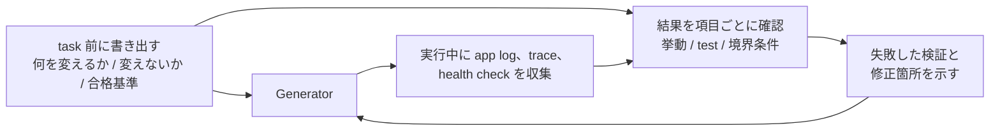

[英語版 →](../../../en/lectures/lecture-11-why-observability-belongs-inside-the-harness/) | [中国語版 →](../../../zh/lectures/lecture-11-why-observability-belongs-inside-the-harness/)

> ソースコード例: [code/](https://github.com/walkinglabs/learn-harness-engineering/blob/main/docs/vi/lectures/lecture-11-why-observability-belongs-inside-the-harness/code/)
> 実践プロジェクト: [Project 06. 完全な Harness（Capstone）](./../../projects/project-06-runtime-observability-and-debugging/index.md)

# 講義 11. 観測可能性をハーネスの内側に組み込む理由

## この講義で扱う問題は何か？

あなたは agent に機能の実装を依頼します。agent は 20 分ほど動作し、いくつかのファイルを変更したあと、「完了しましたが、2 つの test が失敗しています」と報告します。失敗理由を尋ねると、「はっきりしません。たぶん timing の問題です」と返ってきます。さらに、どの重要な path を変更したのかを尋ねると、「コードを見てみます...」と言われます。

これは agent の能力不足ではありません。harness に十分な observability がないことが問題です。**observability がなければ、agent は不確かな状況で判断し、評価は主観的な裁定になり、再試行は当てもなくさまようだけになります。** OpenAI も Anthropic も、信頼性を evidence の問題として定義しています。つまり harness は runtime の挙動と評価 signal を、次の判断につながる形で表に出さなければなりません。

## 重要な概念

- **Runtime observability**: log、trace、process event、health check などの system-level signal。「system が何をしたか」に答えます。
- **Process observability**: plan、採点 rubric、acceptance criteria など、harness が判断するための artifact の可視性。「なぜこの変更が受け入れられるべきか」に答えます。
- **Task trace**: 分散システムにおける request tracing に似た、task の開始から完了までの完全な decision path の記録です。agent が行った各 step を context 付きで残します。
- **Sprint contract**: programming を始める前に交渉して決める短期契約です。task の範囲、検証基準、例外を定義します。process observability の中核となるツールです。
- **Evaluator rubric**: 品質評価を主観的な裁定から、証拠に基づく構造化された採点へ変えるものです。同じ output に対して、異なる evaluator が似た結果を出しやすくなります。
- **Layered observability**: system 層と process 層の observability を同時に設計し、相互に補強する考え方です。runtime signal が挙動を説明し、process artifact が意図を説明します。

## Layered Observability



## なぜこうなるのか

### observability 不足の本当のコスト

harness に observability が足りないと、体系的に 4 種類の問題が起こります。

**「正しい」と「正しそう」の区別がつかない**: コードレビューでは完璧に見える関数でも、構文は正しく、ロジックも筋が通っています。しかし runtime では、edge case の処理ミスによって特定の入力で誤った結果が出ることがあります。実際の実行経路が期待から外れていることを示せるのは runtime trace だけです。

**評価が神秘化する**: 採点 rubric や acceptance criteria がなければ、evaluator（人間でも agent でも）は暗黙の前提に頼ることになります。同じ output が、評価者によってまったく異なる扱いを受けることがあります。品質評価は再現できなくなります。

**再試行が手探りになる**: 何が失敗したのか分からなければ、再試行の方向性はランダムです。関係のない code path を修正してしまい、本当の失敗原因を見落としたまま同じことを何度も繰り返すことがあります。こうした盲目的な再試行は、token と時間の無駄です。

**session 引き継ぎで情報が崖になる**: 未完了の work を次の session に渡すとき、observability が不足していると、新しい session は system state を一から診断し直さなければなりません。Anthropic の長時間稼働 agent に関する観察では、この冗長な診断に session 全体の 30〜50% が消費されることがあります。

### Claude Code の実例

「planner-generator-evaluator」の 3 役 workflow で、「dark mode を app に追加する」task を実行する harness を想像してください。

**observability なし**: Planner は曖昧な description を出します。Generator はその曖昧さを前提に dark mode を実装しますが、planner の暗黙の期待と一致しません。Evaluator は自分だけが持つ暗黙の基準で却下しますが、何が悪いのかを具体的には説明できません。Generator は曖昧な却下理由を頼りに、当てずっぽうで再試行します。この cycle が 3〜4 回繰り返され、約 45 分かかり、ようやく一応受け入れられる程度の結果に落ち着きます。

**十分な observability がある場合**: Planner は sprint contract を提示します。修正すべき component、各 component の検証基準、例外（print styles は扱わない）を列挙します。Generator は contract に従って実装します。runtime observability は各 component の style の読み込みと適用の流れを記録します。Evaluator は採点 rubric を使って各観点を個別に評価し、具体的な evidence を引用します。1 回の反復で高品質な結果が得られ、約 15 分で完了します。

効率は 3 倍です。変わったのは observability だけです。

### なぜ agent だけでは解決できないのか

「agent 自身が log を出せばいいのでは？」と思うかもしれません。問題は次のとおりです。

1. Agent は自分が知らないことを知りません。必要だと気づいていない signal を、自発的に記録することはありません。
2. Log の形式は一貫しません。session ごとに形式が違うため、体系的な分析ができません。
3. Process observability は log だけでは解決できません。sprint contract や採点 rubric は、harness 側で支える必要がある構造化 artifact です。

## 正しいやり方

### 1. Runtime signal の収集を harness に組み込む

agent が自分で log を出すことに頼ってはいけません。harness が以下の signal を自動で集めるべきです。

- **アプリケーションのライフサイクル**: Startup、ready、running、shutdown などの stage 状態
- **Feature path の実行**: entry point、check point、exit point を含む、重要な処理経路の実行記録
- **データフロー**: component 間を流れるデータの記録
- **リソース使用状況**: 異常な resource usage パターン（たとえば memory が増え続ける）
- **エラーと例外**: エラーメッセージだけでなく、十分な context を含める

### 2. Sprint contract を実装する

各 task が始まる前に、generator と evaluator（同じ agent の別 call でもよい）が contract を交渉します。

```markdown
# Sprint Contract: Dark Mode のサポート

## 範囲
- theme 切り替え component を修正する
- global CSS variable を更新する
- dark mode の test を追加する

## 検証基準
- 各 component の visual regression test が通る
- main flow の end-to-end test が通る
- FOUC（flash of unstyled content）が発生しない

## 例外
- print styles は扱わない
- third-party component の dark mode は扱わない
```

### 3. Evaluator rubric を整備する

「良いか悪いか」を、定量化できる採点に変えます。

```markdown
# 採点 Rubric

| 観点 | A | B | C | D |
|-------|---|---|---|---|
| コードの正しさ | すべての test が通る | main flow が通る | 一部のみ通る | build 失敗 |
| アーキテクチャ遵守 | 完全に遵守 | 軽微な逸脱 | 明確な逸脱 | 重大な違反 |
| test の範囲 | main flow + edge case | main flow のみ | skeleton のみ | test なし |
```

### 4. OpenTelemetry で標準化する

harness の session ごとに trace を 1 つ、task ごとに span を 1 つ、検証 step ごとに sub-span を 1 つ作成します。重要な情報は標準属性で注釈します。こうすることで、observability data を標準的なツール（Jaeger、Zipkin）と統合できます。

## 実践例

planner-generator-evaluator の workflow で、「dark mode のサポートを追加する」を実行する harness を考えます。

**observability が不十分な版**: 3〜4 回の盲目的な再試行、45 分、ぎりぎり受け入れられる結果。Evaluator は「しっくりこない」と言うだけで、何が問題かは説明できません。Generator は間違った方向に多くの時間を費やします。

**十分に観測可能な版**:
- Sprint contract が範囲、基準、例外を明確化する
- Runtime trace が各 component の style 読み込みの流れを記録する
- 採点 rubric が各観点の構造化された評価を提供する
- 1 回の反復で高品質な結果が得られ、15 分で完了する

効率は 3 倍向上し、品質はより安定し、評価も再現可能になります。

## 覚えておくべき要点

- **observability は harness のアーキテクチャ属性です**。後付けする機能ではなく、設計時に最初から考慮すべき中核能力です。
- **2 層の observability が必要です**。runtime signal は「何が起きたか」を説明し、process artifact は「なぜそのやり方だったのか」を説明します。
- **Sprint contract は alignment を前倒しします**。generator が作ったものを evaluator が予想できる理由で即座に却下する、という事態を防ぎます。
- **採点 rubric によって評価は再現可能になります**。異なる evaluator でも、同じ output に対して似た点数をつけやすくなります。
- **observability 不足は session 時間の 30〜50% を余計な診断で浪費します。**

## さらに読む

- [Observability Engineering - Charity Majors](https://www.honeycomb.io/blog/observability-engineering-book) — 現代の observability engineering に関する理論と実践の枠組み
- [Dapper - Google (Sigelman et al.)](https://research.google/pubs/pub36356/) — 大規模 distributed tracing における画期的な実践
- [Harness Design - Anthropic](https://www.anthropic.com/engineering/harness-design-long-running-apps) — sprint contract と evaluator rubric の紹介
- [Site Reliability Engineering - Google](https://sre.google/sre-book/table-of-contents/) — production system における observability の体系的な応用

## 演習

1. **Observability Gap の分析**: 現在の harness を監査し、system 層と process 層の observability を洗い出してください。既存 signal では区別できない system state を見つけ、追加すべき情報を提案してください。

2. **Sprint Contract の実践**: 実際の task に対して sprint contract を書いてください。agent に contract に従って実装させ、contract の有無で効率と品質がどう変わるか比較してください。

3. **Task Trace の構築**: 完成した programming task における agent の各 step を記録してください。OpenTelemetry の semantic convention を使って注釈を付けてください。trace 内の information bottleneck を分析し、どの step で十分な signal support が欠けているかを特定してください。
