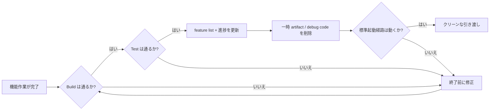
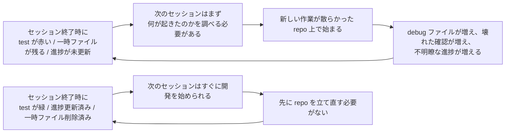

[英語版 →](../../../en/lectures/lecture-12-why-every-session-must-leave-a-clean-state/) | [中国語版 →](../../../zh/lectures/lecture-12-why-every-session-must-leave-a-clean-state/)

> ソースコード例: [code/](https://github.com/walkinglabs/learn-harness-engineering/blob/main/docs/vi/lectures/lecture-12-why-every-session-must-leave-a-clean-state/code/)
> 実践プロジェクト: [プロジェクト 06. 完全なハーネス (Capstone)](./../../projects/project-06-runtime-observability-and-debugging/index.md)

# 第12講. 各セッションの最後は必ずクリーンな状態で終える

## この講義で解決したいこと

あなたの agent が午後いっぱい動き続け、20 個のファイルを変更し、コードを commit し、セッションが終わります。次の agent セッションが始まると、build が壊れている、test が赤い、debug 用の一時ファイルが散らばっている、feature list が更新されていない、そして進捗がまったく分からないことにすぐ気づきます。新しいセッションの最初の30分は、ただ「前のセッションで実際に何が起きたのか」を解き明かすことに費やされます。

OpenAI と Anthropic のどちらも明確に述べています。**長期的な信頼性は、一度の成功ではなく、運用上の規律にかかっています。** セッション終了時の状態の質が、次のセッションの効率を直接左右します。Git のベストプラクティスに重ねて考えてください。各 commit は、元に戻せる単位で、build 可能な1つの変更であるべきであり、途中までの作業の寄せ集めであってはいけません。

## 主要概念

- **クリーン状態 (Clean state)**: セッション終了時にシステムが5つの条件を満たしている状態です。build が成功し、test が成功し、進捗が記録され、古い artifact がなく、起動経路が利用可能であることです。どれか1つでも欠けていれば、そのセッションは「完了」していません。
- **セッション整合性 (Session Integrity)**: データベースのトランザクションに似ています。完全に commit してクリーンな状態を残すか、一貫性のある最後の状態へ rollback するかのどちらかです。中間の選択肢はありません。
- **品質ドキュメント (Quality Document)**: 各 module の品質評価を継続的に記録する、動的な artifact です。一度きりの評価ではなく、codebase が時間とともに強くなっているか弱くなっているかを示す tracker です。
- **クリーンアップループ (Cleanup Loop)**: codebase 内の体系的なエントロピーを減らすための、定期的な保守セッションです。緊急対応ではなく、通常運用の一部です。
- **ハーネス簡素化 (Harness Simplification)**: model の能力が向上したら、もはや不要な harness 要素を定期的に削除することです。今日必要な制約が、3か月後には不要な overhead になっているかもしれません。
- **冪等なクリーンアップ (Idempotent Cleanup)**: 何回実行しても同じ結果になるクリーンアップ操作です。失敗後の再試行シナリオでも安全にクリーンアップできるようにします。

## クリーン状態の5つの次元





## なぜこれが起きるのか

### エントロピー増大はデフォルト状態

Lehman の software evolution の法則は、継続的に変化するシステムは、意図的に管理しない限り複雑さが増していくことを示しています。これは AI coding agent に特に当てはまります。各セッションが変更を持ち込み、終了時にクリーンアップしなければ、技術的負債は指数関数的に蓄積します。

実データは明確です。クリーンアップ戦略なしで agent を12週間使って開発したプロジェクトでは、次のようになりました。

- 1週目: build 成功率 100%、test 成功率 100%、新規セッション起動 5分
- 4週目: build 95%、test 92%、起動 15分
- 8週目: build 82%、test 78%、起動 35分
- 12週目: build 68%、test 61%、起動 60分超

同じプロジェクトでクリーンアップ戦略を採用した場合:

- 1週目: 100%、100%、5分
- 12週目: 97%、95%、9分

12週間後には、build 成功率の差は29ポイント、新規セッション起動時間の差は85%でした。これは理論ではなく、観測された差です。

### クリーン状態の5つの次元

クリーン状態は単に「コードが build できる」だけではありません。次の5つをまとめて評価します。

**Build の次元**: コードはエラーなく build できるか？ これが最も基本です。次のセッションが最初に build エラーを直すことになってはいけません。

**Test の次元**: すべての test は通るか？ これには、セッション前から存在していた test も含まれます。セッションには、既存機能を壊さない責任があります。そして、「自分の環境では動く」ではなく CI で確認しなければなりません。

**進捗の次元**: 現在の進捗は、機械可読な artifact に記録されているか？ 完了した subtask は合格条件とともに、進行中だが未完了の subtask は現在の状態とともに、未着手の subtask はそのままの状態で記録されます。良い進捗記録は、セッション開始時の診断時間を60〜80%削減します。

**Artifact の次元**: 古くなった、または曖昧な一時 artifact は残っていないか？ debug log、一時ファイル、コメントアウトされたコード、TODO マーカーなどはすべて、次のセッションの認知負荷を増やします。

**起動の次元**: 標準起動経路は使えるか？ 次のセッションは、手作業なしで作業を始められるか？ 環境の初期化、codebase の読み込み、文脈の収集、タスクの選択。これらの経路は壊れていてはいけません。

### 「後でクリーンアップする」は、実質的に永遠にやらないのと同じ

最も典型的な心理的落とし穴は、「このセッションではクリーンアップする時間がない。次回やろう」というものです。しかし次の agent セッションは、あなたが何を残したのかを知りません。そこに見えるのは、コードの塊と不確かな状態だけです。そして「このコードのどこが意図的で、どこが一時的なのか」を推測することに時間を使います。

さらに悪いことに、各セッションにはそれぞれ別のタスク目標があります。新しいセッションは新しい作業をするためにあり、前のセッションが残した混乱を片付けるためではありません。だから混乱を無視してその上に新しい作業を始め、さらに混乱を積み重ねます。これはエントロピーの正のフィードバックループです。

## 正しくやる方法

### 1. クリーン状態を完了条件にする

harness では、明確に定義してください。**セッション完了 = タスクの検証に合格し、かつクリーン状態チェックに合格すること。** どちらか1つでも欠ければ、そのセッションは完了ではありません。`CLAUDE.md` には次のように書きます。

```
## セッション終了チェックリスト
- [ ] Build が通る (npm run build)
- [ ] すべての test が通る (npm test)
- [ ] feature list が更新されている
- [ ] debug code が残っていない (console.log, debugger, TODO)
- [ ] 標準起動経路が利用可能 (npm run dev)
```

### 2. 2 モードのクリーンアップ戦略

2つのクリーンアップモードを組み合わせます。

**即時クリーンアップ (各セッションの終了時)**: セッション中に生成された一時 artifact を削除し、feature list の状態を更新し、build と test が通ることを確認します。これは「参照的」なクリーンアップです。

**定期クリーンアップ (週次)**: 全体をスキャンして、蓄積した構造的な問題を解消し、品質ドキュメントを更新し、benchmark test を実行して drift を検出します。これは「トレーシング」的なクリーンアップです。

### 3. 品質ドキュメントを維持する

品質ドキュメントは、各 module を継続的に採点する動的な artifact です。

```markdown
# 品質ドキュメント

## 認証モジュール (品質: A)
- 検証は通っている: はい
- agent が理解可能: はい
- test の安定性: 安定
- アーキテクチャ境界: 遵守
- コーディング規約: 遵守

## 支払いモジュール (品質: C)
- 検証は通っている: 一部 (payment callback が未テスト)
- agent が理解可能: 難しい (ロジックが3ファイルに分散)
- test の安定性: 不安定 (flaky な test が2件)
- アーキテクチャ境界: 逸脱あり
- コーディング規約: 一部遵守
```

新しいセッションはこのドキュメントを読めば、どこを優先すべきかすぐに分かります。最も点数が低い module から修正してください。

### 4. 定期的に harness を簡素化する

Anthropic からの重要な示唆があります。**各 harness 構成要素は、model が何かを確実にできなかったために存在しています。しかし model が改善すると、こうした前提は時代遅れになります。** 3か月前には必要だった制約が、今では不要な overhead になっているかもしれません。

推奨される実践: 毎月、harness の構成要素を1つ選び、一時的に無効化して benchmark タスクを実行します。結果が悪化しなければ、恒久的に削除します。悪化するなら、戻すか、より軽い代替に置き換えます。

### 5. クリーンアップ操作は冪等にする

クリーンアップ script は、何度実行しても安全でなければなりません。

```bash
# 冪等なクリーンアップ操作
rm -f /tmp/debug-*.log  # -f により、ファイルが存在しなくてもエラーにならない
git checkout -- .env.local  # 既知の状態へ戻す
npm run test  # クリーンアップで何も壊していないことを確認する
```

## 実例

12週間にわたって agent で開発した Electron アプリで、2つのアプローチを比較しました。

**クリーンアップ戦略なし** (対照群): 12週目の build 成功率は68%、test 成功率は61%、新規セッション起動は60分超、古い artifact は103件。

**クリーンアップ戦略あり** (実験群): 各セッション終了時に完全なクリーン状態チェックを実施し、さらに週次のクリーンアップループを実施。12週目の build 成功率は97%、test 成功率は95%、新規セッション起動は9分、古い artifact は11件。

12週目時点で、実験群の build 成功率は29ポイント高く、test 成功率は34ポイント高く、新規セッション起動時間は85%短くなっていました。

## 覚えておくべき要点

- **クリーン状態はセッション完了の必須条件** です。任意のクリーンアップではなく、「完了」の定義の一部です。
- **5つの次元はすべて必須** です。build、test、進捗、artifact、起動。各項目を明確に確認してください。
- **品質ドキュメントで codebase の健全性を追跡できる** ようになります。悪化していると分かるものしか改善できません。
- **定期的に harness を簡素化する** ことで、model の能力向上に合わせて不要な制約を削除できます。
- **「後でクリーンアップする」は、結局クリーンアップしないのと同じ** です。エントロピー増大はデフォルトであり、それに対抗できるのは能動的なクリーンアップだけです。

## 参考文献

- [Clean Code - Robert C. Martin](https://www.goodreads.com/book/show/3735293-clean-code) — コードのクリーンさに関する体系的な原則
- [Harness Engineering - OpenAI](https://openai.com/index/harness-engineering/) — 再現性を harness 設計の中核要件とする考え方
- [Effective Harnesses - Anthropic](https://www.anthropic.com/engineering/effective-harnesses-for-long-running-agents) — 長期的な信頼性におけるクリーンなセッション終了の重要性
- [Programs, Life Cycles, and Laws of Software Evolution - Lehman](https://ieeexplore.ieee.org/document/1702314) — 能動的な保守がなければシステムの複雑さは避けられず増大することを示す software evolution の法則

## 演習

1. **クリーン状態チェックリスト**: あなたの codebase 向けに、5つの次元すべてをカバーするセッション終了チェックリストを設計してください。それを5回連続のセッションで適用し、次元ごとの違反を記録してください。

2. **benchmark 比較**: クリーン状態要件の有無で2種類の harness を用意し、固定のタスクセットを使って比較してください。完了率、再試行回数、失敗して終了する割合を比較します。

3. **harness 簡素化の実践**: harness の構成要素を1つ選び、一時的に無効化して benchmark タスクを実行してください。ある場合とない場合の結果を比較し、保持するか、削除するか、置き換えるかを判断してください。
