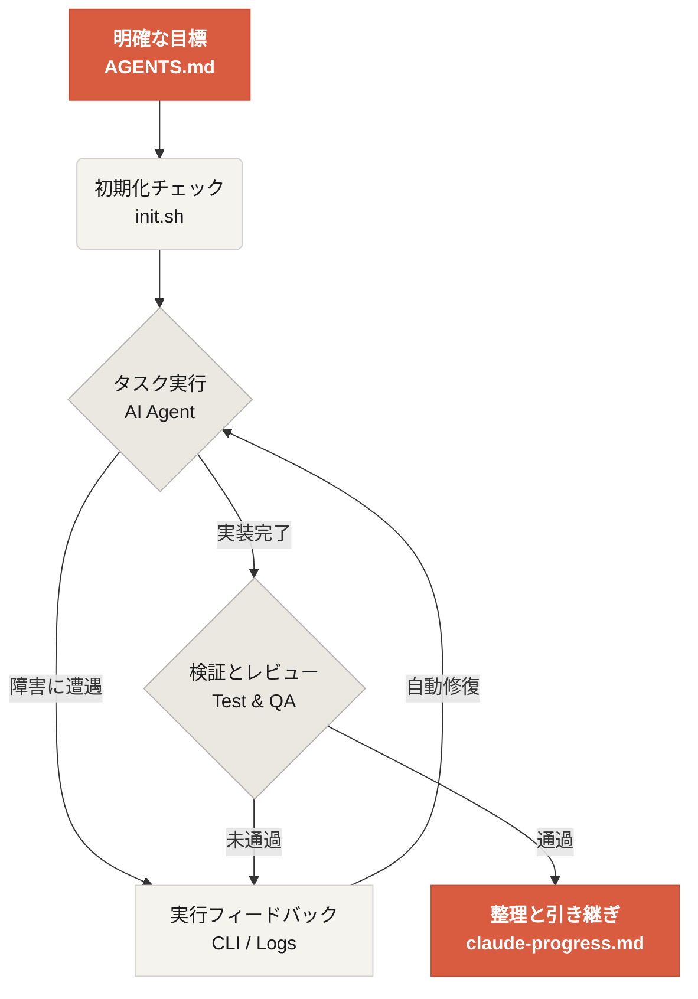

# Learn Harness Engineering へようこそ

Learn Harness Engineering は、AI コーディングエージェントを実運用に載せるための工学に焦点を当てた講座です。本講座では、Harness Engineering（ツールハーネス/足場工学）に関する業界最前線の理論と実践を深く研究・整理しており、参考資料には以下が含まれます。
- [OpenAI: Harness engineering: leveraging Codex in an agent-first world](https://openai.com/index/harness-engineering/)
- [Anthropic: Effective harnesses for long-running agents](https://www.anthropic.com/engineering/effective-harnesses-for-long-running-agents)
- [Anthropic: Harness design for long-running application development](https://www.anthropic.com/engineering/harness-design-long-running-apps)
- [Awesome Harness Engineering](https://github.com/walkinglabs/awesome-harness-engineering)

体系的な環境設計、状態管理、検証、制御の仕組みを通じて、本講座は Codex や Claude Code などの AI Agent が、実際のエンジニアリング作業を本当に確実に完了できるようにすることを目指します。明確なルールと境界によって AI コーディングアシスタントを制約し、機能追加、Bug 修正、開発作業の自動化をより確実に行えるようにします。

## 学習を始める

自分に合った学習ルートを選んでください。本講座は、理論講義、実践プロジェクト、すぐに使える資料集の3つに分かれています。

  <a href="./lectures/lecture-01-why-capable-agents-still-fail/" class="card">
    <h3>講義</h3>
    
なぜ高性能なモデルでも失敗するのかを理解し、有効な Harness を構築するための理論基盤を身につけます。

  </a>
  <a href="./projects/" class="card">
    <h3>プロジェクト</h3>
    
手を動かして、信頼できる Agent の作業環境をゼロから構築します。

  </a>
  <a href="./resources/" class="card">
    <h3>資料集</h3>
    
すぐに使えるテンプレート（AGENTS.md、feature_list.json など）を、そのままあなたのリポジトリへコピーできます。

  </a>

## Harness の中核メカニズム

Harness の本質は「モデルを賢くすること」ではなく、モデルのために閉ループの**作業システム**を構築することにあります。以下の簡単な図で、その基本的な流れを理解できます。

## 学べること

本講座では、次のような核心概念を身につけます。

<ul class="index-list">
  <li>明確なルールと境界によって<strong>Agent の振る舞いを制約する</strong>こと。</li>
  <li>セッションをまたぐ長時間タスクで<strong>文脈の連続性を保つ</strong>こと。</li>
  <li><strong>Agent が完了を早計に宣言するのを防ぐ</strong>こと。</li>
  <li>完全なパイプラインテストを通じて、Agent に<strong>自分の作業を検証させる</strong>こと。</li>
  <li>Agent の実行プロセスを<strong>可観測かつデバッグ可能</strong>にすること。</li>
</ul>

## 次のステップ

核心概念を理解したら、以下の内容でさらに学習を進められます。

<ul class="index-list">
  <li><a href="./lectures/lecture-01-why-capable-agents-still-fail/">L01. モデルの能力が高くても、実行の信頼性は別問題</a>：まずは理論から学びます。</li>
  <li><a href="./projects/project-01-baseline-vs-minimal-harness/">P01. プロンプト vs ルール駆動</a>：最初の比較実践課題に取り組みます。</li>
  <li><a href="./resources/templates/">日本語テンプレート</a>：最小構成の Harness テンプレート一式（AGENTS.md、feature_list.json など）を入手し、そのまま自分のプロジェクトで使えます。</li>
</ul>
