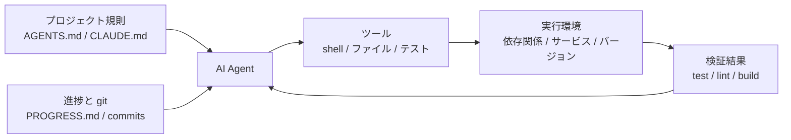

[英語版 →](../../../en/lectures/lecture-02-what-a-harness-actually-is/)

> 本文のコード例：[code/](https://github.com/walkinglabs/learn-harness-engineering/blob/main/docs/zh/lectures/lecture-02-what-a-harness-actually-is/code/)
> 実践演習：[Project 01. プロンプトだけで agent にやらせる場合と、ルールを定めてからやらせる場合で、どれだけ差が出るか](./../../projects/project-01-baseline-vs-minimal-harness/index.md)

# 第2講. Harness とは実際には何か

AI coding agent の世界では "harness" という言葉がますます使われていますが、正直なところ、多くの人が harness と呼んでいるものは、実際には「プロンプトファイル 1 つ」にすぎません。これは harness ではありません。たとえば、食材だけはあるのに、コンロも包丁もレシピも提供フローもないレストランを開こうとしても、それはレストランではなく冷蔵庫です。

この講義では、正確で、しかも実際に使える harness の定義を示します。学術論文の抽象概念ではなく、今日から使えるフレームワークです。harness は 5 つのサブシステムで構成されます。ちょうど、きちんとした厨房にある 5 つの機能エリアのようなものです。つまり、レシピ棚、道具棚、コンロ、下ごしらえ台、そして提供前のチェック口です。それぞれのサブシステムには明確な責務と評価基準があります。

## まずは比喩から

あなたが新しく入ったエンジニアで、文書が一切ないプロジェクトに放り込まれた場面を想像してください。README はなく、コードにコメントもなく、テストの実行方法を誰も教えてくれず、CI 設定ファイルはどこかに隠れています。そんな状況で、良いコードは書けるでしょうか。おそらく書けます。十分に賢く、十分に忍耐強ければ。ただし、多くの時間を「このプロジェクトがどういうものかを理解すること」に費やし、「問題を解くこと」に使えなくなります。

AI agent もまったく同じ困難に直面します。しかも、状況はさらに悪いです。あなたは少なくとも同僚に質問できますが、agent が見られるのは、目の前に置かれたファイルと実行できるコマンドだけです。同僚の肩を叩いて「このプロジェクトの ORM はどのバージョン？」と聞くことはできません。

OpenAI は harness engineering の記事で、harness の核心原則を「リポジトリが規範である」と表現しています。必要な文脈はすべてリポジトリの中にあり、構造化された指示ファイル、明確な検証コマンド、分かりやすいディレクトリ構成を通じて提示されるべきだ、という考え方です。Anthropic の long-running agents の文書は、状態の永続化、明示的な復帰経路、構造化された進捗追跡をより重視しています。両社の重点は異なりますが、言っていることは同じです。**モデルの外側にあるあらゆるエンジニアリング基盤が、モデルの能力をどれだけ引き出せるかを決めます。**

いくつか、なじみのあるツールを見てみましょう。

**Claude Code** の設計には、まさに harness の考え方が表れています。リポジトリ内の `CLAUDE.md` を読み（レシピ棚）、shell でコマンドを実行し（道具棚）、ローカル環境で動作し（コンロ）、会話履歴を持ち（下ごしらえ台）、テストを実行して結果を確認できます（提供前のチェック口）。ただし、どうやってテストを実行するのかを教えなければ、そのチェック口は塞がったままです。料理がちゃんと火が通っているか、誰にも分かりません。

**Cursor** も似たロジックです。`.cursorrules` ファイルはレシピ棚、ターミナルは道具棚、プロジェクト構造や lint 設定を読めることはコンロにあたります。ただし Cursor の状態管理は比較的弱く、IDE を閉じて開き直すと、前回の文脈は消えてしまいます。

**Codex**（OpenAI の coding agent）は、git worktree を使ってタスクごとの実行環境を分離し、ローカルの可観測性スタック（ログ、メトリクス、トレース）と組み合わせることで、各変更を独立した環境で検証します。`AGENTS.md` と明確な検証コマンドがあるリポジトリでは、"素の"リポジトリよりもはるかに高い性能を発揮します。

**AutoGPT** は反面教師です。構造化された状態管理がないため長いタスクで文脈がどんどん積み上がり、正確なフィードバック機構がないため agent がループに陥ります。AutoGPT は「うまくいかない」と言われがちですが、実際には harness が良くありません。壊れたコンロを渡されても、どれだけ良い食材があっても料理はできないのです。

## コア概念

- **harness とは何か**: モデルの重み以外にある、すべてのエンジニアリング基盤です。OpenAI はエンジニアの中核的な仕事を、環境を設計すること、意図を表現すること、フィードバックループを構築することの 3 つにまとめています。Anthropic は Claude Agent SDK を直接「汎用 agent harness」と呼んでいます。
- **リポジトリが唯一の事実源**: agent が見えないものは、agent にとって存在しません。OpenAI はリポジトリを "記録システム" とみなし、必要な文脈はすべてリポジトリ内に、構造化されたファイルと分かりやすいディレクトリ構成で置くべきだとしています。
- **説明書ではなく地図を渡す**: OpenAI の経験では、`AGENTS.md` は目次であるべきで、百科事典であってはいけません。100 行前後で十分であり、収まりきらないなら `docs/` に分割して、agent が必要に応じて読めるようにします。
- **細かな手取り足取りではなく制約を与える**: 良い harness は、逐一の指示ではなく、実行可能なルールで agent を制約します。OpenAI は「不変条件を実行せよ。実装を細かく管理するな」と言っています。Anthropic は、agent は自分の仕事を自信満々に褒めてしまうことを見つけ、その対策として「作業する人」と「検査する人」を分けました。
- **1 つずつ取り外す方法**: harness の各コンポーネントの価値を定量化したいなら、1 つずつ取り外して、どれを外したときに性能が最も下がるかを見ます。Anthropic はこの方法で、モデルが強くなるにつれて重要でなくなる要素もある一方で、常に新しい重要要素が現れることを見つけました。

## Harness の 5 サブシステムモデル

厨房の比喩に戻りましょう。完全な厨房には 5 つの機能エリアがあり、harness にも 5 つのサブシステムがあります。



**指示サブシステム（レシピ棚）**: `AGENTS.md`（または `CLAUDE.md`）を作成し、プロジェクトの概要と目的（何のためのものかを 1 文で説明する）、技術スタックとバージョン（Python 3.11、FastAPI 0.100+、PostgreSQL 15）、初回実行コマンド（`make setup`、`make test`）、絶対に破ってはいけない制約（"すべての API は OAuth 2.0 を通すこと"）、より詳しい文書へのリンクを含めます。

**ツールサブシステム（道具棚）**: agent に十分なツールアクセス権限を与えます。安全性を理由に shell を無効にしてはいけません。agent は `pip install` すら実行できなくなり、仕事にならないからです。ただし、何でも開放すればよいわけでもありません。最小権限の原則に従ってください。

**環境サブシステム（コンロ）**: 環境状態を自己記述的にします。`pyproject.toml` や `package.json` で依存関係を固定し、`.nvmrc` や `.python-version` でランタイムのバージョンを指定し、Docker や devcontainer で環境を再現可能にします。

**状態サブシステム（下ごしらえ台）**: 長いタスクには進捗追跡が必要です。シンプルな `PROGRESS.md` ファイルに、何が完了したか、何が進行中か、何がブロックされているかを記録します。各セッションの終了前に更新し、次のセッション開始時に読み込みます。

**フィードバックサブシステム（提供前のチェック口）**: これが最も費用対効果の高いサブシステムです。`AGENTS.md` に検証コマンドを明示的に列挙します。
```
検証コマンド：
- テスト：pytest tests/ -x
- 型チェック：mypy src/ --strict
- Lint：ruff check src/
- 完全検証：make check（上記すべてを含む）
```

5 つのサブシステムのうち 1 つでも欠けると、厨房の機能エリアが 1 つ足りないのと同じです。料理はできますが、どうしても不格好になります。

**harness の品質を診断する方法**: 「同一モデル対照実験」を使います。モデルは固定したまま、5 つのサブシステムを 1 つずつ取り除き、どのサブシステムが欠けたときに性能が最も落ちるかを見ます。それがボトルネックです。そこに集中的に手を入れます。厨房のボトルネックを探すのと同じで、レシピ棚を外して提供速度がどれだけ落ちるか、コンロを止めて影響がどれだけ大きいかを確認するのです。

## あるチームの実例

あるチームは GPT-4o を使って、TypeScript + React のフロントエンドアプリケーション（約 20,000 行）を開発しました。彼らは 4 つの段階を経ました。要するに、厨房に少しずつ道具を増やしていったわけです。

**第 1 段階 - 空の厨房**: README に基本的なプロジェクト説明があるだけでした。5 回の実行で成功したのは 1 回（20%）です。主な失敗は、間違ったパッケージマネージャーを選ぶこと（npm vs yarn）、コンポーネントの命名規約に従わないこと、テストを実行できないことでした。

**第 2 段階 - レシピ棚を追加**: `AGENTS.md` を追加し、技術スタックのバージョン、命名規約、重要なアーキテクチャ上の判断を明記しました。成功率は 60% まで上がりました。残る失敗は、主に環境問題と検証不足でした。

**第 3 段階 - 提供前のチェック口を開く**: `AGENTS.md` に `yarn test && yarn lint && yarn build` という検証コマンドを記載しました。成功率は 80% まで上がりました。

**第 4 段階 - 下ごしらえ台を設置**: 進捗ファイルのテンプレートを導入し、agent が各実行で完了した作業と未完了の作業を記録するようにしました。成功率は 80-100% で安定しました。

4 回の反復で、モデルは 1 文字も変えていません。それでも成功率は 20% からほぼ 100% に上がりました。これが harness エンジニアリングの力です。より高価な食材に替えたわけではなく、厨房をきちんと整えただけなのです。

## 重要なポイント

- Harness = 指示 + ツール + 環境 + 状態 + フィードバック。5 つのサブシステムは厨房の 5 つの機能エリアのようなもので、どれも欠かせません。
- モデルの重み以外の部分がすべて harness なのではありません。harness が、モデル能力をどれだけ引き出せるかを決めます。
- 5 つのサブシステムの中では、フィードバックサブシステムが最も少ない投資で最も大きなリターンを得やすいです。まず検証コマンドを明確にしてください。提供前のチェック口を最初に整えるべきです。
- 「同一モデル対照実験」で各サブシステムの限界的な寄与を定量化し、感覚で判断しないでください。
- Harness もコードと同じように劣化します。定期的に監査し、技術的負債を返すのと同じように harness 負債も返してください。

## 参考文献

- [OpenAI: Harness Engineering](https://openai.com/index/harness-engineering/)
- [Anthropic: Effective Harnesses for Long-Running Agents](https://www.anthropic.com/engineering/effective-harnesses-for-long-running-agents)
- [HumanLayer: Harness Engineering for Coding Agents](https://humanlayer.dev/articles/harness-engineering-for-coding-agents/)
- [SWE-agent: Agent-Computer Interfaces](https://github.com/princeton-nlp/SWE-agent)
- [Thoughtworks: Harness Engineering on Technology Radar](https://www.thoughtworks.com/radar)

## 演習

1. **Harness 5 要素監査**: いま AI agent を使っているプロジェクトを 1 つ取り上げ、5 要素フレームワークで完全に監査してください。各サブシステムを 1-5 点で評価します。最も低い点のサブシステムを見つけ、30 分かけて改善し、その後 agent の挙動の変化を観察してください。

2. **同一モデル対照実験**: 1 つのモデルと、難しいタスクを 1 つ選びます。指示を外す（AGENTS.md を削除する）、フィードバックを外す（検証コマンドを与えない）、状態を外す（進捗ファイルを提供しない）という操作を、毎回 1 つずつ実施し、性能低下の幅を測定します。その結果に基づいて、あなたのプロジェクトにおける各サブシステムの重要度を順位付けしてください。

3. **可供性分析**: agent があなたのプロジェクトで「やりたいのにできない」場面を 1 つ見つけてください（たとえば、パラメータ化クエリを使うべきだと分かっていても、プロジェクトの ORM の書き方が分からない場合など）。それが実行ギャップ（どう操作すればよいか分からない）なのか、評価ギャップ（正しくできたか分からない）なのかを分析し、それを埋める harness 改善を設計してください。
